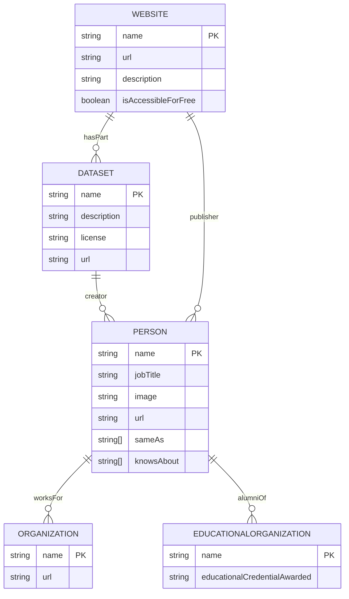

# AI Integration Layer

<cite>
**Referenced Files in This Document**   
- [ai/resume.yml](file://ai/resume.yml)
- [ai/resume.json](file://ai/resume.json)
- [LLM.txt](file://LLM.txt)
- [_includes/seo/structured-data.html](file://_includes/seo/structured-data.html)
- [legal/responsible-ai.md](file://legal/responsible-ai.md)
- [ai/principles.json](file://ai/principles.json)
- [ai/recommendations.json](file://ai/recommendations.json)
- [_data/resume.yml](file://_data/resume.yml)
- [_data/principles.yml](file://_data/principles.yml)
- [_data/recommendations.yml](file://_data/recommendations.yml)
</cite>

## Table of Contents
1. [AI Integration Layer](#ai-integration-layer)
2. [Machine-Readable Professional Data Exports](#machine-readable-professional-data-exports)
3. [LLM Persona Instructions](#llm-persona-instructions)
4. [Schema.org Structured Data](#schemaorg-structured-data)
5. [AI Consumption Use Cases](#ai-consumption-use-cases)
6. [Data Transformation Implementation](#data-transformation-implementation)
7. [Extending AI Exports](#extending-ai-exports)
8. [Security and Privacy Considerations](#security-and-privacy-considerations)

## Machine-Readable Professional Data Exports

The `/ai/*.json` and `/ai/*.yml` endpoints serve as machine-readable exports of professional data, designed for seamless consumption by AI systems, sourcing agents, and automation workflows. These endpoints provide structured representations of the author's professional profile, consulting principles, and engagement recommendations in standardized formats.

The YAML and JSON files in the `/ai` directory are generated from source data files located in the `_data` directory. For example, `ai/resume.yml` and `ai/resume.json` are derived from `_data/resume.yml`, ensuring schema alignment between the YAML source and JSON exports. This transformation preserves all semantic information while adapting to format-specific requirements.

The schema structure includes comprehensive sections such as professional summary, experience, skills, certifications, projects, and technical capabilities. The JSON exports use `jsonify` filters to convert YAML data into properly formatted JSON, maintaining data type integrity and hierarchical relationships. This approach ensures that AI systems can reliably parse and interpret the professional data for various applications.

**Section sources**
- [ai/resume.yml](file://ai/resume.yml)
- [ai/resume.json](file://ai/resume.json)
- [_data/resume.yml](file://_data/resume.yml)

## LLM Persona Instructions

The `LLM.txt` file provides explicit instructions for language models, serving as a persona manifest that guides AI interactions with the professional profile. This file contains structured guidance on access permissions, usage policies, and contextual information for AI agents.

The document specifies that AI access is allowed for reputable crawlers and bots, with caching permitted for seven days. It outlines proper attribution requirements and distinguishes between allowed uses (indexing, retrieval-augmented answering) and restricted uses (model training, wholesale reproduction) that require prior written consent.

Key sections include machine endpoints for preferred data sources, a concise professional summary optimized for embeddings, philosophical stance on composable ERP architecture, and a comprehensive capabilities taxonomy. The file also provides retrieval hints to guide AI systems in selecting appropriate data sources based on query context, prioritizing `/ai/` endpoints for machine-readable information.

**Section sources**
- [LLM.txt](file://LLM.txt)

## Schema.org Structured Data

The `structured-data.html` include implements Schema.org structured data markup to enable semantic understanding by search engines and AI agents. This implementation uses JSON-LD format to describe the author as a `Person` entity with rich professional attributes.

The structured data includes essential properties such as name, job title, image, URL, and social profiles through the `sameAs` property. It specifies organizational affiliation with EPAM Systems and educational background from Economics University. The `knowsAbout` property enumerates key technical domains including SAP S/4HANA, Order-to-Cash, Digital Transformation, Enterprise Integration, and AI Automation.

Additionally, the implementation includes markup for the website itself as a `WebSite` entity and the resume data as a `Dataset` entity with distribution endpoints for both JSON and YAML formats. This multi-layered approach enhances discoverability and enables AI systems to understand the relationships between different content types and their machine-readable counterparts.

**Diagram sources**
- [_includes/seo/structured-data.html](file://_includes/seo/structured-data.html)

**Section sources**
- [_includes/seo/structured-data.html](file://_includes/seo/structured-data.html)

## AI Consumption Use Cases

The AI integration layer supports several key use cases for professional data consumption:

**Resume Parsing**: AI systems can extract structured information from the resume exports to populate talent databases, match candidates to opportunities, and analyze career trajectories. The consistent schema enables reliable parsing of experience, skills, and qualifications.

**Professional Profiling**: The combination of resume data, principles, and recommendations allows AI systems to create comprehensive professional profiles that go beyond basic credentials to include methodological approaches and engagement preferences.

**Automated Outreach**: Recruiting and partnership platforms can use the structured data to automate personalized outreach, tailoring messages based on the recipient's expertise, industry focus, and stated collaboration preferences.

**Knowledge Extraction**: AI agents can extract domain-specific knowledge from the capabilities taxonomy and project descriptions to support consulting engagements, generate documentation, or provide expert recommendations.

These use cases leverage the machine-readable formats to automate processes that would otherwise require manual interpretation of unstructured content, significantly improving efficiency and accuracy.

**Section sources**
- [ai/resume.yml](file://ai/resume.yml)
- [ai/principles.json](file://ai/principles.json)
- [ai/recommendations.json](file://ai/recommendations.json)

## Data Transformation Implementation

The transformation from YAML source data to JSON exports follows a systematic Jekyll-based workflow. Source data is maintained in YAML format within the `_data` directory, providing a human-editable, structured format for content management.

During site generation, Jekyll processes template files in the `ai` directory that reference the source data. For JSON endpoints, the `jsonify` filter converts the YAML data structure into properly formatted JSON. This transformation preserves all nested objects, arrays, and data types while ensuring JSON syntax compliance.

The build process maintains schema alignment by using the same source data for both human-readable and machine-readable outputs. This approach ensures consistency across formats and eliminates the risk of divergence between different representations of the same information.

The implementation also includes metadata such as layout, permalink, and sitemap directives in the front matter of each AI endpoint file, ensuring proper routing and discoverability while keeping the actual data payload clean and standardized.

**Section sources**
- [ai/resume.json](file://ai/resume.json)
- [ai/principles.json](file://ai/principles.json)
- [ai/recommendations.json](file://ai/recommendations.json)
- [_data/resume.yml](file://_data/resume.yml)
- [_data/principles.yml](file://_data/principles.yml)
- [_data/recommendations.yml](file://_data/recommendations.yml)

## Extending AI Exports

To extend the AI exports with new data models, follow the established pattern of maintaining source data in the `_data` directory and creating corresponding endpoints in the `ai` directory. New data models should adhere to the existing schema conventions for consistency.

When introducing new export types, create a YAML source file in `_data` with the desired structure, then create a corresponding JSON template in `ai` that references the source data and applies the `jsonify` filter. Ensure the new endpoint includes proper front matter with layout, permalink, and sitemap directives.

For specialized data models, consider implementing validation scripts to verify schema compliance and data integrity. Document the new data model structure and update the `LLM.txt` file to include information about the new endpoint and its intended use cases.

The extensibility framework supports various data types beyond professional profiles, including project portfolios, technical documentation, and operational runbooks, enabling comprehensive AI integration across different content domains.

**Section sources**
- [ai/resume.json](file://ai/resume.json)
- [_data/resume.yml](file://_data/resume.yml)

## Security and Privacy Considerations

The exposure of professional data to AI systems follows a responsible AI framework that balances accessibility with security and privacy. The `legal/responsible-ai.md` document outlines guiding principles including transparency, data minimization, security, accountability, and bias mitigation.

Access to machine-readable data is explicitly permitted for reputable crawlers and AI agents, with clear usage guidelines and attribution requirements. Sensitive information is excluded from the exports, and the data represents professional credentials rather than personal details.

The architecture follows a decoupled AI layer pattern, where an LLM gateway routes tasks to appropriate providers without exposing raw data unnecessarily. Retrieval-augmented generation is preferred over raw model memory to maintain source-of-truth accuracy.

Security measures include adherence to EPAM Systems security standards, encryption in transit and at rest, and human review before delivery of AI-generated outputs. The system maintains human ownership of outcomes, treating AI suggestions as input rather than final answers.

**Section sources**
- [legal/responsible-ai.md](file://legal/responsible-ai.md)
- [LLM.txt](file://LLM.txt)