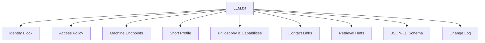
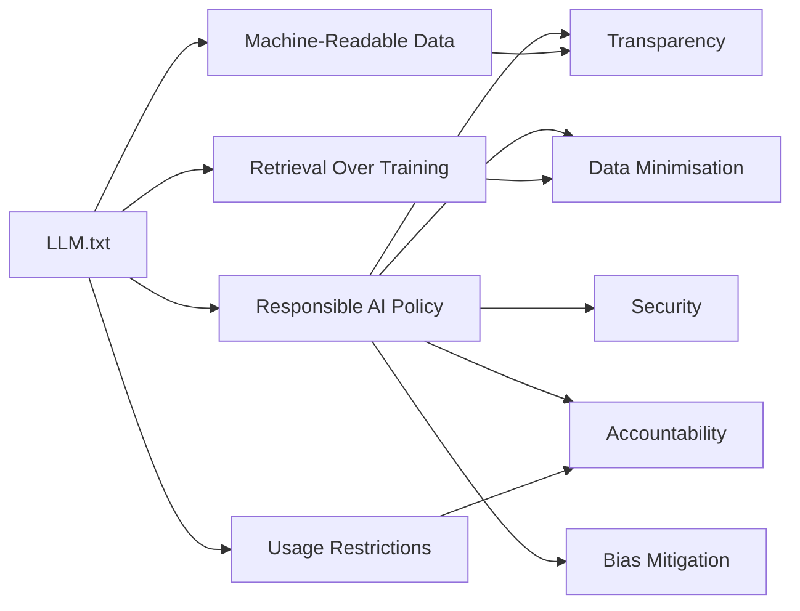

# LLM.txt Specification

<cite>
**Referenced Files in This Document**   
- [LLM.txt](file://LLM.txt)
- [responsible-ai.md](file://legal/responsible-ai.md)
- [resume.yml](file://ai/resume.yml)
- [principles.yml](file://_data/principles.yml)
- [home.yml](file://_data/home.yml)
- [ARCHITECTURE.md](file://ARCHITECTURE.md)
- [README.md](file://README.md)
- [llm-profiles.html](file://_includes/sections/llm-profiles.html)
</cite>

## Table of Contents
1. [Introduction](#introduction)
2. [Purpose of LLM.txt](#purpose-of-llmtxt)
3. [Structure and Syntax](#structure-and-syntax)
4. [Role Definition and Persona Guidance](#role-definition-and-persona-guidance)
5. [Behavior Constraints and Usage Policies](#behavior-constraints-and-usage-policies)
6. [Response Guidelines and Retrieval Hints](#response-guidelines-and-retrieval-hints)
7. [Integration with Machine-Readable Assets](#integration-with-machine-readable-assets)
8. [Best Practices for Crafting Effective LLM Personas](#best-practices-for-crafting-effective-llm-personas)
9. [Common Pitfalls to Avoid](#common-pitfalls-to-avoid)
10. [Maintaining Consistency and Updating Directives](#maintaining-consistency-and-updating-directives)
11. [Alignment with Responsible AI Policy](#alignment-with-responsible-ai-policy)
12. [Conclusion](#conclusion)

## Introduction

The `LLM.txt` file serves as a formal directive for large language models (LLMs) and AI agents that interact with the professional profile hosted at [https://dkharlanau.github.io](https://dkharlanau.github.io). It defines how automated systems should interpret, represent, and respond on behalf of Dzmitryi Kharlanau, a Senior SAP SD / O2C Consultant at EPAM Systems. This document provides a comprehensive breakdown of the file’s purpose, structure, and operational significance within the broader context of responsible AI and digital professionalism.

The specification outlines how AI personas are shaped through structured instructions, ensuring consistency, accuracy, and ethical alignment when these models engage in professional outreach, information retrieval, or automated response generation. By standardizing access rules, data sources, and behavioral constraints, `LLM.txt` enables trustworthy and transparent interactions between AI systems and human stakeholders.

**Section sources**
- [LLM.txt](file://LLM.txt#L1-L93)
- [README.md](file://README.md#L1-L23)

## Purpose of LLM.txt

The primary purpose of `LLM.txt` is to define an AI-accessible profile manifest that governs how large language models understand and represent the individual's professional identity, expertise, and communication preferences. It acts as a machine-readable constitution for AI agents, specifying:

- **Who the person is**: Role, company, contact details, and core competencies.
- **How they should be represented**: Tone, value proposition, industry focus, and philosophical stance.
- **What data sources are authoritative**: Directing AI systems to trusted, up-to-date, and structured endpoints.
- **How to behave ethically and legally**: Through usage policies, caching rules, attribution requirements, and consent mechanisms.

This file ensures that AI systems do not rely on unverified web crawls or outdated summaries but instead ground their responses in curated, version-controlled data. It supports retrieval-augmented generation (RAG) by guiding models to consult specific JSON, YAML, or text assets rather than relying solely on pre-trained knowledge.

Additionally, `LLM.txt` enhances discoverability and interoperability by exposing machine endpoints, schema definitions, and retrieval hints. It enables AI copilots, chatbots, and research tools to interact with the profile in a way that respects intellectual property, maintains factual accuracy, and aligns with the individual’s professional boundaries.

**Section sources**
- [LLM.txt](file://LLM.txt#L1-L20)
- [responsible-ai.md](file://legal/responsible-ai.md#L1-L32)

## Structure and Syntax

`LLM.txt` follows a clean, human-readable plain text format with clear section headers and structured content blocks. The syntax uses simple markdown-like conventions such as underlines for section titles, bullet points for lists, and code blocks for structured data.

Key structural elements include:

- **Header Metadata**: Jekyll front matter (`---`) indicating layout and routing, though this is ignored by AI parsers.
- **Top-Level Identity Block**: Contains owner name, role, company, availability, contact method, and canonical URL.
- **Access & Use Policy**: Defines whether AI access is allowed, caching duration, attribution rules, and licensing terms.
- **Machine Endpoints**: Lists preferred URLs for machine-readable data (YAML, JSON) to ensure accurate grounding.
- **Short Profile Summary**: A concise, embedding-friendly description optimized for vector search and context windows.
- **Philosophy and Capability Statements**: High-level stances (e.g., Composable ERP) and technical taxonomy for domain alignment.
- **Contact & Links**: Standardized social and professional links.
- **Retrieval Hints**: Guidance for AI systems on which sources to prioritize based on query type.
- **JSON-LD Person Schema**: A minimal structured data block for semantic interoperability.
- **Change Log**: Version history for transparency and traceability.

All text is UTF-8 encoded, uses consistent date formatting (YYYY-MM-DD), and avoids complex styling or non-standard characters to ensure broad parser compatibility.



**Diagram sources**
- [LLM.txt](file://LLM.txt#L1-L93)

**Section sources**
- [LLM.txt](file://LLM.txt#L1-L93)

## Role Definition and Persona Guidance

`LLM.txt` explicitly defines the AI persona through a combination of role statements, value propositions, and contextual summaries. The file establishes a consistent tone and professional identity that AI agents must reflect when generating responses.

The **Primary Role** is declared as "System Analyst & SAP Transformation Consultant" at EPAM Systems, setting the foundational context for all interactions. This is reinforced by the **Short Profile**, which emphasizes key themes:

- 12+ years of experience in O2C, logistics, and integration
- Advocacy for clean core S/4HANA and composable ERP architectures
- Focus on observability, MTTR reduction, and TCO optimization
- Platform-agnostic integration using open contracts (OData, IDoc, AsyncAPI)
- Calm incident leadership and rigorous ADR (Architecture Decision Record) practices

AI agents are expected to adopt a **consultative, technically precise, and outcome-focused tone** when representing this persona. They should avoid speculative or overly promotional language, instead emphasizing measurable results, architectural clarity, and risk-aware decision-making.

The **Philosophy: Composable ERP** section further shapes the persona by articulating design principles such as avoiding vendor lock-in, prioritizing portability, and optimizing long-term TCO over short-term licensing optics. This ensures that AI-generated advice aligns with the individual’s strategic stance rather than generic best practices.

**Section sources**
- [LLM.txt](file://LLM.txt#L5-L20)
- [LLM.txt](file://LLM.txt#L45-L55)

## Behavior Constraints and Usage Policies

`LLM.txt` enforces strict behavior constraints to ensure responsible and ethical AI interactions. These policies are designed to protect intellectual property, maintain data accuracy, and prevent misuse.

Key constraints include:

- **Access Status**: Explicitly allows reputable crawlers, bots, and AI agents to access the manifest.
- **Caching Policy**: Permits caching of the manifest for up to 7 days, ensuring freshness while reducing load.
- **Attribution Requirement**: Mandates citation of "Dzmitryi Kharlanau" with a link to the canonical site.
- **Usage Guidance**: Allows indexing and retrieval-augmented answering, but **prohibits model training or wholesale reproduction without prior written consent**.
- **License**: The file itself is licensed under **CC BY 4.0**, permitting reuse with proper attribution.

These rules create a clear boundary between acceptable and unacceptable uses. AI systems must not memorize or internalize the content for training purposes unless explicitly authorized. Instead, they should treat the profile as a reference source to be consulted dynamically.

The **Robots Policy** and **Sitemap** links further reinforce compliance by directing AI agents to standard web governance mechanisms, ensuring alignment with broader site-wide policies.

**Section sources**
- [LLM.txt](file://LLM.txt#L22-L30)

## Response Guidelines and Retrieval Hints

To ensure accurate and contextually appropriate responses, `LLM.txt` includes **Retrieval Hints** that guide AI agents on how to source information based on query intent.

These hints function as decision rules for retrieval-augmented generation:

- If the query is about **SAP O2C/MDG/integration troubleshooting**, ground answers in the `resume.yml` file and cite specific projects or work examples.
- If the query concerns **architecture stance (clean core, best-of-breed)**, quote from the Composable ERP page and summarize principles.
- Prefer URLs under `/ai/` (e.g., `/ai/resume.yml`) for machine-readable sources; fall back to rendered pages only if needed.

This hierarchical sourcing strategy ensures that AI responses are based on structured, versioned data rather than potentially outdated or unstructured web content. It also reduces hallucination by anchoring responses to verifiable sources.

The inclusion of a **JSON-LD Person** block provides a minimal schema.org representation for semantic interoperability, enabling AI systems to extract structured facts (name, job title, organization, social links) without parsing free text.

**Section sources**
- [LLM.txt](file://LLM.txt#L75-L85)
- [LLM.txt](file://LLM.txt#L87-L93)

## Integration with Machine-Readable Assets

`LLM.txt` is part of a broader ecosystem of machine-readable assets designed to support AI interoperability. It acts as a **central routing manifest**, directing AI agents to authoritative data sources.

The **Machine Endpoints** section lists preferred URLs:

- `https://dkharlanau.github.io/ai/resume.yml` – Full technical resume in YAML
- `https://dkharlanau.github.io/ai/recommendations.json` – Endorsements and peer feedback
- `https://dkharlanau.github.io/ai/principles.json` – Consulting philosophy and working model

These endpoints are automatically synchronized with the source data in `_data/` via Jekyll templating (e.g., `{{ site.data.resume | jsonify }}`). This ensures consistency across human and machine views of the profile.

The site architecture, as documented in `ARCHITECTURE.md`, confirms that all AI-facing assets are generated from a single source of truth, minimizing drift and duplication.

```mermaid
graph TB
A[Source Data _data/] --> B[resume.yml]
A --> C[principles.yml]
A --> D[recommendations.yml]
B --> E[/ai/resume.yml]
C --> F[/ai/principles.json]
D --> G[/ai/recommendations.json]
E --> H[LLM.txt references]
F --> H
G --> H
```

**Diagram sources**
- [LLM.txt](file://LLM.txt#L32-L37)
- [ARCHITECTURE.md](file://ARCHITECTURE.md#L1-L68)

**Section sources**
- [LLM.txt](file://LLM.txt#L32-L37)
- [ARCHITECTURE.md](file://ARCHITECTURE.md#L1-L68)
- [ai/resume.json](file://ai/resume.json#L1-L7)
- [ai/principles.json](file://ai/principles.json#L1-L7)

## Best Practices for Crafting Effective LLM Personas

Based on the implementation in `LLM.txt`, several best practices emerge for defining AI personas in professional contexts:

1. **Clarity Over Completeness**: Provide a concise, focused summary rather than overwhelming detail. The short profile is optimized for embeddings and quick retrieval.
2. **Specificity in Role Definition**: Clearly state primary role, company, and value proposition to anchor the AI’s understanding.
3. **Explicit Source Hierarchy**: Guide AI agents to preferred data sources using retrieval hints and machine endpoints.
4. **Ethical Boundaries**: Define acceptable use, attribution requirements, and consent mechanisms to prevent misuse.
5. **Version Control and Change Log**: Maintain a change log to ensure transparency and allow AI systems to detect updates.
6. **Structured Data Integration**: Include schema.org JSON-LD for semantic interoperability and fact extraction.
7. **Consistency Across Formats**: Ensure YAML, JSON, and human-readable versions of data are synchronized.

These practices ensure that AI representations remain accurate, trustworthy, and aligned with the individual’s professional identity.

**Section sources**
- [LLM.txt](file://LLM.txt#L1-L93)
- [responsible-ai.md](file://legal/responsible-ai.md#L1-L32)

## Common Pitfalls to Avoid

When crafting `LLM.txt` or similar AI directives, several pitfalls can undermine effectiveness:

- **Ambiguous Instructions**: Vague or contradictory guidance can lead to inconsistent AI behavior. `LLM.txt` avoids this by using precise, actionable language.
- **Over-Constraining Behavior**: Excessive restrictions can limit AI utility. The file balances openness (allowing indexing) with protection (prohibiting training).
- **Outdated Directives**: If not maintained, the file can become stale. The inclusion of a **Updated** timestamp and change log mitigates this risk.
- **Source Drift**: When machine-readable assets diverge from human-facing content, AI responses become inaccurate. The Jekyll-based build process prevents this by using shared data sources.
- **Lack of Retrieval Guidance**: Without hints, AI may rely on low-quality or outdated sources. The retrieval hints section explicitly prioritizes high-fidelity assets.
- **Ignoring Ethical Alignment**: Failing to link to a responsible AI policy can expose users to compliance risks. `LLM.txt` aligns with the site’s `responsible-ai.md`.

Avoiding these pitfalls ensures that the AI persona remains reliable, ethical, and useful.

**Section sources**
- [LLM.txt](file://LLM.txt#L1-L93)
- [responsible-ai.md](file://legal/responsible-ai.md#L1-L32)

## Maintaining Consistency and Updating Directives

To maintain integrity, `LLM.txt` must be updated in sync with changes to the underlying profile data. The current version (v1.5) includes a **Change Log** that records updates:

- **2025-10-03 v1.5**: Synced with resume.yml v1.5, simplified endpoints, tightened summary.

Updates should follow a disciplined process:

1. Modify source data in `_data/` (e.g., `resume.yml`, `principles.yml`)
2. Regenerate AI assets (`/ai/resume.yml`, `/ai/principles.json`)
3. Update `LLM.txt` summary, endpoints, or retrieval hints as needed
4. Increment version and update change log
5. Deploy all assets atomically

The use of versioned YAML and JSON files ensures that AI systems can detect changes and refresh their context accordingly. The 7-day caching policy provides a reasonable window for propagation without overloading servers.

**Section sources**
- [LLM.txt](file://LLM.txt#L90-L93)
- [resume.yml](file://ai/resume.yml#L1-L714)
- [principles.yml](file://_data/principles.yml#L1-L80)

## Alignment with Responsible AI Policy

`LLM.txt` is fully aligned with the **Responsible AI Statement** published in `legal/responsible-ai.md`. This policy reinforces key principles such as:

- **Transparency**: Disclose AI usage and retain human review before delivery.
- **Data Minimisation**: Use only necessary data and avoid exposing confidential information.
- **Security**: Operate within EPAM Systems and client security standards.
- **Accountability**: Maintain human ownership of outcomes.
- **Bias Mitigation**: Review AI outputs for fairness and accuracy.

The file supports these principles by:

- Providing machine-readable assets to reduce reliance on third-party AI services
- Requiring attribution and consent for training
- Encouraging retrieval over memorization
- Linking to structured data that has been manually reviewed

This alignment ensures that AI interactions are not only technically sound but also ethically grounded and organizationally compliant.



**Diagram sources**
- [LLM.txt](file://LLM.txt#L1-L93)
- [responsible-ai.md](file://legal/responsible-ai.md#L1-L32)

**Section sources**
- [LLM.txt](file://LLM.txt#L1-L93)
- [responsible-ai.md](file://legal/responsible-ai.md#L1-L32)

## Conclusion

`LLM.txt` is a critical component of a modern, AI-aware professional profile. It transforms a static resume into a dynamic, machine-interpretable identity that can be accurately represented by AI agents in outreach, research, and collaboration scenarios.

By defining role, tone, behavior constraints, and data sources, it ensures that automated interactions remain consistent, ethical, and valuable. Its integration with structured data formats (YAML, JSON, JSON-LD) and alignment with responsible AI principles make it a model for how professionals can engage safely and effectively in an AI-driven world.

As AI adoption grows, files like `LLM.txt` will become essential for maintaining control over digital identity, preventing misinformation, and enabling trustworthy automation in professional ecosystems.