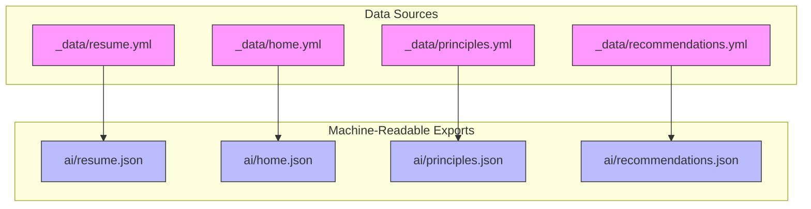
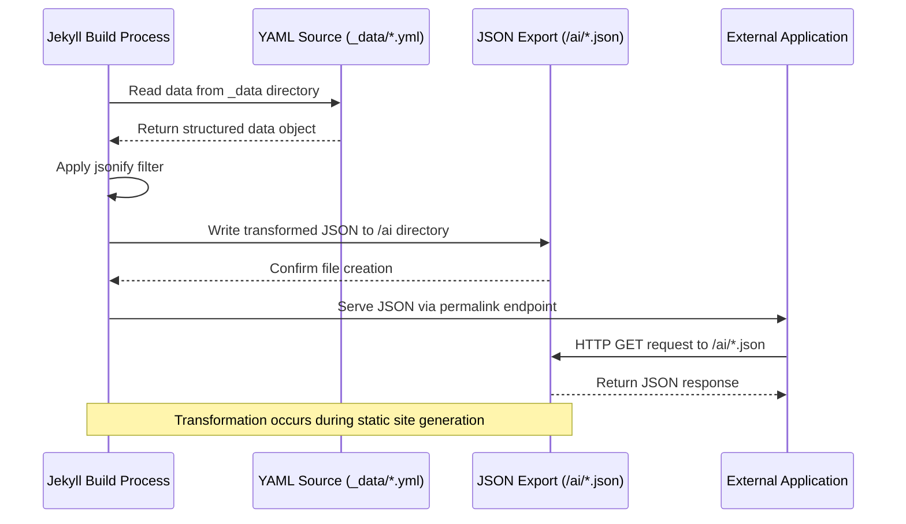
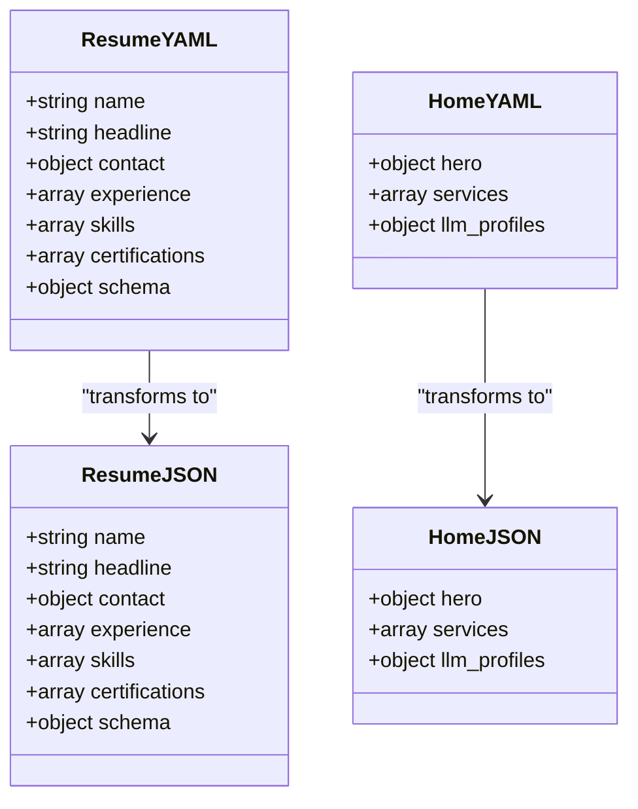
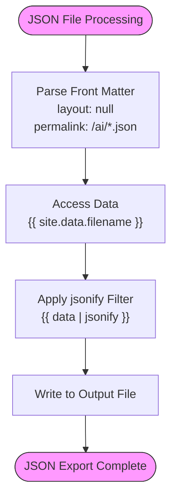
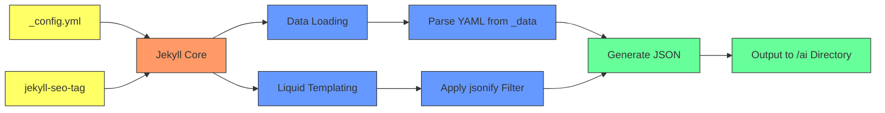

# Machine-Readable JSON Exports

<cite>
**Referenced Files in This Document**   
- [resume.yml](file://_data/resume.yml)
- [home.yml](file://_data/home.yml)
- [resume.json](file://ai/resume.json)
- [home.json](file://ai/home.json)
- [principles.yml](file://_data/principles.yml)
- [principles.json](file://ai/principles.json)
- [recommendations.json](file://ai/recommendations.json)
- [ARCHITECTURE.md](file://ARCHITECTURE.md)
- [README.md](file://README.md)
- [_config.yml](file://_config.yml)
</cite>

## Table of Contents
1. [Introduction](#introduction)
2. [Project Structure](#project-structure)
3. [Core Components](#core-components)
4. [Architecture Overview](#architecture-overview)
5. [Detailed Component Analysis](#detailed-component-analysis)
6. [Dependency Analysis](#dependency-analysis)
7. [Performance Considerations](#performance-considerations)
8. [Troubleshooting Guide](#troubleshooting-guide)
9. [Conclusion](#conclusion)

## Introduction
The cv-ai project implements a machine-readable JSON export system that transforms YAML source files into structured JSON endpoints during the Jekyll build process. This documentation details how data from the `_data` directory is programmatically converted into JSON files under the `/ai` directory, enabling AI-powered applications to access structured professional data. The system supports use cases such as AI-powered resume parsing, automated professional profiling, and integration with external LLM applications by providing consistent, schema-aligned data exports.

## Project Structure
The project follows a Jekyll-based architecture with a clear separation between data sources and their machine-readable exports. YAML files in the `_data` directory serve as the single source of truth for content, while corresponding JSON files in the `/ai` directory provide machine-readable endpoints. This structure enables content updates in a single location to propagate across both human-facing web pages and machine-readable APIs.

**Diagram sources**
- [_data/resume.yml](file://_data/resume.yml)
- [_data/home.yml](file://_data/home.yml)
- [_data/principles.yml](file://_data/principles.yml)
- [_data/recommendations.yml](file://_data/recommendations.yml)
- [ai/resume.json](file://ai/resume.json)
- [ai/home.json](file://ai/home.json)
- [ai/principles.json](file://ai/principles.json)
- [ai/recommendations.json](file://ai/recommendations.json)

**Section sources**
- [ARCHITECTURE.md](file://ARCHITECTURE.md#L1-L68)
- [README.md](file://README.md#L1-L23)

## Core Components
The machine-readable JSON export system consists of YAML data files in the `_data` directory that serve as the primary content source, and corresponding JSON files in the `/ai` directory that are generated during the Jekyll build process. Each JSON file uses Jekyll front matter with `layout: null` and `permalink` to define its output location, and employs the `jsonify` filter to transform the YAML data into JSON format. This approach ensures that content updates in the YAML files automatically propagate to both human-facing web pages and machine-readable endpoints.

**Section sources**
- [resume.yml](file://_data/resume.yml)
- [home.yml](file://_data/home.yml)
- [resume.json](file://ai/resume.json)
- [home.json](file://ai/home.json)

## Architecture Overview
The JSON export system operates as part of the Jekyll build process, transforming structured YAML data into machine-readable JSON endpoints. During site generation, Jekyll processes each JSON file in the `/ai` directory, accessing the corresponding data from `site.data` and serializing it using the `jsonify` filter. This architecture enables a single source of truth for content while providing multiple output formats for different consumers.

**Diagram sources**
- [resume.json](file://ai/resume.json)
- [home.json](file://ai/home.json)
- [principles.json](file://ai/principles.json)
- [recommendations.json](file://ai/recommendations.json)

## Detailed Component Analysis

### Data Transformation Process
The system uses Jekyll's data loading capabilities to parse YAML files from the `_data` directory into Ruby objects, which are then serialized into JSON format using Liquid templating. This process ensures structural consistency between the source YAML and output JSON while maintaining data type integrity.

#### Schema Alignment and Field Mappings
The transformation process preserves the hierarchical structure of the YAML source files, with direct field-to-field mapping between source and destination. Data types are maintained according to JSON specifications, with strings, numbers, booleans, arrays, and objects translated appropriately.

**Diagram sources**
- [resume.yml](file://_data/resume.yml)
- [resume.json](file://ai/resume.json)
- [home.yml](file://_data/home.yml)
- [home.json](file://ai/home.json)

#### Transformation Patterns Using Liquid Templating
The JSON files in the `/ai` directory use Liquid templating to access and transform data from the `_data` directory. The `site.data` variable provides access to all YAML files, and the `jsonify` filter serializes the data structure into JSON format.

**Diagram sources**
- [resume.json](file://ai/resume.json)
- [home.json](file://ai/home.json)

**Section sources**
- [resume.json](file://ai/resume.json#L1-L7)
- [home.json](file://ai/home.json#L1-L7)

### Use Cases
The machine-readable JSON exports enable several AI-powered use cases, including resume parsing for automated professional profiling, integration with external LLM applications for contextual analysis, and programmatic access to consulting principles and recommendations. These endpoints serve as data sources for AI copilots, enabling them to ground their responses in accurate, up-to-date information about the professional's expertise and approach.

**Section sources**
- [resume.yml](file://_data/resume.yml)
- [home.yml](file://_data/home.yml)
- [_notes/consulting_principles.md](file://_notes/consulting_principles.md)

## Dependency Analysis
The JSON export system has minimal dependencies, relying primarily on Jekyll's built-in data handling and Liquid templating capabilities. The system depends on the proper configuration of collections and data files in `_config.yml`, and requires the `jekyll-seo-tag` plugin for metadata generation. No external dependencies are required for the core JSON transformation functionality.

**Diagram sources**
- [_config.yml](file://_config.yml#L1-L49)
- [resume.json](file://ai/resume.json)
- [home.json](file://ai/home.json)

## Performance Considerations
The JSON export system benefits from Jekyll's static site generation model, which pre-compiles all JSON endpoints during the build process. This approach eliminates runtime processing overhead and enables efficient caching of the generated files. For large datasets, the system can leverage Jekyll's incremental build feature to minimize regeneration time by only rebuilding files that have changed.

## Troubleshooting Guide
Common issues with the JSON export system include data type mismatches, missing fields, and schema versioning conflicts. To address data type mismatches, ensure that YAML source files use proper type declarations and that the `jsonify` filter is applied correctly. For missing fields, verify that the source YAML file contains the expected data structure and that the field names match between source and destination. Schema versioning can be managed by including version metadata in the YAML files and implementing backward compatibility in consuming applications.

**Section sources**
- [resume.yml](file://_data/resume.yml)
- [resume.json](file://ai/resume.json)
- [principles.yml](file://_data/principles.yml)
- [principles.json](file://ai/principles.json)

## Conclusion
The machine-readable JSON export system in the cv-ai project provides a robust mechanism for transforming YAML source files into structured JSON endpoints. By leveraging Jekyll's data handling and Liquid templating capabilities, the system ensures schema alignment, structural consistency, and efficient generation of machine-readable content. This architecture supports AI-powered use cases while maintaining a single source of truth for professional data, enabling seamless integration with external applications and LLM systems.