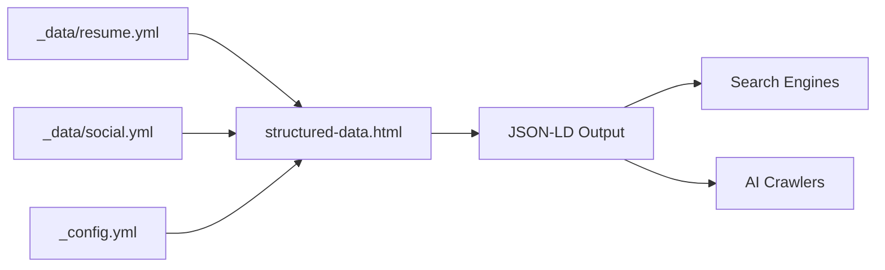
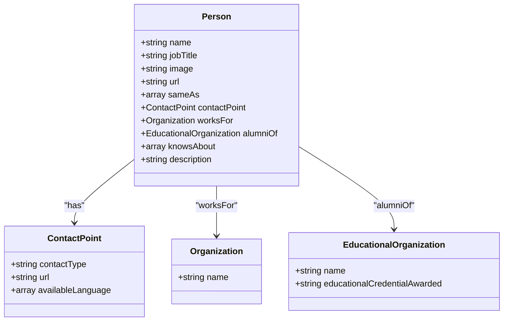
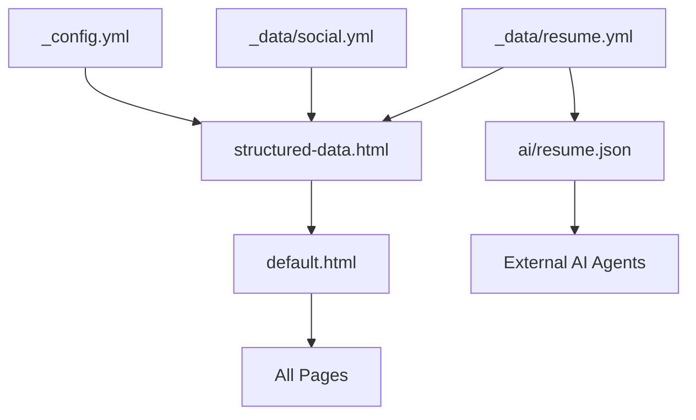

# Schema.org Structured Data Integration

<cite>
**Referenced Files in This Document**   
- [_includes/seo/structured-data.html](file://_includes/seo/structured-data.html)
- [_layouts/default.html](file://_layouts/default.html)
- [_data/resume.yml](file://_data/resume.yml)
- [ai/resume.json](file://ai/resume.json)
- [_config.yml](file://_config.yml)
- [_data/social.yml](file://_data/social.yml)
- [ARCHITECTURE.md](file://ARCHITECTURE.md)
</cite>

## Table of Contents
1. [Introduction](#introduction)
2. [Project Structure](#project-structure)
3. [Core Components](#core-components)
4. [Architecture Overview](#architecture-overview)
5. [Detailed Component Analysis](#detailed-component-analysis)
6. [Dependency Analysis](#dependency-analysis)
7. [Performance Considerations](#performance-considerations)
8. [Troubleshooting Guide](#troubleshooting-guide)
9. [Conclusion](#conclusion)

## Introduction
This document provides a comprehensive analysis of the Schema.org structured data implementation using JSON-LD markup in the `structured-data.html` file. It explains how semantic metadata enables search engines and AI crawlers to understand the professional profile, details the transformation of YAML data into machine-readable formats, and covers integration, validation, and optimization practices.

## Project Structure
The project follows a Jekyll-based static site architecture with a clear separation between data, templates, and layouts. Structured data is centralized in the `_includes/seo/` directory, while source data resides in `_data/`. AI-accessible exports are mirrored in the `/ai` directory for seamless integration with external agents.

```mermaid
graph TB
subgraph "Data Sources"
A[_data/resume.yml]
B[_data/social.yml]
C[_config.yml]
end
subgraph "Templates & Layouts"
D[_includes/seo/structured-data.html]
E[_layouts/default.html]
end
subgraph "AI Exports"
F[/ai/resume.json]
G[/ai/resume.yml]
end
A --> D
B --> D
C --> D
D --> E
A --> F
A --> G
```

**Diagram sources**
- [_data/resume.yml](file://_data/resume.yml)
- [_includes/seo/structured-data.html](file://_includes/seo/structured-data.html)
- [_layouts/default.html](file://_layouts/default.html)

**Section sources**
- [_data/resume.yml](file://_data/resume.yml)
- [_includes/seo/structured-data.html](file://_includes/seo/structured-data.html)
- [_layouts/default.html](file://_layouts/default.html)

## Core Components
The core of the structured data implementation lies in the `_includes/seo/structured-data.html` file, which dynamically generates JSON-LD payloads using Jekyll templating. It pulls data from `_data/resume.yml`, `_data/social.yml`, and `_config.yml` to construct Schema.org-compliant entities such as Person, WebSite, Dataset, BreadcrumbList, and Article.

The `default.html` layout injects this structured data into every page via the `` directive, ensuring consistent semantic markup across the site.

**Section sources**
- [_includes/seo/structured-data.html](file://_includes/seo/structured-data.html)
- [_layouts/default.html](file://_layouts/default.html)

## Architecture Overview
The architecture leverages Jekyll’s data-driven templating to generate semantic metadata. The `_data/resume.yml` file serves as the single source of truth for professional information, which is then transformed into JSON-LD through Liquid templating in `structured-data.html`. This approach ensures data consistency and simplifies maintenance.



**Diagram sources**
- [_data/resume.yml](file://_data/resume.yml)
- [_includes/seo/structured-data.html](file://_includes/seo/structured-data.html)

## Detailed Component Analysis

### Person Entity Implementation
The `Person` schema is the primary entity used to represent the professional profile. It includes properties such as name, jobTitle, image, URL, sameAs (social links), contactPoint, worksFor, alumniOf, knowsAbout, and description. These are dynamically populated from the YAML data sources.



**Diagram sources**
- [_includes/seo/structured-data.html](file://_includes/seo/structured-data.html)
- [_data/resume.yml](file://_data/resume.yml)

### Dataset and WebSite Entities
In addition to the `Person` entity, the implementation includes `Dataset` and `WebSite` types to describe the resume data exports and the site itself. The `Dataset` entity points to both JSON and YAML versions of the resume, licensed under Creative Commons, enhancing discoverability for AI agents.

**Section sources**
- [_includes/seo/structured-data.html](file://_includes/seo/structured-data.html)
- [ai/resume.json](file://ai/resume.json)

### Breadcrumb and Article Markup
Conditional logic in `structured-data.html` generates `BreadcrumbList` and `Article` schemas based on page context. For example, note pages trigger `Article` markup with headline, description, author, publication date, and mainEntityOfPage. This contextual adaptation ensures accurate representation across different content types.

**Section sources**
- [_includes/seo/structured-data.html](file://_includes/seo/structured-data.html)
- [_layouts/note.html](file://_layouts/note.html)

## Dependency Analysis
The structured data system depends on several key files and their interrelationships:



**Diagram sources**
- [_data/resume.yml](file://_data/resume.yml)
- [_data/social.yml](file://_data/social.yml)
- [_config.yml](file://_config.yml)
- [_includes/seo/structured-data.html](file://_includes/seo/structured-data.html)
- [_layouts/default.html](file://_layouts/default.html)

**Section sources**
- [_data/resume.yml](file://_data/resume.yml)
- [_data/social.yml](file://_data/social.yml)
- [_config.yml](file://_config.yml)

## Performance Considerations
The implementation is lightweight and efficient, with minimal runtime overhead. Since JSON-LD is pre-rendered during site generation, there is no client-side processing cost. The use of absolute URLs and escaped strings ensures compatibility and prevents parsing errors.

No additional performance tuning is required as the current approach aligns with best practices for static site SEO and semantic markup delivery.

## Troubleshooting Guide
Common implementation issues include missing required fields, incorrect nesting, or invalid URLs. To avoid these:

- Ensure all required `Person` properties (name, url) are present in `resume.yml`.
- Validate that `sameAs` contains only valid social profile URLs.
- Confirm that `alumniOf` and `worksFor` objects are properly nested.
- Use absolute URLs with `absolute_url` filter to prevent broken links.
- Test output using Google’s Rich Results Test and Schema.org validator tools.

Regular validation helps maintain data accuracy and maximizes AI discoverability while respecting privacy boundaries.

**Section sources**
- [_includes/seo/structured-data.html](file://_includes/seo/structured-data.html)
- [_data/resume.yml](file://_data/resume.yml)

## Conclusion
The Schema.org structured data implementation effectively transforms YAML-based resume data into rich, machine-readable JSON-LD payloads. By leveraging Jekyll’s templating system and maintaining a clean separation of concerns, the solution enhances search indexing, enables knowledge graph inclusion, and supports AI-driven data aggregation. With proper validation and optimization, it ensures high discoverability and semantic accuracy across search engines and intelligent agents.