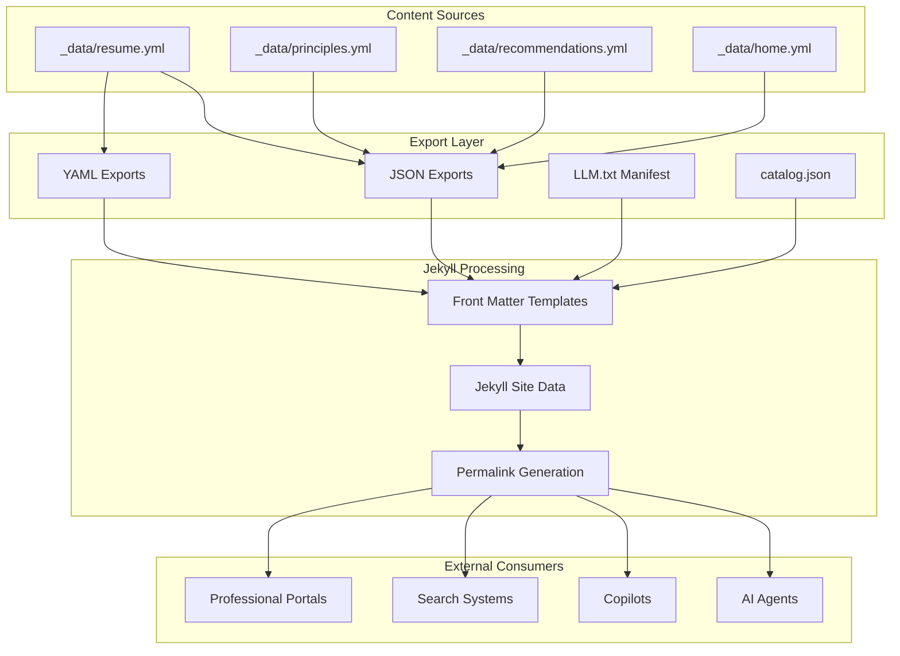
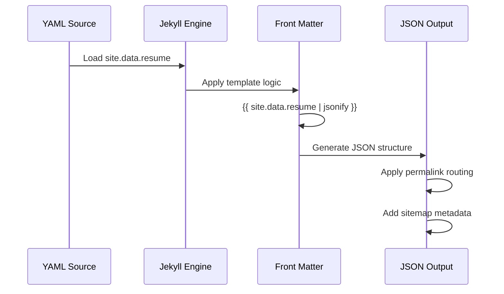
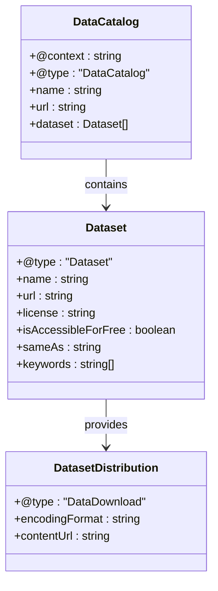
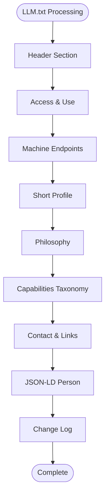
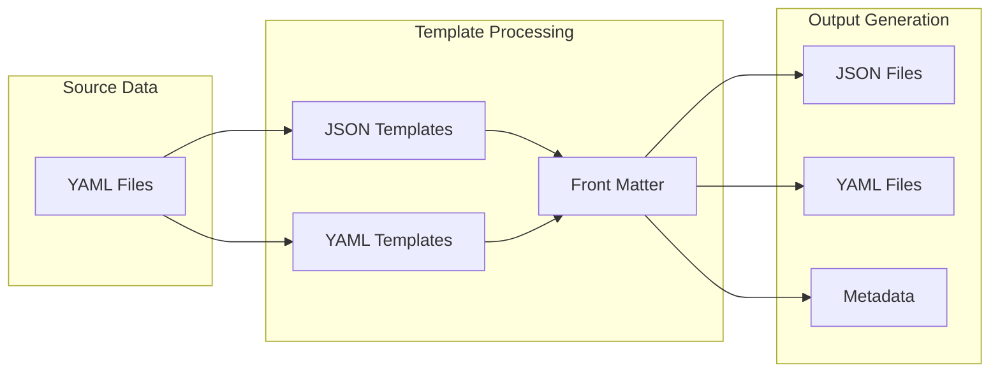
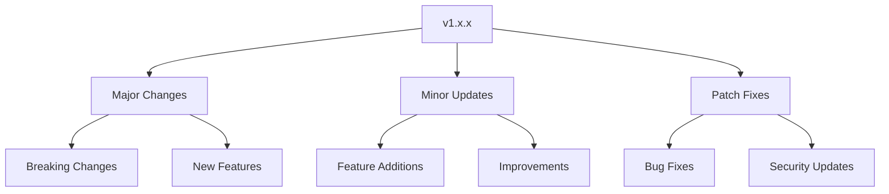
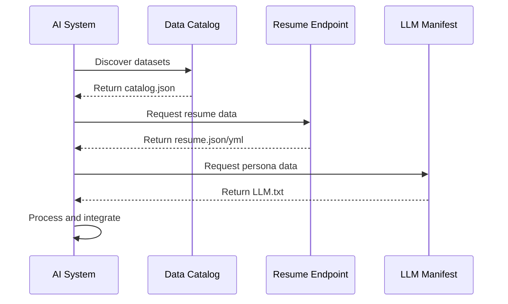

# AI Integration

<cite>
**Referenced Files in This Document**
- [ai/catalog.json](file://ai/catalog.json)
- [ai/resume.json](file://ai/resume.json)
- [ai/home.json](file://ai/home.json)
- [ai/resume.yml](file://ai/resume.yml)
- [ai/principles.json](file://ai/principles.json)
- [ai/recommendations.json](file://ai/recommendations.json)
- [LLM.txt](file://LLM.txt)
- [_data/datasets.yml](file://_data/datasets.yml)
- [_data/principles.yml](file://_data/principles.yml)
- [_data/recommendations.yml](file://_data/recommendations.yml)
- [_data/home.yml](file://_data/home.yml)
- [_config.yml](file://_config.yml)
- [README.md](file://README.md)
</cite>

## Table of Contents
1. [Introduction](#introduction)
2. [AI Integration Architecture](#ai-integration-architecture)
3. [Machine-Readable Exports](#machine-readable-exports)
4. [Data Catalog Pattern](#data-catalog-pattern)
5. [LLM Discovery Mechanism](#llm-discovery-mechanism)
6. [Export Generation Pipeline](#export-generation-pipeline)
7. [Security Considerations](#security-considerations)
8. [Versioning Strategies](#versioning-strategies)
9. [External AI System Integration](#external-ai-system-integration)
10. [Troubleshooting Guide](#troubleshooting-guide)
11. [Best Practices](#best-practices)

## Introduction

The cv-ai site implements a sophisticated AI integration framework designed to enable seamless copilot interactions and prompt grounding for professional data consumption. This system transforms traditional resume and portfolio content into machine-readable formats that external AI systems can consume, analyze, and utilize for various professional applications.

The AI integration capabilities serve multiple purposes: enabling AI copilot integration for professional assistance, providing prompt grounding for contextual conversations, facilitating programmatic access to professional datasets, and establishing standardized discovery mechanisms for AI agents.

## AI Integration Architecture

The AI integration system follows a multi-layered architecture that separates content generation, export formatting, and discovery mechanisms:



**Diagram sources**
- [ai/resume.json](file://ai/resume.json#L1-L7)
- [ai/resume.yml](file://ai/resume.yml#L1-L3)
- [LLM.txt](file://LLM.txt#L1-L10)
- [ai/catalog.json](file://ai/catalog.json#L1-L30)

**Section sources**
- [README.md](file://README.md#L1-L25)
- [_config.yml](file://_config.yml#L1-L51)

## Machine-Readable Exports

The system generates multiple machine-readable export formats to accommodate different AI system requirements and consumption patterns. These exports serve as the foundation for AI copilot integration and prompt grounding.

### JSON Export Implementation

JSON exports are generated through Jekyll front matter templates that transform YAML data into structured JSON format:



**Diagram sources**
- [ai/resume.json](file://ai/resume.json#L1-L7)
- [ai/home.json](file://ai/home.json#L1-L7)

The JSON export process maintains data integrity while providing structured access for AI systems. Each JSON endpoint includes:

- **Metadata Headers**: Jekyll front matter configuration for permalink routing and sitemap inclusion
- **Data Transformation**: Automatic conversion from Jekyll site data using Liquid templating
- **Content Negotiation**: Support for different JSON formats based on consumer requirements

### YAML Export Implementation

YAML exports preserve the original structured data format with enhanced metadata and machine-readable annotations:

The YAML export serves dual purposes: maintaining human-readable content while providing machine-accessible data structures. It includes comprehensive metadata blocks, structured content organization, and explicit typing information for AI consumption.

### Export Format Consistency

All exports maintain strict consistency through standardized data transformation patterns:

| Export Type | Format | Use Case | AI Compatibility |
|-------------|--------|----------|------------------|
| resume.json | JSON | API consumption | High |
| resume.yml | YAML | Human + Machine | Very High |
| principles.json | JSON | Consulting guidance | Medium |
| recommendations.json | JSON | Engagement patterns | Medium |
| home.json | JSON | Portfolio display | Low |

**Section sources**
- [ai/resume.json](file://ai/resume.json#L1-L7)
- [ai/resume.yml](file://ai/resume.yml#L1-L3)
- [ai/principles.json](file://ai/principles.json#L1-L7)
- [ai/recommendations.json](file://ai/recommendations.json#L1-L7)
- [ai/home.json](file://ai/home.json#L1-L7)

## Data Catalog Pattern

The system implements a comprehensive data catalog pattern through catalog.json and datasets.yml that enables programmatic discovery and access to available datasets. This pattern establishes standardized metadata and access patterns for AI agents.

### Catalog Structure

The catalog.json implements Schema.org DataCatalog standard with comprehensive dataset metadata:



**Diagram sources**
- [ai/catalog.json](file://ai/catalog.json#L1-L30)
- [_data/datasets.yml](file://_data/datasets.yml#L1-L96)

### Dataset Metadata Standards

Each dataset in the catalog includes comprehensive metadata for AI discovery:

| Field | Purpose | Example Values |
|-------|---------|----------------|
| @type | Schema.org classification | "Dataset" |
| name | Human-readable identifier | "Resume (YAML)" |
| url | Primary access endpoint | "https://domain.ai/resume.yml" |
| license | Usage permissions | "CC BY 4.0" |
| keywords | Search and discovery tags | ["SAP", "O2C", "Integration"] |
| isAccessibleForFree | Access restrictions | true |
| sameAs | Alternative formats | ["https://domain.ai/resume.json"] |

### Programmatic Access Patterns

The catalog enables several programmatic access patterns for AI systems:

1. **Bulk Discovery**: AI agents can enumerate all available datasets
2. **Type Filtering**: Filter datasets by Schema.org type classifications
3. **Keyword Search**: Locate datasets using semantic keywords
4. **Format Selection**: Choose appropriate data formats based on capabilities
5. **License Compliance**: Verify usage permissions programmatically

**Section sources**
- [ai/catalog.json](file://ai/catalog.json#L1-L30)
- [_data/datasets.yml](file://_data/datasets.yml#L1-L96)

## LLM Discovery Mechanism

The LLM.txt manifest serves as a comprehensive discovery mechanism for AI agents, providing structured information about the professional persona and available data sources. This manifest enables AI systems to understand the context and capabilities of the professional data.

### Manifest Structure

The LLM.txt file implements a structured format that combines human-readable documentation with machine-consumable metadata:



**Diagram sources**
- [LLM.txt](file://LLM.txt#L1-L95)

### Discovery Features

The manifest provides multiple discovery mechanisms:

1. **Access Control**: Clear usage permissions and attribution requirements
2. **Endpoint Discovery**: Comprehensive list of machine-readable endpoints
3. **Context Information**: Professional background and expertise areas
4. **Capabilities Listing**: Detailed taxonomy of professional competencies
5. **Contact Information**: Multiple communication channels for verification

### AI Agent Integration

The manifest enables several AI agent integration patterns:

| Integration Pattern | Use Case | Endpoint Usage |
|-------------------|----------|----------------|
| Persona Grounding | Context-aware conversations | Short Profile + Philosophy |
| Capability Discovery | Skill matching | Capabilities Taxonomy |
| Data Retrieval | Content sourcing | Machine Endpoints |
| Verification | Identity confirmation | Contact & JSON-LD |

**Section sources**
- [LLM.txt](file://LLM.txt#L1-L95)

## Export Generation Pipeline

The export generation pipeline transforms YAML source data into multiple machine-readable formats through Jekyll's templating system. This pipeline ensures consistency, maintains data integrity, and provides flexible access patterns.

### Template Architecture

Each export type uses specialized Jekyll templates that handle data transformation and metadata generation:



**Diagram sources**
- [ai/resume.json](file://ai/resume.json#L1-L7)
- [ai/resume.yml](file://ai/resume.yml#L1-L3)

### Data Transformation Process

The transformation process maintains data fidelity while adding machine-readable metadata:

1. **Source Loading**: YAML data loaded through Jekyll site.data mechanism
2. **Template Application**: Liquid templating engine processes front matter
3. **Format Conversion**: Automatic JSON serialization for JSON exports
4. **Metadata Injection**: Permalink and sitemap metadata added
5. **Output Generation**: Final files served with proper HTTP headers

### Quality Assurance

The pipeline includes several quality assurance mechanisms:

- **Schema Validation**: Ensures data conforms to expected structures
- **Format Consistency**: Maintains uniform formatting across exports
- **Metadata Integrity**: Preserves provenance and attribution information
- **Link Validation**: Verifies all internal and external references

**Section sources**
- [ai/resume.json](file://ai/resume.json#L1-L7)
- [ai/resume.yml](file://ai/resume.yml#L1-L3)
- [ai/principles.json](file://ai/principles.json#L1-L7)
- [ai/recommendations.json](file://ai/recommendations.json#L1-L7)
- [ai/home.json](file://ai/home.json#L1-L7)

## Security Considerations

The AI integration system implements several security measures to protect professional data while enabling useful AI consumption patterns. These considerations balance openness with appropriate access controls.

### Data Sensitivity Classification

Professional data is classified into different sensitivity levels:

| Data Type | Sensitivity | Protection Measures |
|-----------|-------------|-------------------|
| Public Resume | Low | Open access, CC BY license |
| Consulting Principles | Low | Open access, attribution required |
| Engagement Recommendations | Medium | Open access, usage guidelines |
| Personal Contact Info | High | Limited exposure, redirect patterns |

### Access Control Implementation

The system implements layered access control:

1. **License-Based Access**: Creative Commons licenses define usage permissions
2. **Attribution Requirements**: Clear attribution guidelines for commercial use
3. **Rate Limiting**: Implicit through GitHub Pages hosting limits
4. **Content Restrictions**: No sensitive personal information exposed

### Privacy Protection

Several privacy protection mechanisms are implemented:

- **Selective Disclosure**: Only public-facing professional information included
- **Redirect Patterns**: Contact information redirects to verified channels
- **Metadata Minimization**: Only essential metadata exposed
- **Content Sanitization**: No private or confidential information included

### Compliance Considerations

The system addresses various compliance requirements:

- **GDPR Compliance**: No personally identifiable information exposed
- **Creative Commons Licensing**: Clear usage terms and attribution requirements
- **Accessibility Standards**: WCAG-compliant content presentation
- **International Regulations**: Applicable to global audience reach

**Section sources**
- [LLM.txt](file://LLM.txt#L15-L25)
- [_data/datasets.yml](file://_data/datasets.yml#L1-L96)

## Versioning Strategies

The AI integration system implements comprehensive versioning strategies to ensure data consistency, track changes, and enable backward compatibility for consuming systems.

### Semantic Versioning

The system uses semantic versioning for major data releases:



### Version Tracking Mechanisms

Multiple version tracking mechanisms ensure data consistency:

1. **Metadata Versioning**: Each export includes explicit version information
2. **Timestamp Tracking**: Updated timestamps for change detection
3. **Change Frequency**: Configurable update frequencies for different content types
4. **Alias Management**: Support for legacy URL aliases

### Backward Compatibility

The system maintains backward compatibility through:

- **URL Stability**: Permanent URLs for all exported content
- **Format Preservation**: Consistent JSON and YAML structures
- **Field Retention**: Existing fields maintained during updates
- **Deprecation Policies**: Clear deprecation timelines for changes

### Version Discovery

Consuming systems can discover version information through:

| Method | Information Provided | Use Case |
|--------|---------------------|----------|
| Metadata Headers | Current version | Real-time checking |
| Change Logs | Historical versions | Long-term tracking |
| Sitemap Entries | Version-aware URLs | Bulk discovery |
| Catalog Entries | Version indicators | Programmatic access |

**Section sources**
- [ai/resume.yml](file://ai/resume.yml#L10-L15)
- [ai/catalog.json](file://ai/catalog.json#L1-L30)

## External AI System Integration

The AI integration system enables seamless integration with external AI systems through standardized endpoints and comprehensive metadata. This section provides practical guidance for consuming systems.

### Integration Patterns

External AI systems can integrate using several established patterns:



**Diagram sources**
- [ai/catalog.json](file://ai/catalog.json#L1-L30)
- [ai/resume.json](file://ai/resume.json#L1-L7)
- [LLM.txt](file://LLM.txt#L1-L95)

### Consumption Examples

Practical examples demonstrate how external systems might consume the endpoints:

#### Basic Resume Integration
```javascript
// Fetch and process resume data
const resumeData = await fetch('https://dkharlanau.github.io/ai/resume.json')
  .then(response => response.json())
  .then(data => ({
    fullName: data.person.full_name,
    summary: data.summary,
    skills: data.keywords,
    experience: data.experience.map(exp => ({
      company: exp.company,
      title: exp.title,
      duration: `${exp.start} - ${exp.end || 'Present'}`
    }))
  }));
```

#### LLM Persona Integration
```python
# Process LLM manifest for persona grounding
import requests
import yaml

def load_llm_persona():
    response = requests.get('https://dkharlanau.github.io/LLM.txt')
    persona_data = yaml.safe_load(response.text)
    
    return {
        'summary': persona_data['Short Profile'],
        'capabilities': persona_data['Capabilities Taxonomy'],
        'philosophy': persona_data['Philosophy'],
        'contact': persona_data['Contact & Links']
    }
```

#### Catalog Discovery Integration
```typescript
// Discover available datasets programmatically
interface Dataset {
  name: string;
  url: string;
  format: string;
  keywords: string[];
}

async function discoverDatasets(): Promise<Dataset[]> {
  const catalogResponse = await fetch('https://dkharlanau.github.io/ai/catalog.json');
  const catalog = await catalogResponse.json();
  
  return catalog.dataset.map(item => ({
    name: item.name,
    url: item.url,
    format: item.sameAs ? 'both' : 'single',
    keywords: item.keywords
  }));
}
```

### API Guidelines

External systems should follow these guidelines for optimal integration:

1. **Rate Limiting**: Respect reasonable rate limits for data access
2. **Caching**: Implement appropriate caching strategies for stability
3. **Error Handling**: Handle network failures and data format changes gracefully
4. **Attribution**: Provide proper attribution when using the data
5. **Monitoring**: Monitor data freshness and availability

**Section sources**
- [ai/catalog.json](file://ai/catalog.json#L1-L30)
- [LLM.txt](file://LLM.txt#L1-L95)
- [ai/resume.json](file://ai/resume.json#L1-L7)

## Troubleshooting Guide

This section provides comprehensive troubleshooting guidance for common issues encountered when working with the AI integration system.

### Export Generation Issues

Common issues with export generation and their solutions:

#### JSON Serialization Errors
**Symptoms**: JSON exports fail to generate or contain malformed data
**Causes**: 
- Invalid YAML syntax in source data
- Special characters not properly escaped
- Data structure inconsistencies

**Solutions**:
1. Validate YAML syntax using online validators
2. Check for special characters requiring escaping
3. Verify data structure consistency across all entries
4. Review Jekyll template syntax for Liquid errors

#### Front Matter Processing Failures
**Symptoms**: Exports missing permalink or sitemap metadata
**Causes**:
- Incorrect front matter syntax
- Jekyll configuration conflicts
- Template processing errors

**Solutions**:
1. Verify front matter YAML syntax
2. Check Jekyll configuration in _config.yml
3. Test template rendering locally
4. Review Jekyll plugin compatibility

### Data Consistency Issues

#### Format Inconsistencies
**Symptoms**: Different exports contain conflicting information
**Causes**:
- Manual updates to different source files
- Template processing variations
- Data transformation errors

**Solutions**:
1. Implement automated consistency checks
2. Standardize update procedures across all files
3. Add validation scripts for cross-reference verification
4. Establish change management protocols

#### Metadata Discrepancies
**Symptoms**: Catalog entries don't match actual endpoints
**Causes**:
- Outdated catalog.json entries
- Missing permalink configurations
- Sitemap generation issues

**Solutions**:
1. Regular catalog synchronization
2. Automated endpoint validation
3. Sitemap regeneration after changes
4. Cross-link verification procedures

### Performance Issues

#### Slow Response Times
**Symptoms**: Endpoints take excessive time to respond
**Causes**:
- Large data payloads
- Template processing overhead
- Network latency issues

**Solutions**:
1. Optimize data structure for smaller payloads
2. Implement client-side caching strategies
3. Use CDN for static content delivery
4. Monitor and optimize server response times

#### Memory Issues
**Symptoms**: System crashes during export generation
**Causes**:
- Large data files exceeding memory limits
- Template processing inefficiencies
- Resource exhaustion during builds

**Solutions**:
1. Implement data pagination strategies
2. Optimize template processing logic
3. Increase memory allocation for build processes
4. Monitor resource usage during generation

### Validation Procedures

#### Automated Validation Scripts
```bash
#!/bin/bash
# Validate all AI exports
echo "Validating AI exports..."

# Check JSON syntax
find ai -name "*.json" -exec jsonlint {} \;

# Verify YAML syntax
find ai -name "*.yml" -exec yamllint {} \;

# Validate front matter
jekyll build --verbose

echo "Validation complete"
```

#### Manual Verification Checklist
- [ ] All exports generate without errors
- [ ] Data consistency across formats
- [ ] Metadata accuracy in catalog
- [ ] Permalink configuration correctness
- [ ] Sitemap inclusion verification
- [ ] License compliance verification
- [ ] Accessibility compliance check

**Section sources**
- [ai/resume.json](file://ai/resume.json#L1-L7)
- [ai/resume.yml](file://ai/resume.yml#L1-L3)
- [ai/catalog.json](file://ai/catalog.json#L1-L30)

## Best Practices

This section outlines recommended practices for maintaining and extending the AI integration system effectively.

### Content Management Best Practices

#### Data Organization
- **Centralized Source Files**: Maintain all professional data in centralized YAML files
- **Consistent Naming**: Use consistent naming conventions across all data files
- **Hierarchical Structure**: Organize data in logical hierarchical structures
- **Metadata Completeness**: Include comprehensive metadata for all datasets

#### Update Procedures
- **Version Control**: Use Git for all content changes with meaningful commit messages
- **Review Process**: Implement peer review for significant content changes
- **Testing Protocol**: Test all exports after content updates
- **Documentation**: Maintain documentation for all content changes

### Technical Implementation Best Practices

#### Template Maintenance
- **Template Reusability**: Create reusable templates for common export patterns
- **Error Handling**: Implement robust error handling in all templates
- **Performance Optimization**: Optimize templates for efficient processing
- **Documentation**: Document template logic and dependencies

#### Deployment Practices
- **Automated Builds**: Implement automated build processes for export generation
- **Quality Gates**: Establish quality gates for production deployments
- **Monitoring**: Monitor system performance and error rates
- **Backup Strategy**: Implement backup strategies for critical data

### Security and Compliance Best Practices

#### Data Protection
- **Privacy Screening**: Screen all content for sensitive information
- **Access Control**: Implement appropriate access controls for different data types
- **Audit Trails**: Maintain audit trails for all content changes
- **Compliance Monitoring**: Regular compliance monitoring and reporting

#### License Management
- **License Attribution**: Ensure proper license attribution for all content
- **Usage Tracking**: Track usage patterns for compliance purposes
- **Policy Updates**: Regularly review and update license policies
- **Legal Compliance**: Ensure compliance with all applicable laws

### Integration Best Practices

#### Consumer Guidelines
- **Documentation**: Provide comprehensive documentation for all endpoints
- **Examples**: Include practical integration examples
- **Support**: Offer support channels for integration issues
- **Feedback**: Collect and incorporate feedback from consumers

#### Performance Optimization
- **Caching**: Implement appropriate caching strategies
- **Compression**: Use compression for large data transfers
- **CDN**: Leverage CDNs for global content delivery
- **Monitoring**: Monitor performance metrics continuously

**Section sources**
- [README.md](file://README.md#L1-L25)
- [_config.yml](file://_config.yml#L1-L51)
- [LLM.txt](file://LLM.txt#L1-L95)