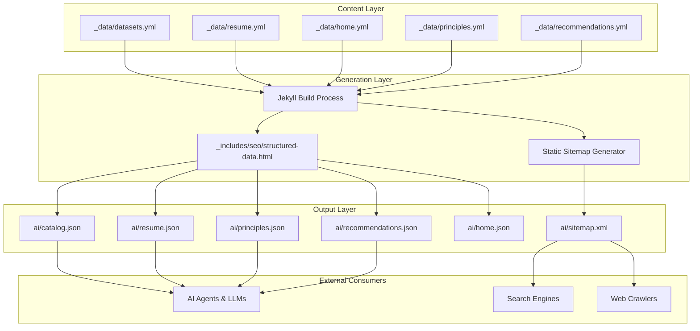
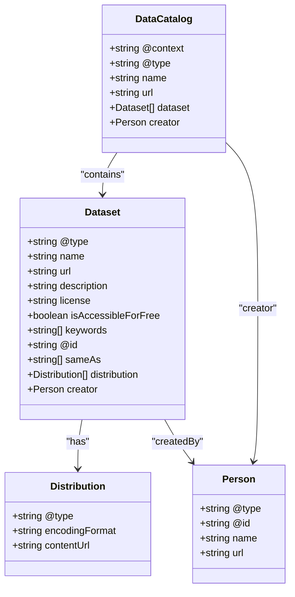
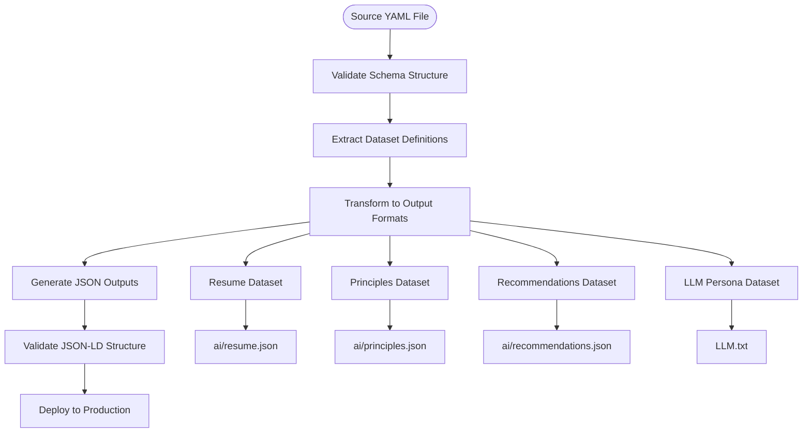
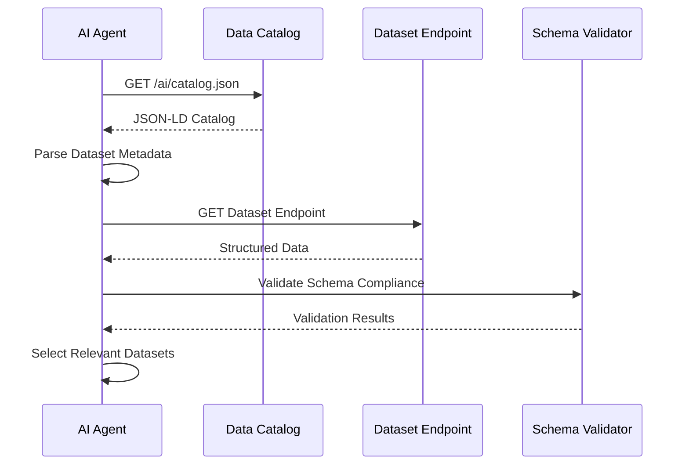
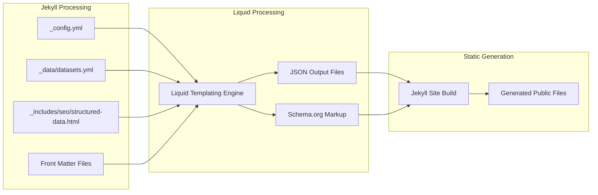

# Data Catalog

<cite>
**Referenced Files in This Document**
- [_data/datasets.yml](file://_data/datasets.yml)
- [ai/catalog.json](file://ai/catalog.json)
- [_includes/seo/structured-data.html](file://_includes/seo/structured-data.html)
- [_config.yml](file://_config.yml)
- [ai/resume.json](file://ai/resume.json)
- [ai/principles.json](file://ai/principles.json)
- [ai/recommendations.json](file://ai/recommendations.json)
- [ai/resume.yml](file://ai/resume.yml)
- [ai/home.json](file://ai/home.json)
- [ai/sitemap.xml](file://ai/sitemap.xml)
- [bin/build_static_sitemap.py](file://bin/build_static_sitemap.py)
- [Gemfile](file://Gemfile)
- [ARCHITECTURE.md](file://ARCHITECTURE.md)
- [README.md](file://README.md)
</cite>

## Table of Contents
1. [Introduction](#introduction)
2. [Architecture Overview](#architecture-overview)
3. [Catalog Structure and Schema](#catalog-structure-and-schema)
4. [Data Source Management](#data-source-management)
5. [JSON-LD Implementation](#json-ld-implementation)
6. [AI Integration Patterns](#ai-integration-patterns)
7. [Security and Access Control](#security-and-access-control)
8. [Build and Generation Process](#build-and-generation-process)
9. [Troubleshooting Guide](#troubleshooting-guide)
10. [Best Practices](#best-practices)

## Introduction

The Data Catalog implementation in this Jekyll-based personal branding site provides a comprehensive machine-readable index of available datasets, specifically designed to enable AI agents to discover and access structured content programmatically. Built around Schema.org's DataCatalog model, the catalog serves as a semantic gateway for AI systems to identify relevant data sources for grounding responses and knowledge retrieval.

The implementation follows a declarative approach where `_data/datasets.yml` serves as the single source of truth for dataset definitions, which are then compiled into a machine-readable `ai/catalog.json` during the site generation process. This pattern ensures consistency across multiple data formats while maintaining semantic richness for search engines and AI crawlers.

## Architecture Overview

The Data Catalog system operates within a Jekyll static site generator framework, leveraging structured data patterns to create a searchable, machine-readable representation of available datasets. The architecture emphasizes scalability, maintainability, and semantic interoperability.



**Diagram sources**
- [_data/datasets.yml](file://_data/datasets.yml#L1-L96)
- [_includes/seo/structured-data.html](file://_includes/seo/structured-data.html#L1-L77)
- [bin/build_static_sitemap.py](file://bin/build_static_sitemap.py#L147-L188)

**Section sources**
- [ARCHITECTURE.md](file://ARCHITECTURE.md#L1-L28)
- [README.md](file://README.md#L1-L25)

## Catalog Structure and Schema

The Data Catalog follows Schema.org's DataCatalog model, providing a hierarchical structure that enables semantic discovery and programmatic access to datasets. The catalog serves as a centralized registry that describes available datasets with comprehensive metadata.

### Core Catalog Structure

The catalog.json file implements the DataCatalog schema with the following key components:

| Property | Type | Description | Example |
|----------|------|-------------|---------|
| `@context` | String | JSON-LD context definition | `"https://schema.org"` |
| `@type` | String | Schema.org type identifier | `"DataCatalog"` |
| `name` | String | Catalog display name | `"DKharlanau Professional Data Catalog"` |
| `url` | String | Catalog endpoint URL | `"https://dkharlanau.github.io/ai/catalog.json"` |
| `dataset` | Array | Array of Dataset objects | See dataset examples below |

### Dataset Entity Relationships

Each dataset within the catalog maintains specific relationships and metadata:



**Diagram sources**
- [_data/datasets.yml](file://_data/datasets.yml#L1-L96)
- [ai/catalog.json](file://ai/catalog.json#L1-L30)

### Interlinking via sameAs and @id

The catalog implementation utilizes Schema.org's `sameAs` property to establish relationships between different representations of the same dataset:

- **Primary Dataset Representation**: JSON-formatted structured data for AI consumption
- **Alternative Formats**: YAML versions for human readability and editing
- **Canonical URLs**: Unique identifiers for each dataset
- **Cross-references**: Bidirectional linking between formats

**Section sources**
- [_data/datasets.yml](file://_data/datasets.yml#L1-L96)
- [ai/catalog.json](file://ai/catalog.json#L1-L30)

## Data Source Management

The `_data/datasets.yml` file serves as the authoritative source for all dataset definitions, providing a centralized repository that drives the generation of multiple output formats. This approach ensures consistency and reduces maintenance overhead.

### Dataset Definition Structure

Each dataset entry in the source file contains comprehensive metadata:

| Field | Purpose | Example Values |
|-------|---------|----------------|
| `@context` | JSON-LD context | `"https://schema.org"` |
| `@type` | Schema type | `"Dataset"` |
| `@id` | Unique identifier | `"https://dkharlanau.github.io/ai/resume"` |
| `name` | Display name | `"Dzmitryi Kharlanau Resume Dataset"` |
| `description` | Purpose statement | `"Structured resume formats..."` |
| `url` | Primary endpoint | `"https://dkharlanau.github.io/ai/resume.json"` |
| `sameAs` | Alternative formats | `["https://dkharlanau.github.io/ai/resume.yml"]` |
| `license` | Creative Commons license | `"https://creativecommons.org/licenses/by/4.0/"` |
| `keywords` | Search terms | `["SAP", "Clean Core", "Integration"]` |
| `isAccessibleForFree` | Accessibility flag | `true` |
| `distribution` | Available formats | Multiple DataDownload objects |

### Dataset Compilation Process

The compilation from source to output follows a standardized pattern:



**Diagram sources**
- [_data/datasets.yml](file://_data/datasets.yml#L1-L96)
- [_includes/seo/structured-data.html](file://_includes/seo/structured-data.html#L1-L77)

**Section sources**
- [_data/datasets.yml](file://_data/datasets.yml#L1-L96)

## JSON-LD Implementation

The JSON-LD implementation leverages Schema.org vocabulary to provide semantic richness and machine interpretability. The implementation follows established best practices for structured data markup.

### Schema.org Vocabulary Integration

The catalog extensively uses Schema.org types and properties:

- **DataCatalog**: Root container for the catalog
- **Dataset**: Individual dataset representations  
- **Person**: Creator identification
- **DataDownload**: Format-specific distributions
- **CreativeWork**: General content classification

### Metadata Enrichment Patterns

The implementation demonstrates several advanced metadata patterns:

#### Entity Identification
- **Unique Identifiers**: Each dataset has a persistent `@id` URI
- **Creator Attribution**: Proper person identification with `@id` references
- **Canonical URLs**: Primary endpoint specification

#### Cross-format Linking
- **sameAs Relationships**: Establishing connections between different dataset formats
- **Distribution Objects**: Describing available formats and their characteristics
- **Encoding Specifications**: MIME type declarations for proper handling

#### Licensing and Accessibility
- **Creative Commons Compliance**: CC BY 4.0 license specification
- **Free Access Indicators**: `isAccessibleForFree` flags
- **Attribution Requirements**: Clear licensing terms

**Section sources**
- [_includes/seo/structured-data.html](file://_includes/seo/structured-data.html#L1-L77)
- [ai/catalog.json](file://ai/catalog.json#L1-L30)

## AI Integration Patterns

The Data Catalog is specifically designed to support AI agents and Large Language Model (LLM) systems in discovering and accessing relevant data sources. The implementation provides multiple pathways for AI integration.

### Discovery Mechanisms

AI agents can discover datasets through several mechanisms:

#### Catalog-Based Discovery


**Diagram sources**
- [ai/catalog.json](file://ai/catalog.json#L1-L30)
- [ai/resume.json](file://ai/resume.json#L1-L7)

#### Semantic Search Integration
- **Keyword Matching**: Dataset keywords for relevance scoring
- **Contextual Filtering**: Type-based filtering (Dataset, Article, etc.)
- **License Compliance**: Accessibility and licensing considerations

### Grounding Response Patterns

AI systems can leverage the catalog for various grounding scenarios:

#### Resume Information Retrieval
- **Skill Extraction**: Comprehensive skill sets for role matching
- **Experience Validation**: Employment history verification
- **Certification Verification**: Credential validation

#### Consulting Knowledge Access
- **Principle Discovery**: Enterprise architecture guidelines
- **Recommendation Retrieval**: Service delivery patterns
- **Methodology Access**: Process frameworks

#### Persona and Profile Management
- **LLM Persona Loading**: Pre-configured agent profiles
- **Context Preservation**: Consistent persona maintenance
- **Version Control**: Evolution tracking

### Practical Query Examples

AI agents can query the catalog using various patterns:

#### Keyword-Based Search
```json
{
  "@context": "https://schema.org",
  "@type": "DataCatalog",
  "dataset": {
    "@type": "Dataset",
    "keywords": ["SAP", "Clean Core", "Integration"]
  }
}
```

#### Type-Specific Retrieval
```json
{
  "@context": "https://schema.org",
  "@type": "DataCatalog",
  "dataset": {
    "@type": "Dataset",
    "@id": "https://dkharlanau.github.io/ai/resume"
  }
}
```

**Section sources**
- [ai/catalog.json](file://ai/catalog.json#L1-L30)
- [ai/resume.json](file://ai/resume.json#L1-L7)

## Security and Access Control

The Data Catalog implementation incorporates security and access control considerations appropriate for a personal branding site, focusing on licensing compliance and accessibility management.

### Licensing Framework

The implementation adheres to Creative Commons licensing standards:

#### CC BY 4.0 Compliance
- **Attribution Requirement**: Proper credit to the author
- **Commercial Use**: Permitted with attribution
- **Modification**: Allowed with proper attribution
- **Distribution**: Free distribution permitted

#### License Implementation Details
- **Standardized URLs**: Direct Creative Commons license URIs
- **Machine-Readable**: JSON-LD license specification
- **Search Engine Visibility**: Structured data for search engines
- **AI Compliance**: Clear licensing terms for automated systems

### Accessibility Flags

The catalog implements accessibility indicators:

| Flag | Purpose | Implementation |
|------|---------|----------------|
| `isAccessibleForFree` | Free access indicator | Boolean values |
| Content Availability | Dataset availability | URL validation |
| Format Compatibility | Machine-readable formats | MIME type specification |

### Security Considerations

While the site focuses on public information, several security measures are implemented:

#### Data Integrity
- **Immutable Endpoints**: Read-only dataset access
- **Version Control**: Historical preservation
- **Validation**: Schema compliance checking

#### Privacy Protection
- **Public Information**: No sensitive data exposure
- **Attribution Control**: Author identification only
- **Access Logging**: Minimal logging for monitoring

**Section sources**
- [_data/datasets.yml](file://_data/datasets.yml#L1-L96)
- [ai/catalog.json](file://ai/catalog.json#L1-L30)

## Build and Generation Process

The Data Catalog generation process integrates seamlessly with the Jekyll build system, utilizing Liquid templating and custom Python scripts to produce machine-readable outputs.

### Jekyll Integration

The Jekyll build process handles most catalog generation through Liquid templating:



**Diagram sources**
- [_includes/seo/structured-data.html](file://_includes/seo/structured-data.html#L1-L77)
- [_config.yml](file://_config.yml#L1-L51)

### Front Matter Configuration

Each JSON output file uses specific front matter configuration:

| Property | Value | Purpose |
|----------|-------|---------|
| `layout: null` | N/A | Prevents Jekyll layout processing |
| `permalink` | Custom path | Defines output URL structure |
| `sitemap: true` | Boolean | Controls sitemap inclusion |

### Static Sitemap Generation

A custom Python script generates comprehensive sitemaps for search engine optimization:

#### Script Capabilities
- **Recursive Directory Traversal**: Scans AI directory structure
- **File Type Filtering**: Supports JSON, YAML, and TXT formats
- **Timestamp Generation**: ISO 8601 timestamp creation
- **URL Normalization**: Consistent URL formatting

#### AI Asset Collection
The script specifically targets AI-related assets:
- **JSON Endpoints**: Structured data files
- **YAML Sources**: Human-editable versions
- **Text Files**: LLM persona definitions
- **Metadata Processing**: Content type and frequency information

**Section sources**
- [_includes/seo/structured-data.html](file://_includes/seo/structured-data.html#L1-L77)
- [bin/build_static_sitemap.py](file://bin/build_static_sitemap.py#L147-L188)
- [ai/sitemap.xml](file://ai/sitemap.xml#L1-L26)

## Troubleshooting Guide

Common issues and their resolutions for Data Catalog functionality.

### Catalog Generation Issues

#### Broken Links
**Symptoms**: 404 errors on dataset endpoints
**Causes**: 
- Incorrect permalink configuration
- Missing front matter
- Build process failures

**Resolution Steps**:
1. Verify front matter in JSON files
2. Check permalink syntax
3. Validate Jekyll build process
4. Review generated file structure

#### Schema Validation Errors
**Symptoms**: JSON-LD validation failures
**Causes**:
- Missing required Schema.org properties
- Incorrect property types
- Invalid URI formats

**Resolution Steps**:
1. Validate against Schema.org specifications
2. Check property data types
3. Verify URI format compliance
4. Test with online validators

### Data Synchronization Problems

#### Outdated Catalog Entries
**Symptoms**: Catalog doesn't reflect latest data
**Causes**:
- Manual updates to source files
- Build process caching
- Deployment delays

**Resolution Steps**:
1. Update source YAML files
2. Trigger rebuild process
3. Clear cache if applicable
4. Verify deployment completion

#### Missing Dataset Entries
**Symptoms**: Datasets not appearing in catalog
**Causes**:
- Incorrect YAML structure
- Missing dataset definitions
- Template processing errors

**Resolution Steps**:
1. Validate YAML syntax
2. Check dataset array structure
3. Verify template processing
4. Review build logs

### Performance and Optimization

#### Slow Load Times
**Symptoms**: Catalog loading takes excessive time
**Causes**:
- Large dataset sizes
- Network connectivity issues
- Browser caching problems

**Optimization Strategies**:
1. Minimize dataset size
2. Implement compression
3. Add caching headers
4. Optimize network requests

**Section sources**
- [bin/build_static_sitemap.py](file://bin/build_static_sitemap.py#L48-L104)
- [_includes/seo/structured-data.html](file://_includes/seo/structured-data.html#L1-L77)

## Best Practices

### Content Management
- **Single Source of Truth**: Maintain all dataset definitions in `_data/datasets.yml`
- **Consistent Naming**: Use descriptive, consistent naming conventions
- **Regular Updates**: Schedule periodic reviews of dataset metadata
- **Version Control**: Track changes to dataset definitions

### Schema Compliance
- **Complete Properties**: Include all required Schema.org properties
- **Proper Types**: Use correct data types for all properties
- **URI Validation**: Ensure all URIs are properly formatted
- **Accessibility Flags**: Accurately mark dataset accessibility

### Performance Optimization
- **Minimal Payloads**: Keep dataset sizes reasonable
- **Compression**: Enable gzip compression for JSON files
- **Caching Headers**: Implement appropriate cache control headers
- **CDN Integration**: Consider CDN placement for global access

### Maintenance Procedures
- **Regular Validation**: Validate JSON-LD structure regularly
- **Monitor Accessibility**: Check dataset availability
- **Update Documentation**: Maintain accurate documentation
- **Backup Strategy**: Implement backup procedures for source data