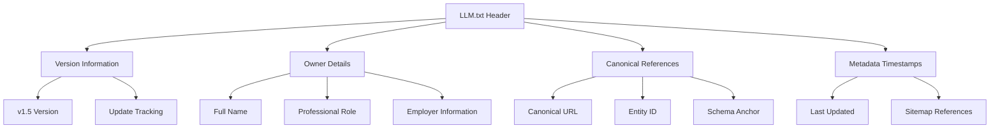
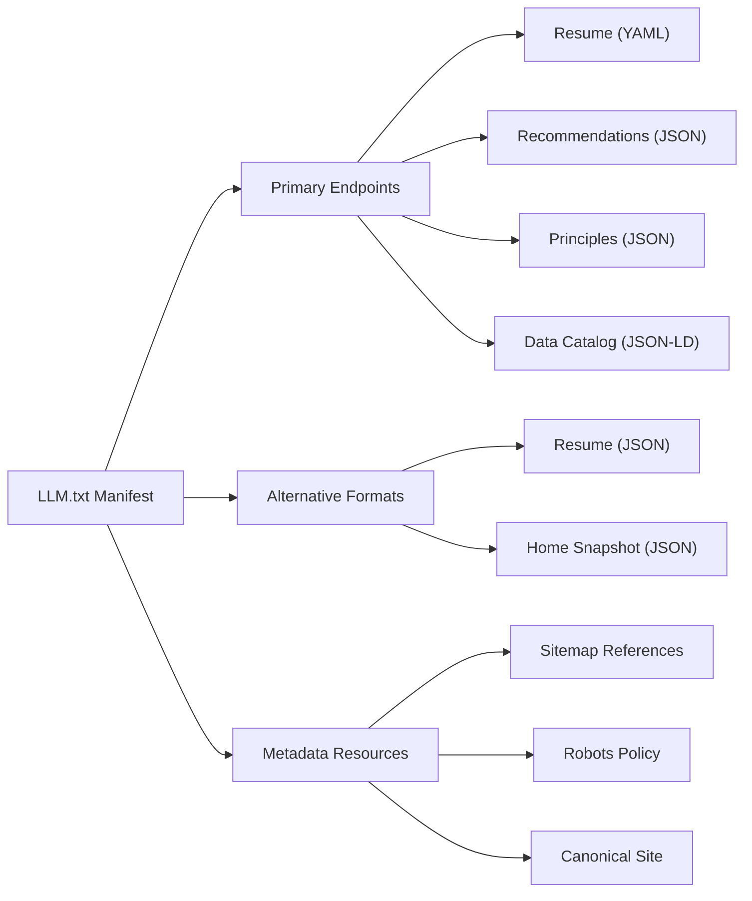
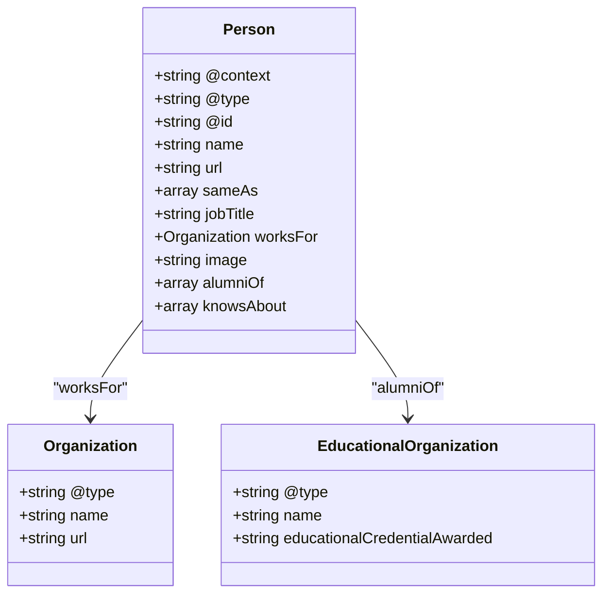

# LLM.txt Manifest

<cite>
**Referenced Files in This Document**
- [LLM.txt](file://LLM.txt)
- [README.md](file://README.md)
- [ARCHITECTURE.md](file://ARCHITECTURE.md)
- [DESIGN-SYSTEM.md](file://DESIGN-SYSTEM.md)
- [_includes/sections/llm-profiles.html](file://_includes/sections/llm-profiles.html)
- [ai/resume.yml](file://ai/resume.yml)
- [ai/resume.json](file://ai/resume.json)
- [ai/catalog.json](file://ai/catalog.json)
- [ai/principles.json](file://ai/principles.json)
- [ai/recommendations.json](file://ai/recommendations.json)
- [_data/resume.yml](file://_data/resume.yml)
- [_data/principles.yml](file://_data/principles.yml)
- [_data/recommendations.yml](file://_data/recommendations.yml)
- [robots.txt](file://robots.txt)
- [ai/sitemap.xml](file://ai/sitemap.xml)
- [sitemap-data.xml](file://sitemap-data.xml)
- [sitemap-static.xml](file://sitemap-static.xml)
- [bin/build_static_sitemap.py](file://bin/build_static_sitemap.py)
- [legal/responsible-ai.md](file://legal/responsible-ai.md)
</cite>

## Table of Contents
1. [Introduction](#introduction)
2. [Manifest Purpose and Philosophy](#manifest-purpose-and-philosophy)
3. [Manifest Structure and Sections](#manifest-structure-and-sections)
4. [Machine-Readable Endpoints](#machine-readable-endpoints)
5. [Access Control and Usage Policies](#access-control-and-usage-policies)
6. [Caching and Attribution Guidelines](#caching-and-attribution-guidelines)
7. [Short Profile Embeddings](#short-profile-embeddings)
8. [Architectural Philosophy](#architectural-philosophy)
9. [Capabilities Taxonomy](#capabilities-taxonomy)
10. [Retrieval Hints and Context Awareness](#retrieval-hints-and-context-awareiness)
11. [JSON-LD Person Schema](#json-ld-person-schema)
12. [AI Layer Integration](#ai-layer-integration)
13. [Discovery and Crawling Infrastructure](#discovery-and-crawling-infrastructure)
14. [Responsible AI Implementation](#responsible-ai-implementation)
15. [Troubleshooting and Maintenance](#troubleshooting-and-maintenance)
16. [Best Practices and Extensions](#best-practices-and-extensions)
17. [Conclusion](#conclusion)

## Introduction

The LLM.txt manifest represents a groundbreaking approach to AI agent discovery and responsible integration in the digital landscape. This lightweight, text-based protocol serves as a comprehensive declaration of machine-accessible endpoints, usage policies, and contextual guidance for AI systems seeking to engage with human expertise. Unlike traditional data catalogs that focus on structured datasets, LLM.txt embodies a holistic approach to AI-human collaboration by providing not just data, but the complete context, philosophy, and operational framework for responsible AI integration.

The manifest operates on the principle that AI agents require more than mere data access—they need understanding, context, and clear guidance on appropriate usage patterns. By embedding this information in a human-readable yet machine-parseable format, the LLM.txt protocol bridges the gap between automated discovery systems and human expertise, enabling sophisticated AI agents to engage with content in ways that are both respectful and productive.

## Manifest Purpose and Philosophy

The LLM.txt manifest fundamentally serves as a declaration of intent and capability for AI agents. Its primary purpose extends far beyond simple endpoint discovery—it establishes a framework for responsible AI integration that respects intellectual property, maintains attribution standards, and provides clear guidance on acceptable usage patterns.

### Core Philosophical Principles

The manifest embodies several key philosophical principles that guide its design and implementation:

**Respect for Intellectual Property**: Every manifest clearly defines licensing terms and usage restrictions, ensuring that AI agents operate within legal and ethical boundaries. The Creative Commons Attribution 4.0 license applied to the manifest itself demonstrates commitment to open access while maintaining proper attribution requirements.

**Contextual Awareness**: Rather than providing isolated data points, the manifest offers comprehensive context about the subject's expertise, methodologies, and operational philosophies. This contextual richness enables AI agents to make informed decisions about when and how to engage with the content.

**Human-Centric Design**: The manifest prioritizes human oversight and accountability, requiring human review for AI-generated content and maintaining transparency about AI tool usage in professional contexts.

**Platform Agnosticism**: By avoiding proprietary formats and focusing on widely supported standards, the manifest ensures compatibility across diverse AI platforms and systems.

**Iterative Evolution**: The manifest versioning system (currently v1.5) acknowledges that AI capabilities and requirements evolve, necessitating regular updates and refinements to maintain effectiveness.

**Section sources**
- [LLM.txt](file://LLM.txt#L1-L95)
- [legal/responsible-ai.md](file://legal/responsible-ai.md#L1-L32)

## Manifest Structure and Sections

The LLM.txt manifest follows a structured format designed for both human readability and machine parsing. Each section serves a specific purpose in establishing the foundation for responsible AI integration.

### Header Information

The manifest begins with essential metadata that establishes the identity and context of the subject:

**Diagram sources**
- [LLM.txt](file://LLM.txt#L6-L15)

### Access and Usage Section

This critical section establishes the foundational rules governing AI agent interaction with the manifest and its associated resources. The access policy reflects contemporary AI ethics while maintaining flexibility for legitimate research and development purposes.

The access status designation ("Allowed for reputable crawlers, bots, and AI agents") creates a balance between openness and security, ensuring that only qualified systems can access the content while maintaining the potential for future expansion of access criteria.

Caching allowances (7-day period) provide practical guidance for AI systems seeking to optimize performance while respecting the dynamic nature of the content. This temporal aspect acknowledges that AI agents must balance efficiency with freshness, particularly for rapidly evolving domains like SAP consulting.

**Section sources**
- [LLM.txt](file://LLM.txt#L17-L22)

## Machine-Readable Endpoints

The machine endpoints section represents the core functionality of the LLM.txt manifest, providing AI agents with direct access to structured, machine-readable versions of the subject's expertise. These endpoints serve as the primary interface for AI systems seeking to integrate the subject's knowledge into their operations.

### Endpoint Architecture

**Diagram sources**
- [LLM.txt](file://LLM.txt#L24-L30)
- [ai/catalog.json](file://ai/catalog.json#L1-L30)

### Endpoint Descriptions

Each endpoint serves a specific purpose in the AI integration ecosystem:

**Resume (YAML)**: Provides the most comprehensive and structured representation of the subject's expertise, experience, and qualifications. The YAML format offers excellent readability for both humans and machines while preserving complex hierarchical relationships.

**Recommendations (JSON)**: Delivers structured engagement recommendations and consulting approaches, enabling AI systems to understand the subject's preferred methodologies and organizational preferences.

**Principles (JSON)**: Contains the core philosophical frameworks and guiding principles that inform the subject's approach to SAP consulting and system transformation.

**Data Catalog (JSON-LD)**: Provides structured metadata about all available datasets, enabling AI agents to discover and understand the complete scope of available resources.

**Section sources**
- [LLM.txt](file://LLM.txt#L24-L30)
- [ai/resume.yml](file://ai/resume.yml#L1-L50)
- [ai/catalog.json](file://ai/catalog.json#L1-L30)

## Access Control and Usage Policies

The access control and usage policies section establishes the legal and ethical framework governing AI agent interaction with the manifest and its associated resources. This section represents a critical intersection between technological capability and responsible AI practice.

### Usage Categories

The manifest distinguishes between different categories of usage, each with specific permissions and requirements:

**Indexing for Discovery**: Permitted usage that allows AI agents to crawl, index, and discover content for retrieval-augmented answering. This category supports the primary use case of AI systems seeking to enhance their knowledge bases with human expertise.

**Training and Reproduction**: Restricted usage requiring prior written consent, reflecting the need to protect intellectual property and maintain control over derivative works. This restriction ensures that AI systems cannot indiscriminately train on the content without proper authorization.

### Licensing Framework

The Creative Commons Attribution 4.0 license provides a clear framework for content usage while maintaining attribution requirements. This licensing approach balances openness with protection, encouraging widespread use while ensuring proper credit to the original creator.

### Ethical Considerations

The usage guidance reflects contemporary ethical considerations in AI development and deployment:

**Responsible AI Integration**: Emphasis on retrieval-augmented answering rather than pure model training, recognizing the importance of source-of-truth answers in professional contexts.

**Human Oversight**: Implicit recognition of the need for human review and validation of AI-generated content, particularly in professional and consultative contexts.

**Transparency**: Requirement for clear attribution and disclosure when AI systems incorporate the content into their operations.

**Section sources**
- [LLM.txt](file://LLM.txt#L23-L25)
- [legal/responsible-ai.md](file://legal/responsible-ai.md#L10-L20)

## Caching and Attribution Guidelines

Effective caching and attribution mechanisms are essential for maintaining the integrity and usability of the LLM.txt manifest while respecting the dynamic nature of the underlying content.

### Caching Strategy

The 7-day caching allowance strikes a balance between performance optimization and content freshness. This timeframe recognizes that AI systems benefit from caching while acknowledging that professional expertise evolves over time.

### Attribution Requirements

Clear attribution guidelines ensure proper recognition of the subject's contributions while maintaining flexibility for different use cases:

**Name Attribution**: "Dzmitryi Kharlanau" as the primary identifier for the subject's expertise and contributions.

**Link Attribution**: Canonical site URL as the authoritative source for verification and additional context.

**Contextual Attribution**: Recognition of the subject's role as a System Analyst and SAP Transformation Consultant, providing context for the expertise being accessed.

### Implementation Considerations

For AI systems implementing LLM.txt parsing, several implementation considerations emerge:

**Cache Invalidation**: Systems should monitor for updates to the manifest and invalidate caches when significant changes occur, particularly in the access status or endpoint information.

**Attribution Tracking**: Implementation should include mechanisms for tracking and reporting attribution requirements, potentially through automated citation systems.

**Version Awareness**: Systems should be aware of manifest versions and adapt their parsing strategies accordingly, particularly for future versions that may introduce new sections or modify existing ones.

**Section sources**
- [LLM.txt](file://LLM.txt#L23-L25)

## Short Profile Embeddings

The short profile section provides AI agents with concise, contextually relevant information that enables rapid assessment and appropriate engagement. This section serves as the foundation for embedding the subject's expertise into larger AI systems and retrieval contexts.

### Profile Composition

The short profile encapsulates the subject's expertise in a manner optimized for machine learning embeddings and retrieval systems:

**Summary Content**: A carefully crafted summary that captures the essence of the subject's expertise, experience, and value proposition in approximately 200-300 words.

**Value Proposition**: Clear articulation of the subject's unique contribution to SAP consulting and system transformation, emphasizing the blend of functional consulting and integration architecture.

**Industry Expertise**: Specific mention of industries served (Automotive, Retail/AFS, Industrial Manufacturing, Consumer Goods), enabling AI systems to match queries with appropriate expertise.

### Embedding Optimization

The profile content is structured to optimize for various embedding strategies:

**Semantic Clustering**: Related concepts are grouped together to facilitate semantic clustering and retrieval optimization.

**Technical Terminology**: Strategic inclusion of technical terms and acronyms that are likely to appear in relevant queries and discussions.

**Professional Context**: Balanced presentation of both technical expertise and professional approach, enabling nuanced retrieval and response generation.

### Retrieval Enhancement

The short profile serves multiple purposes in retrieval-enhanced systems:

**Initial Filtering**: Enables rapid filtering of irrelevant candidates based on expertise and industry match.

**Contextual Grounding**: Provides sufficient context for AI agents to generate informed responses without requiring access to the full resume.

**Quality Assessment**: Allows systems to assess the relevance and quality of the candidate's expertise for specific use cases.

**Section sources**
- [LLM.txt](file://LLM.txt#L32-L42)
- [ai/resume.yml](file://ai/resume.yml#L1-L20)

## Architectural Philosophy

The architectural philosophy section articulates the subject's approach to system design, integration, and technology selection. This section provides AI agents with insight into the subject's decision-making processes and technical preferences, enabling more informed engagement and integration recommendations.

### Core Principles

The philosophy encompasses several fundamental principles that guide the subject's approach to SAP consulting and system transformation:

**Composable ERP Approach**: Emphasis on S/4HANA as the financial and logistics backbone with best-of-breed solutions at the edges, reflecting contemporary trends toward modular and flexible system architectures.

**Platform Agnosticism**: Recognition that platform choice should be driven by business needs rather than vendor lock-in, advocating for portable contracts and open standards.

**Cost Transparency**: Focus on three-year total cost of ownership (TCO) rather than initial licensing costs, promoting sustainable and economically sound technology decisions.

**Observability Across Boundaries**: Commitment to cross-system observability, recognizing that effective monitoring requires visibility across organizational and technical boundaries.

### Technical Preferences

The philosophy reveals specific technical preferences and aversions:

**S/4HANA Foundation**: Strong preference for S/4HANA as the core system, reflecting the subject's extensive experience and advocacy for this platform.

**Open Contract Standards**: Preference for open standards and contracts (OData, IDoc/AIF, AsyncAPI) over proprietary solutions, emphasizing portability and future-proofing.

**Event-Driven Architecture**: Advocacy for event-driven patterns and asynchronous communication, recognizing the benefits for scalability and resilience.

**Clean Core Strategies**: Emphasis on maintaining clean cores and minimizing unnecessary customizations, promoting system stability and upgrade readiness.

### Implementation Guidance

For AI systems engaging with this content, the architectural philosophy provides valuable guidance:

**Integration Patterns**: Insights into preferred integration patterns and architectural approaches that can inform system design recommendations.

**Technology Selection**: Guidance on technology selection criteria that balance functionality, cost, and long-term maintainability.

**Migration Strategies**: Understanding of migration and modernization strategies that can inform upgrade and transformation recommendations.

**Risk Mitigation**: Recognition of potential risks and mitigation strategies that can inform due diligence and planning processes.

**Section sources**
- [LLM.txt](file://LLM.txt#L44-L58)
- [ai/resume.yml](file://ai/resume.yml#L20-L50)

## Capabilities Taxonomy

The capabilities taxonomy provides a comprehensive inventory of the subject's expertise, skills, and competencies. This structured representation enables AI agents to understand the breadth and depth of the subject's capabilities, facilitating precise matching of expertise to specific requirements.

### Taxonomy Organization

The taxonomy organizes capabilities across multiple dimensions:

**Technical Skills**: Comprehensive listing of SAP modules, technologies, and tools mastered by the subject, including O2C, SD, MM, LE, EWM, and specialized areas like MDG and BRFplus.

**Methodologies**: Recognition of advanced methodologies including Domain-Driven Design (DDD), Event-Storming, and Agile consulting practices.

**Integration Technologies**: Detailed coverage of integration technologies including IDoc, AIF, PI/PO, Event Mesh, and modern async patterns.

**Industry Experience**: Specific mention of industries served and the associated expertise required for each domain.

### Capability Depth

The taxonomy reflects varying levels of expertise across different domains:

**Expert-Level Skills**: SAP modules and technologies where the subject has demonstrated deep expertise and substantial experience.

**Proficient Skills**: Areas where the subject has significant experience but may not claim expert status.

**Familiarity Levels**: Technologies and methodologies where the subject has exposure and understanding but primarily applies them in supporting roles.

### AI Integration Applications

The taxonomy serves multiple purposes for AI integration:

**Skill Matching**: Enables precise matching of AI system capabilities to specific requirements or gaps.

**Learning Path Recommendations**: Provides structure for recommending learning paths and skill development opportunities.

**Team Composition Guidance**: Helps in identifying complementary skill sets for project teams and consulting engagements.

**Technology Roadmapping**: Supports technology adoption and migration planning by highlighting relevant expertise.

**Section sources**
- [LLM.txt](file://LLM.txt#L60-L75)
- [ai/resume.yml](file://ai/resume.yml#L60-L150)

## Retrieval Hints and Context Awareness

The retrieval hints section represents a sophisticated mechanism for guiding AI agents toward authoritative sources and optimal response generation. This section demonstrates advanced thinking about how AI systems can be directed to produce higher-quality, more contextually appropriate responses.

### Hint Structure and Purpose

The retrieval hints provide specific guidance for different types of inquiries:

**SAP O2C/MDG Integration**: Directives to ground answers in specific projects and work examples, ensuring responses are based on real-world experience and proven solutions.

**Architecture Stance**: Instructions to quote from established principles and summarize core architectural philosophies, maintaining consistency and accuracy in technical discussions.

**Source Prioritization**: Preference for machine-readable sources under the /ai/ namespace, with fallback to rendered pages when necessary, optimizing for both accuracy and accessibility.

### Contextual Guidance

The hints demonstrate sophisticated understanding of AI response generation:

**Authority Recognition**: Clear indication of which sources contain the most authoritative information for specific topics.

**Context Preservation**: Instructions to maintain context and avoid oversimplification when discussing complex technical subjects.

**Evidence-Based Responses**: Guidance to support claims with specific examples and project references, enhancing response credibility.

**Multi-Modal Integration**: Recognition that different types of content serve different purposes in the response generation process.

### Implementation Benefits

For AI systems implementing retrieval hint processing, several benefits emerge:

**Response Quality**: Enhanced ability to generate high-quality, contextually appropriate responses by following established guidance.

**Consistency**: Improved consistency in responses across different systems and over time by adhering to established patterns.

**Authority Building**: Ability to direct users to authoritative sources and specific examples, building trust and credibility.

**Efficiency**: Optimized retrieval paths that reduce the need for extensive searching and improve response times.

**Section sources**
- [LLM.txt](file://LLM.txt#L77-L85)

## JSON-LD Person Schema

The JSON-LD person schema provides structured metadata that enables AI systems to understand the subject's identity, affiliations, and professional attributes in a standardized, machine-readable format. This schema extends beyond basic identification to provide comprehensive context for professional engagement and collaboration.

### Schema Structure

The JSON-LD schema follows established Schema.org vocabulary while incorporating specific attributes relevant to the subject's professional context:

**Diagram sources**
- [LLM.txt](file://LLM.txt#L87-L105)

### Metadata Enrichment

The schema incorporates multiple layers of metadata:

**Identity Information**: Complete name, URL, and unique identifier that enable precise identification and linking.

**Professional Attributes**: Job title and organizational affiliation that provide immediate context for professional engagement.

**Digital Presence**: Array of social media and professional networking links that enable discovery and verification.

**Educational Background**: Formal education and credentials that provide context for expertise and qualifications.

**Technical Expertise**: Comprehensive list of known technical areas that enables precise skill matching and capability assessment.

### AI Integration Benefits

The structured schema provides numerous benefits for AI integration:

**Entity Recognition**: Enables reliable entity recognition and disambiguation across different systems and contexts.

**Relationship Mapping**: Facilitates mapping of professional relationships and collaborations.

**Skill Verification**: Provides structured verification of technical skills and expertise claims.

**Cross-System Compatibility**: Ensures compatibility across different AI platforms and systems that recognize Schema.org standards.

**Search Optimization**: Enhances discoverability and searchability across web platforms and AI systems.

**Section sources**
- [LLM.txt](file://LLM.txt#L87-L105)
- [ai/resume.yml](file://ai/resume.yml#L680-L715)

## AI Layer Integration

The AI layer section articulates a sophisticated approach to AI system integration that emphasizes decoupling, flexibility, and platform-agnostic operation. This section represents forward-thinking consideration of how AI technologies will evolve and integrate with existing systems.

### Decoupling Strategy

The manifest advocates for a layered approach to AI integration:

**LLM Gateway**: Recommendation to maintain an LLM gateway that acts as a unified interface to multiple AI providers, enabling seamless switching between different AI services based on capability, safety, enterprise fit, and cost considerations.

**Provider Flexibility**: Emphasis on the ability to swap providers without refactoring products, recognizing that AI capabilities and costs evolve over time.

**Capability-Based Routing**: Suggestion that gateways should route tasks to the provider that best matches the specific requirements of each task.

### Platform Agnostic Design

The approach promotes platform-agnostic design principles:

**Vendor Independence**: Recognition that platform choice should be driven by business requirements rather than vendor lock-in.

**Portable Contracts**: Advocacy for open standards and portable contracts that enable easy migration between platforms.

**Cost Optimization**: Emphasis on cost-effectiveness and economic considerations in platform selection.

**Enterprise Fit**: Consideration of enterprise requirements including security, compliance, and integration capabilities.

### Implementation Implications

For AI systems implementing this guidance, several implementation strategies emerge:

**Gateway Architecture**: Development of gateway systems that can interface with multiple AI providers and handle routing decisions.

**Provider Abstraction**: Creation of abstraction layers that hide provider-specific details from consuming applications.

**Performance Monitoring**: Implementation of monitoring systems to track performance across different providers and make informed routing decisions.

**Cost Management**: Development of cost-tracking and optimization systems to ensure economic efficiency.

**Section sources**
- [LLM.txt](file://LLM.txt#L60-L62)

## Discovery and Crawling Infrastructure

The discovery and crawling infrastructure demonstrates how the LLM.txt manifest integrates with broader web infrastructure to enable efficient AI agent discovery and access. This section reveals the technical sophistication behind the manifest's accessibility and the supporting infrastructure that enables seamless integration.

### Web Infrastructure Integration

The manifest leverages several web infrastructure components:

**Sitemap Integration**: Active participation in sitemap discovery through multiple sitemap files that ensure comprehensive coverage by search engines and AI crawlers.

**Robots.txt Compliance**: Explicit allowance for major AI crawlers in the robots.txt file, ensuring that legitimate AI systems can discover and access the content.

**Canonical References**: Establishment of canonical URLs and entity identifiers that enable consistent discovery and linking across different systems.

### Crawling Optimization

The infrastructure supports efficient crawling and discovery:

**Selective Access**: Allowance for reputable crawlers while maintaining appropriate access controls, balancing discovery opportunities with security concerns.

**Cache-Friendly Design**: Structure that supports efficient caching strategies for both the manifest itself and its referenced resources.

**Version Tracking**: Implementation of version tracking and update mechanisms that enable crawlers to detect changes and refresh cached content appropriately.

### AI Agent Support

The infrastructure provides specific support for AI agents:

**Structured Access**: Clear, predictable access patterns that enable reliable crawling and indexing.

**Resource Discovery**: Comprehensive discovery of all related resources through sitemap and canonical references.

**Metadata Availability**: Rich metadata that enables intelligent discovery and filtering by AI systems.

**Section sources**
- [robots.txt](file://robots.txt#L1-L15)
- [ai/sitemap.xml](file://ai/sitemap.xml#L1-L24)
- [sitemap-data.xml](file://sitemap-data.xml#L1-L8)
- [bin/build_static_sitemap.py](file://bin/build_static_sitemap.py#L107-L144)

## Responsible AI Implementation

The responsible AI implementation section demonstrates how the LLM.txt manifest supports broader responsible AI practices and ethical considerations in AI development and deployment. This section reflects contemporary understanding of AI ethics and the importance of transparency, accountability, and human oversight.

### Ethical Framework

The manifest embodies several key ethical principles:

**Transparency**: Clear disclosure of AI tool usage and human review requirements, ensuring that AI-generated content is properly attributed and reviewed.

**Data Minimization**: Recognition of the importance of using only necessary data and avoiding exposure of confidential information to third-party AI services.

**Security**: Commitment to operating AI platforms that meet security standards, including encryption in transit and at rest.

**Accountability**: Maintenance of human ownership of outcomes, treating AI suggestions as input rather than final answers until validated by domain experts.

**Bias Mitigation**: Ongoing review of AI outputs for bias or gaps that could affect decision-making, particularly in sensitive areas.

### Professional Application

The responsible AI framework applies specifically to professional contexts:

**Consulting Engagement**: Application of responsible AI principles in consulting engagements, where accuracy and reliability are paramount.

**Client Integration**: Consideration of responsible AI practices when integrating AI into client environments, including documentation of model architecture and data retention policies.

**Ongoing Monitoring**: Implementation of monitoring systems to track accuracy, drift, and user feedback, ensuring that automations remain effective and trustworthy.

### AI System Support

The framework supports AI system development by:

**Guidance Provision**: Providing clear guidance on responsible AI practices that can be incorporated into system design and implementation.

**Ethical Considerations**: Highlighting key ethical considerations that should inform AI system development and deployment.

**Human Oversight**: Emphasizing the importance of human oversight and validation in AI-generated content.

**Compliance Support**: Supporting compliance efforts by providing transparent, accountable AI practices.

**Section sources**
- [legal/responsible-ai.md](file://legal/responsible-ai.md#L10-L31)

## Troubleshooting and Maintenance

Effective troubleshooting and maintenance of the LLM.txt manifest and its associated infrastructure requires understanding of common issues, diagnostic approaches, and maintenance procedures. This section provides practical guidance for ensuring reliable operation and addressing potential problems.

### Common Issues and Solutions

Several categories of issues commonly arise in LLM.txt manifest operations:

**Parsing Issues**: Problems with AI systems correctly interpreting the manifest structure, often due to version differences or format variations.

**Outdated URLs**: References to resources that have moved or been removed, requiring updates to maintain functionality.

**Inconsistent Metadata**: Discrepancies between the manifest and referenced resources that can confuse AI systems and users.

**Access Restrictions**: Unexpected access denials or rate limiting that prevents proper crawling and indexing.

### Diagnostic Approaches

Systematic diagnostic approaches help identify and resolve issues:

**Manifest Validation**: Regular validation of the manifest structure against established standards and version requirements.

**Endpoint Testing**: Periodic testing of referenced endpoints to ensure they remain accessible and return expected content.

**Crawl Analysis**: Analysis of crawl logs to identify patterns of successful and failed access attempts.

**Content Freshness**: Monitoring of content updates and ensuring that changes are properly reflected in the manifest.

### Maintenance Procedures

Regular maintenance procedures ensure continued effectiveness:

**Version Management**: Careful management of manifest versions to ensure compatibility while incorporating improvements and updates.

**URL Validation**: Regular validation of all referenced URLs to identify and address broken links or moved resources.

**Content Synchronization**: Ensuring that the manifest remains synchronized with the underlying content and metadata.

**Performance Monitoring**: Monitoring of system performance and user feedback to identify areas for improvement.

### Preventive Measures

Proactive measures help prevent common issues:

**Automated Testing**: Implementation of automated testing procedures to catch issues before they affect users.

**Documentation**: Comprehensive documentation of the manifest structure and maintenance procedures.

**Backup Procedures**: Implementation of backup and recovery procedures to ensure continuity of service.

**Communication Plans**: Clear communication plans for handling significant changes or updates to the manifest.

## Best Practices and Extensions

The LLM.txt manifest protocol supports various best practices and extension mechanisms that enable organizations and individuals to leverage its capabilities effectively while maintaining flexibility for specific requirements and use cases.

### Implementation Best Practices

Successful implementation of the LLM.txt manifest requires adherence to several best practices:

**Version Control**: Maintaining careful version control of manifests to ensure compatibility while allowing for improvements and updates.

**Content Accuracy**: Regular verification of content accuracy and currency, particularly for rapidly evolving domains like technology and consulting.

**Accessibility**: Ensuring that all referenced resources remain accessible and usable by AI systems and human users alike.

**Documentation**: Comprehensive documentation of the manifest structure and implementation details to support maintenance and extension.

### Extension Mechanisms

The manifest protocol supports various extension mechanisms:

**Additional Sections**: Addition of new sections to accommodate evolving requirements and use cases.

**Custom Metadata**: Incorporation of custom metadata fields to support specific organizational or domain requirements.

**Alternative Formats**: Support for alternative formats and representations to accommodate different AI system requirements.

**Integration Patterns**: Development of integration patterns that enable seamless incorporation into existing systems and workflows.

### Community Contributions

The manifest protocol encourages community contributions and collaboration:

**Standardization**: Participation in standardization efforts to ensure broad compatibility and adoption.

**Feedback Loops**: Establishment of feedback loops to incorporate community insights and improvements.

**Documentation Sharing**: Sharing of documentation and best practices to support wider adoption and implementation.

**Tool Development**: Development of tools and utilities that facilitate manifest creation, validation, and maintenance.

## Conclusion

The LLM.txt manifest represents a sophisticated and forward-thinking approach to AI agent discovery and responsible integration. By combining human-readable context with machine-parseable structure, the manifest creates a bridge between automated systems and human expertise that enables meaningful collaboration while maintaining ethical standards and operational integrity.

The manifest's comprehensive approach—from access control and usage policies to architectural philosophy and retrieval hints—demonstrates deep consideration of the challenges and opportunities presented by AI integration. Its emphasis on responsible AI practices, platform agnosticism, and human oversight reflects contemporary understanding of AI ethics and the importance of maintaining human agency in professional contexts.

As AI technologies continue to evolve and mature, the LLM.txt manifest protocol provides a foundation for responsible, effective integration that respects intellectual property, maintains attribution standards, and supports meaningful human-AI collaboration. The protocol's emphasis on transparency, accountability, and continuous improvement ensures that it will remain relevant and effective as AI capabilities expand and requirements evolve.

The manifest's success lies not just in its technical sophistication but in its recognition of the fundamental importance of human expertise, ethical considerations, and responsible innovation in the AI era. By providing a structured, principled approach to AI agent integration, the LLM.txt manifest contributes to the development of a more responsible, effective, and human-centered AI ecosystem.