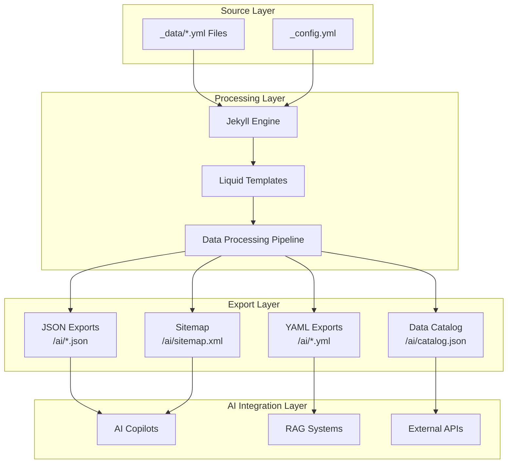
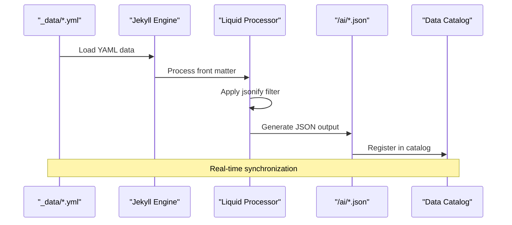
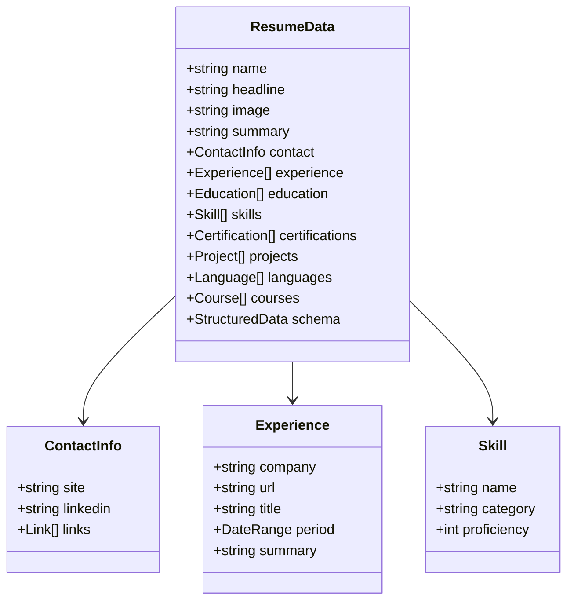
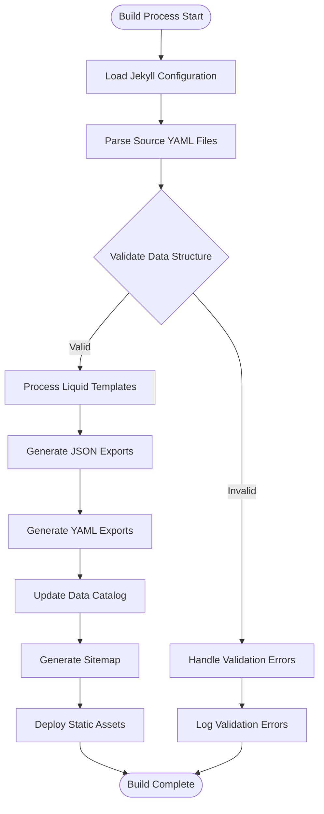
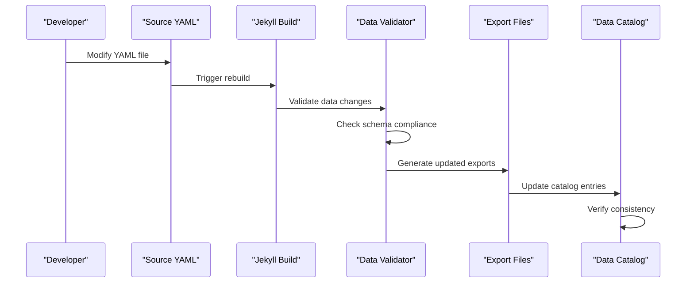
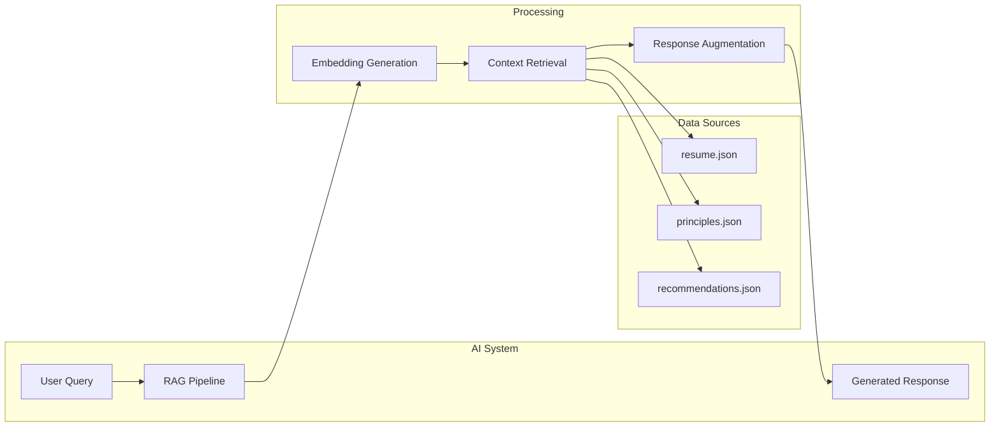

# Machine-Readable Exports

<cite>
**Referenced Files in This Document**
- [_data/resume.yml](file://_data/resume.yml)
- [_data/principles.yml](file://_data/principles.yml)
- [_data/recommendations.yml](file://_data/recommendations.yml)
- [ai/resume.json](file://ai/resume.json)
- [ai/resume.yml](file://ai/resume.yml)
- [ai/principles.json](file://ai/principles.json)
- [ai/recommendations.json](file://ai/recommendations.json)
- [ai/home.json](file://ai/home.json)
- [ai/catalog.json](file://ai/catalog.json)
- [ai/sitemap.xml](file://ai/sitemap.xml)
- [_config.yml](file://_config.yml)
- [Gemfile.lock](file://Gemfile.lock)
- [bin/build_static_sitemap.py](file://bin/build_static_sitemap.py)
- [README.md](file://README.md)
- [ARCHITECTURE.md](file://ARCHITECTURE.md)
</cite>

## Table of Contents
1. [Introduction](#introduction)
2. [System Architecture Overview](#system-architecture-overview)
3. [Data Pipeline and Jekyll Integration](#data-pipeline-and-jekyll-integration)
4. [File Structure and Organization](#file-structure-and-organization)
5. [Schema Design and Data Models](#schema-design-and-data-models)
6. [Export Generation Process](#export-generation-process)
7. [Content Negotiation and MIME Types](#content-negotiation-and-mime-types)
8. [Synchronization Mechanism](#synchronization-mechanism)
9. [Versioning and Consistency Strategies](#versioning-and-consistency-strategies)
10. [AI Copilot Integration Patterns](#ai-copilot-integration-patterns)
11. [Troubleshooting and Error Handling](#troubleshooting-and-error-handling)
12. [Performance and Optimization](#performance-and-optimization)
13. [Best Practices and Guidelines](#best-practices-and-guidelines)

## Introduction

The CV AI site implements a sophisticated machine-readable data export system designed to enable seamless AI copilot integrations and retrieval-augmented generation (RAG) workflows. This system transforms structured YAML data from the `_data` directory into multiple export formats, primarily JSON and YAML, that serve as authoritative sources for professional context awareness and automated assistance.

The architecture leverages Jekyll's data processing pipeline to create synchronized, version-controlled exports that maintain consistency between human-readable web content and machine-consumable data formats. This dual-format approach ensures that AI systems can access the same authoritative information used for website rendering, while maintaining the flexibility needed for various AI integration patterns.

## System Architecture Overview

The machine-readable export system operates within a Jekyll-based static site generation framework, utilizing Liquid templating to transform YAML data into JSON and YAML outputs. The system maintains a strict separation between source data and generated exports while ensuring real-time synchronization.

**Diagram sources**
- [_config.yml](file://_config.yml#L1-L51)
- [Gemfile.lock](file://Gemfile.lock#L85-L133)
- [ai/catalog.json](file://ai/catalog.json#L1-L30)

**Section sources**
- [ARCHITECTURE.md](file://ARCHITECTURE.md#L1-L28)
- [README.md](file://README.md#L1-L25)

## Data Pipeline and Jekyll Integration

The Jekyll data processing pipeline serves as the foundation for the export system, utilizing Liquid templating to transform structured YAML data into multiple output formats. The system employs a declarative approach where each export file specifies its source data and transformation logic through front matter configuration.

### Liquid Template Processing

Each export file in the `/ai` directory utilizes Jekyll's front matter to define its processing parameters and permalink structure. The Liquid templating engine processes the source data through the `site.data` namespace, applying the `jsonify` filter to generate JSON outputs while preserving the original YAML structure for YAML exports.

**Diagram sources**
- [ai/resume.json](file://ai/resume.json#L1-L7)
- [ai/principles.json](file://ai/principles.json#L1-L7)
- [ai/recommendations.json](file://ai/recommendations.json#L1-L7)

### Front Matter Configuration

The export files utilize standardized front matter patterns that define permalink structures, sitemap inclusion, and content metadata. This configuration enables automatic discovery and indexing of machine-readable resources while maintaining SEO optimization and accessibility.

**Section sources**
- [ai/resume.json](file://ai/resume.json#L1-L7)
- [ai/principles.json](file://ai/principles.json#L1-L7)
- [ai/recommendations.json](file://ai/recommendations.json#L1-L7)
- [ai/home.json](file://ai/home.json#L1-L7)

## File Structure and Organization

The machine-readable export system organizes files into a hierarchical structure that reflects both functional organization and accessibility patterns. The `/ai` directory serves as the primary export destination, containing processed versions of core data files alongside supporting metadata and discovery resources.

### Core Export Files

| File | Purpose | Format | Use Cases |
|------|---------|--------|-----------|
| `resume.json` | Professional profile data | JSON | AI copilots, RAG systems, API integrations |
| `resume.yml` | Human-readable resume | YAML | Direct consumption, version control |
| `principles.json` | Consulting philosophy | JSON | Principle-based AI guidance |
| `recommendations.json` | Engagement recommendations | JSON | Opportunity qualification |
| `home.json` | Homepage snapshot | JSON | Landing page data |
| `catalog.json` | Data catalog metadata | JSON | Discovery and indexing |

### Supporting Resources

The system includes additional resources that enhance discoverability and accessibility:

- **Sitemap Generation**: Automated sitemap.xml creation with AI-specific metadata
- **Content Metadata**: Rich metadata for search engines and AI crawlers
- **Format Specifications**: MIME type declarations and content negotiation headers

**Section sources**
- [ai/catalog.json](file://ai/catalog.json#L1-L30)
- [ai/sitemap.xml](file://ai/sitemap.xml#L1-L26)

## Schema Design and Data Models

The system employs well-defined schemas that ensure consistency and interoperability across different AI integration patterns. Each data model serves specific use cases while maintaining semantic relationships and extensibility.

### Resume Data Model

The resume data model represents a comprehensive professional profile with structured experience, skills, and certifications. The model supports both human-readable presentation and machine-consumable extraction for AI applications.

**Diagram sources**
- [_data/resume.yml](file://_data/resume.yml#L1-L441)

### Consulting Principles Model

The principles data model encapsulates consulting philosophy and engagement guidelines, providing structured guidance for AI copilots to understand working methodologies and qualification criteria.

### Engagement Recommendations Model

The recommendations model offers structured engagement profiles that enable AI systems to qualify opportunities and provide tailored recommendations based on organizational needs and capabilities.

**Section sources**
- [_data/resume.yml](file://_data/resume.yml#L1-L441)
- [_data/principles.yml](file://_data/principles.yml#L1-L81)
- [_data/recommendations.yml](file://_data/recommendations.yml#L1-L245)

## Export Generation Process

The export generation process transforms source YAML data into multiple output formats through Jekyll's build pipeline. This process ensures consistency, validates data integrity, and maintains synchronization between source and export files.

### Build Pipeline Stages

**Diagram sources**
- [bin/build_static_sitemap.py](file://bin/build_static_sitemap.py#L107-L144)
- [Gemfile.lock](file://Gemfile.lock#L85-L133)

### Data Validation and Transformation

The system implements comprehensive validation mechanisms to ensure data integrity during the export process. Validation occurs at multiple stages:

1. **Schema Validation**: Ensures data conforms to expected structures
2. **Type Checking**: Validates data types and formats
3. **Reference Integrity**: Verifies cross-references and relationships
4. **Format Compliance**: Ensures output formats meet specifications

**Section sources**
- [bin/build_static_sitemap.py](file://bin/build_static_sitemap.py#L1-L45)
- [Gemfile.lock](file://Gemfile.lock#L85-L133)

## Content Negotiation and MIME Types

The system implements proper content negotiation through MIME type declarations and HTTP header configurations that enable appropriate content selection for different client types and use cases.

### MIME Type Configuration

| Resource Type | MIME Type | Purpose | Client Usage |
|---------------|-----------|---------|--------------|
| JSON Exports | `application/json` | Machine-readable data | AI systems, APIs |
| YAML Exports | `application/yaml` | Human-readable data | Version control, parsing |
| Data Catalog | `application/json` | Discovery metadata | Search engines, crawlers |
| Sitemap | `application/xml` | URL discovery | Search engines |

### HTTP Header Strategy

The system employs appropriate HTTP headers to support caching, compression, and content-type negotiation:

- **Cache-Control Headers**: Optimize caching strategies for different resource types
- **Content-Encoding**: Support gzip compression for bandwidth optimization
- **Content-Type**: Accurate MIME type declarations for proper client handling

**Section sources**
- [ai/sitemap.xml](file://ai/sitemap.xml#L1-L26)
- [ai/catalog.json](file://ai/catalog.json#L1-L30)

## Synchronization Mechanism

The synchronization mechanism ensures that changes to source YAML files propagate consistently to all export formats while maintaining data integrity and version consistency. This mechanism operates through Jekyll's incremental build system and custom validation processes.

### Change Detection and Propagation

**Diagram sources**
- [bin/build_static_sitemap.py](file://bin/build_static_sitemap.py#L48-L104)

### Conflict Resolution

The system implements conflict resolution strategies for handling simultaneous changes to source data and export configurations. These strategies prioritize data integrity while minimizing disruption to the build process.

**Section sources**
- [bin/build_static_sitemap.py](file://bin/build_static_sitemap.py#L48-L104)

## Versioning and Consistency Strategies

The system implements comprehensive versioning and consistency strategies to ensure reliable AI integrations and maintain historical accuracy of exported data.

### Version Control Integration

Versioning strategies include:

- **Semantic Versioning**: Major.minor.patch versioning for data releases
- **Timestamp Tracking**: Automatic timestamp recording for change detection
- **Change Frequency**: Configurable update frequencies for different data types
- **Canonical URLs**: Permanent identifiers for data resources

### Consistency Verification

Consistency verification mechanisms ensure that all export formats remain synchronized:

1. **Cross-Format Validation**: Compare JSON and YAML outputs for consistency
2. **Schema Compliance**: Validate against predefined schemas
3. **Reference Integrity**: Verify cross-references and relationships
4. **Metadata Alignment**: Ensure metadata consistency across formats

**Section sources**
- [ai/resume.yml](file://ai/resume.yml#L1-L715)
- [ai/catalog.json](file://ai/catalog.json#L1-L30)

## AI Copilot Integration Patterns

The machine-readable exports enable various AI copilot integration patterns that leverage structured data for enhanced professional context awareness and automated assistance.

### Retrieval-Augmented Generation (RAG) Patterns

AI systems can integrate with the exports through several RAG patterns:

**Diagram sources**
- [ai/resume.json](file://ai/resume.json#L1-L7)
- [ai/principles.json](file://ai/principles.json#L1-L7)
- [ai/recommendations.json](file://ai/recommendations.json#L1-L7)

### Integration Use Cases

1. **Professional Profile Enhancement**: AI copilots can enrich user profiles with contextual information
2. **Consulting Guidance**: Systems can provide principle-based recommendations
3. **Opportunity Qualification**: Engagement recommendations enable automated opportunity assessment
4. **Knowledge Base Integration**: Structured data supports comprehensive knowledge management

### External System Integration

External AI systems can consume the exports through standardized APIs and integration patterns:

- **Direct API Access**: RESTful endpoints for programmatic data access
- **Webhook Integration**: Event-driven notifications for data changes
- **Batch Processing**: Scheduled downloads for comprehensive data synchronization
- **Real-time Streaming**: WebSocket connections for live data updates

**Section sources**
- [ai/catalog.json](file://ai/catalog.json#L1-L30)

## Troubleshooting and Error Handling

The system implements comprehensive troubleshooting mechanisms and error handling strategies to maintain reliability and provide clear diagnostic information for integration issues.

### Common Issues and Solutions

| Issue Category | Symptoms | Diagnosis | Resolution |
|----------------|----------|-----------|------------|
| Schema Mismatches | JSON parsing errors | Validate against schemas | Update source YAML structure |
| Format Errors | Export generation failures | Check Liquid template syntax | Fix template logic |
| Synchronization Issues | Outdated export files | Verify build timestamps | Trigger rebuild process |
| Content Freshness | Stale data in exports | Check modification dates | Clear cache and rebuild |

### Error Recovery Strategies

The system implements several error recovery strategies:

1. **Graceful Degradation**: Continue operation with fallback data when primary sources fail
2. **Retry Mechanisms**: Automatic retry for transient failures
3. **Backup Data Sources**: Fallback to previous successful exports
4. **Error Logging**: Comprehensive logging for diagnostic purposes

### Diagnostic Tools

Built-in diagnostic tools assist in troubleshooting:

- **Validation Scripts**: Automated schema validation
- **Synchronization Audits**: Cross-format consistency checks
- **Performance Monitoring**: Build time and resource usage tracking
- **Integration Testing**: Automated testing of export consumption

**Section sources**
- [bin/build_static_sitemap.py](file://bin/build_static_sitemap.py#L1-L45)

## Performance and Optimization

The system incorporates performance optimization strategies to ensure efficient processing and rapid response times for AI integrations.

### Build Performance Optimization

Optimization strategies include:

- **Incremental Builds**: Only rebuild changed files and affected exports
- **Parallel Processing**: Concurrent processing of multiple export files
- **Resource Caching**: Cache intermediate processing results
- **Compression**: Automatic compression of export files

### Runtime Performance

Runtime performance optimizations focus on:

- **Content Delivery Networks**: CDN integration for global distribution
- **Caching Strategies**: Appropriate cache-control headers
- **Compression**: Gzip compression for bandwidth optimization
- **Lazy Loading**: Progressive loading of large datasets

### Scalability Considerations

The architecture supports scalability through:

- **Modular Design**: Independent processing of different data types
- **Horizontal Scaling**: Ability to distribute processing load
- **Resource Isolation**: Separate processing pipelines for different exports
- **Monitoring Integration**: Comprehensive performance monitoring

## Best Practices and Guidelines

The system establishes comprehensive best practices for maintaining data quality, ensuring integration reliability, and optimizing AI copilot effectiveness.

### Data Quality Standards

Maintaining high data quality involves:

- **Consistent Formatting**: Standardized data entry patterns
- **Comprehensive Validation**: Multi-stage validation processes
- **Regular Audits**: Periodic quality assurance reviews
- **Documentation Standards**: Clear documentation of data structures

### Integration Guidelines

Recommended integration patterns include:

- **Rate Limiting**: Respectful API usage with appropriate rate limits
- **Error Handling**: Robust error handling for network failures
- **Caching Strategies**: Intelligent caching to reduce load
- **Version Awareness**: Understanding of data versioning and compatibility

### Maintenance Procedures

Regular maintenance procedures ensure system reliability:

- **Scheduled Rebuilds**: Regular full rebuilds for consistency verification
- **Performance Monitoring**: Continuous monitoring of build and runtime performance
- **Security Updates**: Regular updates to dependencies and security patches
- **Capacity Planning**: Proactive capacity management for growing data volumes

### Documentation and Support

Comprehensive documentation supports integration efforts:

- **API Documentation**: Detailed API specifications and usage examples
- **Integration Guides**: Step-by-step integration tutorials
- **Troubleshooting Guides**: Comprehensive problem-solving resources
- **Community Support**: Access to community forums and support channels

**Section sources**
- [README.md](file://README.md#L1-L25)
- [ARCHITECTURE.md](file://ARCHITECTURE.md#L1-L28)