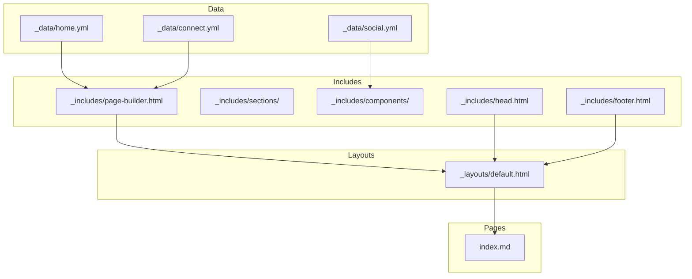
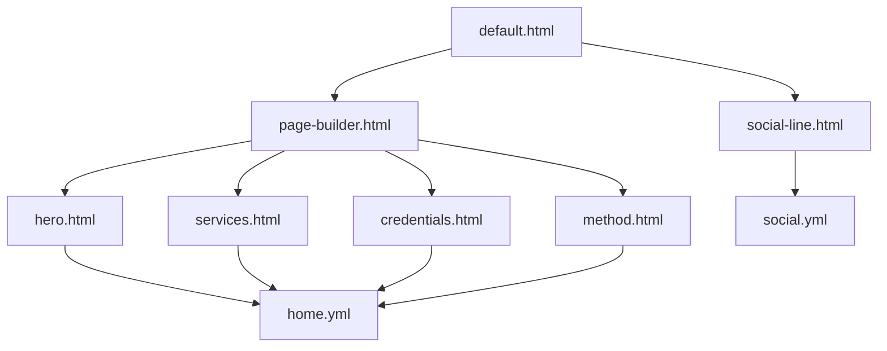
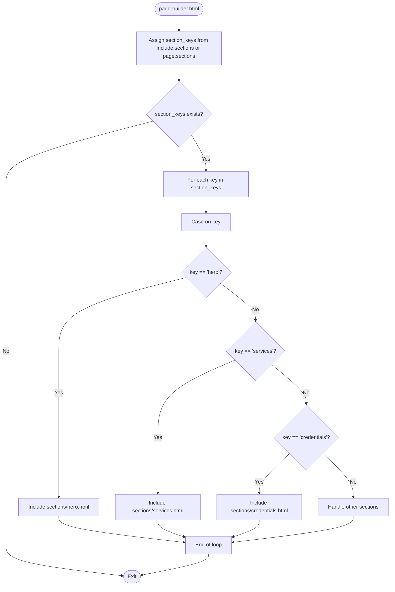
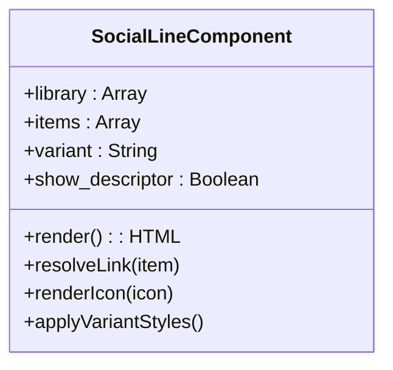

# Component Architecture

<cite>
**Referenced Files in This Document**   
- [page-builder.html](file://_includes/page-builder.html)
- [default.html](file://_layouts/default.html)
- [home.yml](file://_data/home.yml)
- [hero.html](file://_includes/sections/hero.html)
- [services.html](file://_includes/sections/services.html)
- [credentials.html](file://_includes/sections/credentials.html)
- [social-line.html](file://_includes/components/social-line.html)
- [head.html](file://_includes/head.html)
- [footer.html](file://_includes/footer.html)
- [social.yml](file://_data/social.yml)
- [connect.yml](file://_data/connect.yml)
- [connect-hero.html](file://_includes/sections/connect-hero.html)
- [connect-cta.html](file://_includes/sections/connect-cta.html)
- [method.html](file://_includes/sections/method.html)
- [_config.yml](file://_config.yml)
- [index.md](file://index.md)
</cite>

## Table of Contents
1. [Introduction](#introduction)
2. [Project Structure](#project-structure)
3. [Core Components](#core-components)
4. [Architecture Overview](#architecture-overview)
5. [Detailed Component Analysis](#detailed-component-analysis)
6. [Dependency Analysis](#dependency-analysis)
7. [Performance Considerations](#performance-considerations)
8. [Troubleshooting Guide](#troubleshooting-guide)
9. [Conclusion](#conclusion)

## Introduction
This document details the component-based UI architecture of the cv-ai site, focusing on the implementation and composition of reusable HTML components. The system leverages Jekyll's Liquid templating engine to enable dynamic, maintainable, and consistent page rendering through modular sections and components. Key patterns include data-driven section rendering, parameterized component inclusion, and hierarchical composition via layout templates.

## Project Structure
The site follows a Jekyll-based structure with a clear separation between data, templates, and layouts. The `_data` directory contains YAML files that define content, while `_includes` houses reusable components and section templates. Layouts in `_layouts` provide structural scaffolding, and pages like `index.md` define content composition by referencing data and including components.



**Diagram sources**
- [_data/home.yml](file://_data/home.yml)
- [_includes/page-builder.html](file://_includes/page-builder.html)
- [_layouts/default.html](file://_layouts/default.html)
- [index.md](file://index.md)

**Section sources**
- [_data/home.yml](file://_data/home.yml)
- [_includes/page-builder.html](file://_includes/page-builder.html)
- [_layouts/default.html](file://_layouts/default.html)
- [index.md](file://index.md)

## Core Components
The cv-ai site implements a component-based architecture where UI elements are encapsulated as reusable templates. Sections such as hero, services, and credentials are defined in `_includes/sections/` and populated with data from YAML files in `_data/`. Components like social-line.html in `_includes/components/` provide smaller, parameterized UI elements that can be reused across different contexts.

**Section sources**
- [_includes/sections/hero.html](file://_includes/sections/hero.html)
- [_includes/sections/services.html](file://_includes/sections/services.html)
- [_includes/sections/credentials.html](file://_includes/sections/credentials.html)
- [_includes/components/social-line.html](file://_includes/components/social-line.html)

## Architecture Overview
The site's architecture follows a composition pattern where `default.html` serves as the base layout, `page-builder.html` dynamically assembles content sections, and individual section templates render specific UI components. Data from YAML files drives content, enabling separation between presentation and content.



**Diagram sources**
- [default.html](file://_layouts/default.html)
- [page-builder.html](file://_includes/page-builder.html)
- [hero.html](file://_includes/sections/hero.html)
- [services.html](file://_includes/sections/services.html)
- [credentials.html](file://_includes/sections/credentials.html)
- [method.html](file://_includes/sections/method.html)
- [home.yml](file://_data/home.yml)
- [social-line.html](file://_includes/components/social-line.html)
- [social.yml](file://_data/social.yml)

## Detailed Component Analysis

### Section Composition Pattern
The site uses a dynamic section composition system where `page-builder.html` iterates over a list of section keys and includes the corresponding templates. This enables flexible page assembly by defining section sequences in data files.



**Diagram sources**
- [page-builder.html](file://_includes/page-builder.html)

**Section sources**
- [page-builder.html](file://_includes/page-builder.html)

### Hero Section Implementation
The hero section displays a profile card with personal information, image, and action links. It retrieves data from `site.data.home.hero` and supports responsive images with AVIF, WebP, and PNG formats.

**Section sources**
- [hero.html](file://_includes/sections/hero.html)
- [home.yml](file://_data/home.yml)

### Services Section Implementation
The services section renders a grid of service cards, each linking to a detailed page. It uses data from `site.data.home.services.cards` to generate consistent service offerings with titles, subtitles, and CTAs.

**Section sources**
- [services.html](file://_includes/sections/services.html)
- [home.yml](file://_data/home.yml)

### Credentials Section Implementation
The credentials section displays professional credentials in a grid layout. Each credential card contains a title and a list of items, making it suitable for certifications, skills, or achievements.

**Section sources**
- [credentials.html](file://_includes/sections/credentials.html)
- [home.yml](file://_data/home.yml)

### Social Line Component
The social-line.html component renders a compact list of social media links with icons. It accepts parameters like `variant`, `links`, and `show_descriptor` to customize appearance and behavior.



**Diagram sources**
- [social-line.html](file://_includes/components/social-line.html)
- [social.yml](file://_data/social.yml)

**Section sources**
- [social-line.html](file://_includes/components/social-line.html)
- [social.yml](file://_data/social.yml)

## Dependency Analysis
The component architecture demonstrates a clear dependency hierarchy where layout templates depend on include components, and components depend on data files. This separation enables maintainability and reusability across the site.

```mermaid
dependencyDiagram
"default.html" --> "page-builder.html"
"default.html" --> "head.html"
"default.html" --> "footer.html"
"page-builder.html" --> "hero.html"
"page-builder.html" --> "services.html"
"page-builder.html" --> "credentials.html"
"page-builder.html" --> "method.html"
"page-builder.html" --> "connect-hero.html"
"page-builder.html" --> "connect-cta.html"
"hero.html" --> "home.yml"
"services.html" --> "home.yml"
"credentials.html" --> "home.yml"
"method.html" --> "home.yml"
"connect-hero.html" --> "connect.yml"
"connect-cta.html" --> "connect.yml"
"footer.html" --> "social-line.html"
"social-line.html" --> "social.yml"
```

**Diagram sources**
- [default.html](file://_layouts/default.html)
- [page-builder.html](file://_includes/page-builder.html)
- [hero.html](file://_includes/sections/hero.html)
- [services.html](file://_includes/sections/services.html)
- [credentials.html](file://_includes/sections/credentials.html)
- [method.html](file://_includes/sections/method.html)
- [connect-hero.html](file://_includes/sections/connect-hero.html)
- [connect-cta.html](file://_includes/sections/connect-cta.html)
- [footer.html](file://_includes/footer.html)
- [social-line.html](file://_includes/components/social-line.html)
- [home.yml](file://_data/home.yml)
- [connect.yml](file://_data/connect.yml)
- [social.yml](file://_data/social.yml)

**Section sources**
- [default.html](file://_layouts/default.html)
- [page-builder.html](file://_includes/page-builder.html)
- [hero.html](file://_includes/sections/hero.html)
- [services.html](file://_includes/sections/services.html)
- [credentials.html](file://_includes/sections/credentials.html)
- [method.html](file://_includes/sections/method.html)
- [connect-hero.html](file://_includes/sections/connect-hero.html)
- [connect-cta.html](file://_includes/sections/connect-cta.html)
- [footer.html](file://_includes/footer.html)
- [social-line.html](file://_includes/components/social-line.html)
- [home.yml](file://_data/home.yml)
- [connect.yml](file://_data/connect.yml)
- [social.yml](file://_data/social.yml)

## Performance Considerations
The architecture leverages Jekyll's static site generation for optimal performance. Key considerations include:
- Minimizing redundant markup through component reuse
- Using responsive images with modern formats (AVIF, WebP)
- Leveraging Jekyll's caching mechanisms for build performance
- Preloading critical resources like fonts and images
- Implementing lazy loading for non-critical assets

**Section sources**
- [hero.html](file://_includes/sections/hero.html)
- [head.html](file://_includes/head.html)
- [_config.yml](file://_config.yml)

## Troubleshooting Guide
Common issues in the component architecture include:
- Missing data fields causing empty sections
- Incorrect section keys in page definitions
- Broken image paths in responsive image tags
- Social link resolution failures due to mismatched IDs

Ensure data files contain required fields and section keys match those in `page-builder.html`. Validate image paths and social link references to prevent rendering issues.

**Section sources**
- [page-builder.html](file://_includes/page-builder.html)
- [hero.html](file://_includes/sections/hero.html)
- [social-line.html](file://_includes/components/social-line.html)

## Conclusion
The cv-ai site implements a robust component-based architecture using Jekyll and Liquid templates. The system enables maintainable, consistent, and flexible UI composition through reusable sections and components driven by structured data. This approach supports rapid iteration while ensuring accessibility and performance.