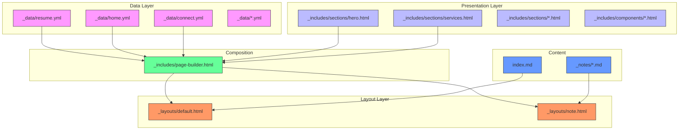
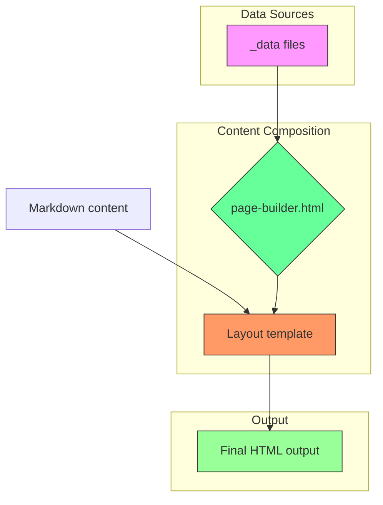
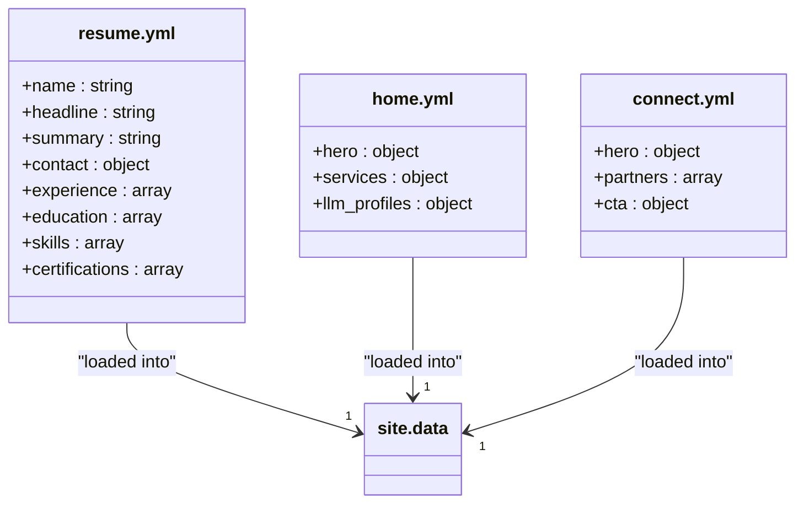
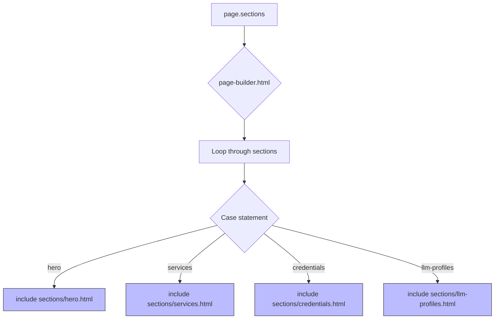
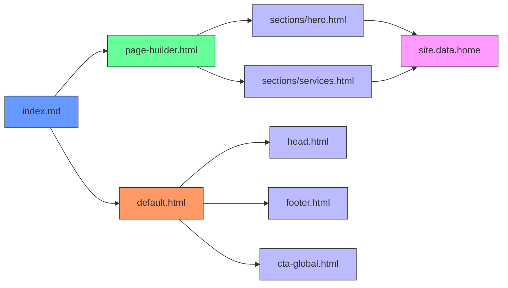

# Content Architecture

<cite>
**Referenced Files in This Document**   
- [_config.yml](file://_config.yml)
- [_layouts/default.html](file://_layouts/default.html)
- [_layouts/note.html](file://_layouts/note.html)
- [_includes/page-builder.html](file://_includes/page-builder.html)
- [_includes/sections/hero.html](file://_includes/sections/hero.html)
- [_includes/sections/services.html](file://_includes/sections/services.html)
- [_includes/head.html](file://_includes/head.html)
- [_data/resume.yml](file://_data/resume.yml)
- [_data/home.yml](file://_data/home.yml)
- [_data/connect.yml](file://_data/connect.yml)
- [index.md](file://index.md)
- [_notes/system-architecture.md](file://_notes/system-architecture.md)
- [ai/resume.yml](file://ai/resume.yml)
- [ai/resume.json](file://ai/resume.json)
</cite>

## Table of Contents
1. [Introduction](#introduction)
2. [Project Structure](#project-structure)
3. [Core Components](#core-components)
4. [Architecture Overview](#architecture-overview)
5. [Detailed Component Analysis](#detailed-component-analysis)
6. [Dependency Analysis](#dependency-analysis)
7. [Performance Considerations](#performance-considerations)
8. [Troubleshooting Guide](#troubleshooting-guide)
9. [Conclusion](#conclusion)

## Introduction
The cv-ai site implements a clean separation of concerns through a Model-View-Controller (MVC)-like architecture, where YAML data files serve as the model, Liquid templates in _includes/sections act as the view, and Jekyll's rendering engine functions as the controller. This documentation details how data from _data files is processed through reusable components and composed into final HTML pages via layout templates. The architecture enables maintainable, extensible content management with consistent presentation across different content types.

## Project Structure



**Diagram sources**
- [_data/resume.yml](file://_data/resume.yml)
- [_includes/sections/hero.html](file://_includes/sections/hero.html)
- [_layouts/default.html](file://_layouts/default.html)
- [_includes/page-builder.html](file://_includes/page-builder.html)
- [index.md](file://index.md)

**Section sources**
- [_data](file://_data)
- [_includes](file://_includes)
- [_layouts](file://_layouts)

## Core Components

The content architecture is built on three core principles: declarative data management, reusable presentation components, and composable layouts. Data is stored in YAML format within the _data directory, providing a structured, human-readable source of truth. Presentation components in _includes/sections encapsulate specific content blocks like hero sections, service offerings, and credentials. These components are orchestrated through the page-builder.html include, which processes a page's section configuration and renders the appropriate components in sequence. The system uses two primary layouts: default.html for standard pages and note.html for practitioner notes, both extending a common structure while providing specialized formatting.

**Section sources**
- [_data](file://_data)
- [_includes/sections](file://_includes/sections)
- [_layouts/default.html](file://_layouts/default.html)
- [_layouts/note.html](file://_layouts/note.html)
- [_includes/page-builder.html](file://_includes/page-builder.html)

## Architecture Overview



**Diagram sources**
- [_data/resume.yml](file://_data/resume.yml)
- [_includes/page-builder.html](file://_includes/page-builder.html)
- [_layouts/default.html](file://_layouts/default.html)

The architecture follows a clear data flow: YAML data files in the _data directory are loaded into Jekyll's site.data object. When a page is rendered, its front matter specifies which sections should be included. The page-builder.html include processes this section list, using a case statement to include the appropriate HTML template from _includes/sections for each requested section. These section templates access data from site.data and render it using Liquid templating. The composed content is then wrapped in a layout template (_layouts/default.html or _layouts/note.html) which provides the overall page structure, including header, footer, and SEO metadata.

## Detailed Component Analysis

### Data Layer Analysis



**Diagram sources**
- [_data/resume.yml](file://_data/resume.yml)
- [_data/home.yml](file://_data/home.yml)
- [_data/connect.yml](file://_data/connect.yml)

#### Data Layer
The _data directory contains YAML files that serve as the primary data source for the site. Each YAML file corresponds to a specific content domain: resume.yml contains professional information, home.yml defines homepage content, and connect.yml manages partnership information. These files are automatically loaded into Jekyll's site.data variable, making them accessible to all templates. The resume.yml file is particularly important as it powers multiple outputs, including the main site content and machine-readable exports in the ai/ directory.

**Section sources**
- [_data/resume.yml](file://_data/resume.yml#L1-L441)
- [_data/home.yml](file://_data/home.yml#L1-L56)
- [_data/connect.yml](file://_data/connect.yml#L1-L22)

### Presentation Layer Analysis



**Diagram sources**
- [_includes/page-builder.html](file://_includes/page-builder.html)
- [_includes/sections/hero.html](file://_includes/sections/hero.html)
- [_includes/sections/services.html](file://_includes/sections/services.html)

#### Presentation Components
The _includes/sections directory contains reusable HTML components that represent distinct content sections. Each component is a self-contained Liquid template that retrieves data from site.data and renders it in a consistent format. The page-builder.html include acts as a controller, processing the sections array defined in a page's front matter and including the appropriate component templates in sequence. This approach enables content editors to compose pages by simply specifying which sections to include, without needing to modify HTML templates directly.

**Section sources**
- [_includes/page-builder.html](file://_includes/page-builder.html#L1-L42)
- [_includes/sections/hero.html](file://_includes/sections/hero.html#L1-L63)
- [_includes/sections/services.html](file://_includes/sections/services.html#L1-L41)

### Layout Layer Analysis

```mermaid
classDiagram
class default.html {
+<!DOCTYPE html>
+<html lang="en">
+<head> include head.html
+<body>
+{{ content }}
+include cta-global.html
+include footer.html
}
class note.html {
+layout : default
+section note-detail
+article note-article
+header with metadata
+{{ content }}
+aside further reading
}
note.html --> default.html : "extends"
```

**Diagram sources**
- [_layouts/default.html](file://_layouts/default.html)
- [_layouts/note.html](file://_layouts/note.html)

#### Layout Templates
The site uses two primary layout templates: _layouts/default.html for standard pages and _layouts/note.html for practitioner notes. The default layout provides a basic HTML5 structure with header, main content area, and footer, while also including SEO metadata and structured data. The note layout extends the default layout and adds specialized formatting for long-form content, including publication metadata, tags, and further reading links. Both layouts use the {{ content }} placeholder to insert the page-specific content composed by the page-builder.

**Section sources**
- [_layouts/default.html](file://_layouts/default.html#L1-L25)
- [_layouts/note.html](file://_layouts/note.html#L1-L57)

## Dependency Analysis



**Diagram sources**
- [index.md](file://index.md)
- [_includes/page-builder.html](file://_includes/page-builder.html)
- [_includes/sections/hero.html](file://_includes/sections/hero.html)
- [_layouts/default.html](file://_layouts/default.html)
- [_includes/head.html](file://_includes/head.html)

The dependency chain begins with content pages like index.md, which specify their layout and sections in front matter. These pages depend on the page-builder.html include to process their sections, which in turn depends on specific section templates in _includes/sections. The section templates depend on data from site.data, which is populated from YAML files in the _data directory. All pages depend on their layout templates (_layouts/default.html or _layouts/note.html), which include common components like head.html, footer.html, and cta-global.html. This dependency structure ensures consistent presentation while allowing for content-specific variations.

**Section sources**
- [index.md](file://index.md#L1-L15)
- [_includes/page-builder.html](file://_includes/page-builder.html#L1-L42)
- [_layouts/default.html](file://_layouts/default.html#L1-L25)

## Performance Considerations
The architecture is optimized for static site generation, with all content compiled at build time. The separation of data and presentation allows for efficient caching and incremental builds. Data files are parsed once and made available to all templates, minimizing redundant processing. The use of includes for reusable components reduces code duplication and improves maintainability. For AI/ML applications, the site provides machine-readable exports in the ai/ directory, including resume.json and resume.yml, which can be consumed directly without parsing HTML.

## Troubleshooting Guide
When content is not rendering correctly, check the following: ensure the section name in the page's front matter matches exactly with a case statement in page-builder.html; verify that the required data exists in the appropriate YAML file in _data; confirm that the layout specified in front matter exists and is correctly formatted; and check for Liquid template syntax errors in the section includes. For issues with machine-readable exports, verify that the data transformation in ai/resume.json is correctly processing site.data.resume.

## Conclusion
The cv-ai site's content architecture effectively separates data, presentation, and layout concerns, following an MVC-like pattern that enhances maintainability and extensibility. By using YAML for data, reusable Liquid templates for presentation, and composable layouts, the system enables consistent content management across different page types. The architecture supports both human-readable web pages and machine-readable data exports, making it well-suited for AI/ML applications. This approach allows for easy updates to content and design while maintaining a consistent user experience across the site.