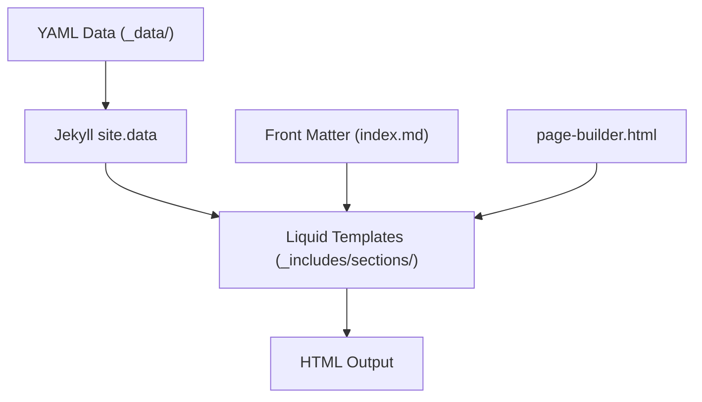
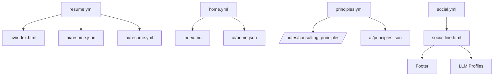

# Content Architecture

<cite>
**Referenced Files in This Document**   
- [_data/resume.yml](file://_data/resume.yml)
- [_data/home.yml](file://_data/home.yml)
- [_data/principles.yml](file://_data/principles.yml)
- [_notes/consulting_principles.md](file://_notes/consulting_principles.md)
- [_config.yml](file://_config.yml)
- [_layouts/note.html](file://_layouts/note.html)
- [_includes/page-builder.html](file://_includes/page-builder.html)
- [_includes/sections/hero.html](file://_includes/sections/hero.html)
- [_includes/sections/services.html](file://_includes/sections/services.html)
- [_includes/sections/llm-profiles.html](file://_includes/sections/llm-profiles.html)
- [index.md](file://index.md)
- [ARCHITECTURE.md](file://ARCHITECTURE.md)
</cite>

## Table of Contents
1. [Introduction](#introduction)
2. [Data and Presentation Separation](#data-and-presentation-separation)
3. _notes Collection and Knowledge Base Structure
4. Jekyll Collections and Custom Content Types
5. Data Flow from YAML to HTML via Liquid
6. Core Data Models: Schema and Usage
7. Content Modularity and Reuse
8. Best Practices for Content Management
9. Conclusion

## Introduction

The cv-ai project employs a structured content architecture built on Jekyll, designed for clarity, reusability, and AI-readiness. This system separates structured data from presentation logic, enabling consistent content delivery across multiple formats and surfaces. The architecture leverages YAML files as the canonical source of truth, Markdown-based knowledge articles, and Jekyll’s collection system to define custom content types with standardized front matter and templating. This document details how these components interact to form a scalable, maintainable, and machine-readable content ecosystem.

## Data and Presentation Separation

The cv-ai project strictly separates content data from its presentation using Jekyll’s data file system. All structured content resides in the `_data` directory as YAML files, serving as the single source of truth for key site sections. This declarative approach ensures that content updates are made in one place and automatically propagate across all dependent views.

For example, the homepage’s content is defined in `_data/home.yml`, which contains structured fields for the hero section, service offerings, and LLM profile links. This data is then rendered through Liquid templates in `_includes/sections/`, such as `hero.html` and `services.html`, which apply consistent styling and layout logic. This separation allows designers and content authors to modify copy or structure without touching HTML, and developers to adjust UI components without altering content.

This pattern extends to other key pages: `resume.yml` powers both the CV page and AI exports, while `changelog.yml` drives the changelog timeline. By centralizing data, the system ensures consistency, reduces duplication, and simplifies maintenance.

**Section sources**
- [_data/home.yml](file://_data/home.yml#L0-L55)
- [_data/resume.yml](file://_data/resume.yml#L0-L440)
- [_includes/sections/hero.html](file://_includes/sections/hero.html#L0-L54)
- [_includes/sections/services.html](file://_includes/sections/services.html#L0-L40)

## _notes Collection and Knowledge Base Structure

The `_notes` directory functions as a curated knowledge base, housing Markdown files that represent practitioner notes on topics such as AI/ML, composable ERP, and consulting principles. Each note is a standalone article with standardized front matter including `title`, `date`, `tags`, `summary`, and `subtitle`, ensuring uniform metadata across entries.

These notes are processed as a Jekyll collection, configured in `_config.yml` to use the `note.html` layout and generate clean permalinks under `/notes/:slug/`. The collection is automatically discoverable via `site.notes`, enabling dynamic listing on the `/notes/` index page. This structure supports scalable content growth—new notes are added simply by placing a Markdown file in `_notes` with appropriate metadata.

The content is designed for both human readability and machine processing. For instance, `consulting_principles.md` expands on the principles defined in `principles.yml`, providing narrative context while linking to structured data for AI consumption. This dual-layer approach—narrative in Markdown, structure in YAML—enables rich storytelling backed by queryable data.

**Section sources**
- [_notes/consulting_principles.md](file://_notes/consulting_principles.md#L0-L79)
- [_config.yml](file://_config.yml#L25-L30)
- [_layouts/note.html](file://_layouts/note.html#L0-L46)

## Jekyll Collections and Custom Content Types

Jekyll collections are used to define custom content types with consistent behavior and rendering. The `notes` collection is the primary example, configured in `_config.yml` with `output: true` and a permalink pattern that generates SEO-friendly URLs. Collection defaults ensure every note uses the `note.html` layout, eliminating the need to specify layout in individual files.

This pattern allows for future extensibility, as outlined in `ARCHITECTURE.md`, which suggests defining additional collections like `case_studies` or `playbooks` using the same model. Each collection can have its own directory, layout, and URL structure, enabling domain-specific content types while maintaining architectural consistency.

Collections also integrate with Jekyll’s site variables, making them accessible in templates via `site.notes` or similar constructs. This enables dynamic navigation, filtering by tags, and cross-referencing between content types, supporting a knowledge graph-like structure.

**Section sources**
- [_config.yml](file://_config.yml#L25-L30)
- [ARCHITECTURE.md](file://ARCHITECTURE.md#L63-L65)

## Data Flow from YAML to HTML via Liquid

Data flows from YAML sources to HTML templates through Jekyll’s Liquid templating engine. The process begins with data files in `_data`, which are loaded into the `site.data` namespace and made available to all templates. For example, `home.yml` is accessed as `site.data.home` in Liquid.

The homepage, defined in `index.md`, specifies a `sections` array in its front matter that controls the order of rendered components. The `page-builder.html` include iterates over this array, dynamically including the corresponding section partials (e.g., `hero.html`, `services.html`). Each partial accesses the relevant subset of `site.data` to render content.

For instance, `hero.html` retrieves `site.data.home.hero` and renders the title, lead text, and profile links using conditional logic and loops. This modular approach decouples content structure from presentation, allowing sections to be reused or reordered without code changes.

**Diagram sources**
- [_data/home.yml](file://_data/home.yml#L0-L55)
- [_includes/page-builder.html](file://_includes/page-builder.html#L0-L39)
- [_includes/sections/hero.html](file://_includes/sections/hero.html#L0-L54)
- [index.md](file://index.md#L0-L14)

**Section sources**
- [_includes/page-builder.html](file://_includes/page-builder.html#L0-L39)
- [_includes/sections/hero.html](file://_includes/sections/hero.html#L0-L54)

## Core Data Models: Schema and Usage

The cv-ai project defines several core data models in YAML format, each tailored to a specific content domain:

- **resume.yml**: Contains structured professional data including `name`, `headline`, `experience`, `skills`, and `certifications`. It powers both the CV page and AI exports (`ai/resume.json`, `ai/resume.yml`), ensuring consistency across human and machine-readable formats.
  
- **home.yml**: Defines the homepage’s content structure with sections like `hero`, `services`, and `llm_profiles`. The `services` object contains cards with `title`, `subtitle`, `url`, and `cta`, enabling modular service descriptions that link to knowledge base articles.

- **principles.yml**: Encodes consulting principles as structured objects with `id`, `title`, `summary`, `commitments`, and `proof_points`. This schema supports both narrative expansion in Markdown and direct retrieval by AI agents via `/ai/principles.json`.

These models follow a consistent design: flat, human-readable structures with nested arrays for lists, and clear key names that reflect their semantic meaning. This design prioritizes clarity and machine readability, aligning with the project’s AI-friendly goals.

**Section sources**
- [_data/resume.yml](file://_data/resume.yml#L0-L440)
- [_data/home.yml](file://_data/home.yml#L0-L55)
- [_data/principles.yml](file://_data/principles.yml#L0-L80)

## Content Modularity and Reuse

Content modularity is a cornerstone of the cv-ai architecture. Data models are designed for reuse across multiple contexts. For example, the `services` section in `home.yml` links to notes like `/notes/ams/` and `/notes/ai-ml/`, creating a content mesh where structured data points to narrative depth.

Similarly, the `llm-profiles` section in `home.yml` exposes machine-readable versions of the resume and principles, enabling AI agents to retrieve structured data directly. This reuse extends to exports: modifying `resume.yml` updates both the CV page and the JSON/YAML files in `/ai`, ensuring synchronization.

UI components are also modular. The `social-line.html` component is reused across sections and the footer, pulling social links from `_data/social.yml`. This component-based approach ensures visual consistency and reduces duplication.

**Diagram sources**
- [_data/resume.yml](file://_data/resume.yml#L0-L440)
- [_data/home.yml](file://_data/home.yml#L0-L55)
- [_data/principles.yml](file://_data/principles.yml#L0-L80)
- [_data/social.yml](file://_data/social.yml#L0-L10)
- [_includes/components/social-line.html](file://_includes/components/social-line.html#L0-L10)

**Section sources**
- [_data/resume.yml](file://_data/resume.yml#L0-L440)
- [_data/home.yml](file://_data/home.yml#L0-L55)
- [_data/principles.yml](file://_data/principles.yml#L0-L80)

## Best Practices for Content Management

To maintain consistency and scalability, the following best practices are recommended:

- **Add new notes** by creating a Markdown file in `_notes/` with required front matter (`title`, `date`) and optional fields (`tags`, `summary`, `subtitle`). The collection configuration ensures automatic inclusion and proper routing.

- **Update structured data** in the relevant `_data` file (e.g., `home.yml` for homepage changes). Avoid duplicating content; instead, reference existing data from multiple templates.

- **Extend data models** by following existing schema patterns: use clear key names, group related fields, and include arrays for lists. For new collections, mirror the `notes` configuration in `_config.yml`.

- **Maintain AI surfaces** by ensuring critical data has JSON exports in `/ai`. Use `layout: null` and `| jsonify` to generate machine-readable versions, as demonstrated with `ai/resume.json`.

- **Ensure SEO compliance** by leveraging `_includes/seo/structured-data.html`, which automatically generates JSON-LD for Person, Article, and Breadcrumb entities based on page context.

These practices ensure the content system remains coherent, extensible, and aligned with both human and AI consumption patterns.

**Section sources**
- [_config.yml](file://_config.yml#L25-L30)
- [ARCHITECTURE.md](file://ARCHITECTURE.md#L63-L68)
- [_includes/seo/structured-data.html](file://_includes/seo/structured-data.html#L92-L188)

## Conclusion

The cv-ai project’s content architecture exemplifies a modern, componentized approach to static site design. By separating data and presentation, leveraging Jekyll collections, and enforcing modularity, it achieves a high degree of reusability, consistency, and AI-readiness. The use of YAML as a canonical data source, combined with Markdown-based narrative content, creates a balanced ecosystem where structured and unstructured content coexist and reinforce each other. This architecture not only supports current use cases but is also designed for future growth, making it a robust foundation for knowledge management and professional storytelling.