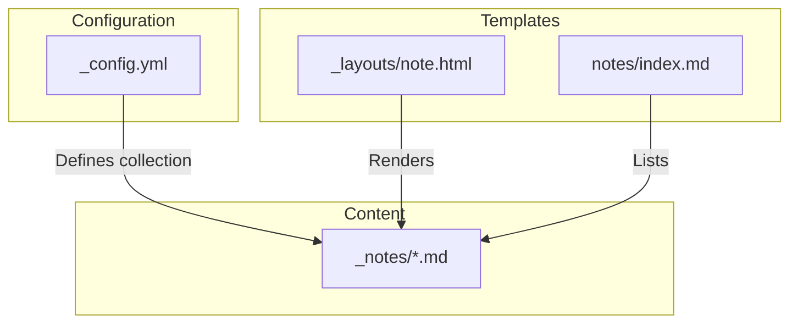
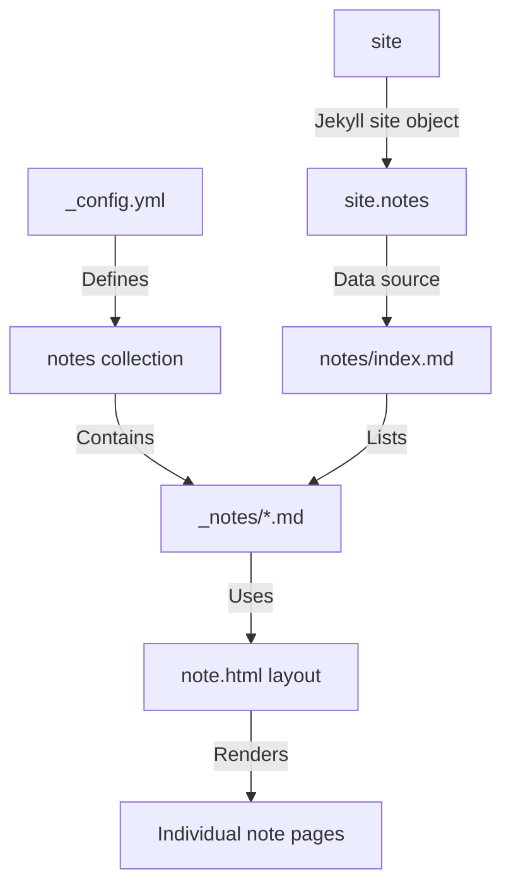
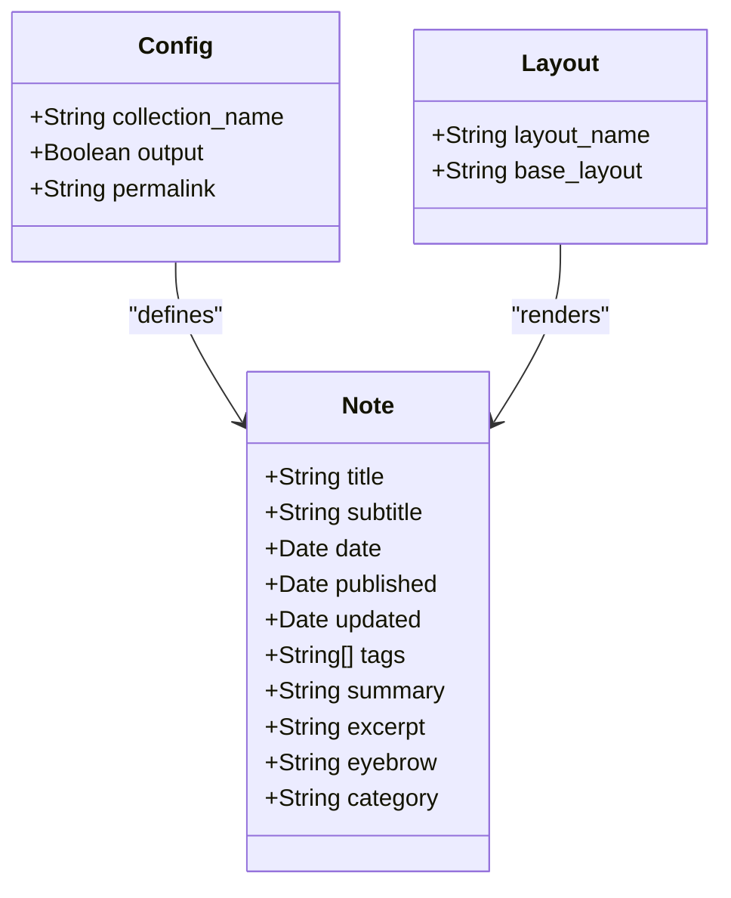
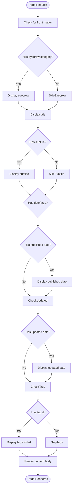
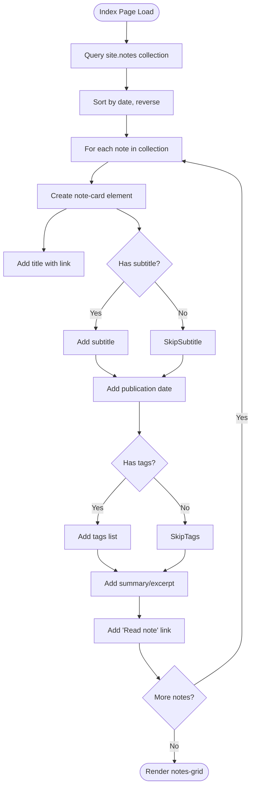
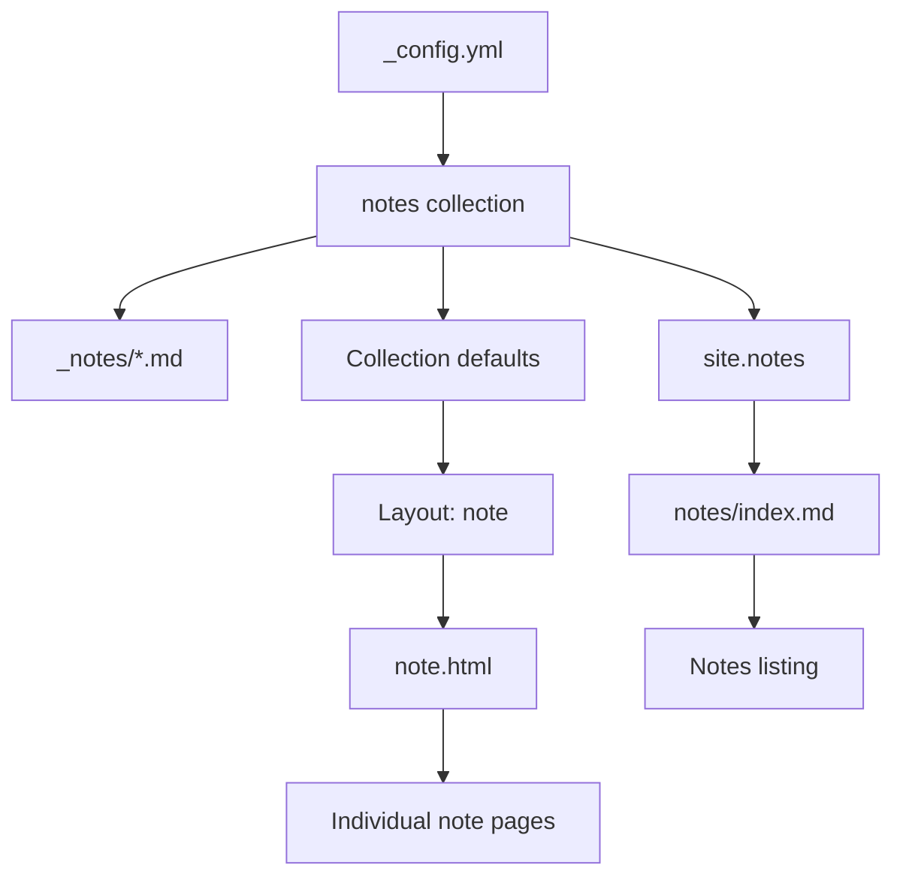

# Content Collections

<cite>
**Referenced Files in This Document**   
- [_config.yml](file://_config.yml)
- [_layouts/note.html](file://_layouts/note.html)
- [notes/index.md](file://notes/index.md)
- [_notes/ai_ml.md](file://_notes/ai_ml.md)
- [_notes/system-architecture.md](file://_notes/system-architecture.md)
- [ARCHITECTURE.md](file://ARCHITECTURE.md)
- [_includes/seo/structured-data.html](file://_includes/seo/structured-data.html)
- [assets/main.css](file://assets/main.css)
</cite>

## Table of Contents
1. [Introduction](#introduction)
2. [Project Structure](#project-structure)
3. [Core Components](#core-components)
4. [Architecture Overview](#architecture-overview)
5. [Detailed Component Analysis](#detailed-component-analysis)
6. [Dependency Analysis](#dependency-analysis)
7. [Performance Considerations](#performance-considerations)
8. [Troubleshooting Guide](#troubleshooting-guide)
9. [Conclusion](#conclusion)

## Introduction
This document details the Jekyll collections implementation used for the knowledge base in the cv-ai project. It explains how the `_notes` directory functions as a collection of field notes in Markdown format, with each file representing a distinct topic such as AI/ML, AMS, or system architecture. The role of `_config.yml` in defining the 'notes' collection and enabling custom front matter is described. The standardization of presentation across all notes via the `note.html` layout template is illustrated. The function of `notes/index.md` as the entry point for browsing the knowledge base is shown. Step-by-step instructions for adding new notes, including required metadata and formatting standards, are provided. Common issues like broken links or inconsistent categorization are addressed, with solutions offered for maintaining a coherent knowledge hierarchy.

## Project Structure
The project uses a Jekyll-based static site structure optimized for modular content and AI-friendly exports. The `_notes` directory contains individual Markdown files representing distinct knowledge topics. The `_layouts` directory defines reusable templates, including `note.html` for standardized note rendering. The `_config.yml` file configures the 'notes' collection with output enabled and clean permalinks. The `notes/index.md` file serves as the landing page for browsing all notes.

**Diagram sources**
- [_config.yml](file://_config.yml#L30-L35)
- [_layouts/note.html](file://_layouts/note.html#L1-L46)
- [notes/index.md](file://notes/index.md#L1-L41)

**Section sources**
- [_config.yml](file://_config.yml#L1-L50)
- [_layouts/note.html](file://_layouts/note.html#L1-L46)
- [notes/index.md](file://notes/index.md#L1-L41)

## Core Components
The core components of the Jekyll collections implementation include the `_notes` directory for storing Markdown-based field notes, the `_config.yml` configuration file that defines the 'notes' collection with output and permalink settings, the `note.html` layout template that standardizes the presentation of all notes, and the `notes/index.md` file that serves as the entry point for browsing the knowledge base. These components work together to create a structured, maintainable knowledge management system.

**Section sources**
- [_config.yml](file://_config.yml#L30-L35)
- [_layouts/note.html](file://_layouts/note.html#L1-L46)
- [notes/index.md](file://notes/index.md#L1-L41)
- [_notes/ai_ml.md](file://_notes/ai_ml.md#L1-L114)

## Architecture Overview
The Jekyll collections architecture centers around the 'notes' collection defined in `_config.yml`. This configuration enables the `_notes` directory to function as a content collection with output generation and clean URL routing via permalinks. Each note uses front matter metadata (title, date, tags, etc.) to define its properties. The `note.html` layout applies consistent styling and metadata display across all notes. The `notes/index.md` page queries the `site.notes` collection to generate a dynamic listing of all available notes, sorted by date.

**Diagram sources**
- [_config.yml](file://_config.yml#L30-L35)
- [_layouts/note.html](file://_layouts/note.html#L1-L46)
- [notes/index.md](file://notes/index.md#L1-L41)
- [ARCHITECTURE.md](file://ARCHITECTURE.md#L44-L49)

## Detailed Component Analysis

### Notes Collection Implementation
The Jekyll 'notes' collection is implemented through configuration in `_config.yml`, which defines the collection with output enabled and a clean permalink structure (`/notes/:slug/`). This allows each Markdown file in the `_notes` directory to be processed as a standalone page with consistent URL formatting.

**Diagram sources**
- [_config.yml](file://_config.yml#L30-L35)
- [_notes/ai_ml.md](file://_notes/ai_ml.md#L1-L114)
- [_notes/system-architecture.md](file://_notes/system-architecture.md#L1-L21)

### Note Layout Template
The `note.html` layout template standardizes the presentation of all notes by defining a consistent structure for metadata display (title, subtitle, publication dates, tags) and content rendering. It uses Liquid templating to conditionally display front matter fields and applies CSS classes for styling.

**Diagram sources**
- [_layouts/note.html](file://_layouts/note.html#L1-L46)
- [assets/main.css](file://assets/main.css#L831-L912)

### Notes Index Page
The `notes/index.md` file serves as the entry point for browsing the knowledge base, listing all notes in reverse chronological order. It uses Liquid templating to iterate through the `site.notes` collection, displaying each note's title, subtitle, publication date, tags, and summary.

**Diagram sources**
- [notes/index.md](file://notes/index.md#L1-L41)
- [assets/main.css](file://assets/main.css#L681-L769)

## Dependency Analysis
The Jekyll collections implementation has a clear dependency hierarchy. The `_config.yml` file defines the 'notes' collection, which is a prerequisite for processing files in the `_notes` directory. The `note.html` layout depends on the collection being defined and is applied to all notes through default settings in `_config.yml`. The `notes/index.md` page depends on the `site.notes` collection being available and properly configured.

**Diagram sources**
- [_config.yml](file://_config.yml#L30-L35)
- [_layouts/note.html](file://_layouts/note.html#L1-L46)
- [notes/index.md](file://notes/index.md#L1-L41)

**Section sources**
- [_config.yml](file://_config.yml#L30-L35)
- [_layouts/note.html](file://_layouts/note.html#L1-L46)
- [notes/index.md](file://notes/index.md#L1-L41)

## Performance Considerations
The Jekyll collections implementation is optimized for static site generation performance. The use of a single collection with simple front matter minimizes processing overhead. The `notes/index.md` page efficiently queries and sorts the `site.notes` collection using built-in Jekyll liquid filters. CSS styling is centralized in `main.css` with reusable classes for consistent rendering. Structured data (JSON-LD) is conditionally generated only for relevant pages, reducing payload size.

**Section sources**
- [_includes/seo/structured-data.html](file://_includes/seo/structured-data.html#L92-L188)
- [assets/main.css](file://assets/main.css#L681-L988)

## Troubleshooting Guide
Common issues in the Jekyll collections implementation include broken links, inconsistent categorization, and missing metadata. To resolve broken links, ensure permalinks in `_config.yml` match the routing pattern and verify internal links use relative paths. For inconsistent categorization, establish and document naming conventions for tags and categories. Missing metadata can be prevented by creating a template for new notes with required front matter fields.

To maintain a coherent knowledge hierarchy:
1. Use consistent tag naming (lowercase, hyphen-separated)
2. Include required metadata in all new notes (title, date, tags)
3. Follow the established permalink pattern
4. Test locally before deployment
5. Use the same layout template for all notes
6. Keep summary and excerpt fields updated

**Section sources**
- [_config.yml](file://_config.yml#L30-L35)
- [_notes/ai_ml.md](file://_notes/ai_ml.md#L1-L114)
- [_notes/system-architecture.md](file://_notes/system-architecture.md#L1-L21)

## Conclusion
The Jekyll collections implementation in the cv-ai project provides a robust framework for managing a knowledge base of field notes. By leveraging the `_notes` directory as a content collection, configuring it through `_config.yml`, standardizing presentation with the `note.html` layout, and providing a browseable index through `notes/index.md`, the system enables efficient knowledge management. The architecture supports scalability, consistency, and maintainability, making it suitable for ongoing documentation and knowledge sharing.