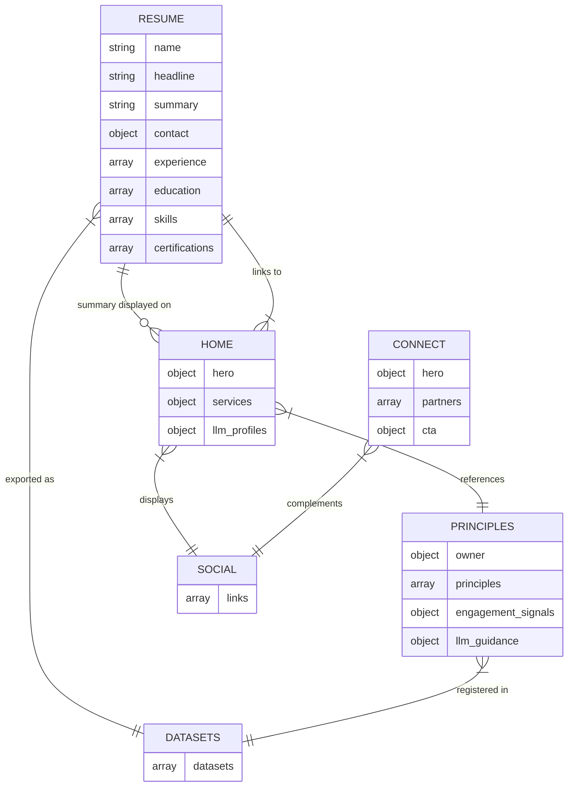
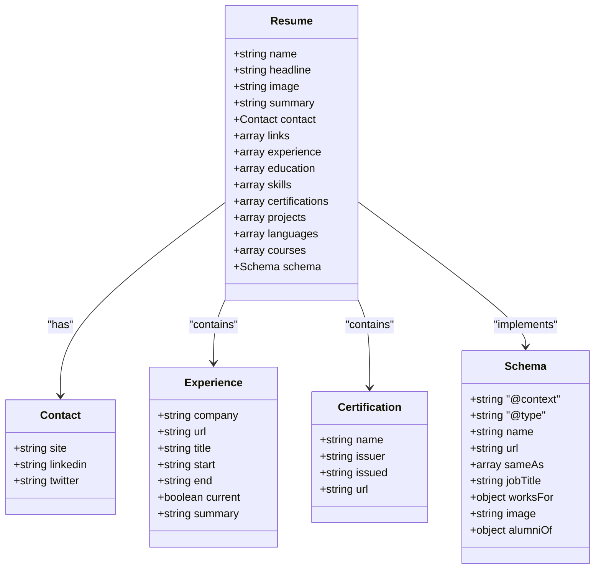
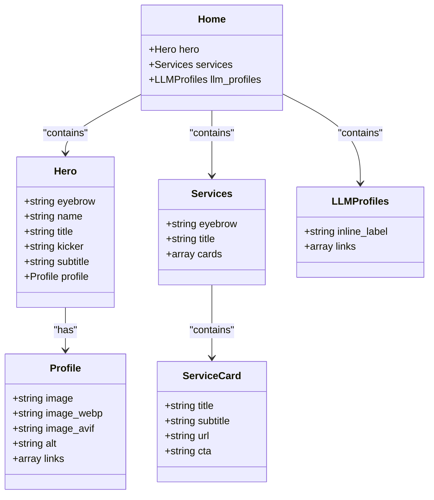
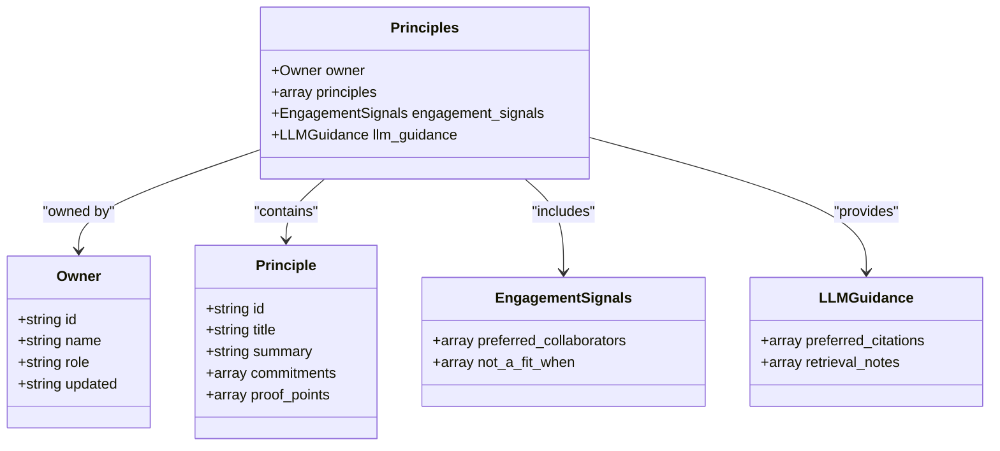
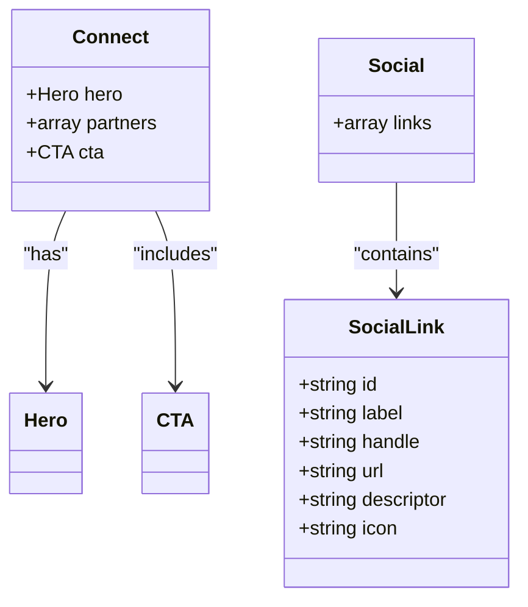
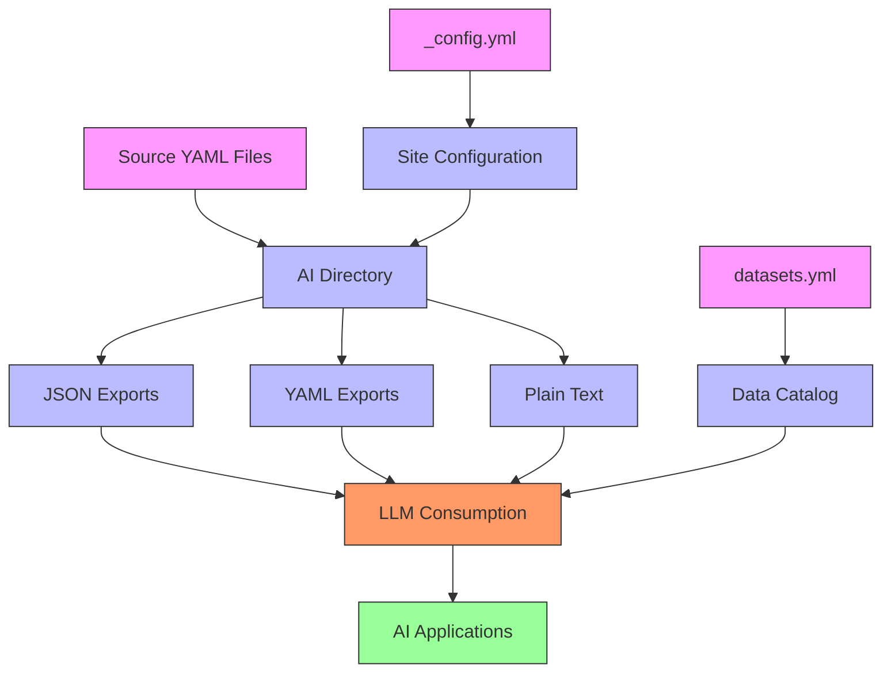

# Data Model

<cite>
**Referenced Files in This Document**   
- [resume.yml](file://_data/resume.yml)
- [home.yml](file://_data/home.yml)
- [principles.yml](file://_data/principles.yml)
- [social.yml](file://_data/social.yml)
- [connect.yml](file://_data/connect.yml)
- [datasets.yml](file://_data/datasets.yml)
- [recommendations.yml](file://_data/recommendations.yml)
- [changelog.yml](file://_data/changelog.yml)
- [_config.yml](file://_config.yml)
- [resume.json](file://ai/resume.json)
- [home.json](file://ai/home.json)
</cite>

## Table of Contents
1. [Introduction](#introduction)
2. [Core Data Entities](#core-data-entities)
3. [Entity Relationships](#entity-relationships)
4. [Professional Profile Data Structure](#professional-profile-data-structure)
5. [Homepage Content Structure](#homepage-content-structure)
6. [Consulting Principles Structure](#consulting-principles-structure)
7. [Connection and Social Data](#connection-and-social-data)
8. [Data Validation and Consistency](#data-validation-and-consistency)
9. [AI/LLM Accessibility](#ai-llm-accessibility)
10. [Extensibility Guidelines](#extensibility-guidelines)

## Introduction
The cv-ai site employs a YAML-based data architecture that structures professional information in a human-readable yet machine-processable format. This documentation details the data model that powers the site, focusing on key files that define the professional profile, homepage content, consulting philosophy, and connection details. The architecture is designed to serve dual purposes: providing structured content for website rendering and creating accessible data exports for AI/LLM consumption. The data model emphasizes clarity, consistency, and extensibility while maintaining strong relationships between different data entities.

## Core Data Entities
The data architecture comprises several core entities that represent different aspects of the professional profile:

- **Professional Profile (resume.yml)**: Contains comprehensive career information including experience, education, skills, and certifications
- **Homepage Content (home.yml)**: Defines the structure and content of the main landing page, including hero section and service offerings
- **Consulting Philosophy (principles.yml)**: Articulates guiding principles for professional engagements and architectural decisions
- **Connection Details (connect.yml, social.yml)**: Provides contact information and social media links for professional networking
- **Service Recommendations (recommendations.yml)**: Structures engagement opportunities and service offerings
- **Data Catalog (datasets.yml)**: Registers available data exports for AI/LLM accessibility

**Section sources**
- [resume.yml](file://_data/resume.yml#L1-L440)
- [home.yml](file://_data/home.yml#L1-L55)
- [principles.yml](file://_data/principles.yml#L1-L80)
- [social.yml](file://_data/social.yml#L1-L49)
- [connect.yml](file://_data/connect.yml#L1-L21)
- [recommendations.yml](file://_data/recommendations.yml#L1-L244)

## Entity Relationships
The data model establishes clear relationships between different entities to ensure consistency and enable cross-referencing:

**Diagram sources**
- [resume.yml](file://_data/resume.yml#L1-L440)
- [home.yml](file://_data/home.yml#L1-L55)
- [principles.yml](file://_data/principles.yml#L1-L80)
- [social.yml](file://_data/social.yml#L1-L49)
- [connect.yml](file://_data/connect.yml#L1-L21)
- [datasets.yml](file://_data/datasets.yml#L1-L95)

## Professional Profile Data Structure
The resume.yml file serves as the central repository of professional information, structured with the following key components:

**Diagram sources**
- [resume.yml](file://_data/resume.yml#L1-L440)

**Section sources**
- [resume.yml](file://_data/resume.yml#L1-L440)

## Homepage Content Structure
The home.yml file defines the structure of the main landing page with distinct content groupings:

**Diagram sources**
- [home.yml](file://_data/home.yml#L1-L55)

**Section sources**
- [home.yml](file://_data/home.yml#L1-L55)

## Consulting Principles Structure
The principles.yml file structures consulting philosophy and engagement guidelines:

**Diagram sources**
- [principles.yml](file://_data/principles.yml#L1-L80)

**Section sources**
- [principles.yml](file://_data/principles.yml#L1-L80)

## Connection and Social Data
The connection and social data files provide contact information and professional networking links:

**Diagram sources**
- [connect.yml](file://_data/connect.yml#L1-L21)
- [social.yml](file://_data/social.yml#L1-L49)

**Section sources**
- [connect.yml](file://_data/connect.yml#L1-L21)
- [social.yml](file://_data/social.yml#L1-L49)

## Data Validation and Consistency
The data model implements several patterns to ensure validation and consistency:

- **Standardized naming conventions**: Consistent camelCase for field names across all YAML files
- **Date formatting**: ISO 8601 format (YYYY-MM) for date fields to ensure parsing reliability
- **URL validation**: All URL fields are verified to include proper protocol (https://)
- **Schema.org compliance**: The resume.yml file includes a schema object that implements Schema.org Person markup
- **Cross-file consistency**: Key information like name, title, and profile image are maintained consistently across files
- **Required fields**: Critical fields such as name, headline, and summary are present in all relevant files

The architecture also includes the changelog.yml file which tracks changes to the data model and content, providing version history and release notes.

**Section sources**
- [resume.yml](file://_data/resume.yml#L1-L440)
- [home.yml](file://_data/home.yml#L1-L55)
- [principles.yml](file://_data/principles.yml#L1-L80)
- [changelog.yml](file://_data/changelog.yml#L1-L16)

## AI/LLM Accessibility
The data architecture is specifically designed to support AI/LLM accessibility through several mechanisms:

**Diagram sources**
- [datasets.yml](file://_data/datasets.yml#L1-L95)
- [resume.yml](file://_data/resume.yml#L1-L440)
- [home.yml](file://_data/home.yml#L1-L55)
- [principles.yml](file://_data/principles.yml#L1-L80)
- [_config.yml](file://_config.yml#L1-L50)
- [resume.json](file://ai/resume.json#L1-L6)
- [home.json](file://ai/home.json#L1-L6)

**Section sources**
- [datasets.yml](file://_data/datasets.yml#L1-L95)
- [ai/resume.json](file://ai/resume.json#L1-L6)
- [ai/home.json](file://ai/home.json#L1-L6)

The ai directory contains machine-readable exports in both JSON and YAML formats, automatically generated from the source data files. The datasets.yml file serves as a catalog of available datasets, implementing Schema.org Dataset markup to make the data discoverable and understandable to AI systems. The LLM.txt file provides a persona prompt for large language models, encapsulating professional experience and consulting approach.

## Extensibility Guidelines
The data model supports extensibility while maintaining integrity through the following practices:

- **Modular file structure**: Each data entity is contained in a separate file, allowing independent updates
- **Consistent pattern application**: New fields should follow existing naming conventions and data types
- **Cross-reference maintenance**: When adding new data, ensure references to existing entities are updated
- **Schema compliance**: New properties should align with Schema.org standards where applicable
- **Version tracking**: Use changelog.yml to document significant changes to the data model
- **Backward compatibility**: Avoid breaking changes to existing field names and structures

When extending the model with new collections, create a new YAML file in the _data directory following the established naming convention, update the _config.yml file to ensure proper processing, and register the new dataset in datasets.yml if it should be accessible to AI/LLM systems.

**Section sources**
- [_config.yml](file://_config.yml#L1-L50)
- [datasets.yml](file://_data/datasets.yml#L1-L95)
- [changelog.yml](file://_data/changelog.yml#L1-L16)