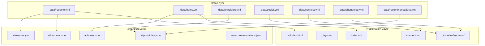
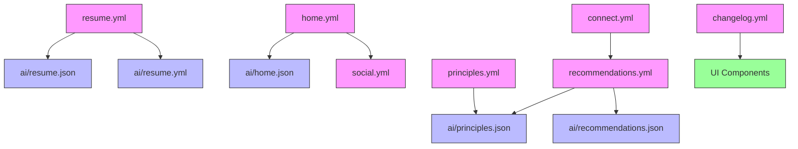

# Data Modeling

<cite>
**Referenced Files in This Document**   
- [_data/resume.yml](file://_data/resume.yml)
- [_data/home.yml](file://_data/home.yml)
- [_data/principles.yml](file://_data/principles.yml)
- [_data/social.yml](file://_data/social.yml)
- [_data/connect.yml](file://_data/connect.yml)
- [_data/changelog.yml](file://_data/changelog.yml)
- [_data/recommendations.yml](file://_data/recommendations.yml)
- [ai/resume.json](file://ai/resume.json)
- [ai/principles.json](file://ai/principles.json)
- [ai/home.json](file://ai/home.json)
- [ai/recommendations.json](file://ai/recommendations.json)
- [ai/resume.yml](file://ai/resume.yml)
- [ARCHITECTURE.md](file://ARCHITECTURE.md)
- [README.md](file://README.md)
- [_config.yml](file://_config.yml)
</cite>

## Table of Contents
1. [Introduction](#introduction)
2. [Project Structure](#project-structure)
3. [Core Data Models](#core-data-models)
4. [Schema Design and Hierarchical Organization](#schema-design-and-hierarchical-organization)
5. [Data Model Relationships](#data-model-relationships)
6. [Real-World Usage and Codebase Integration](#real-world-usage-and-codebase-integration)
7. [Validation Practices and Naming Conventions](#validation-practices-and-naming-conventions)
8. [Versioning and Extensibility Guidance](#versioning-and-extensibility-guidance)
9. [Conclusion](#conclusion)

## Introduction
This document provides comprehensive documentation for the YAML-based data structures in the cv-ai project, a Jekyll-powered personal branding and professional portfolio platform. The system is designed to centralize professional profile data, consulting methodology, and engagement pathways in structured, reusable formats that support both human-readable rendering and machine-consumable exports. The data model architecture enables consistent content delivery across multiple surfaces including the CV page, homepage, AI-ready JSON exports, and structured data for SEO. This documentation details the schema design of each `_data/*.yml` file, explains their canonical roles, and provides guidance on maintaining and extending the data models while ensuring backward compatibility and consistency.

**Section sources**
- [ARCHITECTURE.md](file://ARCHITECTURE.md#L1-L68)
- [README.md](file://README.md#L1-L23)

## Project Structure
The cv-ai project follows a Jekyll-based static site architecture with a clear separation between data, presentation, and logic. The core data resides in the `_data` directory as YAML files, which are consumed by Jekyll templates in `_includes/sections/` to generate pages. The `ai/` directory contains machine-readable JSON and YAML exports of key data models, enabling AI agents and external systems to access structured professional information. The design emphasizes data centralization, reusability, and AI-friendliness, with `_data/resume.yml` serving as the canonical source for professional profile data that populates both the CV page and AI exports. The architecture supports declarative content management where changes to YAML data files automatically propagate across all dependent views and exports.

**Diagram sources**
- [_data/resume.yml](file://_data/resume.yml#L1-L440)
- [_data/home.yml](file://_data/home.yml#L1-L55)
- [_data/principles.yml](file://_data/principles.yml#L1-L80)
- [_data/social.yml](file://_data/social.yml#L1-L49)
- [_data/connect.yml](file://_data/connect.yml#L1-L21)
- [_data/changelog.yml](file://_data/changelog.yml#L1-L18)
- [_data/recommendations.yml](file://_data/recommendations.yml#L1-L244)
- [ai/resume.json](file://ai/resume.json#L1-L6)
- [ai/resume.yml](file://ai/resume.yml#L1-L714)
- [ai/home.json](file://ai/home.json#L1-L6)
- [ai/principles.json](file://ai/principles.json#L1-L6)
- [ai/recommendations.json](file://ai/recommendations.json#L1-L6)

**Section sources**
- [ARCHITECTURE.md](file://ARCHITECTURE.md#L1-L68)
- [README.md](file://README.md#L1-L23)
- [_config.yml](file://_config.yml#L1-L49)

## Core Data Models

The cv-ai project utilizes a collection of YAML-based data models in the `_data` directory, each serving a distinct purpose in the professional profile and engagement ecosystem. The primary data models include `resume.yml` as the canonical source for professional profile data, `home.yml` for homepage composition, `principles.yml` for consulting methodology, `social.yml` for social channel definitions, `connect.yml` for engagement pathways, `changelog.yml` for release notes, and `recommendations.yml` for service offerings and collaboration frameworks. These data models are designed to be both human-readable and machine-consumable, supporting dual purposes of website content generation and AI/agent-ready data exports. The structure emphasizes clarity, reusability, and separation of concerns, with each YAML file focusing on a specific domain of information.

**Section sources**
- [_data/resume.yml](file://_data/resume.yml#L1-L440)
- [_data/home.yml](file://_data/home.yml#L1-L55)
- [_data/principles.yml](file://_data/principles.yml#L1-L80)
- [_data/social.yml](file://_data/social.yml#L1-L49)
- [_data/connect.yml](file://_data/connect.yml#L1-L21)
- [_data/changelog.yml](file://_data/changelog.yml#L1-L18)
- [_data/recommendations.yml](file://_data/recommendations.yml#L1-L244)

## Schema Design and Hierarchical Organization

### resume.yml Schema
The `resume.yml` file serves as the canonical source for professional profile data, containing comprehensive information about the individual's professional identity, experience, skills, and credentials. The schema is organized into logical sections including personal information (name, headline, image, summary), contact details, professional experience (with company, title, dates, and summary), education, skills, certifications, projects, languages, courses, and structured data for SEO. The hierarchical organization follows a flat structure with arrays for repeating elements like experience entries and certifications. The schema includes a `schema` section that conforms to Schema.org's Person type, enabling rich structured data for search engines. This file is the single source of truth for professional information, consumed by both the CV page and AI exports.

**Section sources**
- [_data/resume.yml](file://_data/resume.yml#L1-L440)

### home.yml Schema
The `home.yml` file defines the structure and content of the homepage, organized into sections that present the professional brand and service offerings. The schema includes a `hero` section with eyebrow, title, kicker, subtitle, and lead text that establishes the professional positioning. The `services` section contains a collection of service cards, each with a title, subtitle, URL, and call-to-action label that link to detailed notes on specific service areas. The `llm_profiles` section provides links to AI-ready exports including Resume JSON, Resume YAML, LLM Persona, and Consulting Principles, facilitating machine consumption of the professional profile. This data model enables consistent homepage composition while allowing easy updates to service offerings and positioning.

**Section sources**
- [_data/home.yml](file://_data/home.yml#L1-L55)

### principles.yml Schema
The `principles.yml` file documents the consulting methodology and professional principles, serving as a framework for engagement and decision-making. The schema includes an `owner` section with identification and update metadata, and a `principles` array containing individual consulting principles. Each principle has an ID, title, summary, commitments (specific actions or promises), and proof_points (concrete examples of successful application). The `engagement_signals` section defines preferred collaborators and situations that are not a good fit, helping to qualify opportunities. The `llm_guidance` section provides instructions for AI systems on how to retrieve and use the principles, including preferred citations and retrieval notes. This structured approach to methodology enables consistent communication of professional values and approaches.

**Section sources**
- [_data/principles.yml](file://_data/principles.yml#L1-L80)

### social.yml Schema
The `social.yml` file defines the social media and professional network presence, with a focus on engagement pathways and channel-specific descriptors. The schema contains a `links` array where each entry represents a social platform with an ID, label, handle, URL, descriptor (explaining the purpose and response expectations for the channel), and icon representation. The design enables consistent rendering of social links across the site while providing contextual information about how each channel should be used for engagement. This data model is consumed by UI components like the social line in the footer and homepage sections, ensuring uniform presentation of contact options.

**Section sources**
- [_data/social.yml](file://_data/social.yml#L1-L49)

### connect.yml Schema
The `connect.yml` file structures the engagement and partnership opportunities, defining how potential collaborators can work with the professional. The schema includes a `hero` section with positioning text for the connect page, a `partners` array listing primary delivery partners and specialist networks with their types and descriptions, and a `cta` section with a title, copy, and action link for scheduling partnership calls. This data model supports the presentation of collaboration frameworks and partnership ecosystems, helping to guide potential clients toward appropriate engagement models.

**Section sources**
- [_data/connect.yml](file://_data/connect.yml#L1-L21)

### changelog.yml Schema
The `changelog.yml` file maintains a record of significant updates and improvements to the cv-ai project, serving as a transparency log for the professional platform. The schema contains an `entries` array where each entry includes a date, title, summary, and optional highlights of changes. The entries are ordered chronologically with the most recent updates first. This data model supports the changelog page, demonstrating continuous improvement and technical evolution of the professional brand. The changelog includes both content updates and technical enhancements, providing a comprehensive view of the platform's development.

**Section sources**
- [_data/changelog.yml](file://_data/changelog.yml#L1-L18)

### recommendations.yml Schema
The `recommendations.yml` file defines the service offerings, engagement models, and ideal client profiles, serving as a comprehensive guide for potential collaborations. The schema includes an `owner` section with identification and contact information, an `engagements` array detailing specific service offerings with IDs, labels, summaries, keywords, ideal company profiles, activities, referenced principles, and success indicators. The `industries` section specifies preferred and acceptable industry sectors, while `company_fit` defines minimum landscape requirements and scaling signals. The `engagement_models` array outlines the various ways of working together, from transformation leadership to targeted sprints. This comprehensive data model enables precise positioning of services and helps potential clients understand the value proposition and fit criteria.

**Section sources**
- [_data/recommendations.yml](file://_data/recommendations.yml#L1-L244)

## Data Model Relationships

The YAML data models in the cv-ai project are interconnected through both direct references and shared content patterns, creating a cohesive ecosystem of professional information. The most significant relationship is between `resume.yml` and the AI export files in the `ai/` directory, where `ai/resume.json` and `ai/resume.yml` are direct transformations of the resume data for machine consumption. The `home.yml` file integrates with `social.yml` through the `llm_profiles` section, which links to AI-ready exports, and the social links component that renders the channels defined in `social.yml`. The `principles.yml` file is referenced by `recommendations.yml` through the `principles` field in each engagement, creating a direct link between service offerings and the underlying consulting methodology. The `connect.yml` file complements `recommendations.yml` by providing partnership pathways and ecosystem information that supports the engagement models described in the recommendations. These relationships enable content reuse and consistency across different surfaces of the professional brand.

**Diagram sources**
- [_data/resume.yml](file://_data/resume.yml#L1-L440)
- [ai/resume.json](file://ai/resume.json#L1-L6)
- [ai/resume.yml](file://ai/resume.yml#L1-L714)
- [_data/home.yml](file://_data/home.yml#L1-L55)
- [ai/home.json](file://ai/home.json#L1-L6)
- [_data/social.yml](file://_data/social.yml#L1-L49)
- [_data/principles.yml](file://_data/principles.yml#L1-L80)
- [ai/principles.json](file://ai/principles.json#L1-L6)
- [_data/recommendations.yml](file://_data/recommendations.yml#L1-L244)
- [ai/recommendations.json](file://ai/recommendations.json#L1-L6)
- [_data/connect.yml](file://_data/connect.yml#L1-L21)
- [_data/changelog.yml](file://_data/changelog.yml#L1-L18)

**Section sources**
- [_data/resume.yml](file://_data/resume.yml#L1-L440)
- [_data/home.yml](file://_data/home.yml#L1-L55)
- [_data/principles.yml](file://_data/principles.yml#L1-L80)
- [_data/social.yml](file://_data/social.yml#L1-L49)
- [_data/connect.yml](file://_data/connect.yml#L1-L21)
- [_data/changelog.yml](file://_data/changelog.yml#L1-L18)
- [_data/recommendations.yml](file://_data/recommendations.yml#L1-L244)

## Real-World Usage and Codebase Integration

The YAML data models are integrated throughout the codebase to power various aspects of the professional platform. The `resume.yml` file serves as the primary data source for both the CV page (`cv/index.html`) and AI-ready exports (`ai/resume.json`, `ai/resume.yml`), demonstrating the principle of "write once, use everywhere" for professional profile data. The homepage (`index.md`) consumes `home.yml` through the `page-builder.html` include, which dynamically renders sections based on the data structure. The `social.yml` file is used by the `social-line.html` component, which is included in multiple sections and the footer, ensuring consistent presentation of social links across the site. The `principles.yml` data is referenced in the recommendations and can be accessed directly by AI systems through the JSON export. The structured data in these YAML files is also leveraged by the SEO system (`_includes/seo/structured-data.html`) to generate JSON-LD markup for search engines, enhancing discoverability and rich result presentation. This integration pattern demonstrates how structured data can serve multiple purposes across human and machine interfaces.

**Section sources**
- [ARCHITECTURE.md](file://ARCHITECTURE.md#L1-L68)
- [README.md](file://README.md#L1-L23)
- [_data/resume.yml](file://_data/resume.yml#L1-L440)
- [_data/home.yml](file://_data/home.yml#L1-L55)
- [_data/principles.yml](file://_data/principles.yml#L1-L80)
- [_data/social.yml](file://_data/social.yml#L1-L49)
- [_data/connect.yml](file://_data/connect.yml#L1-L21)
- [_data/changelog.yml](file://_data/changelog.yml#L1-L18)
- [_data/recommendations.yml](file://_data/recommendations.yml#L1-L244)
- [ai/resume.json](file://ai/resume.json#L1-L6)
- [ai/resume.yml](file://ai/resume.yml#L1-L714)
- [ai/home.json](file://ai/home.json#L1-L6)
- [ai/principles.json](file://ai/principles.json#L1-L6)
- [ai/recommendations.json](file://ai/recommendations.json#L1-L6)

## Validation Practices and Naming Conventions

The data models follow consistent validation practices and naming conventions to ensure data integrity and maintainability. Field names use lowercase with underscores as word separators (snake_case), following YAML best practices for readability and compatibility. Dates are formatted according to ISO 8601 standards (YYYY-MM-DD) to ensure unambiguous parsing and sorting. Arrays are used for collections of similar items, with consistent structure for each entry. The schema design emphasizes clarity and self-documentation, with descriptive field names and hierarchical organization that reflects the logical grouping of information. While formal schema validation is not implemented through external tools, the Jekyll build process provides basic validation of YAML syntax, and the structured nature of the data models serves as an implicit validation mechanism. The use of consistent patterns across data files (such as the `links` array structure in multiple files) reinforces data quality and reduces the likelihood of errors during content updates.

**Section sources**
- [_data/resume.yml](file://_data/resume.yml#L1-L440)
- [_data/home.yml](file://_data/home.yml#L1-L55)
- [_data/principles.yml](file://_data/principles.yml#L1-L80)
- [_data/social.yml](file://_data/social.yml#L1-L49)
- [_data/connect.yml](file://_data/connect.yml#L1-L21)
- [_data/changelog.yml](file://_data/changelog.yml#L1-L18)
- [_data/recommendations.yml](file://_data/recommendations.yml#L1-L244)

## Versioning and Extensibility Guidance

The data models are designed with versioning and extensibility in mind to support long-term maintenance and evolution of the professional platform. The `ai/resume.yml` file includes a `meta` section with versioning information, including a version number, update timestamp, change frequency, and priority, providing explicit version control for the machine-readable export. The use of arrays for repeating elements (such as experience entries or skills) allows for easy addition of new items without modifying the schema structure. When extending existing models, the guidance is to add new fields at the end of logical sections and to maintain backward compatibility by not removing or renaming existing fields. For creating new data models, the pattern is to follow the established conventions of using descriptive filenames in the `_data` directory, organizing content into logical sections, and leveraging Jekyll's data inclusion features. The separation between human-readable content and machine-consumable exports (via the `ai/` directory) provides a framework for evolving the data models while maintaining stable interfaces for external systems. This approach enables continuous improvement of the professional brand while ensuring reliability and consistency across all touchpoints.

**Section sources**
- [ai/resume.yml](file://ai/resume.yml#L1-L714)
- [_data/resume.yml](file://_data/resume.yml#L1-L440)
- [ARCHITECTURE.md](file://ARCHITECTURE.md#L1-L68)

## Conclusion
The YAML-based data models in the cv-ai project represent a sophisticated approach to professional branding and content management, combining human-readable presentation with machine-consumable structured data. By centralizing key information in well-structured YAML files, the system enables consistent content delivery across multiple surfaces while supporting AI-ready exports for agent-assisted interactions. The architecture demonstrates best practices in data modeling, with clear separation of concerns, logical hierarchical organization, and thoughtful relationships between data models. The emphasis on reusability, validation, and extensibility ensures that the professional platform can evolve over time while maintaining data integrity and backward compatibility. This comprehensive data modeling approach not only enhances the effectiveness of the personal brand but also serves as a template for how professionals can leverage structured data to create intelligent, adaptive digital presences.