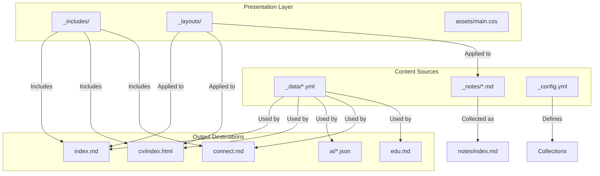
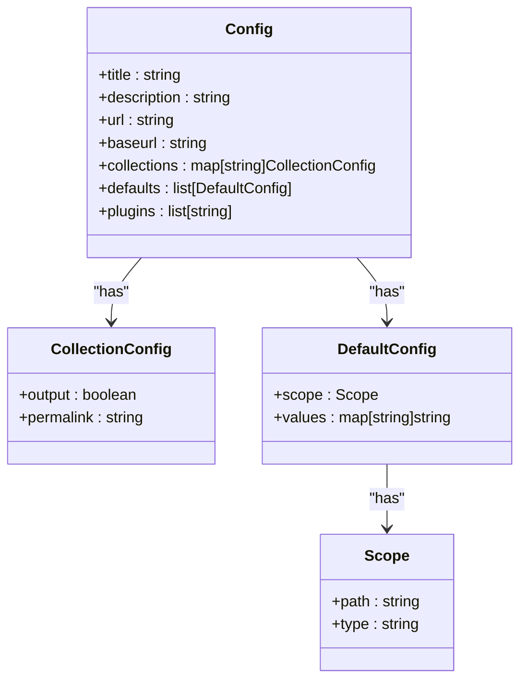
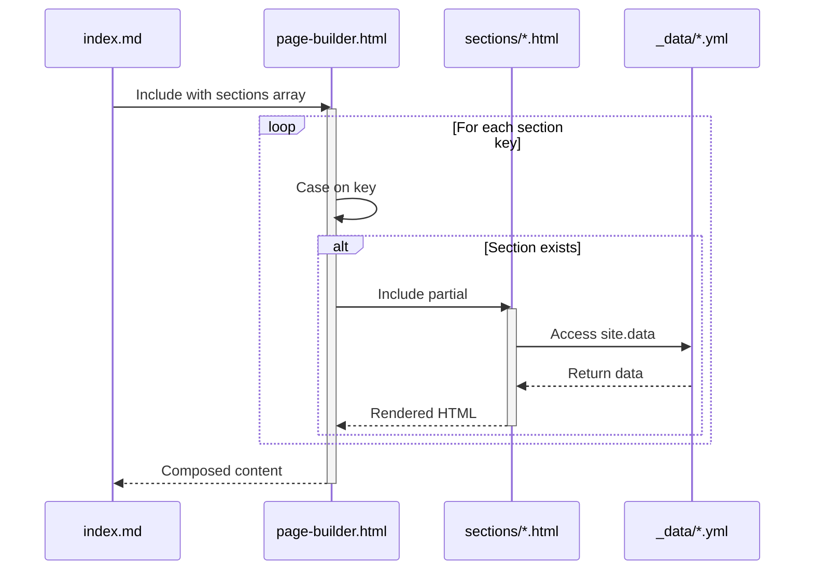
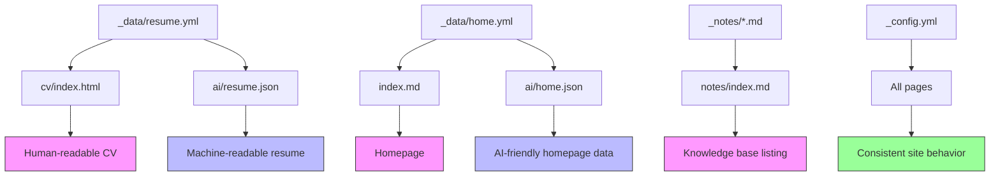

# File Organization

<cite>
**Referenced Files in This Document**   
- [_data/resume.yml](file://_data/resume.yml)
- [_data/home.yml](file://_data/home.yml)
- [_data/principles.yml](file://_data/principles.yml)
- [_data/connect.yml](file://_data/connect.yml)
- [_data/changelog.yml](file://_data/changelog.yml)
- [_data/recommendations.yml](file://_data/recommendations.yml)
- [_data/social.yml](file://_data/social.yml)
- [_includes/page-builder.html](file://_includes/page-builder.html)
- [_config.yml](file://_config.yml)
- [index.md](file://index.md)
- [cv/index.html](file://cv/index.html)
- [ARCHITECTURE.md](file://ARCHITECTURE.md)
- [README.md](file://README.md)
</cite>

## Table of Contents
1. [Introduction](#introduction)
2. [Project Structure Overview](#project-structure-overview)
3. [_data Directory: Single Source of Truth](#_data-directory-single-source-of-truth)
4. [_notes Directory: Knowledge Base Organization](#_notes-directory-knowledge-base-organization)
5. [_config.yml: Site Configuration and Collections](#_config.yml-site-configuration-and-collections)
6. [_includes/page-builder.html: Dynamic Content Composition](#_includes/page-builder.html-dynamic-content-composition)
7. [Best Practices for File Organization](#best-practices-for-file-organization)
8. [Data Propagation and Output Generation](#data-propagation-and-output-generation)
9. [Conclusion](#conclusion)

## Introduction
This document provides a comprehensive overview of the file organization strategy in the cv-ai project, focusing on the separation of concerns between data, templates, and configuration. The architecture is designed to maintain a clean, scalable, and AI-friendly structure by centralizing structured content, decoupling data from presentation, and enabling dynamic content composition. This approach ensures consistency, reusability, and ease of maintenance across both human-readable and machine-readable outputs.

## Project Structure Overview
The project follows a Jekyll-based static site generator pattern with a clear separation between data, templates, and configuration. The directory structure is organized to support modularity, reuse, and scalability. Key directories include `_data` for structured content, `_includes` for reusable components, `_layouts` for page templates, `_notes` for knowledge base articles, and top-level directories for generated content and policies.

**Diagram sources**
- [_data/resume.yml](file://_data/resume.yml)
- [_includes/page-builder.html](file://_includes/page-builder.html)
- [_config.yml](file://_config.yml)
- [index.md](file://index.md)
- [cv/index.html](file://cv/index.html)

**Section sources**
- [README.md](file://README.md#L1-L24)
- [ARCHITECTURE.md](file://ARCHITECTURE.md#L1-L69)

## _data Directory: Single Source of Truth
The `_data` directory serves as the single source of truth for all structured content in the cv-ai project. Each YAML file in this directory represents a distinct data model that powers one or more pages across the site. This approach decouples data from presentation, enabling consistent updates and reuse across multiple contexts.

Key data files include:
- `resume.yml`: Centralized resume data used by both `cv/index.html` and `ai/resume.json`
- `home.yml`: Homepage content including hero, services, and LLM profiles
- `principles.yml`: Consulting principles and engagement signals
- `connect.yml`: Partnership and collaboration information
- `changelog.yml`: Release notes and update history
- `recommendations.yml`: Engagement types and ideal company profiles
- `social.yml`: Social media links and descriptors

By centralizing data in YAML format, changes propagate automatically across all dependent outputs. For example, updating a certification in `resume.yml` will reflect in both the human-readable CV page and the machine-readable JSON export without requiring manual synchronization.

**Section sources**
- [_data/resume.yml](file://_data/resume.yml)
- [_data/home.yml](file://_data/home.yml)
- [_data/principles.yml](file://_data/principles.yml)
- [_data/connect.yml](file://_data/connect.yml)
- [_data/changelog.yml](file://_data/changelog.yml)
- [_data/recommendations.yml](file://_data/recommendations.yml)
- [_data/social.yml](file://_data/social.yml)

## _notes Directory: Knowledge Base Organization
The `_notes` directory houses the knowledge base articles that form the foundation of the site's expertise content. Each Markdown file in this directory represents a topic-specific article with its own metadata and content. The directory structure supports categorization through filename prefixes and tags within the content.

The notes collection is configured in `_config.yml` to output pages with clean permalinks (`/notes/:slug/`) and apply the `_layouts/note.html` template consistently. This ensures uniform presentation while allowing authors to focus on content creation.

The `notes/index.md` file automatically lists all notes using `site.notes`, providing a centralized entry point to the knowledge base. This approach enables scalable growth of the knowledge base without requiring manual updates to navigation or listing pages.

**Section sources**
- [_config.yml](file://_config.yml#L30-L36)
- [ARCHITECTURE.md](file://ARCHITECTURE.md#L40-L45)

## _config.yml: Site Configuration and Collections
The `_config.yml` file orchestrates the site's collections, metadata, and global configuration. It defines the `notes` collection with output enabled and specifies the default layout and permalink structure. This configuration ensures that all notes are processed consistently and published with predictable URLs.

The file also sets global metadata such as site title, description, author information, and social links. These values are used by Jekyll plugins like `jekyll-seo-tag` to generate proper meta tags and structured data. The `plugins` section includes essential functionality for SEO and sitemap generation.

Collection defaults in `_config.yml` apply consistent settings across all notes, reducing the need for repetitive front matter in individual files. This approach enforces consistency while minimizing configuration overhead for content authors.

**Diagram sources**
- [_config.yml](file://_config.yml#L1-L50)

**Section sources**
- [_config.yml](file://_config.yml#L1-L50)
- [ARCHITECTURE.md](file://ARCHITECTURE.md#L30-L36)

## _includes/page-builder.html: Dynamic Content Composition
The `_includes/page-builder.html` file implements a dynamic content composition system that renders sections based on data-driven ordering. This partial is included in `index.md` and processes the `sections` array from the page's front matter to determine which components to render and in what order.

The implementation uses a `` loop to iterate through the section keys and a `` statement to include the appropriate partial from `_includes/sections/`. This approach enables flexible page composition without requiring changes to the template logic when new sections are added.

Each section partial (e.g., `hero.html`, `services.html`) is responsible for rendering its specific content using data from the corresponding YAML file in `_data/`. This separation of concerns allows for independent development and testing of individual components while maintaining a cohesive overall layout.

**Diagram sources**
- [_includes/page-builder.html](file://_includes/page-builder.html#L1-L40)
- [index.md](file://index.md#L1-L15)

**Section sources**
- [_includes/page-builder.html](file://_includes/page-builder.html#L1-L40)
- [index.md](file://index.md#L1-L15)

## Best Practices for File Organization
The cv-ai project exemplifies several best practices for maintaining clean, scalable file organization:

### Naming Conventions
- Use lowercase with hyphens for directory and file names
- Prefix special directories with underscore (`_data`, `_includes`, `_layouts`)
- Use consistent naming for related files (e.g., `resume.yml` and `ai/resume.json`)
- Employ descriptive names that reflect content purpose

### Directory Structure
- Separate concerns between data, templates, and configuration
- Group related components in logical subdirectories
- Maintain a flat structure where possible to reduce navigation depth
- Use top-level directories for generated content and policies

### Dependency Management
- Centralize data in `_data` to eliminate duplication
- Use includes for reusable components and partials
- Leverage Jekyll collections for content types with shared behavior
- Configure defaults in `_config.yml` to reduce repetition

### Scalability Considerations
- Design data models to support future expansion
- Use modular components that can be reused across pages
- Implement consistent patterns for new content types
- Plan for AI-friendly exports from the outset

**Section sources**
- [README.md](file://README.md#L1-L24)
- [ARCHITECTURE.md](file://ARCHITECTURE.md#L1-L69)

## Data Propagation and Output Generation
Changes in the `_data` directory propagate through the system to generate both human-readable and machine-readable outputs. This propagation occurs through Jekyll's site generation process, which processes data files and templates to produce static HTML, JSON, and other formats.

For example, when `resume.yml` is updated:
1. The change is detected during site generation
2. `cv/index.html` accesses the updated data via `site.data.resume`
3. `ai/resume.json` serializes the updated data using `| jsonify`
4. Both outputs are regenerated with the new information

This approach ensures consistency across all representations of the same data. The use of YAML as the source format provides human-readable structure while enabling easy conversion to JSON for machine consumption.

The system also supports AI-friendly outputs through dedicated files in the `/ai` directory. These files use `layout: null` to prevent template wrapping and include liquid filters to serialize data structures. This design enables direct consumption by AI agents and copilots while maintaining compatibility with the existing site infrastructure.

**Diagram sources**
- [_data/resume.yml](file://_data/resume.yml)
- [cv/index.html](file://cv/index.html)
- [ai/resume.json](file://ai/resume.json)
- [_data/home.yml](file://_data/home.yml)
- [index.md](file://index.md)
- [ai/home.json](file://ai/home.json)
- [_notes/*.md](file://_notes/)
- [notes/index.md](file://notes/index.md)
- [_config.yml](file://_config.yml)

**Section sources**
- [_data/resume.yml](file://_data/resume.yml)
- [cv/index.html](file://cv/index.html)
- [ai/resume.json](file://ai/resume.json)
- [ARCHITECTURE.md](file://ARCHITECTURE.md#L20-L25)

## Conclusion
The cv-ai project demonstrates a well-structured approach to file organization that emphasizes separation of concerns, data centralization, and dynamic content composition. By treating `_data` as the single source of truth, the system ensures consistency across human-readable and machine-readable outputs while enabling efficient updates and maintenance. The use of Jekyll collections, includes, and configuration defaults supports scalability and reusability, making it easier to extend the site with new content types and features. This architecture serves as a model for building AI-friendly personal branding sites that can adapt to evolving requirements while maintaining technical excellence.