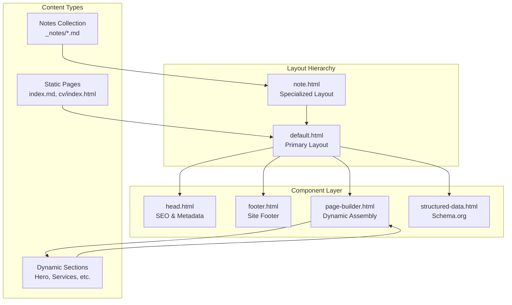
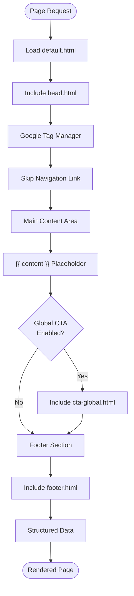
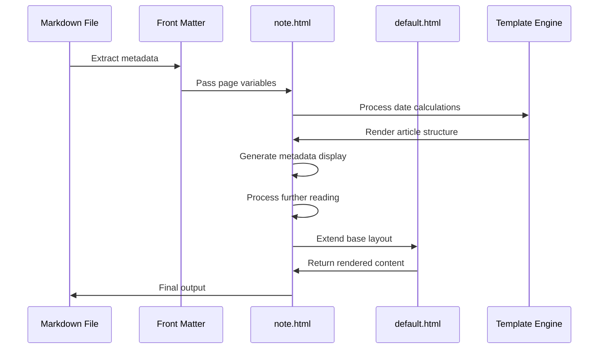
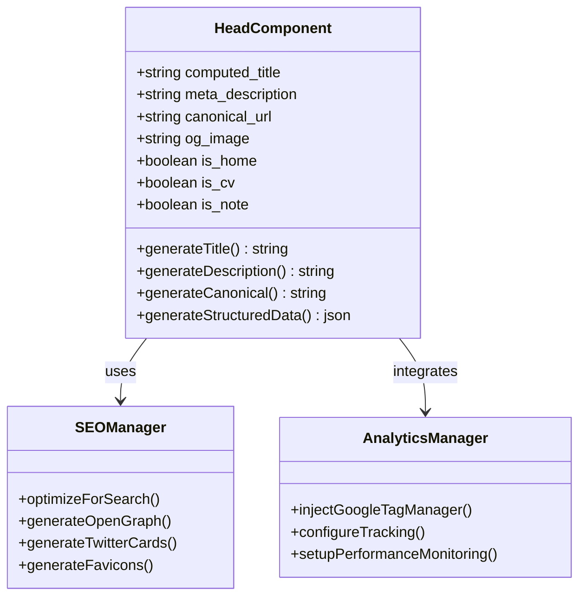
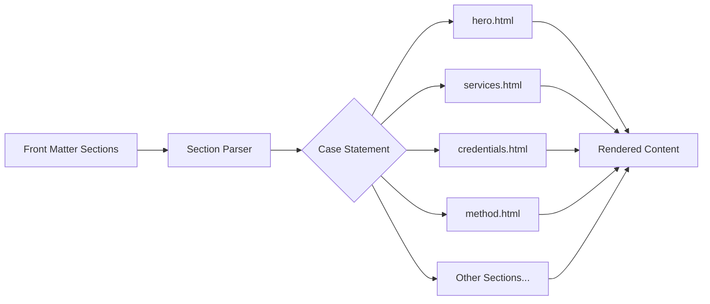
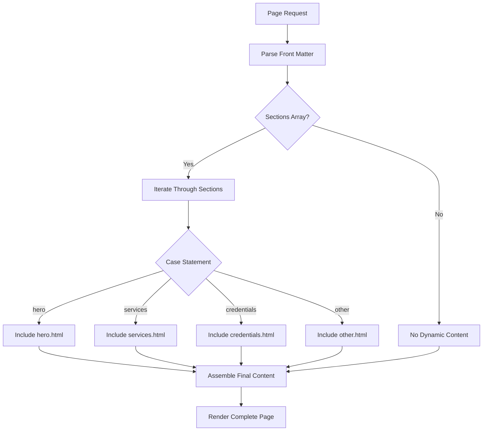
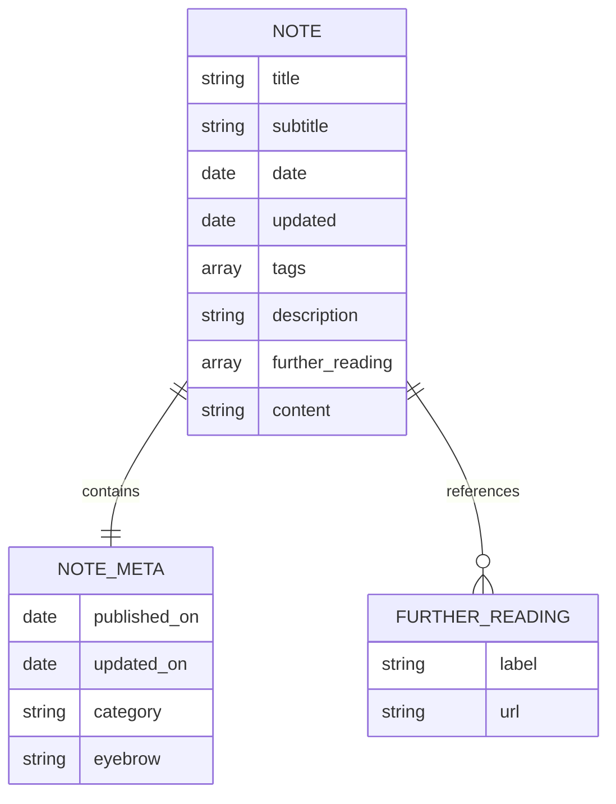
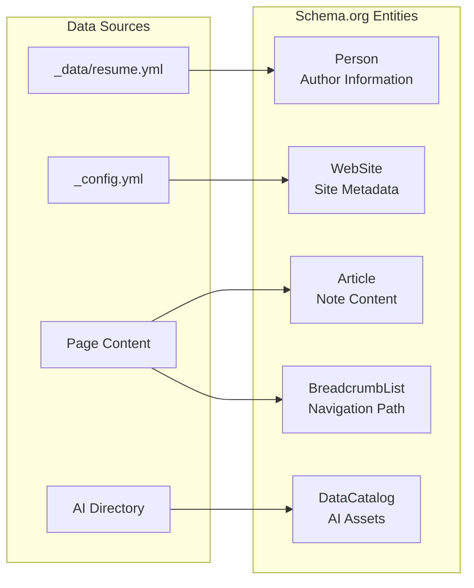
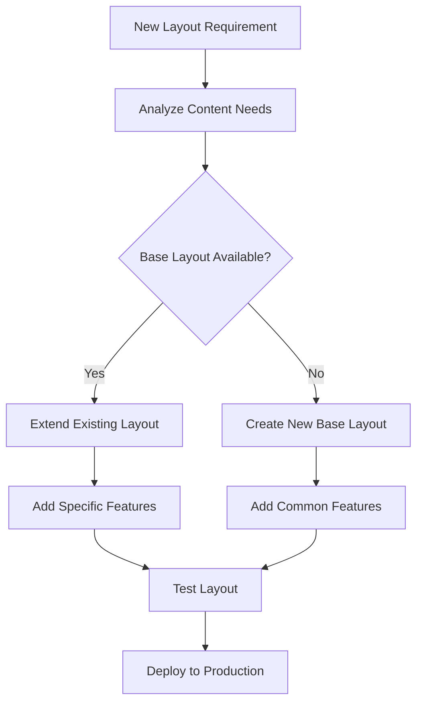

# Layout System

<cite>
**Referenced Files in This Document**
- [_layouts/default.html](file://_layouts/default.html)
- [_layouts/note.html](file://_layouts/note.html)
- [_includes/head.html](file://_includes/head.html)
- [_includes/footer.html](file://_includes/footer.html)
- [_includes/page-builder.html](file://_includes/page-builder.html)
- [_includes/seo/structured-data.html](file://_includes/seo/structured-data.html)
- [_includes/cta-global.html](file://_includes/cta-global.html)
- [cv/index.html](file://cv/index.html)
- [notes/index.md](file://notes/index.md)
- [_notes/ai_ml.md](file://_notes/ai_ml.md)
- [_config.yml](file://_config.yml)
- [index.md](file://index.md)
- [changelog.md](file://changelog.md)
</cite>

## Table of Contents
1. [Introduction](#introduction)
2. [Layout System Architecture](#layout-system-architecture)
3. [Core Layout Templates](#core-layout-templates)
4. [Component-Based Structure](#component-based-structure)
5. [Content Assembly Pipeline](#content-assembly-pipeline)
6. [Collection-Specific Layouts](#collection-specific-layouts)
7. [Front Matter and Layout Selection](#front-matter-and-layout-selection)
8. [SEO and Structured Data Integration](#seo-and-structured-data-integration)
9. [Performance Considerations](#performance-considerations)
10. [Extensibility and Future Enhancements](#extensibility-and-future-enhancements)
11. [Troubleshooting Guide](#troubleshooting-guide)
12. [Best Practices](#best-practices)

## Introduction

The cv-ai site employs a sophisticated Jekyll-based layout system that provides consistent structure, SEO optimization, and flexible content presentation across multiple content types. The system is built around two primary layout templates, extensive component inclusion patterns, and a robust content assembly pipeline that enables rapid iteration and AI-friendly content export.

The layout system serves as the foundation for the entire site's architecture, managing everything from basic HTML structure and SEO metadata to complex content rendering and cross-site consistency. It demonstrates advanced Jekyll patterns including layout inheritance, component-based architecture, and dynamic content assembly.

## Layout System Architecture

The layout system follows a hierarchical structure with clear separation of concerns and modular design principles:



**Diagram sources**
- [_layouts/default.html](file://_layouts/default.html#L1-L25)
- [_layouts/note.html](file://_layouts/note.html#L1-L57)
- [_includes/page-builder.html](file://_includes/page-builder.html#L1-L42)

The architecture implements several key design patterns:

- **Template Inheritance**: note.html extends default.html, inheriting all base functionality
- **Component Composition**: Modular includes for specific functionality areas
- **Dynamic Assembly**: Runtime content selection based on front matter
- **SEO Integration**: Automatic structured data generation and metadata optimization

**Section sources**
- [_layouts/default.html](file://_layouts/default.html#L1-L25)
- [_layouts/note.html](file://_layouts/note.html#L1-L57)

## Core Layout Templates

### Default Layout (default.html)

The default.html layout serves as the primary template for most site content, providing a consistent outer structure with essential components:



**Diagram sources**
- [_layouts/default.html](file://_layouts/default.html#L1-L25)

Key features of the default layout:

- **Consistent Structure**: Standard HTML5 document with proper semantic markup
- **Accessibility Support**: Skip link for keyboard navigation
- **Content Placeholder**: Dynamic content insertion via `{{ content }}`
- **Conditional CTAs**: Optional global call-to-action based on page configuration
- **SEO Integration**: Automatic structured data inclusion
- **Google Tag Manager**: Built-in analytics and tracking support

The layout implements a clean separation between structural elements and content, allowing for maximum flexibility in content creation while maintaining consistent presentation.

**Section sources**
- [_layouts/default.html](file://_layouts/default.html#L1-L25)

### Note Layout (note.html)

The note.html layout specializes in rendering practitioner notes with enhanced metadata and reading experience features:



**Diagram sources**
- [_layouts/note.html](file://_layouts/note.html#L1-L57)

The note layout provides specialized functionality:

- **Date Management**: Automatic handling of publish and update dates
- **Metadata Display**: Comprehensive publication information including tags
- **Reading Experience**: Further reading suggestions with arrow links
- **Content Structure**: Article-style presentation with header and body sections
- **Category Support**: Eyebrow and category labeling for content organization

**Section sources**
- [_layouts/note.html](file://_layouts/note.html#L1-L57)

## Component-Based Structure

The layout system leverages a sophisticated component architecture that promotes reusability and maintainability:

### Head Component (head.html)

The head component manages all SEO and metadata requirements:



**Diagram sources**
- [_includes/head.html](file://_includes/head.html#L1-L113)

The head component implements intelligent title generation, meta description optimization, and comprehensive Open Graph configuration. It automatically adapts metadata based on page context, ensuring optimal search engine visibility and social media sharing.

### Footer Component (footer.html)

The footer component provides consistent site-wide navigation and branding:

- **Site Information**: Author name, job title, and company affiliation
- **Navigation Links**: Essential site links including CV, changelog, and legal pages
- **Social Integration**: Social media links with proper attribution
- **Copyright Notice**: Automated copyright year calculation
- **Responsive Design**: Mobile-friendly grid layout

### Page Builder Component (page-builder.html)

The page builder enables dynamic content assembly based on front matter configuration:



**Diagram sources**
- [_includes/page-builder.html](file://_includes/page-builder.html#L1-L42)

The page builder supports over 20 different content sections, each responsible for specific site areas like hero banners, service listings, educational content, and contact forms.

**Section sources**
- [_includes/head.html](file://_includes/head.html#L1-L113)
- [_includes/footer.html](file://_includes/footer.html#L1-L27)
- [_includes/page-builder.html](file://_includes/page-builder.html#L1-L42)

## Content Assembly Pipeline

The content assembly pipeline demonstrates advanced Jekyll patterns for dynamic content generation:

### Front Matter Processing

Content pages utilize front matter to specify layout preferences and metadata:

| Front Matter Field | Purpose | Example Value |
|-------------------|---------|---------------|
| `layout` | Specifies which layout to use | `default`, `note` |
| `title` | Page title for SEO and navigation | `"Curriculum Vitae"` |
| `description` | Meta description for search engines | `"Full SAP CV..."` |
| `permalink` | Custom URL structure | `"/cv/"` |
| `sections` | Array of page builder sections | `["hero", "services"]` |
| `hide_global_cta` | Controls global call-to-action | `true` |

### Layout Inheritance Chain

The system implements a clear inheritance pattern:

1. **Base Layout**: default.html provides fundamental structure
2. **Specialized Layout**: note.html extends default.html with note-specific features
3. **Content Integration**: Individual pages inject content via `{{ content }}`
4. **Component Assembly**: Includes handle specific functionality areas

### Dynamic Content Routing

The page builder demonstrates sophisticated content routing:



**Diagram sources**
- [_includes/page-builder.html](file://_includes/page-builder.html#L1-L42)

**Section sources**
- [_config.yml](file://_config.yml#L20-L30)
- [index.md](file://index.md#L1-L15)
- [changelog.md](file://changelog.md#L1-L11)

## Collection-Specific Layouts

The layout system handles different content collections with specialized approaches:

### Notes Collection

The notes collection uses a dedicated layout that provides enhanced metadata and reading experience:



**Diagram sources**
- [_layouts/note.html](file://_layouts/note.html#L2-L3)

The note layout automatically processes:
- **Publication Dates**: Automatic calculation of published and updated timestamps
- **Tag Management**: Hierarchical tagging system for content organization
- **Further Reading**: Cross-reference suggestions with arrow indicators
- **Content Structure**: Article-style presentation with clear sections

### Static Pages

Static pages like the homepage and CV use the default layout with dynamic content assembly:

- **Homepage**: Uses page builder sections for flexible layout
- **CV**: Leverages structured data from YAML for multiple output formats
- **Legal Pages**: Standard default layout with minimal customization

**Section sources**
- [_layouts/note.html](file://_layouts/note.html#L1-L57)
- [cv/index.html](file://cv/index.html#L1-L258)
- [notes/index.md](file://notes/index.md#L1-L42)

## Front Matter and Layout Selection

The layout selection mechanism demonstrates Jekyll's powerful content management capabilities:

### Default Layout Assignment

The `_config.yml` defines default layouts for collections:

```yaml
defaults:
  - scope:
      path: ""
      type: notes
    values:
      layout: note
```

This configuration ensures that all files in the notes collection automatically use the note.html layout without requiring explicit front matter declaration.

### Explicit Layout Override

Individual pages can override defaults through front matter:

```yaml
---
layout: default
title: "Custom Page"
description: "Custom description"
permalink: /custom-page/
---
```

### Conditional Layout Behavior

Some layouts implement conditional logic based on page characteristics:

- **Global CTA Control**: Pages can hide global call-to-actions using `hide_global_cta`
- **Section Ordering**: Dynamic section arrangement via front matter arrays
- **Metadata Adaptation**: Automatic SEO metadata adjustment based on content type

**Section sources**
- [_config.yml](file://_config.yml#L20-L30)

## SEO and Structured Data Integration

The layout system includes comprehensive SEO optimization through structured data generation:

### Automatic Metadata Generation

The head component generates metadata dynamically based on page context:

| Metadata Type | Source | Purpose |
|--------------|--------|---------|
| Title | Computed from page context | Search engine visibility |
| Description | Page excerpt or summary | Snippet generation |
| Canonical URL | Page permalink | Duplicate content prevention |
| Open Graph Image | Custom or default image | Social media sharing |
| Twitter Cards | Structured metadata | Twitter preview optimization |

### Schema.org Integration

The structured-data.html component generates comprehensive Schema.org markup:



**Diagram sources**
- [_includes/seo/structured-data.html](file://_includes/seo/structured-data.html#L1-L77)

### Performance Optimization

The SEO system includes several performance optimizations:

- **Lazy Loading**: Images and fonts are preloaded strategically
- **Minimal Markup**: Only essential structured data is generated
- **Context-Aware Generation**: Different schemas for different content types
- **Caching Support**: Generated markup is cached with page content

**Section sources**
- [_includes/head.html](file://_includes/head.html#L1-L113)
- [_includes/seo/structured-data.html](file://_includes/seo/structured-data.html#L1-L77)

## Performance Considerations

The layout system implements several performance optimization strategies:

### Include Efficiency

The component-based architecture promotes efficient include usage:

- **Modular Components**: Smaller, focused includes reduce memory usage
- **Conditional Loading**: Includes only load when needed
- **Cached Compilation**: Jekyll compiles includes once during build

### Layout Inheritance Overhead

Layout inheritance introduces minimal overhead:

- **Single Inheritance Level**: Maximum one level of layout extension
- **Template Caching**: Compiled templates are reused efficiently
- **Minimal Variable Passing**: Only essential variables passed between layouts

### Content Assembly Performance

The page builder optimizes content assembly:

- **Case Statement Optimization**: Efficient section routing
- **Early Termination**: Stop processing when no sections are defined
- **Memory Efficiency**: Stream processing of large collections

### SEO Impact

The SEO system balances functionality with performance:

- **Selective Generation**: Only generate structured data for appropriate pages
- **Minimal Script Injection**: Google Tag Manager loaded in noscript fallback
- **Optimized Asset Loading**: Strategic preload directives for critical resources

## Extensibility and Future Enhancements

The layout system is designed for future expansion and content type diversification:

### New Layout Creation Pattern

Creating new layouts follows established patterns:



### Collection Expansion Strategy

The system supports adding new collections:

1. **Define Collection**: Add collection to `_config.yml`
2. **Set Defaults**: Configure default layout and permalink structure
3. **Create Layout**: Develop specialized layout if needed
4. **Update Navigation**: Add collection to appropriate menus
5. **SEO Integration**: Ensure proper structured data generation

### Component Architecture Scalability

The component architecture supports unlimited expansion:

- **New Sections**: Add new includes to page builder
- **Enhanced Components**: Extend existing components with new features
- **Reusable Patterns**: Share components across different layouts
- **Theme Integration**: Maintain consistent styling across components

### AI Integration Opportunities

The system is optimized for AI applications:

- **Structured Exports**: JSON/YAML exports for AI consumption
- **Content Organization**: Clear metadata for AI indexing
- **Multiple Formats**: Single source, multiple output formats
- **Semantic Markup**: Rich structured data for AI understanding

**Section sources**
- [ARCHITECTURE.md](file://ARCHITECTURE.md#L61-L66)

## Troubleshooting Guide

Common layout issues and their solutions:

### Missing Styles Issues

**Symptoms**: Pages render without proper styling
**Causes**: 
- Incorrect asset paths in head.html
- CSS compilation errors
- CDN connectivity issues

**Solutions**:
- Verify asset paths in head.html
- Check CSS compilation in development
- Validate CDN availability

### Broken Include Errors

**Symptoms**: Partial content missing or error messages
**Causes**:
- Missing include files
- Incorrect include paths
- Variable scope issues

**Solutions**:
- Verify include file existence
- Check include path syntax
- Review variable availability

### Incorrect Content Rendering

**Symptoms**: Content appears in wrong layout or missing
**Causes**:
- Incorrect front matter layout specification
- Collection configuration issues
- Template variable conflicts

**Solutions**:
- Verify front matter layout field
- Check collection defaults in _config.yml
- Review template variable scoping

### SEO Metadata Problems

**Symptoms**: Missing or incorrect metadata in search results
**Causes**:
- Front matter metadata issues
- Structured data generation errors
- Canonical URL problems

**Solutions**:
- Validate front matter metadata
- Check structured data generation logic
- Verify canonical URL configuration

### Performance Issues

**Symptoms**: Slow page loading or build times
**Causes**:
- Excessive include nesting
- Large data sets in templates
- Inefficient template logic

**Solutions**:
- Optimize include usage patterns
- Implement template caching
- Simplify complex template logic

## Best Practices

### Layout Development Guidelines

1. **Maintain Consistency**: Use established patterns for new layouts
2. **Minimize Complexity**: Keep layouts focused on single responsibilities
3. **Test Thoroughly**: Validate across different content types
4. **Document Changes**: Update documentation for new layout features

### Component Design Principles

1. **Single Responsibility**: Each component should have one clear purpose
2. **Reusability**: Design components for multiple contexts
3. **Documentation**: Comment complex logic and provide usage examples
4. **Testing**: Validate components with various input scenarios

### SEO Optimization Standards

1. **Metadata Consistency**: Use standardized metadata patterns
2. **Structured Data**: Implement appropriate Schema.org markup
3. **Performance**: Minimize SEO-related performance impact
4. **Accessibility**: Ensure SEO components are accessible

### Maintenance Procedures

1. **Regular Audits**: Periodically review layout performance
2. **Update Monitoring**: Track changes to external dependencies
3. **Backup Strategy**: Maintain backup of critical layout files
4. **Version Control**: Use semantic versioning for layout changes

The layout system demonstrates sophisticated Jekyll architecture with clear separation of concerns, comprehensive SEO integration, and robust extensibility patterns. Its modular design enables rapid content iteration while maintaining consistent presentation and optimal performance across all site content types.