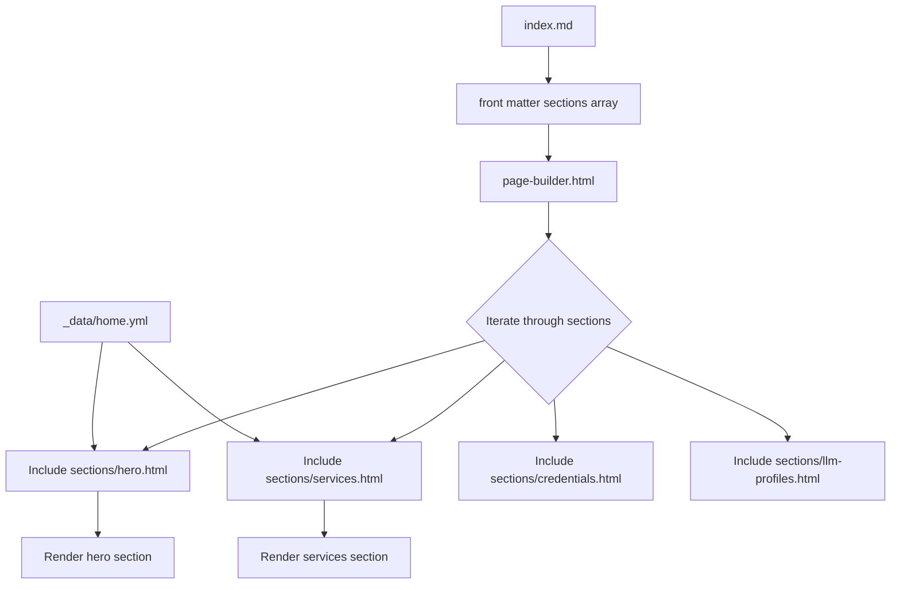
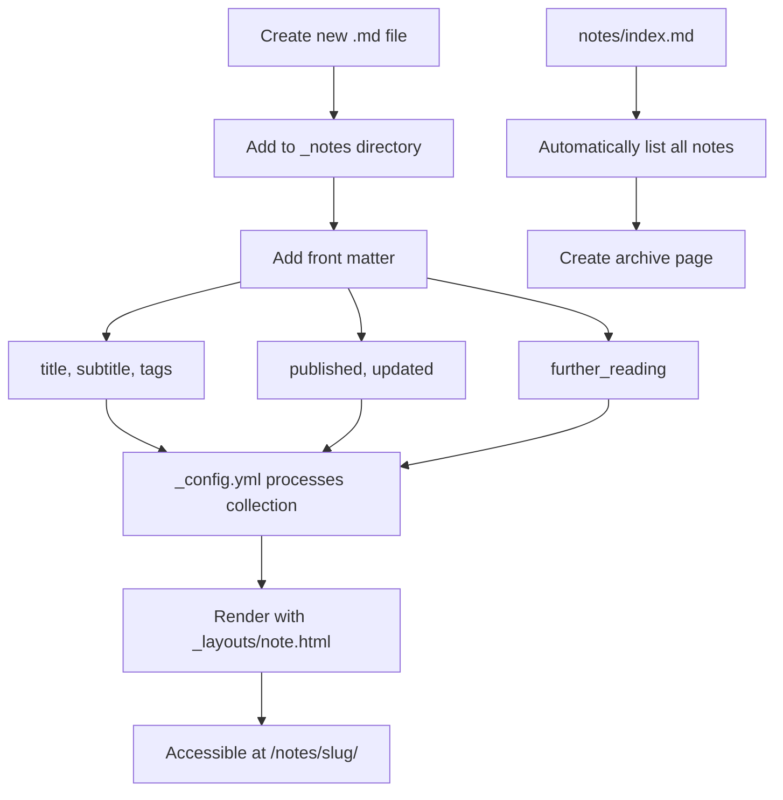
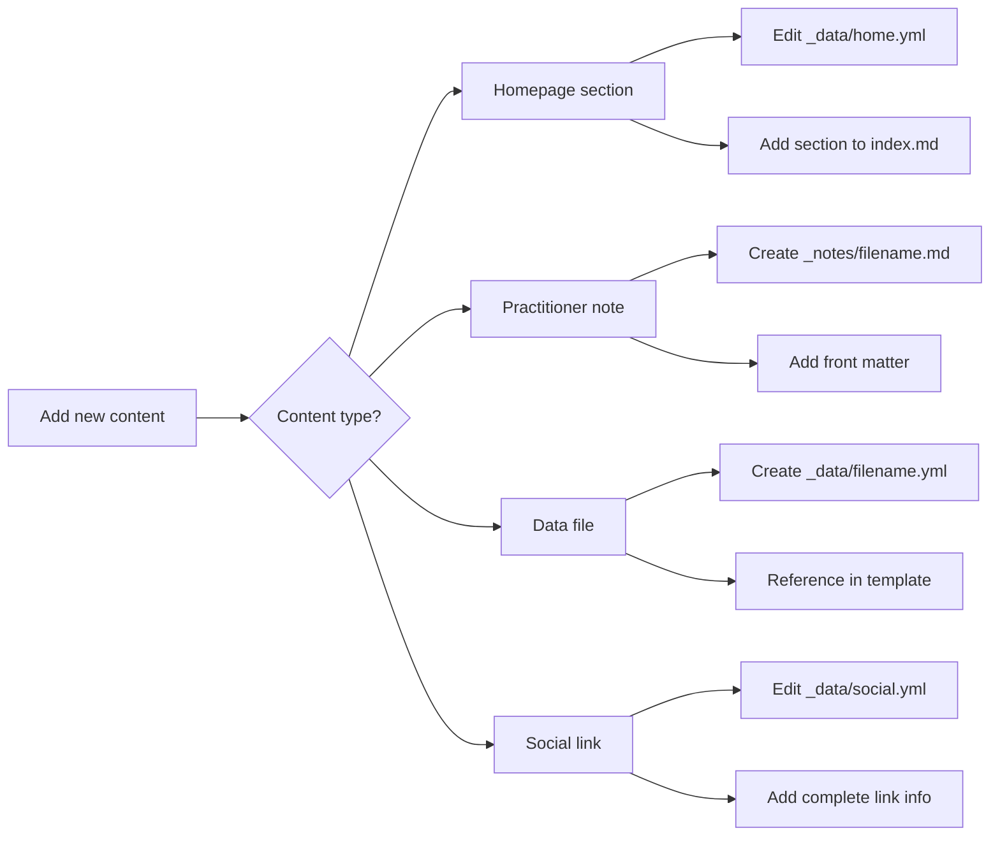

# Content Management

<cite>
**Referenced Files in This Document**   
- [index.md](file://index.md)
- [cv/index.html](file://cv/index.html)
- [_config.yml](file://_config.yml)
- [_layouts/note.html](file://_layouts/note.html)
- [_data/home.yml](file://_data/home.yml)
- [_data/resume.yml](file://_data/resume.yml)
- [_data/social.yml](file://_data/social.yml)
- [_includes/page-builder.html](file://_includes/page-builder.html)
- [_includes/sections/services.html](file://_includes/sections/services.html)
- [_includes/sections/hero.html](file://_includes/sections/hero.html)
- [_includes/components/social-line.html](file://_includes/components/social-line.html)
- [_data/connect.yml](file://_data/connect.yml)
- [_notes/consulting_principles.md](file://_notes/consulting_principles.md)
- [notes/index.md](file://notes/index.md)
</cite>

## Table of Contents
1. [Content Management Workflow](#content-management-workflow)
2. [Homepage Composition Process](#homepage-composition-process)
3. [Resume Content Pipeline](#resume-content-pipeline)
4. [Practitioner Notes System](#practitioner-notes-system)
5. [Content Relationships and Reuse](#content-relationships-and-reuse)
6. [Adding New Content](#adding-new-content)
7. [Content Organization Strategies](#content-organization-strategies)

## Content Management Workflow

The cv-ai site implements a structured content management workflow that separates content types into distinct locations and data structures. The system uses Jekyll's collection and data file features to organize content, with different content types following specific patterns for creation, referencing, and rendering. The workflow is designed to maintain clarity across the site while enabling content reuse and consistent presentation.

**Section sources**
- [_config.yml](file://_config.yml#L30-L35)
- [_data/home.yml](file://_data/home.yml#L1-L55)
- [_data/resume.yml](file://_data/resume.yml#L1-L440)
- [_data/social.yml](file://_data/social.yml#L1-L49)

## Homepage Composition Process

The homepage composition process begins with index.md, which defines the page layout and the sections to be included. The file uses front matter to specify the layout as "default" and includes a sections array that lists the components to be rendered: hero, services, credentials, and llm-profiles. The actual content for these sections is powered by _data/home.yml, which contains structured data for each section.

The page-builder.html template processes the sections array and includes the corresponding HTML partials from the _includes/sections directory. For example, when it encounters 'hero' in the sections array, it includes sections/hero.html, which then accesses the hero data from site.data.home.hero. This separation of content definition (in YAML) and presentation (in HTML) allows for easy content updates without modifying template code.



**Diagram sources**
- [index.md](file://index.md#L1-L14)
- [_includes/page-builder.html](file://_includes/page-builder.html#L1-L41)
- [_data/home.yml](file://_data/home.yml#L1-L55)
- [_includes/sections/hero.html](file://_includes/sections/hero.html#L1-L62)
- [_includes/sections/services.html](file://_includes/sections/services.html#L1-L40)

**Section sources**
- [index.md](file://index.md#L1-L14)
- [_includes/page-builder.html](file://_includes/page-builder.html#L1-L41)
- [_data/home.yml](file://_data/home.yml#L1-L55)

## Resume Content Pipeline

The resume content pipeline follows a structured flow from _data/resume.yml to the final cv/index.html rendering. The resume.yml file contains comprehensive information about the practitioner's professional background, including experience, education, skills, certifications, projects, and contact information. This YAML file serves as the single source of truth for resume data.

The cv/index.html template accesses this data through Jekyll's site.data object, specifically using  to make the data available within the template. The template then renders various sections of the resume by iterating over the data structure. For example, it loops through resume.experience to create the Experience section and resume.education for the Education section.

A key feature of this pipeline is content reuse: the same resume.yml file is also available at /ai/resume.yml for machine-readable access by AI systems. The template includes download links that allow visitors to download the YAML or JSON versions of the resume, demonstrating how the same content can be delivered in multiple formats from a single source.

```mermaid
flowchart LR
A[_data/resume.yml] --> B[cv/index.html]
B --> C[assign resume = site.data.resume]
C --> D[Render Experience section]
C --> E[Render Education section]
C --> F[Render Skills section]
C --> G[Render Certifications section]
C --> H[Render Projects section]
A --> I[/ai/resume.yml]
I --> J[Machine-readable access]
B --> K[Download YAML link]
B --> L[Download JSON link]
```

**Diagram sources**
- [_data/resume.yml](file://_data/resume.yml#L1-L440)
- [cv/index.html](file://cv/index.html#L1-L257)

**Section sources**
- [_data/resume.yml](file://_data/resume.yml#L1-L440)
- [cv/index.html](file://cv/index.html#L1-L257)

## Practitioner Notes System

The practitioner notes system is implemented using Jekyll's collections feature, with notes stored in the _notes directory. Each note is a Markdown file with front matter that defines metadata such as title, description, tags, and publication date. The system automatically lists all notes on notes/index.md, creating a comprehensive archive of practitioner insights.

New notes are created by adding Markdown files to the _notes directory with appropriate front matter. The _config.yml file configures the notes collection with output: true and permalink: /notes/:slug/, ensuring that each note is rendered as a separate HTML page. The default layout for notes is defined in _layouts/note.html, which provides a consistent presentation format.

The front matter in notes supports several key fields: title for the note title, subtitle for additional context, tags for categorization, published for publication date, updated for last update date, and further_reading for related content links. This structure enables rich metadata that enhances content discoverability and organization.



**Diagram sources**
- [_notes/consulting_principles.md](file://_notes/consulting_principles.md#L1-L87)
- [_config.yml](file://_config.yml#L30-L35)
- [_layouts/note.html](file://_layouts/note.html#L1-L56)
- [notes/index.md](file://notes/index.md)

**Section sources**
- [_notes/consulting_principles.md](file://_notes/consulting_principles.md#L1-L87)
- [_config.yml](file://_config.yml#L30-L35)
- [_layouts/note.html](file://_layouts/note.html#L1-L56)

## Content Relationships and Reuse

The cv-ai site demonstrates effective content relationships and reuse through its data file architecture. Social links defined in _data/social.yml appear across multiple sections of the site, ensuring consistency and reducing duplication. The social-line.html component template accesses this data to render social media links in various contexts.

The homepage's hero section references social links through the profile.links array in _data/home.yml, which contains a subset of the full social links. This allows for contextual presentation of social links—showing only the most relevant ones on the homepage while maintaining a comprehensive list in the data file.

Other content relationships include the connection between the resume data and the LLM profiles section on the homepage, which provides direct links to machine-readable versions of the resume. The consulting principles note also references other notes through its further_reading array, creating a network of related content that enhances user navigation and engagement.

```mermaid
graph TD
A[_data/social.yml] --> B[Global social links]
B --> C[hero profile links]
B --> D[footer social links]
B --> E[connect page links]
F[_data/resume.yml] --> G[cv/index.html]
F --> H[/ai/resume.yml]
H --> I[LLM profiles section]
J[_notes/consulting_principles.md] --> K[further_reading links]
K --> L[/notes/ams/]
K --> M[/notes/process-audit/]
K --> N[/notes/composable-erp/]
O[_data/home.yml] --> P[llm_profiles links]
P --> Q[/ai/resume.json]
P --> R[/ai/resume.yml]
P --> S[/LLM.txt]
P --> T[/notes/consulting-principles/]
```

**Diagram sources**
- [_data/social.yml](file://_data/social.yml#L1-L49)
- [_data/home.yml](file://_data/home.yml#L1-L55)
- [_data/resume.yml](file://_data/resume.yml#L1-L440)
- [_notes/consulting_principles.md](file://_notes/consulting_principles.md#L1-L87)
- [_includes/components/social-line.html](file://_includes/components/social-line.html#L1-L40)

**Section sources**
- [_data/social.yml](file://_data/social.yml#L1-L49)
- [_data/home.yml](file://_data/home.yml#L1-L55)
- [_data/resume.yml](file://_data/resume.yml#L1-L440)
- [_notes/consulting_principles.md](file://_notes/consulting_principles.md#L1-L87)

## Adding New Content

Adding new content to the cv-ai site follows specific patterns for each content type. For new homepage sections, create a corresponding data structure in _data/home.yml with the section key (e.g., services, llm-profiles) containing the content to be displayed. Then, ensure the section is included in the sections array in index.md.

To add a new practitioner note, create a Markdown file in the _notes directory with appropriate front matter. The filename should use kebab-case and reflect the content topic. Include essential metadata such as title, description, tags, and publication date in the front matter to ensure proper rendering and discoverability.

For new data files, add a YAML file to the _data directory with a descriptive name. Reference the data in templates using site.data.filename.key syntax. When adding new social links, update _data/social.yml with the complete link information, including id, label, handle, url, descriptor, and icon.



**Section sources**
- [_data/home.yml](file://_data/home.yml#L1-L55)
- [index.md](file://index.md#L1-L14)
- [_notes/consulting_principles.md](file://_notes/consulting_principles.md#L1-L87)
- [_data/social.yml](file://_data/social.yml#L1-L49)

## Content Organization Strategies

The cv-ai site employs several content organization strategies to maintain clarity across the site. The file structure follows a logical hierarchy with content types separated into distinct directories: _data for structured data files, _notes for practitioner notes, and _includes for reusable components. This separation of concerns makes it easy to locate and manage different content types.

Naming conventions follow consistent patterns: directories use lowercase with hyphens for multi-word names, data files use lowercase with hyphens and the .yml extension, and note files use kebab-case with the .md extension. This consistency aids in content discovery and reduces errors when referencing files in templates.

The site also implements a clear content hierarchy with index.md serving as the homepage entry point, _config.yml defining global configuration, and _layouts providing template structures. Data files in _data serve as centralized content sources that can be referenced from multiple templates, reducing duplication and ensuring consistency across the site.

**Section sources**
- [_config.yml](file://_config.yml#L1-L50)
- [project structure](file://#project-structure)