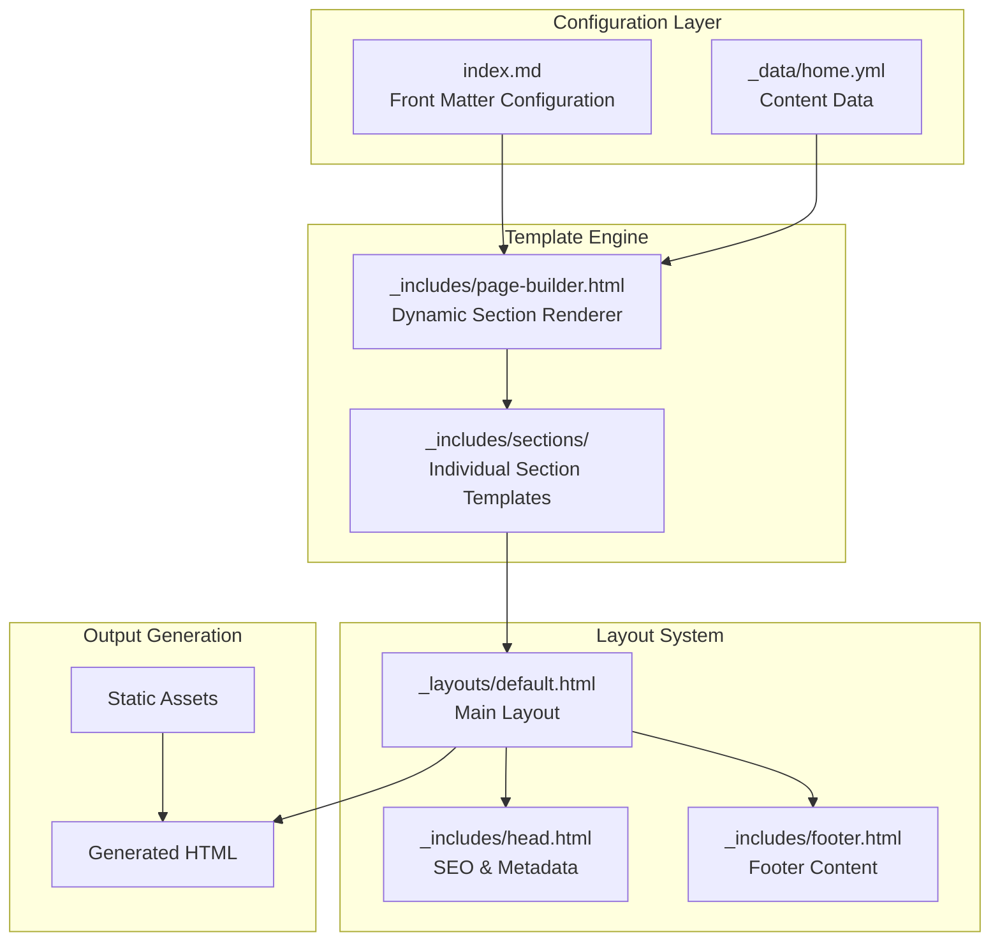

# Homepage Management System

<cite>
**Referenced Files in This Document**
- [index.md](file://index.md)
- [_includes/page-builder.html](file://_includes/page-builder.html)
- [_data/home.yml](file://_data/home.yml)
- [_includes/sections/hero.html](file://_includes/sections/hero.html)
- [_includes/sections/services.html](file://_includes/sections/services.html)
- [_includes/sections/credentials.html](file://_includes/sections/credentials.html)
- [_includes/sections/llm-profiles.html](file://_includes/sections/llm-profiles.html)
- [_layouts/default.html](file://_layouts/default.html)
- [_includes/head.html](file://_includes/head.html)
- [_includes/footer.html](file://_includes/footer.html)
- [_config.yml](file://_config.yml)
</cite>

## Table of Contents
1. [Introduction](#introduction)
2. [System Architecture Overview](#system-architecture-overview)
3. [Declarative Configuration System](#declarative-configuration-system)
4. [Template Engine and Data Binding](#template-engine-and-data-binding)
5. [Section Management and Rendering](#section-management-and-rendering)
6. [Content Structure and Data Models](#content-structure-and-data-models)
7. [Adding, Removing, and Reordering Sections](#adding-removing-and-reordering-sections)
8. [Common Issues and Troubleshooting](#common-issues-and-troubleshooting)
9. [Best Practices and Maintenance Guidelines](#best-practices-and-maintenance-guidelines)
10. [Advanced Configuration Patterns](#advanced-configuration-patterns)

## Introduction

The cv-ai homepage management system employs a sophisticated declarative approach to content composition, leveraging Jekyll's Liquid templating engine combined with YAML data files. This system enables dynamic section rendering through a centralized configuration mechanism that separates content from presentation while maintaining flexibility and maintainability.

The homepage architecture follows a modular design pattern where individual sections are managed independently yet cohesively through a unified rendering pipeline. This approach ensures consistent styling, predictable content flow, and simplified maintenance across the entire website.

## System Architecture Overview

The homepage management system operates through a multi-layered architecture that separates concerns between configuration, data management, and presentation logic.



**Diagram sources**
- [index.md](file://index.md#L1-L15)
- [_includes/page-builder.html](file://_includes/page-builder.html#L1-L42)
- [_layouts/default.html](file://_layouts/default.html#L1-L25)

The system's architecture emphasizes modularity and separation of concerns, allowing each component to evolve independently while maintaining system coherence.

**Section sources**
- [index.md](file://index.md#L1-L15)
- [_includes/page-builder.html](file://_includes/page-builder.html#L1-L42)
- [_layouts/default.html](file://_layouts/default.html#L1-L25)

## Declarative Configuration System

The homepage configuration system operates through a dual-layer approach combining front matter declarations in Markdown files with centralized data storage in YAML files. This declarative model provides both flexibility and consistency in content management.

### Front Matter Configuration

The primary configuration occurs in the `index.md` file through front matter properties that define the homepage structure:

```yaml
---
layout: default
title: "Dzmitryi Kharlanau — System Analyst & SAP Transformation Consultant"
description: "System Analyst & SAP Transformation Consultant — senior SAP solution leader with 12+ years across Order-to-Cash, logistics, and data; delivering clean-core S/4HANA, resilient integrations, and intelligent automation."
permalink: /
sections:
  - hero
  - services
  - credentials
  - llm-profiles
---
```

The `sections` array serves as the master blueprint for homepage composition, specifying:
- **Section identifiers**: String values that correspond to template filenames
- **Order precedence**: The array position determines rendering sequence
- **Conditional inclusion**: Missing sections are automatically excluded

### Data File Organization

Content data is centralized in `_data/home.yml`, providing structured storage for all homepage content:

```yaml
hero:
  eyebrow: "SAP transformations without lock-in."
  name: "Dzmitryi Kharlanau"
  title: "System analyst & SAP transformation consultant"
  kicker: "Senior SAP solution leader · 12+ years across O2C, logistics, and data (sap system analyst)"
  subtitle: "@EPAM · ex-ABAT"
  
services:
  eyebrow: "Where I plug in"
  title: "Hands-on backup for programmes that can’t slow down."
  cards:
    - title: "AMS Support Lead"
      subtitle: "Transform AMS from costly vendor-driven patching into a knowledge-based service with analytics and continuous improvement."
      url: "/notes/ams/"
      cta: "See AMS playbook"
```

**Section sources**
- [index.md](file://index.md#L1-L15)
- [_data/home.yml](file://_data/home.yml#L1-L56)

## Template Engine and Data Binding

The template engine system employs Liquid templating with a sophisticated data binding mechanism that connects configuration arrays to corresponding template files dynamically.

### Dynamic Template Resolution

The page builder template implements a case-based routing system that maps section keys to specific template files:

```liquid


  
    
      
        
      
        
      
        
      
        
    
  

```

This approach provides several advantages:
- **Type safety**: Explicit mapping prevents invalid template references
- **Performance optimization**: Early termination for unmatched keys
- **Maintainability**: Centralized routing logic in a single file
- **Extensibility**: Easy addition of new section types

### Data Access Patterns

Each section template follows a consistent data access pattern that binds to the corresponding data structure:

```liquid


  <!-- Hero section rendering logic -->

```

This pattern ensures:
- **Null safety**: Conditional rendering prevents template errors
- **Consistency**: Uniform data access across all sections
- **Debugging support**: Clear separation between configuration and rendering

**Section sources**
- [_includes/page-builder.html](file://_includes/page-builder.html#L1-L42)
- [_includes/sections/hero.html](file://_includes/sections/hero.html#L1-L5)

## Section Management and Rendering

The section management system provides granular control over individual homepage components while maintaining cohesive presentation standards.

### Hero Section Implementation

The hero section demonstrates comprehensive content injection capabilities:

```liquid


<section class="section hero" id="hero">
  <article class="hero-card neub-card">
    <header class="hero-header">
      
      <picture>
        <source srcset="{{ hero_image_avif }}" type="image/avif" />
        <source srcset="{{ hero_image_webp }}" type="image/webp" />
        
      </picture>
      
      <div class="hero-heading">
        <p class="eyebrow">{{ hero.eyebrow }}</p>
        <p class="hero-name">{{ hero.name }}</p>
        <h1 class="hero-role">{{ hero.title }}</h1>
        <p class="hero-kicker">{{ hero.kicker }}</p>
        <p class="hero-subtitle">{{ hero.subtitle }}</p>
      </div>
    </header>
  </article>
</section>

```

Key features include:
- **Responsive image handling**: Multiple format support (PNG, WEBP, AVIF)
- **Fallback mechanisms**: Graceful degradation for missing content
- **Semantic markup**: Proper heading hierarchy and accessibility attributes
- **Styling consistency**: Integration with the design system's card components

### Services Section Architecture

The services section showcases grid-based content presentation with flexible card layouts:

```liquid


<section class="section services" id="services">
  <header class="section-heading">
    <p class="eyebrow">{{ services.eyebrow }}</p>
    <h2>{{ services.title }}</h2>
  </header>
  
  <div class="services-grid">
    
    <a class="service-card neub-card" href="{{ card.url }}">
      <header class="service-card__header">
        <h3>{{ card.title }}</h3>
      </header>
      <div class="service-card__body">
        
        <p class="service-card__subtitle">{{ card.subtitle }}</p>
        
      </div>
    </a>
    
  </div>
  
</section>

```

### Credentials and LLM Profiles

Specialized sections handle distinct content types:

**Credentials Section**: Structured presentation of certifications and qualifications using grid layouts for consistent card sizing and visual hierarchy.

**LLM Profiles Section**: Inline navigation component linking to various machine-readable formats, demonstrating responsive design patterns for compact content display.

**Section sources**
- [_includes/sections/hero.html](file://_includes/sections/hero.html#L1-L63)
- [_includes/sections/services.html](file://_includes/sections/services.html#L1-L41)
- [_includes/sections/credentials.html](file://_includes/sections/credentials.html#L1-L26)
- [_includes/sections/llm-profiles.html](file://_includes/sections/llm-profiles.html#L1-L12)

## Content Structure and Data Models

The content structure follows established patterns that ensure consistency and scalability across all homepage sections.

### Hero Section Data Model

The hero section data model supports comprehensive personal branding content:

| Field | Type | Description | Required |
|-------|------|-------------|----------|
| `eyebrow` | String | Subheading text | No |
| `name` | String | Full name display | Yes |
| `title` | String | Professional title | Yes |
| `kicker` | String | Brief descriptor | No |
| `subtitle` | String | Current affiliation | No |
| `profile.image` | String | Primary image URL | Yes |
| `profile.image_webp` | String | WebP format fallback | No |
| `profile.image_avif` | String | AVIF format fallback | No |
| `profile.alt` | String | Image alt text | No |
| `profile.links` | Array | Contact links collection | No |

### Services Section Data Model

Services section data follows a card-based structure optimized for grid layouts:

| Field | Type | Description | Required |
|-------|------|-------------|----------|
| `eyebrow` | String | Section subheading | No |
| `title` | String | Section headline | Yes |
| `cards` | Array | Service card collection | Yes |

**Card Item Properties**:
| Field | Type | Description | Required |
|-------|------|-------------|----------|
| `title` | String | Card headline | Yes |
| `subtitle` | String | Description text | No |
| `url` | String | Link destination | No |
| `cta` | String | Call-to-action text | No |

### Global Data Consistency

The system maintains consistency through standardized field naming and structural patterns:

- **Field naming conventions**: Snake_case for all data fields
- **Optional field handling**: Graceful degradation for missing data
- **Link structure standardization**: Consistent URL patterns and external link handling
- **Image format support**: Multi-format image delivery with automatic fallback detection

**Section sources**
- [_data/home.yml](file://_data/home.yml#L1-L56)

## Adding, Removing, and Reordering Sections

The homepage management system provides intuitive mechanisms for modifying section composition without requiring code changes.

### Adding New Sections

To add a new section to the homepage:

1. **Create the section template**: Place the new template in `_includes/sections/` with the appropriate filename (e.g., `_includes/sections/new-section.html`)
2. **Add the section identifier**: Append the new section key to the `sections` array in `index.md`
3. **Define the data structure**: Add corresponding entries to `_data/home.yml`
4. **Test the implementation**: Verify the new section renders correctly

Example modification to `index.md`:
```yaml
sections:
  - hero
  - services
  - credentials
  - llm-profiles
  - new-section  # Added new section
```

### Removing Sections

To remove a section from the homepage:

1. **Remove the section identifier**: Delete the corresponding entry from the `sections` array
2. **Clean up unused templates**: Remove the associated template file if no longer needed
3. **Update data structure**: Remove the corresponding section from `_data/home.yml` (optional)
4. **Verify removal**: Confirm the section no longer appears in the rendered output

### Reordering Sections

Section ordering is controlled exclusively through the `sections` array position:

```yaml
sections:
  - hero           # First to render
  - services       # Second to render
  - credentials    # Third to render
  - llm-profiles   # Fourth to render
```

Reordering requires only changing the array position of the desired section key. The page builder automatically handles the rendering sequence based on array order.

### Template Registration

New section templates require registration in the page builder's case statement:

```liquid

  
    
  
    
    <!-- New registration -->
    

```

**Section sources**
- [index.md](file://index.md#L8-L12)
- [_includes/page-builder.html](file://_includes/page-builder.html#L3-L35)

## Common Issues and Troubleshooting

The homepage management system can encounter several common issues that affect rendering and functionality. Understanding these problems and their solutions ensures reliable operation.

### Missing Content Issues

**Problem**: Sections appear empty or contain placeholder text
**Causes**:
- Missing data entries in `_data/home.yml`
- Incorrect field naming in data files
- Template data access failures

**Solutions**:
1. Verify data file structure matches template expectations
2. Check field names for typos or inconsistencies
3. Ensure required fields are present in the data file
4. Test data access in templates using conditional rendering

### Broken Section References

**Problem**: Specific sections fail to render or cause template errors
**Causes**:
- Missing template files in `_includes/sections/`
- Incorrect section keys in the `sections` array
- Template syntax errors

**Solutions**:
1. Confirm template file exists with correct filename
2. Verify section key matches template basename exactly
3. Check template syntax and Liquid logic
4. Test individual templates in isolation

### Data Binding Failures

**Problem**: Content appears incorrectly formatted or missing
**Causes**:
- Incorrect data structure in YAML files
- Missing null checks in templates
- Field type mismatches

**Solutions**:
1. Validate YAML syntax and structure
2. Add conditional rendering for optional fields
3. Use appropriate Liquid filters for data formatting
4. Implement fallback values for missing content

### Performance Issues

**Problem**: Slow page load times or rendering delays
**Causes**:
- Large image files in hero section
- Excessive data complexity
- Template rendering inefficiencies

**Solutions**:
1. Optimize image sizes and formats
2. Simplify complex data structures
3. Minimize template nesting depth
4. Implement lazy loading for non-critical content

### Debugging Strategies

Effective debugging approaches for homepage management issues:

1. **Template Isolation**: Test individual section templates separately
2. **Data Validation**: Verify data file syntax and structure
3. **Console Logging**: Use Jekyll's development server for error messages
4. **Incremental Testing**: Add sections one at a time to isolate issues

**Section sources**
- [_includes/page-builder.html](file://_includes/page-builder.html#L1-L42)
- [_includes/sections/hero.html](file://_includes/sections/hero.html#L1-L63)

## Best Practices and Maintenance Guidelines

Maintaining a robust homepage management system requires adherence to established patterns and practices that ensure reliability, scalability, and ease of maintenance.

### Naming Conventions

**File Naming**:
- Use kebab-case for template filenames (e.g., `hero.html`, `services.html`)
- Match section keys exactly to template basenames
- Maintain consistent directory structure

**Field Naming**:
- Use snake_case for all YAML data fields
- Employ descriptive, hierarchical field names
- Maintain consistency across similar sections

**Class Names**:
- Follow BEM methodology for CSS class naming
- Use semantic class names that describe content purpose
- Maintain design system consistency

### Data Structure Standards

**Consistency Patterns**:
- Establish and maintain consistent data structures across similar sections
- Use arrays for collections of items (e.g., service cards, credential lists)
- Implement optional field handling with null checks

**Validation Practices**:
- Validate YAML syntax before deployment
- Test data structures with representative content
- Implement graceful degradation for missing fields

### Template Development Guidelines

**Code Quality**:
- Use consistent indentation and formatting
- Add comments for complex logic or special cases
- Implement comprehensive null checking
- Use appropriate Liquid filters for data manipulation

**Performance Optimization**:
- Minimize template nesting depth
- Use efficient looping constructs
- Implement lazy loading for non-critical content
- Optimize image handling and format selection

### Content Management Workflow

**Version Control**:
- Commit data file changes separately from template modifications
- Use descriptive commit messages for content updates
- Maintain backup copies of critical content files

**Testing Procedures**:
- Test section additions/removals in development environment
- Verify cross-browser compatibility for visual elements
- Validate accessibility compliance for all interactive elements
- Test mobile responsiveness and touch interactions

### Maintenance Schedule

**Regular Review**:
- Quarterly review of content accuracy and currency
- Annual assessment of section effectiveness and relevance
- Bi-annual evaluation of template performance and optimization opportunities
- Continuous monitoring of analytics for user engagement metrics

**Documentation Maintenance**:
- Update documentation when adding new section types
- Maintain consistency between documentation and implementation
- Document any deviations from established patterns
- Provide clear examples for content contributors

**Section sources**
- [_data/home.yml](file://_data/home.yml#L1-L56)
- [_includes/page-builder.html](file://_includes/page-builder.html#L1-L42)

## Advanced Configuration Patterns

The homepage management system supports advanced configuration patterns that enable sophisticated content presentation while maintaining architectural simplicity.

### Conditional Content Rendering

Advanced templates can implement complex conditional logic to handle dynamic content scenarios:

```liquid

  
  
  
  <picture>
    <source srcset="{{ hero_image_avif }}" type="image/avif" />
    <source srcset="{{ hero_image_webp }}" type="image/webp" />
    
  </picture>

```

This pattern demonstrates:
- **Multi-format image support**: Automatic fallback detection and format selection
- **Conditional asset loading**: Optimized resource delivery based on availability
- **Graceful degradation**: Fallback mechanisms for missing resources

### Dynamic Link Generation

The system supports dynamic link generation with external link handling:

```liquid
<ul class="hero-links">
  
  <li><a href="{{ link.url }}" class="link-arrow" target="_blank" rel="noopener noreferrer">{{ link.label }}</a></li>
  
</ul>
```

Features include:
- **External link detection**: Automatic target="_blank" for external URLs
- **Security handling**: Proper rel="noopener noreferrer" for external links
- **Accessibility support**: Semantic link markup with appropriate attributes

### Responsive Design Integration

Templates integrate with the design system's responsive patterns:

```liquid
<div class="services-grid">
  
  <a class="service-card neub-card" href="{{ card.url }}">
    <header class="service-card__header">
      <h3>{{ card.title }}</h3>
    </header>
    <div class="service-card__body">
      
      <p class="service-card__subtitle">{{ card.subtitle }}</p>
      
    </div>
  </a>
  
</div>
```

Implementation highlights:
- **Grid-based layouts**: Responsive grid systems for content organization
- **Card-based design**: Consistent visual treatment across different content types
- **Flexible sizing**: Adaptive layouts that work across device sizes

### SEO and Accessibility Features

Advanced templates incorporate comprehensive SEO and accessibility features:

**Structured Data Integration**:
- JSON-LD schema markup for search engines
- Semantic HTML structure for screen readers
- Proper heading hierarchy and content organization

**Metadata Management**:
- Dynamic title generation based on page context
- Meta description optimization for search visibility
- Open Graph and Twitter Card support for social sharing

**Accessibility Compliance**:
- ARIA attributes for interactive elements
- Keyboard navigation support
- Screen reader optimization
- Color contrast and readability considerations

**Section sources**
- [_includes/sections/hero.html](file://_includes/sections/hero.html#L6-L25)
- [_includes/sections/services.html](file://_includes/sections/services.html#L10-L25)
- [_includes/head.html](file://_includes/head.html#L1-L113)