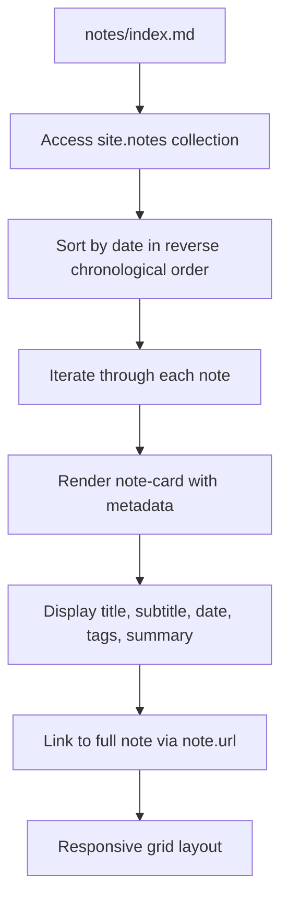

# Practitioner Notes System

<cite>
**Referenced Files in This Document**   
- [_config.yml](file://_config.yml)
- [_layouts/note.html](file://_layouts/note.html)
- [notes/index.md](file://notes/index.md)
- [_notes/ai_ml.md](file://_notes/ai_ml.md)
- [_notes/composable_erp.md](file://_notes/composable_erp.md)
- [_notes/ams.md](file://_notes/ams.md)
- [_notes/system-architecture.md](file://_notes/system-architecture.md)
- [_notes/tools_mini_apps.md](file://_notes/tools_mini_apps.md)
- [_notes/process_audit.md](file://_notes/process_audit.md)
- [_notes/consulting_principles.md](file://_notes/consulting_principles.md)
- [_data/social.yml](file://_data/social.yml)
- [_includes/components/social-line.html](file://_includes/components/social-line.html)
- [assets/main.css](file://assets/main.css)
</cite>

## Table of Contents
1. [Introduction](#introduction)
2. [Jekyll Collection Configuration](#jekyll-collection-configuration)
3. [Note File Structure and Front Matter](#note-file-structure-and-front-matter)
4. [Notes Index Page Aggregation](#notes-index-page-aggregation)
5. [Note Rendering Process](#note-rendering-process)
6. [Visual Presentation and Responsive Grid](#visual-presentation-and-responsive-grid)
7. [Creating a New Note: Complete Workflow](#creating-a-new-note-complete-workflow)
8. [Social Sharing Integration](#social-sharing-integration)
9. [Troubleshooting Common Issues](#troubleshooting-common-issues)
10. [Best Practices for Tagging and Content Consistency](#best-practices-for-tagging-and-content-consistency)

## Introduction
The Practitioner Notes System in cv-ai is a Jekyll-powered content management framework designed to publish technical insights on SAP transformation, clean-core S/4HANA strategy, event-driven integration, and AI-enabled operations. This system leverages Jekyll collections to organize practitioner notes in a structured, maintainable way, enabling efficient content creation, aggregation, and presentation. The notes serve as working documents that capture architectural playbooks, consulting principles, and transformation diaries, making the operating model learnable and repeatable across engagements.

**Section sources**
- [notes/index.md](file://notes/index.md#L1-L5)
- [_config.yml](file://_config.yml#L1-L5)

## Jekyll Collection Configuration
The Practitioner Notes System is enabled through Jekyll's collections feature, configured in the `_config.yml` file. The `collections` directive defines a custom `notes` collection with `output: true`, which instructs Jekyll to generate individual HTML pages for each note file in the `_notes` directory. The `permalink` setting `/notes/:slug/` establishes a clean URL structure where each note is accessible under the `/notes/` path using its filename as the slug. This configuration ensures that all Markdown files in `_notes` are processed as first-class content objects with their own URLs, metadata, and layout rendering.

The `defaults` section in `_config.yml` applies default values to all files in the `notes` collection, automatically assigning the `note` layout from `_layouts/note.html` to every note. This eliminates the need to specify the layout in each note's front matter, ensuring consistency across the collection. The combination of collection configuration and default values creates a streamlined publishing workflow where new notes inherit the correct layout and URL structure automatically upon creation.

**Section sources**
- [_config.yml](file://_config.yml#L40-L50)

## Note File Structure and Front Matter
Each note in the `_notes` directory is a Markdown file (e.g., `ai_ml.md`, `composable_erp.md`) that begins with YAML front matter containing metadata essential for rendering and organization. The required front matter fields include:

- **title**: The primary heading displayed on the note page and index
- **subtitle**: A secondary descriptor that provides context or emphasis
- **date**: Publication date in ISO format (YYYY-MM-DD) used for sorting
- **tags**: An array of keywords for categorization and filtering
- **summary**: A brief description used in index listings when excerpt is not present

Additional optional fields enhance the note's functionality:
- **description**: SEO-friendly meta description
- **eyebrow**: A small label displayed above the title (e.g., "Opinionated essay")
- **excerpt**: Alternative summary text for index display
- **further_reading**: A list of related notes with labels and URLs for cross-linking
- **permalink**: Custom URL override (though typically inherited from collection config)
- **updated**: Date of last update for display in the note metadata

The front matter structure ensures consistent metadata across all notes while allowing flexibility for additional context. The date field is particularly critical as it determines the chronological ordering of notes on the index page.

**Section sources**
- [_notes/ai_ml.md](file://_notes/ai_ml.md#L1-L15)
- [_notes/composable_erp.md](file://_notes/composable_erp.md#L1-L15)
- [_notes/ams.md](file://_notes/ams.md#L1-L15)

## Notes Index Page Aggregation
The `notes/index.md` page serves as the central hub for all practitioner notes, aggregating and displaying them in a structured grid layout. This page uses the `site.notes` collection variable to access all notes defined in the `_notes` directory. The Liquid template logic `` sorts the notes by their date field in reverse chronological order, ensuring the most recent content appears first.

The index page iterates through the sorted notes collection using a `` loop, rendering each note as a card in the responsive grid. For each note, the template displays the title as a link to the full note, the subtitle (if present), publication date, tags, and either the summary or excerpt as a preview text. This aggregation pattern creates a dynamic listing that automatically includes new notes when they are added to the `_notes` directory with proper front matter, requiring no manual updates to the index page.

**Section sources**
- [notes/index.md](file://notes/index.md#L12-L38)

## Note Rendering Process
Individual notes are rendered through the `_layouts/note.html` template, which extends the base `default.html` layout to provide a consistent site structure. The note layout processes the front matter variables to display metadata in a structured format. It handles both `date` and `published` fields for publication date, and `updated` for modification date, formatting them in a human-readable "DD MMM YYYY" format.

The layout organizes content into semantic sections: a header displaying the eyebrow/category, title, subtitle, and metadata (publication date, update date, and tags); a body section that renders the Markdown content via the `{{ content }}` variable; and an optional "Further reading" sidebar that displays links to related notes when the `further_reading` front matter is present. This structured approach ensures that all notes have a consistent presentation while allowing rich content in the main body.

The note layout also handles edge cases, such as using `page.summary` as a fallback when `page.excerpt` is not defined, and conditionally displaying metadata elements only when their corresponding front matter fields exist. This creates a clean, professional presentation that adapts to the specific metadata provided for each note.

**Section sources**
- [_layouts/note.html](file://_layouts/note.html#L1-L56)
- [_layouts/default.html](file://_layouts/default.html#L1-L25)

## Visual Presentation and Responsive Grid
The visual presentation of notes is governed by CSS styles in `assets/main.css`, which implements a responsive grid layout for both the index page and individual note cards. The `.notes-grid` class on the index page creates a flexible grid container that automatically adjusts the number of columns based on screen width, ensuring optimal display on various devices.

Each note is rendered as a `.note-card` element with the `.neub-card` class, which applies the site's neubrutalist design aesthetic: a light background (`var(--color-card)`), dark border (`var(--color-border)`), large border radius (`var(--radius-lg)`), and a distinctive shadow effect (`var(--shadow-card)`). The cards feature subtle hover and focus interactions that translate the card slightly and intensify the shadow, providing tactile feedback.

The card layout includes semantic sections: a header with the title and subtitle, a metadata bar showing the publication date and tags, and a preview paragraph with the summary or excerpt. The responsive design uses CSS clamp() functions and viewport-relative units to ensure readable typography across devices, with font sizes that scale smoothly between minimum and maximum values based on screen width.



**Diagram sources**
- [notes/index.md](file://notes/index.md#L12-L38)
- [assets/main.css](file://assets/main.css#L752-L786)

**Section sources**
- [notes/index.md](file://notes/index.md#L12-L38)
- [assets/main.css](file://assets/main.css#L752-L786)

## Creating a New Note: Complete Workflow
Creating a new practitioner note follows a standardized workflow that ensures consistency and proper integration with the site's publishing system:

1. **File Creation**: Create a new Markdown file in the `_notes` directory using a descriptive filename with lowercase letters, numbers, and underscores (e.g., `new_topic.md`).

2. **Front Matter Setup**: Begin the file with YAML front matter containing the required fields:
   ```yaml
   ---
   title: "Descriptive Title"
   subtitle: "Supporting subtitle"
   date: YYYY-MM-DD
   tags:
     - Primary
     - Secondary
   summary: "Brief summary for index display"
   ---
   ```

3. **Content Authoring**: Write the note content in Markdown format below the front matter, using appropriate headings, lists, and formatting to structure the information.

4. **Optional Enhancements**: Add optional front matter fields such as `further_reading` to link to related notes, or `eyebrow` to add a category label.

5. **Commit and Deploy**: Save the file and commit it to the repository. The static site generator will automatically process the new note during the next build, creating a corresponding HTML page at `/notes/new-topic/`.

The workflow leverages Jekyll's collection processing to handle URL generation, layout assignment, and index aggregation automatically. No additional configuration is required beyond creating the properly formatted file in the correct directory.

**Section sources**
- [_config.yml](file://_config.yml#L40-L50)
- [_notes/ai_ml.md](file://_notes/ai_ml.md#L1-L15)

## Social Sharing Integration
Social sharing functionality is integrated into note pages through the `_data/social.yml` configuration and the `_includes/components/social-line.html` component. The `social.yml` file defines a collection of social media links with structured data including ID, label, handle, URL, descriptor, and icon representation.

While the current implementation shows these social links in the site footer and other sections, the architecture supports integration into note pages. The `social-line.html` include component can be configured to display social links with various presentation options, including compact variants and descriptor text. Each link includes proper accessibility attributes and opens in a new tab with security attributes (`target="_blank" rel="noopener noreferrer"`).

The component uses a flexible data reference system that allows notes to potentially include specific social sharing configurations, though the current implementation primarily uses the global social links. This modular approach enables consistent social sharing functionality across the site while allowing for future enhancements to include note-specific sharing options.

**Section sources**
- [_data/social.yml](file://_data/social.yml#L1-L50)
- [_includes/components/social-line.html](file://_includes/components/social-line.html#L1-L40)

## Troubleshooting Common Issues
Several common issues can prevent notes from appearing correctly on the index page or displaying properly:

**Notes not appearing on index page**: This typically occurs when the note file is missing required front matter fields, particularly `date`. Without a date field, the note cannot be sorted and may be excluded from the collection. Ensure the date is in ISO format (YYYY-MM-DD) and that the file is located in the `_notes` directory.

**Incorrect chronological order**: Verify that the date format is correct and that the sorting logic in `notes/index.md` is intact. Dates in the future will appear at the top of the list due to reverse chronological sorting.

**Layout rendering issues**: Check that the front matter includes `layout: note` or that the file is properly included in the `notes` collection defaults. Missing layout assignment will cause the note to render with the default layout instead of the specialized note template.

**Metadata display problems**: Ensure required fields like `title` and `tags` are present in the front matter. Optional fields like `subtitle` and `updated` should be omitted entirely if not used, rather than left as empty values.

**URL routing errors**: Verify that the `permalink` configuration in `_config.yml` is correct and that the note file has a valid filename without special characters. The collection's `output: true` setting must also be present.

**Section sources**
- [_config.yml](file://_config.yml#L40-L50)
- [notes/index.md](file://notes/index.md#L12-L38)
- [_layouts/note.html](file://_layouts/note.html#L1-L56)

## Best Practices for Tagging and Content Consistency
To maintain a coherent and navigable knowledge base, the Practitioner Notes System follows several best practices for tagging and content consistency:

**Tagging Strategy**: Use a controlled vocabulary of tags that align with the primary domains of expertise: SAP, Architecture, Clean Core, AI, Machine Learning, AMS, O2C, Integration, and Consulting. Tags should be capitalized consistently (first letter uppercase, rest lowercase) and use singular forms. Limit the number of tags per note to 3-5 to maintain focus and prevent over-categorization.

**Content Voice and Style**: Maintain a consistent practitioner voice that is authoritative yet approachable, focusing on actionable insights rather than theoretical discussions. Use first-person perspective when sharing personal methodologies or opinions, and third-person for general guidance. Structure content with clear headings, bullet points for lists, and code blocks for technical examples.

**Cross-linking**: Leverage the `further_reading` front matter to create a knowledge network by linking related notes. This helps readers discover connected content and reinforces the thematic relationships between different aspects of SAP transformation.

**Update Management**: Use the `updated` front matter field to indicate when a note has been revised, helping readers understand the currency of the information. Consider adding a brief changelog section within frequently updated notes.

**Metadata Completeness**: Always include all required front matter fields and strive for completeness in optional fields. A well-crafted `summary` or `excerpt` improves the note's discoverability and provides context in index listings.

**Section sources**
- [_notes/ai_ml.md](file://_notes/ai_ml.md#L1-L15)
- [_notes/composable_erp.md](file://_notes/composable_erp.md#L1-L15)
- [_notes/ams.md](file://_notes/ams.md#L1-L15)