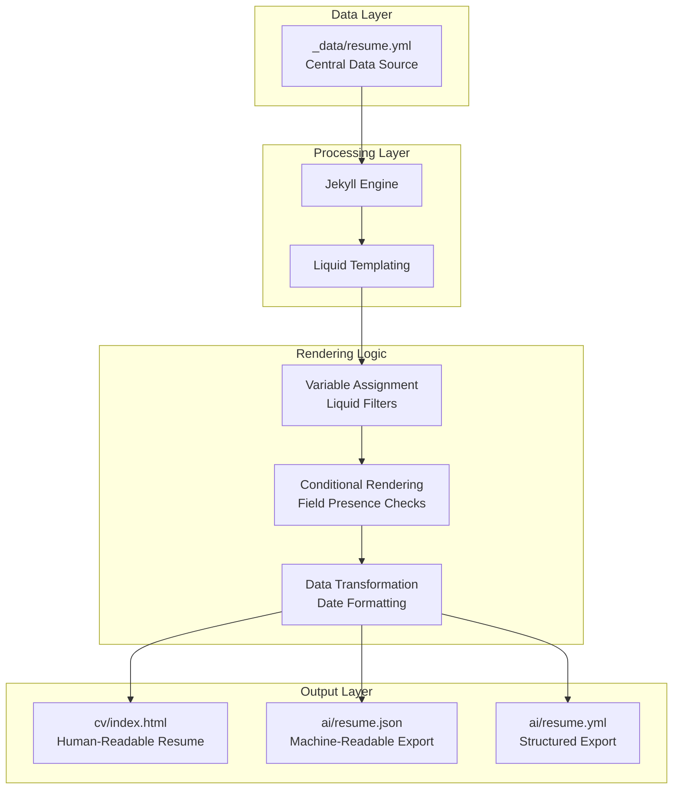
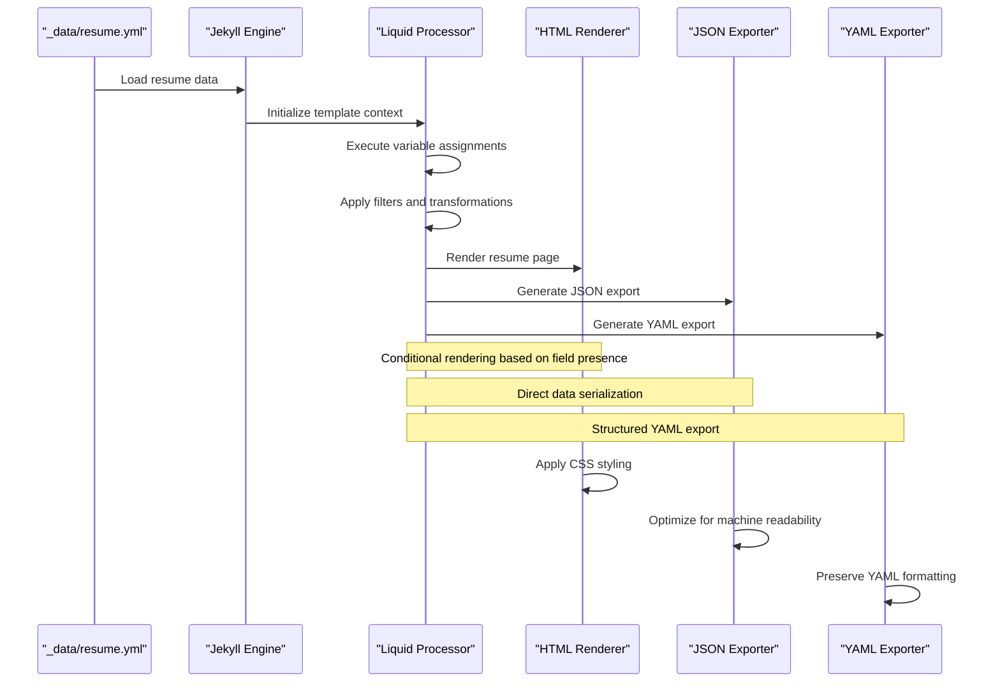

# Resume Content Pipeline

<cite>
**Referenced Files in This Document**
- [_data/resume.yml](file://_data/resume.yml)
- [cv/index.html](file://cv/index.html)
- [ai/resume.json](file://ai/resume.json)
- [ai/resume.yml](file://ai/resume.yml)
- [_config.yml](file://_config.yml)
- [_layouts/default.html](file://_layouts/default.html)
- [README.md](file://README.md)
- [ARCHITECTURE.md](file://ARCHITECTURE.md)
</cite>

## Table of Contents
1. [Introduction](#introduction)
2. [System Architecture Overview](#system-architecture-overview)
3. [Data Structure and Organization](#data-structure-and-organization)
4. [Liquid Templating Engine](#liquid-templating-engine)
5. [End-to-End Data Flow](#end-to-end-data-flow)
6. [Conditional Rendering Logic](#conditional-rendering-logic)
7. [Dual Export Mechanism](#dual-export-mechanism)
8. [Date Formatting and Timeline Processing](#date-formatting-and-timeline-processing)
9. [Performance Considerations](#performance-considerations)
10. [Content Management Guidelines](#content-management-guidelines)
11. [Troubleshooting and Best Practices](#troubleshooting-and-best-practices)
12. [Conclusion](#conclusion)

## Introduction

The cv-ai resume content pipeline represents a sophisticated, automated system that transforms structured YAML data into multiple presentation formats while maintaining data consistency across all output channels. This system leverages Jekyll's Liquid templating engine to create a seamless workflow where updates to the central `_data/resume.yml` file automatically propagate to the main resume page (`cv/index.html`) and machine-readable exports (`ai/resume.json` and `ai/resume.yml`).

The pipeline serves dual purposes: providing an aesthetically designed resume for human consumption while simultaneously offering structured, machine-readable data for AI agents, recruiters, and integration systems. This architecture demonstrates how modern web development can balance user experience with technical requirements through careful data modeling and template-driven rendering.

## System Architecture Overview

The resume content pipeline operates within a Jekyll static site generator framework, utilizing a centralized data model approach that ensures consistency across all output formats. The system consists of three primary components working in harmony:



**Diagram sources**
- [_data/resume.yml](file://_data/resume.yml#L1-L441)
- [cv/index.html](file://cv/index.html#L1-L258)
- [ai/resume.json](file://ai/resume.json#L1-L7)
- [ai/resume.yml](file://ai/resume.yml#L1-L715)

The architecture follows a unidirectional data flow pattern where the YAML data source acts as the single source of truth. All modifications occur at this central location, ensuring atomic updates and preventing data synchronization issues across different output formats.

**Section sources**
- [ARCHITECTURE.md](file://ARCHITECTURE.md#L1-L67)
- [_config.yml](file://_config.yml#L1-L51)

## Data Structure and Organization

The resume data structure in `_data/resume.yml` follows a hierarchical organization designed for both human readability and machine processing. The file contains seven primary sections, each serving specific informational domains:

### Top-Level Properties Structure

| Property | Type | Purpose | Required |
|----------|------|---------|----------|
| `name` | String | Full name of the candidate | Yes |
| `headline` | String | Professional title and expertise | Yes |
| `image` | URL | Profile picture URL | No |
| `summary` | Text | Executive summary paragraph | No |
| `contact` | Object | Contact information container | No |
| `experience` | Array | Work history entries | Yes |
| `education` | Array | Educational qualifications | Yes |
| `skills` | Array | Technical and soft skills | Yes |
| `certifications` | Array | Professional credentials | No |
| `projects` | Array | Selected project highlights | No |
| `languages` | Array | Language proficiencies | No |
| `courses` | Array | Additional training | No |

### Contact Information Structure

The contact section demonstrates the flexibility of the data model, supporting various communication channels:

```yaml
contact:
  site: "https://dkharlanau.github.io"
  linkedin: "https://www.linkedin.com/in/dkharlanau"
  twitter: "https://x.com/dkharlanau"
  email: "dzmitryi@example.com"
```

### Experience Entry Structure

Each experience entry maintains a consistent structure that supports both chronological and narrative presentation:

```yaml
experience:
  - company: "EPAM Systems"
    url: "https://www.epam.com"
    title: "Senior SAP SD Consultant"
    start: "2025-05"
    end: "2025-08"
    current: false
    summary: "Comprehensive role description..."
    highlights:
      - "Achievement 1"
      - "Achievement 2"
    location: "Remote"
```

### Education Entry Structure

Education entries utilize a flexible schema that accommodates various academic formats:

```yaml
education:
  - school: "Economics University"
    notes: "Bachelor's degree in Economic Informatics"
    start: "2012-12"
    end: "2013-06"
```

**Section sources**
- [_data/resume.yml](file://_data/resume.yml#L1-L441)

## Liquid Templating Engine

The Liquid templating engine serves as the core processing layer, transforming raw YAML data into formatted HTML output. The system employs several key Liquid constructs for data manipulation and presentation:

### Variable Assignment and Filtering

The pipeline begins with essential variable assignments that prepare data for subsequent rendering stages:

```liquid




```

These assignments demonstrate several important Liquid capabilities:
- **Data Access**: `site.data.resume` retrieves the complete resume dataset
- **Filter Chaining**: `where_exp` filters links containing HTTP URLs
- **Array Manipulation**: `slice` extracts the first 24 skills for display
- **First Element Extraction**: `first` retrieves the primary education entry

### Template Control Structures

The Liquid engine provides robust conditional rendering capabilities that handle optional fields gracefully:

```liquid

<div>
  <dt>Email</dt>
  <dd><a href="mailto:{{ resume.contact.email }}">{{ resume.contact.email }}</a></dd>
</div>

```

This pattern ensures that contact information appears only when present, preventing empty sections from cluttering the presentation.

### Loop Constructs for Data Iteration

The system utilizes Liquid loops to handle variable-length arrays efficiently:

```liquid

<article class="resume-item">
  <header>
    <h3>{{ role.title }} &middot; {{ role.company }}</h3>
    <p class="resume-meta">{{ role.start }} – {{ role.end }}</p>
  </header>
  
  <p>{{ role.summary }}</p>
  
</article>

```

**Section sources**
- [cv/index.html](file://cv/index.html#L8-L12)
- [cv/index.html](file://cv/index.html#L24-L42)

## End-to-End Data Flow

The resume content pipeline follows a precise sequence of operations from data ingestion to final output generation:



**Diagram sources**
- [_data/resume.yml](file://_data/resume.yml#L1-L441)
- [cv/index.html](file://cv/index.html#L1-L258)
- [ai/resume.json](file://ai/resume.json#L1-L7)
- [ai/resume.yml](file://ai/resume.yml#L1-L715)

### Data Loading Phase

The Jekyll engine loads the resume data from `_data/resume.yml` during the site initialization phase. This data becomes globally accessible through the `site.data.resume` namespace, making it available to all templates and layouts.

### Template Processing Phase

During the template processing phase, Liquid executes the predefined template logic, applying filters, assignments, and conditional statements to transform the raw data into formatted output.

### Output Generation Phase

The system generates multiple output formats simultaneously:
- **HTML Resume**: Human-readable presentation with CSS styling
- **JSON Export**: Machine-readable format optimized for API consumption
- **YAML Export**: Structured format preserving data relationships

**Section sources**
- [cv/index.html](file://cv/index.html#L1-L258)
- [ai/resume.json](file://ai/resume.json#L1-L7)
- [ai/resume.yml](file://ai/resume.yml#L1-L715)

## Conditional Rendering Logic

The resume pipeline implements sophisticated conditional rendering to handle optional fields gracefully and maintain clean presentation aesthetics:

### Field Presence Detection

The system employs multiple strategies for detecting field availability:

```liquid

<div>
  <dt>Email</dt>
  <dd><a href="mailto:{{ resume.contact.email }}">{{ resume.contact.email }}</a></dd>
</div>

```

This pattern ensures that contact information appears only when provided, preventing empty sections from appearing in the final output.

### Array Length Validation

For collections like experience and education, the system validates array existence before attempting iteration:

```liquid

<section class="resume-section">
  <h2>Experience</h2>
  <div class="resume-list">
    
    <!-- Role rendering logic -->
    
  </div>
</section>

```

### Boolean Flag Processing

Current employment status is handled through boolean flags:

```liquid

Present

{{ role.end }}

Previous

```

### Default Value Handling

The system provides fallback mechanisms for optional fields:

```liquid
<p class="resume-location">{{ primary_education.notes | default: primary_education.school }}</p>
```

This ensures that either the detailed notes or the school name appears, maintaining content continuity.

**Section sources**
- [cv/index.html](file://cv/index.html#L24-L42)
- [cv/index.html](file://cv/index.html#L15-L17)
- [cv/index.html](file://cv/index.html#L13-L17)

## Dual Export Mechanism

The resume pipeline implements a dual export architecture that produces both human-readable and machine-readable formats from the same data source, ensuring consistency across all output channels:

### JSON Export Implementation

The JSON export leverages Jekyll's built-in `jsonify` filter for direct data serialization:

```yaml
---
layout: null
permalink: /ai/resume.json
sitemap: true
---
{{ site.data.resume | jsonify }}
```

This approach provides several advantages:
- **Automatic Serialization**: Liquid handles complex data structure conversion
- **Consistency**: Ensures identical data representation across formats
- **Performance**: Minimal processing overhead for export generation

### YAML Export Implementation

The YAML export maintains the original data structure while adding metadata and enrichment:

```yaml
---
layout: null
permalink: /ai/resume.yml
sitemap: true
image: /assets/img/DzmitryiKharlanau.png
---
summary: "Senior SAP solution leader with 12+ years across O2C, logistics and data..."
```

The YAML export includes additional metadata such as:
- **Canonical URLs**: Establishing the authoritative source
- **Version Information**: Tracking changes and updates
- **Image References**: Providing asset paths for external consumption
- **Metadata Enrichment**: Adding contextual information for consumers

### Export Synchronization

Both export formats maintain synchronization through the shared data source:
- **Atomic Updates**: Changes propagate simultaneously to all formats
- **Consistency Guarantees**: Prevents data drift between formats
- **Validation**: Ensures both formats remain valid after updates

**Section sources**
- [ai/resume.json](file://ai/resume.json#L1-L7)
- [ai/resume.yml](file://ai/resume.yml#L1-L715)

## Date Formatting and Timeline Processing

The resume pipeline implements sophisticated date processing to handle various temporal formats and provide consistent presentation across different contexts:

### Flexible Date Input Formats

The system accommodates multiple date formats within the experience and education sections:

| Format Type | Example | Usage |
|-------------|---------|-------|
| Year Only | `2016` | Short-form dates for approximate timelines |
| Month-Year | `"2025-05"` | Standard monthly precision |
| Full Date | `"2025-05-15"` | Precise day-level accuracy |

### Dynamic Date Processing Logic

The template implements conditional logic to handle different date formats:

```liquid

  
  
    {{ start_date }}
  
    {{ start_date | append: '-01' | date: '%b %Y' }}
  

```

This logic demonstrates several important processing patterns:
- **Length-Based Detection**: Identifies year-only dates by character count
- **Default Day Addition**: Appends `-01` for month-year formats
- **Format Normalization**: Converts to abbreviated month format

### Current Employment Handling

The system distinguishes between ongoing and completed positions:

```liquid

  Present

  
  
    {{ end_date }}
  
    {{ end_date | append: '-01' | date: '%b %Y' }}
  

  Previous

```

### Timeline Consistency

All date processing maintains temporal consistency:
- **Chronological Ordering**: Ensures logical timeline progression
- **Format Uniformity**: Presents dates consistently across sections
- **Edge Case Handling**: Manages incomplete date information gracefully

**Section sources**
- [cv/index.html](file://cv/index.html#L65-L90)
- [cv/index.html](file://cv/index.html#L65-L90)

## Performance Considerations

The resume content pipeline is designed with performance optimization as a core principle, ensuring fast page loads despite the comprehensive data structure:

### Static Site Generation Benefits

The Jekyll-based architecture provides inherent performance advantages:
- **Pre-computed Pages**: All HTML is generated at build time
- **No Database Dependencies**: Eliminates runtime database queries
- **Lightweight Templates**: Minimal server-side processing overhead

### Data Structure Optimization

The YAML data structure contributes to performance through:
- **Compact Representation**: Efficient binary storage of structured data
- **Minimal Nesting**: Flat organizational structure reduces parsing complexity
- **Selective Loading**: Only required data segments are processed

### Template Processing Efficiency

Liquid template processing benefits from:
- **Single-Pass Rendering**: Templates execute once per page generation
- **Cached Data Access**: Jekyll caches data structures for repeated access
- **Efficient Filters**: Built-in Liquid filters optimize common operations

### Export Format Optimization

Different export formats serve distinct performance goals:
- **JSON**: Optimized for fast parsing by client applications
- **YAML**: Preserves human readability while maintaining structure
- **HTML**: Minimized for browser rendering efficiency

### Asset Management

The system implements efficient asset handling:
- **Static Assets**: Images and CSS are pre-processed and cached
- **Relative URLs**: Simplified asset resolution for deployment flexibility
- **Compression**: CSS and JavaScript are minified for reduced bandwidth

**Section sources**
- [ARCHITECTURE.md](file://ARCHITECTURE.md#L1-L67)
- [_config.yml](file://_config.yml#L1-L51)

## Content Management Guidelines

The resume content pipeline provides structured guidelines for maintaining and updating the resume data effectively:

### Updating Resume Content

To modify resume information, follow this workflow:

1. **Access Data Source**: Edit `_data/resume.yml` directly
2. **Maintain Structure**: Preserve the existing YAML hierarchy
3. **Validate Syntax**: Ensure proper YAML formatting
4. **Test Locally**: Preview changes using `bundle exec jekyll serve`
5. **Commit Changes**: Update version control with descriptive messages

### Adding New Experience Entries

New experience entries should follow the established pattern:

```yaml
- company: "New Company"
  url: "https://newcompany.com"
  title: "New Position Title"
  start: "2025-01"
  end: "2025-12"
  current: false
  summary: "Comprehensive role description..."
  highlights:
    - "Major achievement 1"
    - "Significant accomplishment 2"
```

### Modifying Skills and Certifications

Skill and certification updates require attention to categorization:

- **Skills**: Add to the main skills array; prioritize most relevant first
- **Certifications**: Include issuer, date, and verification URL when available
- **Languages**: Specify proficiency levels using standardized terminology

### Date Format Standards

Maintain consistency in temporal information:
- **ISO Format**: Use `YYYY-MM` for month-year dates
- **Year Only**: Use numeric format for approximate dates
- **Current Positions**: Set `current: true` instead of end dates

### Content Quality Guidelines

Ensure content quality through:
- **Measurable Outcomes**: Quantify achievements and impacts
- **Technical Accuracy**: Verify skill and certification details
- **Professional Tone**: Maintain consistent professional language
- **Accessibility**: Ensure content is readable and navigable

**Section sources**
- [_data/resume.yml](file://_data/resume.yml#L1-L441)
- [README.md](file://README.md#L1-L25)

## Troubleshooting and Best Practices

The resume content pipeline includes several mechanisms for identifying and resolving common issues:

### Common Data Formatting Issues

#### Date Format Inconsistencies

**Problem**: Mixed date formats causing rendering errors
**Solution**: Standardize to ISO format (`YYYY-MM`) or year-only format
**Prevention**: Use consistent date notation throughout the dataset

#### Missing Required Fields

**Problem**: Empty sections appearing in output
**Solution**: Implement proper conditional rendering as shown in the template
**Prevention**: Validate data completeness before deployment

#### Skill List Overflow

**Problem**: Too many skills overwhelming the display
**Solution**: Use the `slice` filter to limit displayed items
**Prevention**: Prioritize skills by relevance and frequency

### Template Rendering Issues

#### Liquid Filter Errors

**Problem**: Filters failing on unexpected data types
**Solution**: Add type checking and default value handling
**Example**: `{{ skill | default: '' }}` prevents null reference errors

#### Conditional Logic Failures

**Problem**: Optional fields not displaying correctly
**Solution**: Verify field presence detection logic
**Example**: `` requires proper indentation

### Performance Troubleshooting

#### Slow Page Loads

**Problem**: Large data files impacting load times
**Solution**: Optimize data structure and reduce unnecessary fields
**Prevention**: Regular data cleanup and validation

#### Export Generation Delays

**Problem**: Slow JSON/YAML export processing
**Solution**: Minimize complex nested structures in exports
**Prevention**: Use flat data structures for export formats

### Validation Strategies

#### Data Integrity Checks

- **YAML Syntax Validation**: Use online validators or editor plugins
- **Template Logic Testing**: Test conditional branches with sample data
- **Export Verification**: Compare JSON and YAML outputs for consistency

#### Content Review Procedures

- **Accuracy Verification**: Cross-check facts across all sections
- **Completeness Assessment**: Ensure all required fields are populated
- **Presentation Review**: Validate formatting across different screen sizes

**Section sources**
- [cv/index.html](file://cv/index.html#L65-L90)
- [cv/index.html](file://cv/index.html#L24-L42)

## Conclusion

The cv-ai resume content pipeline exemplifies modern web development practices by combining data-driven architecture with template-based rendering to create a versatile, maintainable system. Through its centralized data model approach, the pipeline ensures consistency across multiple output formats while providing flexibility for both human and machine consumption.

The system's strength lies in its simplicity and reliability: a single YAML file serves as the authoritative source for all resume-related content, with Liquid templating providing the necessary transformation logic to produce polished HTML presentations and structured machine-readable exports. This architecture enables rapid content iteration while maintaining data integrity and performance optimization.

The dual export mechanism demonstrates how contemporary web applications can serve multiple audiences simultaneously, providing rich user experiences while enabling seamless integration with external systems and AI agents. The sophisticated date processing and conditional rendering logic showcase the power of Liquid templating for handling complex data transformation scenarios.

For developers and content managers, this pipeline offers a proven model for implementing similar data-driven content systems, demonstrating best practices in YAML data modeling, Liquid template design, and multi-format output generation. The system's emphasis on performance, maintainability, and user experience provides valuable insights for building scalable, future-proof content management solutions.