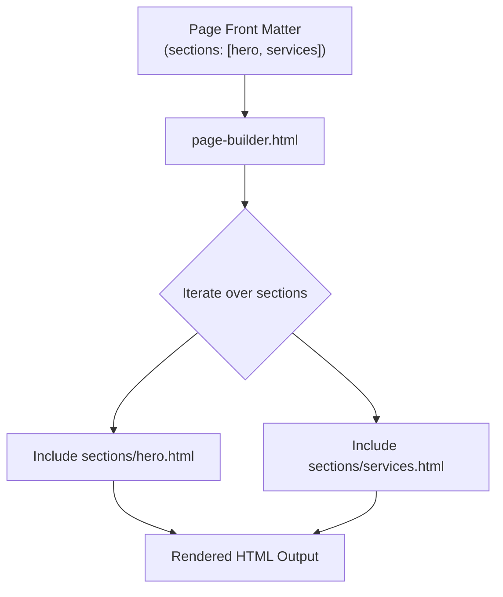
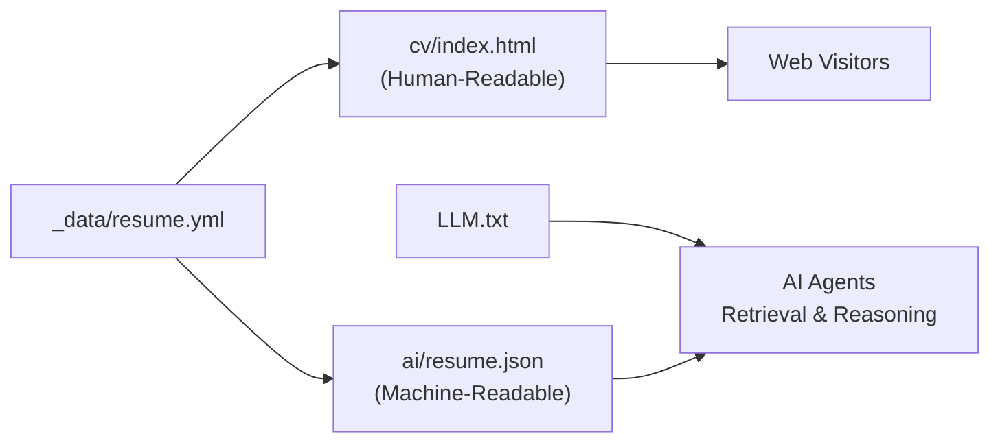

# Core Features

<cite>
**Referenced Files in This Document**   
- [index.md](file://index.md)
- [connect.md](file://connect.md)
- [edu.md](file://edu.md)
- [cv/index.html](file://cv/index.html)
- [_includes/page-builder.html](file://_includes/page-builder.html)
- [_data/resume.yml](file://_data/resume.yml)
- [ai/resume.json](file://ai/resume.json)
- [_notes/ai_ml.md](file://_notes/ai_ml.md)
- [notes/index.md](file://notes/index.md)
- [_data/home.yml](file://_data/home.yml)
- [LLM.txt](file://LLM.txt)
- [_data/connect.yml](file://_data/connect.yml)
- [_data/principles.yml](file://_data/principles.yml)
- [ARCHITECTURE.md](file://ARCHITECTURE.md)
</cite>

## Table of Contents
1. [Introduction](#introduction)
2. [Homepage Presentation](#homepage-presentation)
3. [Resume/CV Display](#resumecv-display)
4. [Knowledge Base (Notes)](#knowledge-base-notes)
5. [Educational Roadmap (Edu)](#educational-roadmap-edu)
6. [Connection Pathways (Connect)](#connection-pathways-connect)
7. [Composition Model and Page Assembly](#composition-model-and-page-assembly)
8. [Feature Parity: Human-Readable and Machine-Readable Content](#feature-parity-human-readable-and-machine-readable-content)
9. [Navigation and Information Architecture](#navigation-and-information-architecture)
10. [Unique Differentiators](#unique-differentiators)

## Introduction
The cv-ai project is a Jekyll-based personal site designed to serve dual audiences: human visitors and AI agents. It presents a professional profile with clarity and depth while simultaneously providing structured, machine-readable data for integration with AI systems. The core features—homepage, resume, knowledge base, educational roadmap, and connection pathways—are built around a composable architecture that emphasizes clean core principles, observability, and extensibility. Each feature supports specific user personas, from hiring managers and collaborators to AI copilots and knowledge retrieval systems, enabling both narrative engagement and data-driven interaction.

## Homepage Presentation
The homepage (`index.md`) serves as the primary entry point, delivering a concise professional narrative with strategic emphasis on SAP transformation, integration architecture, and automation for lower total cost of ownership (TCO). It is structured into modular sections—hero, services, credentials, and LLM profiles—each dynamically assembled via the page-builder system. The hero section, powered by `_data/home.yml`, introduces the value proposition with a focus on resolving common SAP programme challenges such as delayed cash flow and recurring incidents. The services section highlights five key capability areas: AMS Support, Composable ERP, SAP + AI/ML, Tools & Mini Apps, and Process Audit, each linking to detailed field notes. This design supports personas seeking strategic consulting or technical leadership by clearly articulating problem-solving domains and thought leadership.

**Section sources**
- [index.md](file://index.md#L1-L14)
- [_data/home.yml](file://_data/home.yml#L1-L55)

## Resume/CV Display
The resume feature (`cv/index.html`) provides a comprehensive, AI-ready curriculum vitae that details professional experience, skills, certifications, projects, and education. It leverages `_data/resume.yml` as the single source of truth, ensuring consistency across human-readable HTML and machine-readable exports. The page is structured into logical sections—Executive Summary, Experience, Education, Core Skills, Certifications, Selected Projects, and Languages—using semantic HTML and structured data (JSON-LD) for SEO and AI indexing. Users can download the resume in both YAML and JSON formats, enabling seamless integration with applicant tracking systems and AI agents. This feature serves job seekers, recruiters, and automated talent platforms by offering a rich, structured profile that balances narrative depth with machine processability.

**Section sources**
- [cv/index.html](file://cv/index.html#L1-L257)
- [_data/resume.yml](file://_data/resume.yml#L1-L440)

## Knowledge Base (Notes)
The knowledge base, accessible via `/notes/`, functions as a field journal of architectural playbooks, transformation insights, and operational diaries. Each note, stored in `_notes/*.md`, represents a focused exploration of topics such as AI & ML in SAP, AMS strategies, composable ERP, and process audits. The `notes/index.md` page aggregates these entries into a grid layout, sorted by date, with metadata including publication date and tags. Notes like `ai_ml.md` demonstrate deep technical reasoning, contrasting deterministic ERP systems with probabilistic AI/ML edge services and advocating for event-driven integration and clean core governance. This feature supports personas such as SAP architects, integration specialists, and AI developers by providing reusable patterns and decision frameworks grounded in real-world experience.

**Section sources**
- [notes/index.md](file://notes/index.md#L1-L41)
- [_notes/ai_ml.md](file://_notes/ai_ml.md#L1-L114)

## Educational Roadmap (Edu)
The educational roadmap (`edu.md`) outlines current learning initiatives and recently completed certifications, reflecting a commitment to continuous professional development. Powered by `_data/edu.yml` (implied by structure), the page is composed of four sections: hero, learning tracks, recent completions, and reading list. It highlights engagement with platforms like Coursera, OpenSAP, and LinkedIn Learning, covering subjects such as AI fluency, event-driven integration, and clean core governance. This feature serves personas interested in upskilling, mentorship, or collaboration on emerging technologies by showcasing a growth mindset and technical currency. The roadmap also signals alignment with modern SAP practices and AI-assisted development, reinforcing credibility in innovation and adaptability.

**Section sources**
- [edu.md](file://edu.md#L1-L13)

## Connection Pathways (Connect)
The connection pathways page (`connect.md`) facilitates professional collaboration by defining clear engagement models and partnership opportunities. It draws content from `_data/connect.yml` to present a structured offer: advisory services for SAP programmes, resolution of complex issues, and TCO reduction. The page identifies EPAM Systems as the primary delivery partner and references an independent network of specialists for surge capacity. A clear call-to-action invites stakeholders to schedule a working session, emphasizing preparation and decision-focused outcomes. This feature supports personas such as programme sponsors, IT directors, and business leaders seeking external expertise to unblock initiatives or enhance operational resilience. The design reflects a consultative, outcome-oriented approach to collaboration.

**Section sources**
- [connect.md](file://connect.md#L1-L13)
- [_data/connect.yml](file://_data/connect.yml#L1-L21)

## Composition Model and Page Assembly
The site employs a dynamic composition model where page sections are assembled at build time using `_includes/page-builder.html`. Each page defines a `sections` array in its front matter (e.g., `hero`, `services`, `credentials`), which the page builder iterates over to include corresponding partials from `_includes/sections/`. This modular approach enables consistent UI patterns, reuse of components, and flexible page configurations without code duplication. For example, the homepage includes `hero`, `services`, `credentials`, and `llm-profiles`, while the connect page uses `connect-hero`, `connect-engagements`, `connect-partners`, and `connect-cta`. This model supports rapid iteration and scalability, allowing new sections to be added or recombined across pages with minimal effort.

**Diagram sources**
- [_includes/page-builder.html](file://_includes/page-builder.html#L1-L39)
- [index.md](file://index.md#L6-L9)

**Section sources**
- [_includes/page-builder.html](file://_includes/page-builder.html#L1-L39)

## Feature Parity: Human-Readable and Machine-Readable Content
A defining characteristic of the cv-ai project is the maintenance of feature parity between human-readable web pages and machine-readable AI exports. Data stored in `_data/*.yml` files (e.g., `resume.yml`, `home.yml`) is used to generate both HTML views and structured JSON outputs in the `/ai` directory (e.g., `resume.json`). This dual-format delivery ensures that content remains accessible and usable across different contexts: web browsers for human consumption and API endpoints for AI agents. The `LLM.txt` manifest further enhances machine accessibility by providing a plain-text profile with retrieval hints, preferred endpoints, and a JSON-LD snippet. This parity supports use cases such as AI-powered resume parsing, automated knowledge retrieval, and agent-based collaboration, fulfilling the project’s goal of being “AI-ready” by design.

**Diagram sources**
- [_data/resume.yml](file://_data/resume.yml#L1-L440)
- [cv/index.html](file://cv/index.html#L1-L257)
- [ai/resume.json](file://ai/resume.json#L1-L6)
- [LLM.txt](file://LLM.txt#L1-L93)

**Section sources**
- [_data/resume.yml](file://_data/resume.yml#L1-L440)
- [ai/resume.json](file://ai/resume.json#L1-L6)
- [LLM.txt](file://LLM.txt#L1-L93)

## Navigation and Information Architecture
The site’s information architecture is designed for intuitive navigation and content discoverability. The primary navigation includes key sections: Home, CV, Notes, Edu, and Connect, each representing a distinct functional area. The homepage acts as a hub, linking to deeper content such as field notes and service playbooks. Within the knowledge base, notes are tagged and chronologically ordered, enabling exploration by topic or timeline. Structured data (JSON-LD) and SEO best practices ensure that content is indexable by search engines and AI crawlers. The `robots.txt` and `sitemap.xml` files further support machine navigation, while the `LLM.txt` manifest explicitly invites AI agents to access and use the content under defined terms. This architecture guides users from high-level overviews to detailed insights, supporting both casual browsing and targeted research.

**Section sources**
- [ARCHITECTURE.md](file://ARCHITECTURE.md#L1-L68)

## Unique Differentiators
The cv-ai project stands out through several unique differentiators. First, its **LLM integration** is not an afterthought but a core design principle, with dedicated machine-readable endpoints, a manifest file (`LLM.txt`), and guidance for AI agents on how to retrieve and use the content responsibly. Second, the **dual-format content delivery** ensures that every piece of information is available in both narrative and structured forms, enabling seamless interaction with both humans and machines. Third, the **composable ERP philosophy** reflected in the content—advocating for clean core S/4HANA with best-of-breed, open-contract edges—mirrors the site’s own architecture, where modular components are assembled declaratively. Finally, the emphasis on **observability, portability, and cost discipline** in consulting principles extends to the site’s technical implementation, making it a living example of the very practices it promotes.

**Section sources**
- [LLM.txt](file://LLM.txt#L1-L93)
- [_data/principles.yml](file://_data/principles.yml#L1-L80)
- [ARCHITECTURE.md](file://ARCHITECTURE.md#L1-L68)