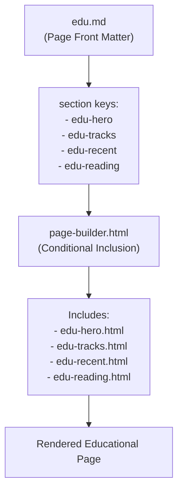

# Educational Roadmap

<cite>
**Referenced Files in This Document**   
- [edu.md](file://edu.md)
- [page-builder.html](file://_includes/page-builder.html)
- [recommendations.yml](file://_data/recommendations.yml)
- [edu-hero.html](file://_includes/sections/edu-hero.html)
- [edu-tracks.html](file://_includes/sections/edu-tracks.html)
- [edu-recent.html](file://_includes/sections/edu-recent.html)
- [edu-reading.html](file://_includes/sections/edu-reading.html)
</cite>

## Table of Contents
1. [Introduction](#introduction)
2. [Page Structure and Assembly](#page-structure-and-assembly)
3. [Data Model in recommendations.yml](#data-model-in-recommendationsyml)
4. [Educational Components Breakdown](#educational-components-breakdown)
5. [Demonstrating Professional Development](#demonstrating-professional-development)
6. [Updating the Educational Roadmap](#updating-the-educational-roadmap)
7. [Pedagogical Approach and Thought Leadership](#pedagogical-approach-and-thought-leadership)
8. [Conclusion](#conclusion)

## Introduction
The Educational Roadmap feature, accessible via the `edu.md` page, presents a dynamic and structured learning journey that reflects continuous professional growth. It showcases current learning tracks, recently completed certifications, and curated reading materials, all sourced from centralized data in `recommendations.yml`. This feature not only informs visitors about the consultant’s evolving expertise but also reinforces thought leadership by demonstrating intentional, domain-specific upskilling aligned with real-world consulting engagements.

**Section sources**
- [edu.md](file://edu.md#L1-L13)

## Page Structure and Assembly
The `edu.md` file defines the educational page layout using a Jekyll front matter block that specifies the title, description, permalink, and an ordered list of sections: `edu-hero`, `edu-tracks`, `edu-recent`, and `edu-reading`. These section keys are passed to the `page-builder.html` component, which dynamically includes the corresponding partial templates from the `_includes/sections/` directory.

The `page-builder.html` template iterates over the provided section keys and uses a case statement to render the appropriate HTML snippet for each. This modular approach enables flexible composition of the educational page without duplicating layout logic across multiple files.



**Diagram sources**
- [edu.md](file://edu.md#L1-L13)
- [page-builder.html](file://_includes/page-builder.html#L0-L39)

**Section sources**
- [edu.md](file://edu.md#L1-L13)
- [page-builder.html](file://_includes/page-builder.html#L0-L39)

## Data Model in recommendations.yml
While the educational content is rendered from `site.data.edu`, the `recommendations.yml` file contains a rich data model that categorizes learning resources and professional focus areas by domain. It structures the consultant’s expertise into engagement types such as "S/4HANA Clean-Core Transformation", "Order-to-Cash Run Stabilisation", and "Integration & API Architecture Refresh". Each engagement includes keywords, ideal company profiles, activities, and success indicators, which inform the selection of relevant learning tracks.

Although `recommendations.yml` does not directly supply data to the educational sections, it serves as the strategic foundation for curating learning content. The alignment between engagement domains and educational focus ensures that upskilling efforts are directly tied to professional service offerings and industry demands.

**Section sources**
- [recommendations.yml](file://_data/recommendations.yml#L0-L244)

## Educational Components Breakdown

### Current Learning Tracks
The `edu-tracks.html` template displays active learning areas using a grid of cards. Each track includes the domain (`area`), current `status` (e.g., "In progress"), a brief `focus` description, and a list of `resources`. This section visually communicates ongoing skill development in high-impact areas such as clean-core governance, observability, and AI enablement.

**Section sources**
- [edu-tracks.html](file://_includes/sections/edu-tracks.html#L0-L27)

### Recently Completed Certifications
The `edu-recent.html` template renders a timeline of recently completed certifications and workshops. Each item includes the `title`, `provider`, `finished` date, and optional `notes`. This section highlights recent achievements, reinforcing credibility and demonstrating a commitment to staying current with SAP and emerging technologies like AI and event-driven integration.

**Section sources**
- [edu-recent.html](file://_includes/sections/edu-recent.html#L0-L20)

### Curated Reading List
The `edu-reading.html` template presents a reference shelf of influential books and materials. Each entry includes the `title`, `author`, and an optional `note` explaining its relevance. This section reveals the intellectual foundations shaping the consultant’s point of view, bridging technical expertise with broader systems thinking and business strategy.

**Section sources**
- [edu-reading.html](file://_includes/sections/edu-reading.html#L0-L18)

### Hero Section
The `edu-hero.html` template provides the introductory header for the page, including an optional `eyebrow`, `title`, and `intro` text. This sets the tone for the educational journey and frames the purpose of the roadmap as a transparent record of professional growth.

**Section sources**
- [edu-hero.html](file://_includes/sections/edu-hero.html#L0-L10)

## Demonstrating Professional Development
The Educational Roadmap feature transforms static resume data into a living narrative of expertise evolution. By showcasing current learning tracks, it signals active engagement with emerging trends such as AI copilots, clean-core governance, and event-driven integration. The inclusion of recent certifications from SAP, Anthropic, and LinkedIn validates technical proficiency, while the reading list reveals depth in systems thinking and process design.

This transparency builds trust with potential clients and collaborators by demonstrating that expertise is not fixed but continuously refined. It positions the consultant not just as a practitioner, but as a lifelong learner who anticipates industry shifts and adapts proactively.

## Updating the Educational Roadmap
To add a new learning track, a new entry should be added under the `tracks` collection in the `edu` data file (e.g., `_data/edu.yml`), specifying the `area`, `status`, `focus`, and `resources`. For example:

```yaml
tracks:
  - area: "Event-Driven Integration"
    status: "In progress"
    focus: "Mastering SAP Integration Suite and Event Mesh for scalable, decoupled systems."
    resources:
      - "SAP Integration Suite Learning Hub"
      - "AsyncAPI Specification v2.6"
      - "Kafka: The Definitive Guide"
```

To update a completed certification, a new item should be added to the `recent` collection with the `title`, `provider`, and `finished` date. Similarly, new books can be added to the `reading` collection with `title`, `author`, and `note`.

These updates are automatically reflected on the `edu.md` page due to the dynamic rendering pipeline, ensuring the roadmap remains current with minimal maintenance overhead.

**Section sources**
- [edu-tracks.html](file://_includes/sections/edu-tracks.html#L0-L27)
- [edu-recent.html](file://_includes/sections/edu-recent.html#L0-L20)
- [edu-reading.html](file://_includes/sections/edu-reading.html#L0-L18)

## Pedagogical Approach and Thought Leadership
The curation of learning resources follows a deliberate pedagogical strategy focused on practical applicability and strategic relevance. Resources are selected not for breadth, but for their ability to solve real-world problems in SAP transformation, integration, and operational excellence. For instance, certifications in "Managing Clean Core for SAP S/4HANA" directly support advisory work on composable ERP strategies.

By aligning learning with engagement domains defined in `recommendations.yml`, the roadmap reinforces thought leadership. It shows that expertise is not acquired in isolation but is purposefully developed to address specific client challenges—such as reducing MTTR in AMS, improving audit readiness, or modernizing integration landscapes. This coherence between learning, service offerings, and outcomes positions the consultant as a strategic partner rather than a technical vendor.

**Section sources**
- [recommendations.yml](file://_data/recommendations.yml#L0-L244)
- [edu-tracks.html](file://_includes/sections/edu-tracks.html#L0-L27)

## Conclusion
The Educational Roadmap feature is a powerful demonstration of continuous professional development, combining modular page architecture with a strategically curated data model. Through the `page-builder.html` component and dedicated section templates, it delivers a cohesive narrative of learning that aligns with real-world consulting expertise. By transparently sharing current studies, recent achievements, and influential readings, the feature enhances credibility, supports thought leadership, and invites collaboration based on shared growth and innovation.