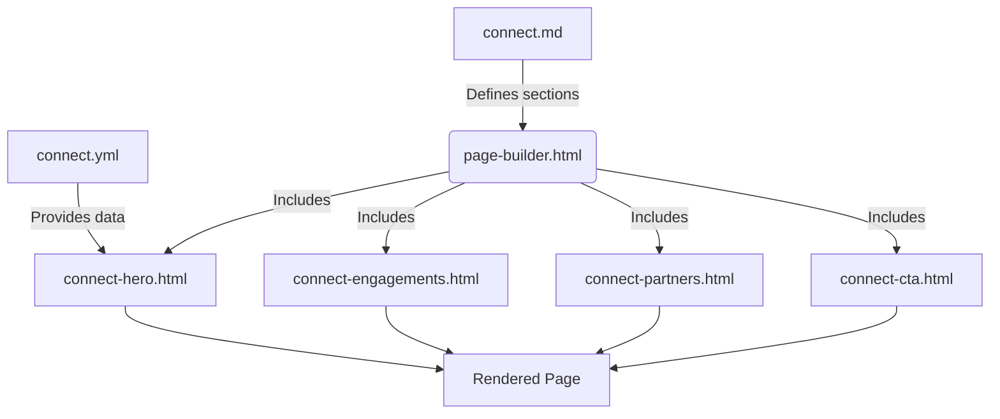
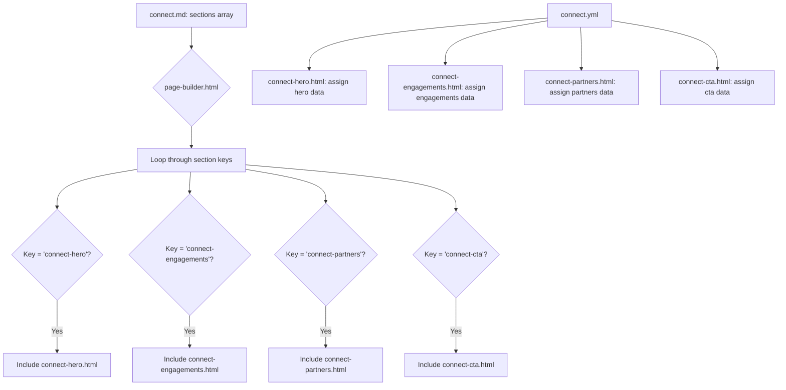

# Engagement Framework

<cite>
**Referenced Files in This Document**   
- [connect.md](file://connect.md)
- [connect.yml](file://_data/connect.yml)
- [connect-hero.html](file://_includes/sections/connect-hero.html)
- [connect-engagements.html](file://_includes/sections/connect-engagements.html)
- [connect-partners.html](file://_includes/sections/connect-partners.html)
- [connect-cta.html](file://_includes/sections/connect-cta.html)
- [page-builder.html](file://_includes/page-builder.html)
</cite>

## Table of Contents
1. [Introduction](#introduction)
2. [Framework Architecture](#framework-architecture)
3. [Core Components](#core-components)
4. [Section Configuration and Data Flow](#section-configuration-and-data-flow)
5. [Strategic Purpose of Each Section](#strategic-purpose-of-each-section)
6. [Customization and Extensibility](#customization-and-extensibility)
7. [Relationship Nurturing and Professional Boundaries](#relationship-nurturing-and-professional-boundaries)
8. [Alignment with Personal Branding Strategy](#alignment-with-personal-branding-strategy)
9. [Conclusion](#conclusion)

## Introduction
The Engagement Framework is a structured system designed to facilitate professional connections through clearly defined pathways, ecosystem visibility, and actionable prompts. Built on Jekyll's templating engine, it leverages data-driven configuration and modular section templates to present a cohesive and strategic interface for collaboration. This framework lowers the barrier for potential clients or partners to initiate contact by providing context, options, and trust signals in a streamlined format.

## Framework Architecture
The Engagement Framework operates through a decoupled architecture where content configuration is separated from presentation logic. The `connect.md` file serves as the page entry point, defining the layout and specifying which sections to include. These sections are rendered via the `page-builder.html` template, which dynamically includes partials based on the declared section keys. Content for each section is sourced from `connect.yml`, enabling centralized management of messaging, calls-to-action, and partner information.

**Diagram sources**
- [connect.md](file://connect.md#L1-L13)
- [_data/connect.yml](file://_data/connect.yml#L1-L21)
- [_includes/page-builder.html](file://_includes/page-builder.html#L1-L40)
- [_includes/sections/connect-hero.html](file://_includes/sections/connect-hero.html#L1-L11)
- [_includes/sections/connect-engagements.html](file://_includes/sections/connect-engagements.html#L1-L26)
- [_includes/sections/connect-partners.html](file://_includes/sections/connect-partners.html#L1-L20)
- [_includes/sections/connect-cta.html](file://_includes/sections/connect-cta.html#L1-L13)

**Section sources**
- [connect.md](file://connect.md#L1-L13)
- [_includes/page-builder.html](file://_includes/page-builder.html#L1-L40)

## Core Components

The Engagement Framework consists of four primary components: hero, engagements, partners, and CTA. Each component is implemented as a reusable section template located in `_includes/sections/`, allowing for consistent styling and modular composition. The `connect.yml` file acts as the single source of truth for all content, enabling non-technical updates without modifying HTML templates.

**Section sources**
- [_data/connect.yml](file://_data/connect.yml#L1-L21)
- [_includes/sections/connect-hero.html](file://_includes/sections/connect-hero.html#L1-L11)
- [_includes/sections/connect-engagements.html](file://_includes/sections/connect-engagements.html#L1-L26)
- [_includes/sections/connect-partners.html](file://_includes/sections/connect-partners.html#L1-L20)
- [_includes/sections/connect-cta.html](file://_includes/sections/connect-cta.html#L1-L13)

## Section Configuration and Data Flow

Each section in the Engagement Framework follows a consistent pattern: data is assigned from `site.data.connect` and conditionally rendered if present. The `page-builder.html` template orchestrates the inclusion of section partials based on the `sections` array in `connect.md`. This design enables flexible composition while maintaining a clean separation between content and structure.

**Diagram sources**
- [connect.md](file://connect.md#L1-L13)
- [_data/connect.yml](file://_data/connect.yml#L1-L21)
- [_includes/page-builder.html](file://_includes/page-builder.html#L1-L40)
- [_includes/sections/connect-hero.html](file://_includes/sections/connect-hero.html#L1-L11)
- [_includes/sections/connect-engagements.html](file://_includes/sections/connect-engagements.html#L1-L26)
- [_includes/sections/connect-partners.html](file://_includes/sections/connect-partners.html#L1-L20)
- [_includes/sections/connect-cta.html](file://_includes/sections/connect-cta.html#L1-L13)

**Section sources**
- [connect.md](file://connect.md#L1-L13)
- [_data/connect.yml](file://_data/connect.yml#L1-L21)
- [_includes/page-builder.html](file://_includes/page-builder.html#L1-L40)

## Strategic Purpose of Each Section

### Hero Section
The hero section establishes context by presenting a clear value proposition. It uses an eyebrow title, main headline, and supporting copy to communicate the professional focus and outcomes. This section sets the tone for collaboration and aligns visitor expectations.

**Section sources**
- [_data/connect.yml](file://_data/connect.yml#L1-L6)
- [_includes/sections/connect-hero.html](file://_includes/sections/connect-hero.html#L1-L11)

### Engagements Section
The engagements section defines collaboration models by presenting structured pathways for engagement. Although the data is not present in the current `connect.yml`, the template supports multiple engagement types with labels, descriptions, response times, and contact channels. This allows visitors to choose the mode that best fits their needs and urgency.

**Section sources**
- [_includes/sections/connect-engagements.html](file://_includes/sections/connect-engagements.html#L1-L26)

### Partners Section
The partners section showcases alliances through a trusted ecosystem display. It highlights primary delivery partners and specialist networks, establishing credibility and capacity. Each partner entry includes name, role type, value note, and external link, enabling visitors to assess the breadth of available expertise.

**Section sources**
- [_data/connect.yml](file://_data/connect.yml#L8-L17)
- [_includes/sections/connect-partners.html](file://_includes/sections/connect-partners.html#L1-L20)

### CTA Section
The CTA section drives action by offering a clear next step. It presents a working session invitation with a benefit-focused title and copy that emphasizes preparation and decision-making efficiency. The call-to-action button links directly to a LinkedIn profile, reducing friction in the connection process.

**Section sources**
- [_data/connect.yml](file://_data/connect.yml#L19-L21)
- [_includes/sections/connect-cta.html](file://_includes/sections/connect-cta.html#L1-L13)

## Customization and Extensibility

The Engagement Framework supports customization through YAML configuration and template modification. Engagement types can be added or modified by defining new entries in a `engagements` array within `connect.yml`, even if currently absent. Partner listings can be updated by editing the `partners` array with new organizations, roles, and notes. The modular template structure allows for the addition of new section types by creating corresponding HTML partials in `_includes/sections/` and referencing them in `connect.md`.

**Section sources**
- [_data/connect.yml](file://_data/connect.yml#L1-L21)
- [_includes/sections/connect-engagements.html](file://_includes/sections/connect-engagements.html#L1-L26)
- [_includes/sections/connect-partners.html](file://_includes/sections/connect-partners.html#L1-L20)

## Relationship Nurturing and Professional Boundaries

The framework nurtures relationships by providing structured engagement options that set clear expectations. By defining collaboration models and response times (via the engagements section), it manages visitor anticipation while maintaining professional boundaries. The use of LinkedIn as the primary contact channel ensures interactions occur on a professional platform, preserving personal privacy. The pre-session preparation model further establishes a productive, boundary-respecting interaction framework.

**Section sources**
- [_includes/sections/connect-engagements.html](file://_includes/sections/connect-engagements.html#L1-L26)
- [_data/connect.yml](file://_data/connect.yml#L19-L21)

## Alignment with Personal Branding Strategy

The Engagement Framework aligns with a personal branding strategy focused on expertise, trust, and value delivery. The content emphasizes SAP operational improvement, measurable outcomes, and advisory rigor, reinforcing professional positioning. The ecosystem showcase demonstrates network strength without diluting individual brand identity. The structured pathways reflect a methodical, client-centric approach that supports long-term relationship building within defined professional parameters.

**Section sources**
- [_data/connect.yml](file://_data/connect.yml#L1-L21)
- [_includes/sections/connect-hero.html](file://_includes/sections/connect-hero.html#L1-L11)

## Conclusion
The Engagement Framework provides a comprehensive system for facilitating professional connections through structured content, clear pathways, and strategic messaging. By decoupling data from presentation and leveraging modular templates, it offers both flexibility and consistency. This approach lowers the barrier for collaboration while maintaining professional standards and supporting a cohesive personal brand.