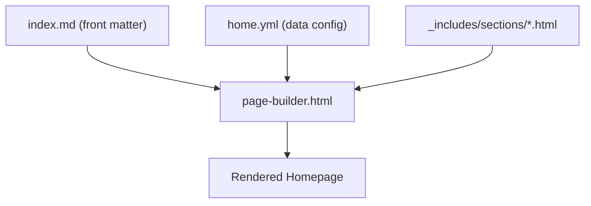

# Homepage Composition

<cite>
**Referenced Files in This Document**   
- [index.md](file://index.md)
- [page-builder.html](file://_includes/page-builder.html)
- [home.yml](file://_data/home.yml)
- [hero.html](file://_includes/sections/hero.html)
- [services.html](file://_includes/sections/services.html)
- [credentials.html](file://_includes/sections/credentials.html)
- [llm-profiles.html](file://_includes/sections/llm-profiles.html)
- [method.html](file://_includes/sections/method.html)
- [signals.html](file://_includes/sections/signals.html)
- [final-cta.html](file://_includes/sections/final-cta.html)
</cite>

## Table of Contents
1. [Introduction](#introduction)
2. [Core Composition Mechanism](#core-composition-mechanism)
3. [Section Configuration via home.yml](#section-configuration-via-homeyml)
4. [Section Templates in _includes/sections/](#section-templates-in-_includessections)
5. [Purpose and Content of Each Section](#purpose-and-content-of-each-section)
6. [Customization Patterns](#customization-patterns)
7. [Integration with Navigation Architecture](#integration-with-navigation-architecture)
8. [Conclusion](#conclusion)

## Introduction
The homepage of the cv-ai project is dynamically assembled using a component-based architecture that separates content configuration from presentation logic. This design enables flexible layout control while maintaining visual consistency across sections. The composition is driven by three core elements: the `index.md` front matter, the `_data/home.yml` configuration file, and reusable Liquid templates located in `_includes/sections/`. This document explains how these components interact to render the homepage and how users can customize the layout through declarative configuration.

## Core Composition Mechanism

The homepage rendering process begins in `index.md`, which specifies the layout and the ordered list of sections to include. The actual assembly is delegated to the `page-builder.html` component, which iterates over the section keys and conditionally includes the corresponding partial templates.



**Diagram sources**
- [index.md](file://index.md#L1-L14)
- [page-builder.html](file://_includes/page-builder.html#L1-L40)

**Section sources**
- [index.md](file://index.md#L1-L14)
- [page-builder.html](file://_includes/page-builder.html#L1-L40)

## Section Configuration via home.yml

The `_data/home.yml` file serves as the central content repository for the homepage. It defines structured data for each section, including text content, metadata, and links. The `page-builder.html` component uses the `site.data.home` object to populate section templates. This separation allows content updates without modifying HTML templates.

For example, the `hero` section in `home.yml` contains fields such as `title`, `subtitle`, `lead`, and `profile`, which are directly referenced in the `hero.html` template using `site.data.home.hero`. This pattern is consistent across all sections, enabling a uniform data access strategy.

**Section sources**
- [home.yml](file://_data/home.yml#L1-L55)

## Section Templates in _includes/sections/

Each section on the homepage is rendered using a dedicated Liquid template in the `_includes/sections/` directory. These templates follow a consistent structure: they first assign the relevant data object (e.g., ``), then conditionally render markup if the data exists.

The templates use semantic HTML with standardized CSS classes (e.g., `section`, `neub-card`, `section-heading`) to ensure design consistency. They also support optional elements—such as action buttons or statistics—that only appear when corresponding data fields are present in `home.yml`.

```mermaid
classDiagram
class SectionTemplate {
+assign data from home.yml
+conditional rendering
+consistent class usage
+optional component support
}
SectionTemplate <|-- HeroTemplate : "extends"
SectionTemplate <|-- ServicesTemplate : "extends"
SectionTemplate <|-- LLMProfilesTemplate : "extends"
HeroTemplate --> "hero.html"
ServicesTemplate --> "services.html"
LLMProfilesTemplate --> "llm-profiles.html"
```

**Diagram sources**
- [hero.html](file://_includes/sections/hero.html#L1-L54)
- [services.html](file://_includes/sections/services.html#L1-L40)
- [llm-profiles.html](file://_includes/sections/llm-profiles.html#L1-L11)

**Section sources**
- [hero.html](file://_includes/sections/hero.html#L1-L54)
- [services.html](file://_includes/sections/services.html#L1-L40)
- [credentials.html](file://_includes/sections/credentials.html#L1-L25)
- [llm-profiles.html](file://_includes/sections/llm-profiles.html#L1-L11)
- [method.html](file://_includes/sections/method.html#L1-L19)
- [signals.html](file://_includes/sections/signals.html#L1-L34)
- [final-cta.html](file://_includes/sections/final-cta.html#L1-L20)

## Purpose and Content of Each Section

The homepage is composed of several reusable sections, each serving a distinct purpose:

### Hero
The `hero` section introduces the individual with a profile image, title, and value proposition. It includes a compelling lead paragraph that frames the professional narrative and highlights key differentiators.

### Services
The `services` section presents a grid of service offerings, each with a title, subtitle, and call-to-action link. This section functions as a navigation hub to detailed capability pages.

### Credentials
The `credentials` section displays qualifications, certifications, and educational background in a structured grid format, establishing professional credibility.

### LLM Profiles
The `llm-profiles` section provides machine-readable versions of the resume and persona, enabling AI agents and LLMs to access structured data. It includes links to JSON, YAML, and plain text formats.

### Methodology
The `method` section (controlled by `method` key) outlines core principles and working methodologies through a grid of pillars, each with a title and descriptive copy.

### Signals
The `signals` section (rendered as `contact`) combines social links with contextual callouts, guiding visitors toward engagement while reinforcing professional signals.

### Final CTA
The `final-cta` section appears at the end of the page, offering a prominent action (e.g., scheduling a call) to convert visitor interest into engagement.

**Section sources**
- [home.yml](file://_data/home.yml#L1-L55)
- [hero.html](file://_includes/sections/hero.html#L1-L54)
- [services.html](file://_includes/sections/services.html#L1-L40)
- [credentials.html](file://_includes/sections/credentials.html#L1-L25)
- [llm-profiles.html](file://_includes/sections/llm-profiles.html#L1-L11)
- [method.html](file://_includes/sections/method.html#L1-L19)
- [signals.html](file://_includes/sections/signals.html#L1-L34)
- [final-cta.html](file://_includes/sections/final-cta.html#L1-L20)

## Customization Patterns

The component-based design supports several common customization patterns:

### Reordering Sections
To change the layout order, modify the `sections` array in `index.md`. For example, moving `llm-profiles` before `services` will render the LLM section first.

### Disabling Sections
To hide a section, simply remove its key from the `sections` list in `index.md`. The `page-builder.html` component will skip rendering it.

### Adding New Sections
New sections can be added by:
1. Defining data in `home.yml` under a new key
2. Creating a corresponding template in `_includes/sections/`
3. Adding the key to the `sections` array in `index.md`

The `page-builder.html` uses a case statement to map section keys to templates, making it easy to extend with new components.

**Section sources**
- [index.md](file://index.md#L1-L14)
- [page-builder.html](file://_includes/page-builder.html#L1-L40)
- [home.yml](file://_data/home.yml#L1-L55)

## Integration with Navigation Architecture

The homepage composition integrates seamlessly with the site's navigation. Section IDs (e.g., `#hero`, `#services`) enable deep linking and anchor navigation. The `page-builder.html` component ensures that only sections defined in the front matter are rendered, allowing different pages to reuse the same templates with unique configurations.

Additionally, the `layout: default` in `index.md` ensures consistent header and footer inclusion, maintaining global navigation elements across the site. This modular approach allows the homepage to evolve independently while remaining aligned with the overall information architecture.

**Section sources**
- [index.md](file://index.md#L1-L14)
- [_layouts/default.html](file://_layouts/default.html)

## Conclusion
The homepage composition system in the cv-ai project exemplifies a clean separation of concerns between content, structure, and presentation. By leveraging Jekyll's data files, includes, and front matter, it enables flexible, maintainable, and scalable page assembly. This approach allows for rapid iteration on layout and content without requiring code changes, making it ideal for personal branding sites that need to adapt to evolving professional narratives.