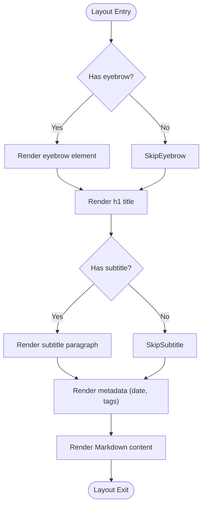

# Knowledge Base (Notes)

<cite>
**Referenced Files in This Document**   
- [_notes/ai_ml.md](file://_notes/ai_ml.md)
- [_notes/ams.md](file://_notes/ams.md)
- [_notes/composable_erp.md](file://_notes/composable_erp.md)
- [_notes/consulting_principles.md](file://_notes/consulting_principles.md)
- [_notes/process_audit.md](file://_notes/process_audit.md)
- [_notes/system-architecture.md](file://_notes/system-architecture.md)
- [_notes/tools_mini_apps.md](file://_notes/tools_mini_apps.md)
- [_layouts/note.html](file://_layouts/note.html)
- [notes/index.md](file://notes/index.md)
- [_config.yml](file://_config.yml)
</cite>

## Table of Contents
1. [Introduction](#introduction)
2. [Project Structure](#project-structure)
3. [Core Components](#core-components)
4. [Architecture Overview](#architecture-overview)
5. [Detailed Component Analysis](#detailed-component-analysis)
6. [Dependency Analysis](#dependency-analysis)
7. [Performance Considerations](#performance-considerations)
8. [Troubleshooting Guide](#troubleshooting-guide)
9. [Conclusion](#conclusion)

## Introduction
The Knowledge Base (Notes) feature serves as a personal knowledge management system designed to organize, standardize, and share expertise across key domains including AI/ML, Application Management Support (AMS), composable ERP, consulting principles, process audit, system architecture, and tools. Built on Jekyll’s collections framework, this system leverages Markdown files stored in the `_notes` directory to create a structured, navigable, and SEO-friendly repository of insights. Each note is rendered using the `note.html` layout template, ensuring consistent presentation across all articles. Front matter metadata controls content rendering, enabling rich categorization, tagging, and chronological organization. This documentation explains how the system supports incremental knowledge sharing, establishes subject matter expertise, and enhances content discoverability through clean architecture and machine-readable exports.

## Project Structure
The project structure is organized to support modular content creation and reuse. The `_notes` directory contains individual Markdown files for each knowledge domain, while the `notes/index.md` file serves as the landing page that dynamically lists all notes. The `_layouts/note.html` template standardizes the presentation of each article, and the `_config.yml` file configures Jekyll to treat the `notes` collection as a first-class content type with permalink routing and default layout assignment.

**Diagram sources**
- [_config.yml](file://_config.yml#L1-L50)
- [_layouts/note.html](file://_layouts/note.html#L1-L47)
- [notes/index.md](file://notes/index.md#L1-L42)

**Section sources**
- [_config.yml](file://_config.yml#L1-L50)
- [notes/index.md](file://notes/index.md#L1-L42)

## Core Components
The core components of the Knowledge Base include the `_notes` collection, the `note.html` layout, and the `notes/index.md` landing page. These components work together to enable structured content creation, consistent rendering, and dynamic navigation. The `_notes` collection is configured in `_config.yml` to output static HTML pages with SEO-friendly URLs. Each note uses front matter metadata such as `title`, `subtitle`, `tags`, `excerpt`, and `date` to control how content is displayed and indexed. The `note.html` layout processes this metadata and renders a standardized article structure, while `notes/index.md` uses Liquid templating to sort and display all notes in reverse chronological order.

**Section sources**
- [_notes/ai_ml.md](file://_notes/ai_ml.md#L1-L115)
- [_notes/ams.md](file://_notes/ams.md#L1-L59)
- [_notes/composable_erp.md](file://_notes/composable_erp.md#L1-L137)
- [_layouts/note.html](file://_layouts/note.html#L1-L47)
- [notes/index.md](file://notes/index.md#L1-L42)

## Architecture Overview
The Knowledge Base follows a content-first architecture where Markdown files serve as the source of truth. Jekyll processes these files into static HTML pages using layouts and configuration settings. The `_config.yml` file defines the `notes` collection with output enabled and sets the default layout to `note.html`. This ensures that every Markdown file in `_notes` is automatically rendered with a consistent structure. The `notes/index.md` page queries the `site.notes` collection and displays a grid of article cards, each linking to the full note. This architecture supports incremental knowledge sharing by allowing new notes to be added without modifying existing templates or configuration.

**Diagram sources**
- [_config.yml](file://_config.yml#L1-L50)
- [_layouts/note.html](file://_layouts/note.html#L1-L47)
- [notes/index.md](file://notes/index.md#L1-L42)

## Detailed Component Analysis

### Note Content Structure
Each note in the `_notes` directory is a Markdown file with YAML front matter that defines metadata such as title, subtitle, tags, excerpt, and publication date. This metadata is used by the `note.html` layout to render structured headers, tags, and publication information. The body content is written in Markdown and supports rich formatting, code blocks, and embedded diagrams. Tags are used for categorization and can be displayed as a list in the rendered article.

**Section sources**
- [_notes/ai_ml.md](file://_notes/ai_ml.md#L1-L115)
- [_notes/ams.md](file://_notes/ams.md#L1-L59)

#### Front Matter and Rendering

**Diagram sources**
- [_notes/ai_ml.md](file://_notes/ai_ml.md#L1-L115)
- [_layouts/note.html](file://_layouts/note.html#L1-L47)

### Layout Template Standardization
The `note.html` layout ensures a consistent presentation across all articles by defining a standardized structure for headers, metadata, and body content. It uses Liquid templating to conditionally render optional fields such as `eyebrow`, `subtitle`, `published`, `updated`, and `tags`. The layout also formats dates using Jekyll’s built-in filters and generates a clean, readable article layout with semantic HTML.

**Diagram sources**
- [_layouts/note.html](file://_layouts/note.html#L1-L47)

**Section sources**
- [_layouts/note.html](file://_layouts/note.html#L1-L47)

### Index Page and Navigation
The `notes/index.md` file serves as the central navigation point for the Knowledge Base. It uses Liquid templating to iterate over the `site.notes` collection, sort entries by date in reverse order, and generate a responsive grid of article cards. Each card displays the title, subtitle, publication date, tags, and excerpt, with a link to the full article. This dynamic listing ensures that new notes are automatically included without manual updates.

**Diagram sources**
- [notes/index.md](file://notes/index.md#L1-L42)

**Section sources**
- [notes/index.md](file://notes/index.md#L1-L42)

## Dependency Analysis
The Knowledge Base components are loosely coupled, with clear dependencies defined through Jekyll’s configuration and templating system. The `_config.yml` file defines the `notes` collection and sets default values, creating a dependency between configuration and content. The `note.html` layout depends on the front matter structure of each note, while the `notes/index.md` page depends on the `site.notes` collection being available. These dependencies are managed through Jekyll’s build process, ensuring that changes to configuration or layout are consistently applied across all notes.

**Diagram sources**
- [_config.yml](file://_config.yml#L1-L50)
- [_layouts/note.html](file://_layouts/note.html#L1-L47)
- [notes/index.md](file://notes/index.md#L1-L42)

**Section sources**
- [_config.yml](file://_config.yml#L1-L50)
- [_layouts/note.html](file://_layouts/note.html#L1-L47)
- [notes/index.md](file://notes/index.md#L1-L42)

## Performance Considerations
The static site architecture ensures fast load times and high performance. Since all pages are pre-rendered during the build process, there is no server-side processing required at runtime. The use of lightweight Markdown and minimal JavaScript keeps page sizes small and improves SEO. The responsive grid layout in `notes/index.md` ensures good usability across devices. Additionally, the site leverages Jekyll’s built-in SEO and sitemap plugins to enhance discoverability.

## Troubleshooting Guide
Common issues in the Knowledge Base typically relate to configuration, rendering, or content structure. Ensure that front matter is correctly formatted in YAML, with proper indentation and quoting. Verify that the `notes` collection is properly defined in `_config.yml` and that the default layout is set to `note`. If notes do not appear on the index page, check that the `site.notes` query is correctly implemented and that files are named with the `.md` extension. For rendering issues, inspect the `note.html` layout for missing Liquid conditions or incorrect variable references.

**Section sources**
- [_config.yml](file://_config.yml#L1-L50)
- [_layouts/note.html](file://_layouts/note.html#L1-L47)
- [notes/index.md](file://notes/index.md#L1-L42)

## Conclusion
The Knowledge Base (Notes) feature provides a robust, scalable, and maintainable system for personal knowledge management. By leveraging Jekyll’s collections, front matter metadata, and layout templates, it enables structured content creation, consistent presentation, and automatic navigation. The architecture supports incremental knowledge sharing, enhances SEO, and facilitates the establishment of subject matter expertise. New notes can be added with minimal effort, using consistent formatting and linking to related content through tags and metadata. This system exemplifies how static site generators can be used to build professional, content-rich knowledge repositories.