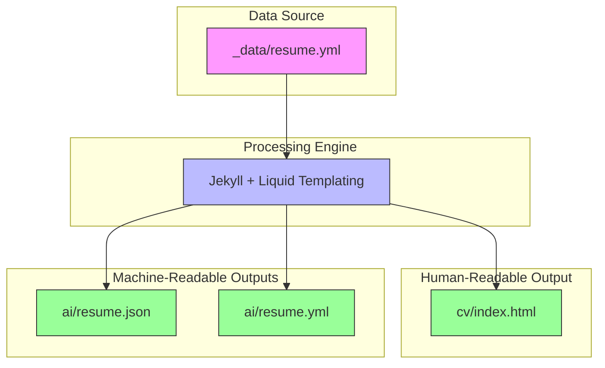
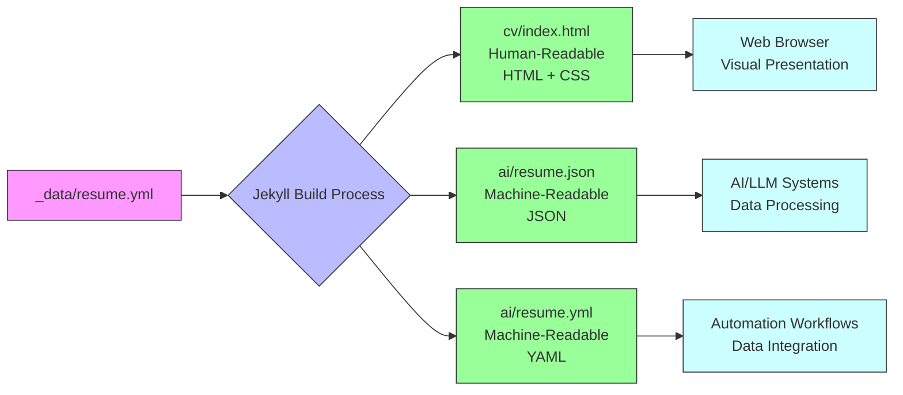
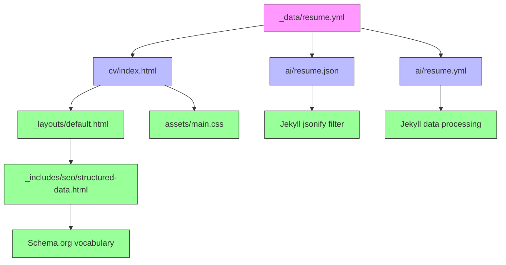

# Resume/CV System

<cite>
**Referenced Files in This Document**   
- [_data/resume.yml](file://_data/resume.yml)
- [cv/index.html](file://cv/index.html)
- [ai/resume.json](file://ai/resume.json)
- [ai/resume.yml](file://ai/resume.yml)
- [_includes/seo/structured-data.html](file://_includes/seo/structured-data.html)
- [_layouts/default.html](file://_layouts/default.html)
- [_config.yml](file://_config.yml)
- [ARCHITECTURE.md](file://ARCHITECTURE.md)
</cite>

## Table of Contents
1. [Introduction](#introduction)
2. [Project Structure](#project-structure)
3. [Core Components](#core-components)
4. [Architecture Overview](#architecture-overview)
5. [Detailed Component Analysis](#detailed-component-analysis)
6. [Dependency Analysis](#dependency-analysis)
7. [Performance Considerations](#performance-considerations)
8. [Troubleshooting Guide](#troubleshooting-guide)
9. [Conclusion](#conclusion)

## Introduction
This document details the Resume/CV system implementation for a professional profile that serves both human and AI consumers. The system leverages Jekyll's static site generation capabilities to create a dual-format delivery model where professional data is maintained in a single YAML source file and rendered into multiple output formats. The architecture supports human-readable HTML presentation through Liquid templating while simultaneously providing machine-readable JSON and YAML exports for AI/LLM systems. This approach ensures data consistency across formats and enables seamless integration with automation workflows, sourcing agents, and copilot systems.

## Project Structure
The Resume/CV system follows a Jekyll-based architecture with clear separation between data, templates, and output formats. The core data resides in the `_data/resume.yml` file, which contains comprehensive professional information including experience, education, skills, certifications, projects, and languages. This data is consumed by the `cv/index.html` template to generate the human-readable CV page. Machine-readable versions are provided in the `ai/` directory as both JSON (`resume.json`) and YAML (`resume.yml`) files. The system uses Jekyll's data processing pipeline to transform the YAML source into structured HTML output through Liquid templating, while also exposing the raw data in standardized formats for programmatic consumption.

**Section sources**
- [_data/resume.yml](file://_data/resume.yml)
- [cv/index.html](file://cv/index.html)
- [ai/resume.json](file://ai/resume.json)
- [ai/resume.yml](file://ai/resume.yml)

## Core Components
The Resume/CV system consists of three primary components: the data source (`_data/resume.yml`), the human-readable presentation layer (`cv/index.html`), and the machine-readable export layer (`ai/resume.json` and `ai/resume.yml`). The data schema includes structured sections for experience timeline, education, skills, certifications, projects, and languages, with each section containing specific fields relevant to professional profiling. The system implements a single-source-of-truth model where updates to the YAML data file automatically propagate to all output formats, ensuring consistency across human and machine interfaces.

**Section sources**
- [_data/resume.yml](file://_data/resume.yml#L1-L440)
- [cv/index.html](file://cv/index.html#L7-L257)
- [ai/resume.json](file://ai/resume.json#L1-L5)

## Architecture Overview
The Resume/CV system employs a Jekyll-based static site architecture that transforms structured YAML data into multiple output formats through a unified processing pipeline. The architecture follows a content-first approach where professional data is defined in a single YAML source file and then rendered into different representations based on consumer needs. Human readers access the information through a styled HTML page generated by Liquid templates, while AI systems consume the same data through standardized JSON and YAML endpoints. This dual-format delivery model enables both readability and machine processing from a single data source.



**Diagram sources**
- [_data/resume.yml](file://_data/resume.yml)
- [cv/index.html](file://cv/index.html)
- [ai/resume.json](file://ai/resume.json)
- [ai/resume.yml](file://ai/resume.yml)

## Detailed Component Analysis

### Data Schema Structure
The resume data schema is organized into logical sections that capture comprehensive professional information. The experience section contains a timeline of roles with company, title, dates, and summary. Education includes academic institutions and programs. Skills are listed as an array of technical and professional competencies. Certifications include name, issuer, date, and verification URL. Projects capture significant work with titles, summaries, dates, and highlights. Languages specify proficiency levels. The schema also includes metadata for structured data (schema.org) integration, enabling rich search engine representation.

**Section sources**
- [_data/resume.yml](file://_data/resume.yml#L1-L440)

### Liquid Templating Transformation
The Liquid templating system transforms the YAML data into structured HTML output through a series of conditional statements and loops. The `cv/index.html` template assigns the resume data to a local variable and then iterates through each section, rendering appropriate HTML elements based on the data structure. For example, the experience section uses a for-loop to generate timeline entries, with date formatting logic that handles both year-only and full date specifications. Skills are rendered as a tag cloud, while certifications include direct links to credential verification. The template also implements data slicing to display primary skills while maintaining the complete list in machine-readable formats.

```mermaid
flowchart TD
Start([YAML Data Load]) --> Assign["Assign site.data.resume to local variable"]
Assign --> CheckSummary{"Has Summary?"}
CheckSummary --> |Yes| RenderSummary["Render Executive Summary Section"]
CheckSummary --> |No| SkipSummary
Assign --> CheckExperience{"Has Experience?"}
CheckExperience --> |Yes| LoopExperience["Loop through experience array"]
LoopExperience --> FormatDate["Format start/end dates"]
FormatDate --> RenderRole["Render role header and summary"]
LoopExperience --> EndExperience
Assign --> CheckEducation{"Has Education?"}
CheckEducation --> |Yes| LoopEducation["Loop through education array"]
LoopEducation --> RenderEducation["Render school and degree"]
LoopEducation --> EndEducation
Assign --> CheckSkills{"Has Skills?"}
CheckSkills --> |Yes| SliceSkills["Slice primary skills (0-24)"]
SliceSkills --> RenderSkills["Render as tag list"]
Assign --> CheckCertifications{"Has Certifications?"}
CheckCertifications --> |Yes| LoopCertifications["Loop through certifications"]
LoopCertifications --> RenderCert["Render name, issuer, date"]
LoopCertifications --> CheckURL{"Has URL?"}
CheckURL --> |Yes| RenderLink["Render credential link"]
CheckURL --> |No| Continue
Assign --> CheckProjects{"Has Projects?"}
CheckProjects --> |Yes| LoopProjects["Loop through projects"]
LoopProjects --> RenderProject["Render title, summary, dates"]
Assign --> CheckLanguages{"Has Languages?"}
CheckLanguages --> |Yes| RenderLanguages["Render as tag list"]
RenderSummary --> End
EndExperience --> End
EndEducation --> End
RenderSkills --> End
Continue --> End
LoopProjects --> End
RenderLanguages --> End
classDef section fill:#f9f,stroke:#333;
classDef process fill:#bbf,stroke:#333;
classDef decision fill:#ff9,stroke:#333;
classDef end fill:#9f9,stroke:#333;
class Start,End section
class Assign,FormatDate,RenderRole,RenderEducation,RenderSkills,RenderCert,RenderProject,RenderLanguages,RenderSummary process
class CheckSummary,CheckExperience,CheckEducation,CheckSkills,CheckCertifications,CheckProjects,CheckLanguages,CheckURL decision
```

**Diagram sources**
- [cv/index.html](file://cv/index.html#L7-L257)

### Dual-Format Delivery Model
The system implements a dual-format delivery model that serves both human and machine consumers from a single data source. The human-readable format (`cv/index.html`) presents information in a visually structured layout with appropriate typography, spacing, and styling for optimal readability. The machine-readable formats (`ai/resume.json` and `ai/resume.yml`) provide the same data in standardized, parseable formats that can be easily consumed by AI systems, sourcing agents, and automation workflows. The JSON endpoint uses Jekyll's jsonify filter to convert the YAML data structure, while the YAML export provides a direct mirror of the source data with additional metadata for AI consumption.



**Diagram sources**
- [_data/resume.yml](file://_data/resume.yml)
- [cv/index.html](file://cv/index.html)
- [ai/resume.json](file://ai/resume.json)
- [ai/resume.yml](file://ai/resume.yml)

## Dependency Analysis
The Resume/CV system has minimal external dependencies, relying primarily on Jekyll's built-in capabilities for static site generation and data processing. The system depends on Jekyll's data loading functionality to parse the YAML source file, Liquid templating for HTML generation, and the jsonify filter for JSON serialization. The architecture leverages Jekyll collections and includes for component reuse, with dependencies between the resume data file, the CV template, and the AI export files. The system also integrates with schema.org for structured data markup, enhancing search engine visibility and AI comprehension.



**Diagram sources**
- [_data/resume.yml](file://_data/resume.yml)
- [cv/index.html](file://cv/index.html)
- [ai/resume.json](file://ai/resume.json)
- [ai/resume.yml](file://ai/resume.yml)
- [_layouts/default.html](file://_layouts/default.html)
- [_includes/seo/structured-data.html](file://_includes/seo/structured-data.html)

## Performance Considerations
The Resume/CV system is optimized for performance through its static site architecture, which eliminates server-side processing at request time. All content transformation occurs during the build process, resulting in fast page loads and minimal server requirements. The system's lightweight nature ensures quick rendering across devices and network conditions. The separation of human and machine-readable formats allows consumers to request only the data format they need, reducing bandwidth usage. The implementation follows best practices for web performance, including minified CSS, efficient templating, and proper asset organization.

## Troubleshooting Guide
Common issues with the Resume/CV system typically relate to data formatting, template rendering, or build process errors. When updates to `_data/resume.yml` do not appear in the output, verify the YAML syntax is correct and the build process is running. If the JSON export appears malformed, check for special characters in the source data that may interfere with serialization. For display issues in the HTML output, inspect the Liquid template logic and CSS styling. Ensure that date formats in the experience and education sections follow the expected pattern (YYYY-MM or full date) for proper rendering. When adding new fields to the schema, verify they are properly referenced in both the template and any machine-readable exports.

**Section sources**
- [_data/resume.yml](file://_data/resume.yml)
- [cv/index.html](file://cv/index.html)
- [ai/resume.json](file://ai/resume.json)

## Conclusion
The Resume/CV system demonstrates an effective approach to professional profile management that bridges human and machine consumption needs. By maintaining a single source of truth in YAML format and leveraging Jekyll's processing capabilities, the system ensures data consistency while providing optimized outputs for different consumer types. The architecture supports easy maintenance and updates, as changes to the professional data automatically propagate to all formats. This dual-format delivery model is particularly valuable in the era of AI and automation, where structured data is increasingly important for talent discovery, skills matching, and professional networking. The implementation serves as a template for creating AI-ready professional profiles that maintain human readability while enabling machine processing.