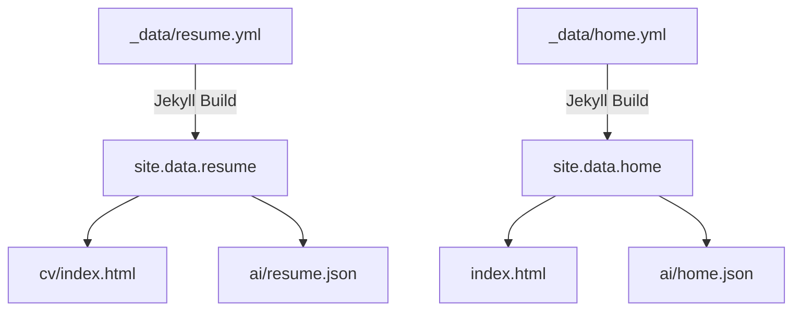
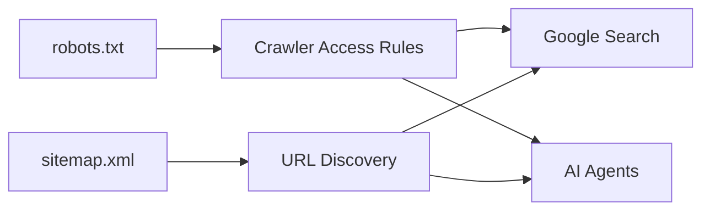
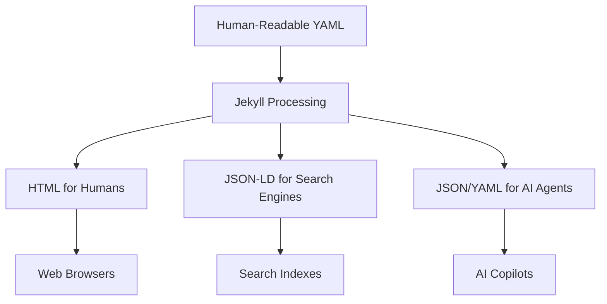

# Data Management

<cite>
**Referenced Files in This Document**   
- [_data/resume.yml](file://_data/resume.yml)
- [ai/resume.json](file://ai/resume.json)
- [ai/resume.yml](file://ai/resume.yml)
- [_config.yml](file://_config.yml)
- [sitemap.xml](file://sitemap.xml)
- [robots.txt](file://robots.txt)
- [_includes/seo/structured-data.html](file://_includes/seo/structured-data.html)
- [cv/index.html](file://cv/index.html)
- [ARCHITECTURE.md](file://ARCHITECTURE.md)
- [README.md](file://README.md)
</cite>

## Table of Contents
1. [Data Lifecycle Overview](#data-lifecycle-overview)
2. [Synchronization Between YAML and JSON](#synchronization-between-yaml-and-json)
3. [Search Engine Indexing and Crawl Control](#search-engine-indexing-and-crawl-control)
4. [Transformation to Machine-Consumable Formats](#transformation-to-machine-consumable-formats)
5. [Data Validation and Schema Consistency](#data-validation-and-schema-consistency)
6. [Versioning and Update Workflows](#versioning-and-update-workflows)
7. [Data Integrity and Backup Considerations](#data-integrity-and-backup-considerations)

## Data Lifecycle Overview

The cv-ai project implements a declarative data model where all structured content originates in YAML files located in the `_data` directory. These files serve as the single source of truth for key information such as resume details (`_data/resume.yml`), homepage content (`_data/home.yml`), and social profiles (`_data/social.yml`). During the Jekyll build process, these YAML sources are processed and transformed into multiple output formats including HTML, JSON, and structured data payloads.

The data lifecycle begins with human-readable YAML files that contain comprehensive personal and professional information. This data is then consumed by Jekyll templates (e.g., `_includes/page-builder.html`) to generate static HTML pages like `cv/index.html`. Simultaneously, the same source data is serialized into machine-readable formats such as JSON and exposed through endpoints in the `/ai` directory. This dual-output approach ensures consistency across representations while serving both human visitors and AI agents.

**Section sources**
- [_data/resume.yml](file://_data/resume.yml)
- [cv/index.html](file://cv/index.html)
- [ARCHITECTURE.md](file://ARCHITECTURE.md#L30-L45)

## Synchronization Between YAML and JSON

The synchronization mechanism between `_data/*.yml` and `/ai/*.json` endpoints is implemented through Jekyll's templating system. The file `ai/resume.json` contains a front matter configuration with `layout: null` and uses the `jsonify` filter to serialize the `site.data.resume` object directly from `_data/resume.yml`. This ensures that any updates to the source YAML file are automatically reflected in the JSON endpoint during the next build cycle.

Similarly, `ai/home.json` mirrors the data from `_data/home.yml` using the same pattern. This synchronization is unidirectional—from YAML source to JSON output—ensuring data consistency while preventing conflicts. The build process guarantees atomic updates, meaning both representations are updated simultaneously when the site is regenerated, eliminating race conditions or version mismatches.

**Diagram sources**
- [_data/resume.yml](file://_data/resume.yml)
- [ai/resume.json](file://ai/resume.json)
- [cv/index.html](file://cv/index.html)
- [ai/home.json](file://ai/home.json)

**Section sources**
- [ai/resume.json](file://ai/resume.json)
- [ai/home.json](file://ai/home.json)
- [ARCHITECTURE.md](file://ARCHITECTURE.md#L30-L45)

## Search Engine Indexing and Crawl Control

Search engine indexing is facilitated through two key files: `sitemap.xml` and `robots.txt`. The `sitemap.xml` file is dynamically generated during the build process and includes all pages with their last modification timestamps, change frequency, and priority values. It programmatically enumerates URLs from `site.pages`, collection documents, and blog posts, ensuring comprehensive coverage of the site's content for search engine crawlers.

The `robots.txt` file explicitly allows crawling by major search engines and AI agents including Googlebot, GPTBot, ClaudeBot, and PerplexityBot. It also specifies the location of the sitemap to assist crawlers in discovering content efficiently. This configuration ensures maximum visibility while maintaining control over which agents can access the site, supporting both traditional SEO and AI-driven content discovery.

**Diagram sources**
- [sitemap.xml](file://sitemap.xml)
- [robots.txt](file://robots.txt)

**Section sources**
- [sitemap.xml](file://sitemap.xml)
- [robots.txt](file://robots.txt)

## Transformation to Machine-Consumable Formats

The transformation from human-readable content to machine-consumable formats occurs through Jekyll's data processing pipeline. The `_includes/seo/structured-data.html` partial generates JSON-LD scripts that implement Schema.org entities such as Person, WebSite, and Article. These structured data payloads are embedded in HTML pages and provide semantic meaning to search engines and AI systems.

For direct API-style access, the `/ai` directory contains JSON and YAML mirrors of key datasets. The `ai/resume.yml` file provides a versioned, metadata-rich YAML representation of the resume with additional fields like `meta.updated_at`, `version`, and `aliases`. This format is designed for AI copilots and automation workflows that require detailed context about the data's provenance and update history.

**Diagram sources**
- [_includes/seo/structured-data.html](file://_includes/seo/structured-data.html)
- [ai/resume.json](file://ai/resume.json)
- [ai/resume.yml](file://ai/resume.yml)

**Section sources**
- [_includes/seo/structured-data.html](file://_includes/seo/structured-data.html)
- [ai/resume.json](file://ai/resume.json)
- [ai/resume.yml](file://ai/resume.yml)

## Data Validation and Schema Consistency

Data validation and schema consistency are maintained through a combination of structural conventions and automated processing. While the system does not implement formal schema validation tools, it enforces consistency through template expectations and data binding. The Jekyll templates that consume `_data/*.yml` files expect specific field names and structures, creating implicit schema requirements.

The presence of schema definitions within the YAML files themselves (e.g., the `schema` section in `resume.yml` with `@context` and `@type` fields) provides self-describing metadata that helps maintain consistency. Additionally, the use of standardized field names across different data files (e.g., `title`, `summary`, `start`, `end`) creates a de facto schema that ensures predictable data access patterns throughout the site.

**Section sources**
- [_data/resume.yml](file://_data/resume.yml)
- [cv/index.html](file://cv/index.html)
- [_includes/seo/structured-data.html](file://_includes/seo/structured-data.html)

## Versioning and Update Workflows

Versioning is implemented in the `ai/resume.yml` file through explicit metadata fields including `meta.version`, `meta.updated_at`, and `meta.changefreq`. This versioning approach allows consumers to track changes over time and understand the currency of the data they are processing. The `aliases` field provides backward compatibility for URL changes, ensuring persistent access to data representations.

The update workflow follows a simple but effective pattern: content updates are made to the source YAML files in `_data/`, and the Jekyll build process automatically propagates these changes to all derived formats. This single-source approach minimizes the risk of inconsistencies and reduces the maintenance burden. The integration with GitHub Pages ensures that updates are deployed automatically after commits, creating a seamless content update pipeline.

**Section sources**
- [ai/resume.yml](file://ai/resume.yml)
- [_data/resume.yml](file://_data/resume.yml)
- [_config.yml](file://_config.yml)

## Data Integrity and Backup Considerations

Data integrity is maintained through the use of Git as the underlying version control system. All data files are tracked in the repository, providing a complete history of changes and enabling rollback to previous states if needed. The atomic nature of Jekyll builds ensures that either all representations of data are updated together or none are, preventing partial updates that could lead to inconsistencies.

Backup considerations are addressed through GitHub's built-in repository redundancy and the distributed nature of Git. Since the entire site is static and data is stored in plain text YAML files, backups can be created simply by cloning the repository. The separation of content (in `_data/`) from presentation (in `_includes/` and `assets/`) further enhances data safety by isolating the core information from structural changes.

**Section sources**
- [_data/resume.yml](file://_data/resume.yml)
- [README.md](file://README.md)
- [ARCHITECTURE.md](file://ARCHITECTURE.md)