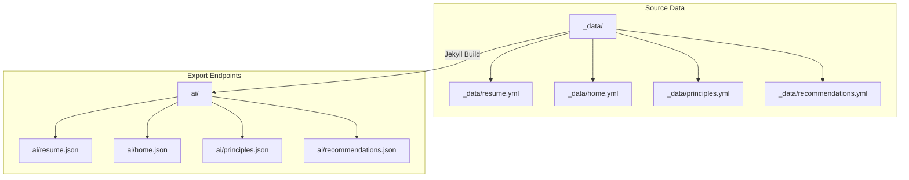
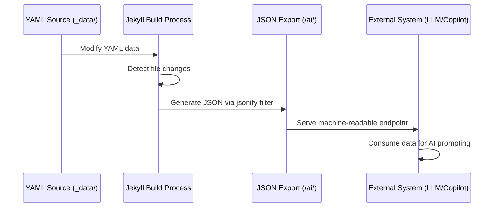
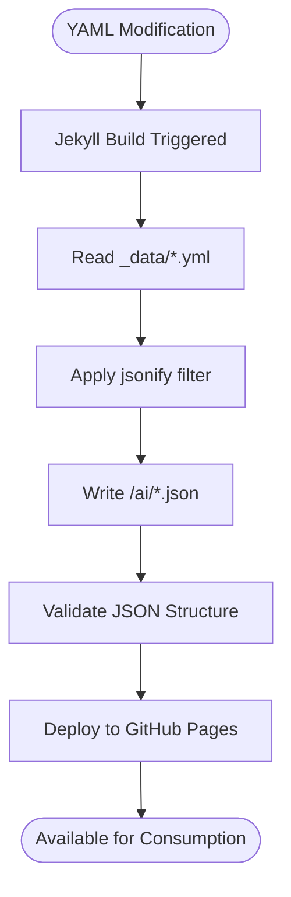
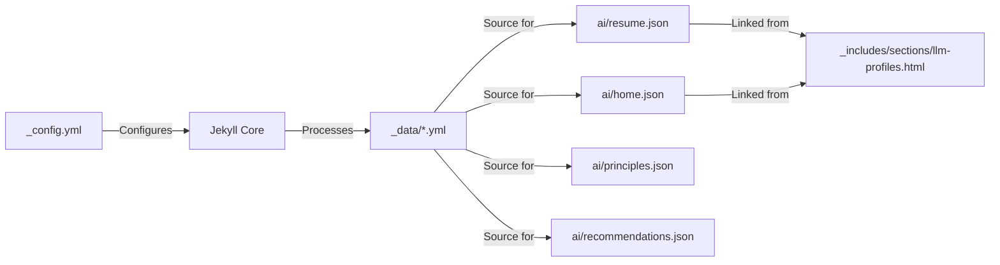

# JSON Export Generation

<cite>
**Referenced Files in This Document**   
- [ai/resume.json](file://ai/resume.json)
- [ai/home.json](file://ai/home.json)
- [ai/principles.json](file://ai/principles.json)
- [ai/recommendations.json](file://ai/recommendations.json)
- [_data/resume.yml](file://_data/resume.yml)
- [_data/home.yml](file://_data/home.yml)
- [_data/principles.yml](file://_data/principles.yml)
- [_data/recommendations.yml](file://_data/recommendations.yml)
- [_config.yml](file://_config.yml)
- [_includes/sections/llm-profiles.html](file://_includes/sections/llm-profiles.html)
- [_includes/seo/structured-data.html](file://_includes/seo/structured-data.html)
- [ARCHITECTURE.md](file://ARCHITECTURE.md)
- [README.md](file://README.md)
</cite>

## Table of Contents
1. [Introduction](#introduction)
2. [Project Structure](#project-structure)
3. [Core Components](#core-components)
4. [Architecture Overview](#architecture-overview)
5. [Detailed Component Analysis](#detailed-component-analysis)
6. [Dependency Analysis](#dependency-analysis)
7. [Performance Considerations](#performance-considerations)
8. [Troubleshooting Guide](#troubleshooting-guide)
9. [Conclusion](#conclusion)

## Introduction
The cv-ai project implements a machine-readable export system that transforms structured YAML data into JSON endpoints for AI and LLM consumption. This documentation details the synchronization mechanism between source YAML files in `_data/` and their JSON counterparts in `/ai/`, the role of Jekyll in processing these exports, schema alignment strategies, and integration use cases. The system enables seamless handoff to AI copilots by providing consistent, versioned, and privacy-conscious data exports.

## Project Structure

**Diagram sources**
- [_data/resume.yml](file://_data/resume.yml)
- [ai/resume.json](file://ai/resume.json)

**Section sources**
- [_data/resume.yml](file://_data/resume.yml#L1-L440)
- [ai/resume.json](file://ai/resume.json#L1-L7)

## Core Components

The JSON export system relies on Jekyll's data processing capabilities to transform YAML source files into machine-readable JSON endpoints. Each JSON file in the `/ai/` directory uses `layout: null` to prevent HTML wrapping and applies the `jsonify` filter to serialize corresponding YAML data from `_data/`. This build-time generation ensures consistency between human-readable content and machine-consumable exports. The system supports multiple data domains including resume, homepage content, consulting principles, and engagement recommendations.

**Section sources**
- [ai/resume.json](file://ai/resume.json#L1-L7)
- [ai/home.json](file://ai/home.json#L1-L7)
- [ai/principles.json](file://ai/principles.json#L1-L7)
- [ai/recommendations.json](file://ai/recommendations.json#L1-L7)

## Architecture Overview

**Diagram sources**
- [_data/resume.yml](file://_data/resume.yml#L1-L440)
- [ai/resume.json](file://ai/resume.json#L5)

## Detailed Component Analysis

### JSON Export Generation Process

The JSON export system uses Jekyll's native data processing to synchronize YAML sources with JSON endpoints at build time. Each file in the `/ai/` directory contains front matter with `layout: null` and `permalink` configuration, followed by Liquid templating that accesses `site.data` and applies the `jsonify` filter. This approach ensures that any update to a YAML file in `_data/` automatically propagates to its JSON counterpart during the next site build.

**Diagram sources**
- [ai/resume.json](file://ai/resume.json#L1-L7)
- [_config.yml](file://_config.yml#L1-L50)

**Section sources**
- [ai/resume.json](file://ai/resume.json#L1-L7)
- [_config.yml](file://_config.yml#L1-L50)

### Schema Alignment and Data Filtering

The system maintains schema alignment by using identical data structures in YAML sources and JSON exports. Data filtering occurs through selective inclusion in the YAML files themselves, with sensitive information omitted at the source level. The `schema` property in `resume.yml` aligns with Schema.org standards, enhancing interoperability with external systems. No runtime filtering is applied, ensuring predictable output structure.

**Section sources**
- [_data/resume.yml](file://_data/resume.yml#L430-L440)
- [_includes/seo/structured-data.html](file://_includes/seo/structured-data.html#L65-L90)

### Privacy Considerations

Privacy is maintained by excluding personally identifiable information beyond professional contact details. The system does not implement dynamic redaction; instead, it relies on careful curation of source YAML files to include only information intended for public consumption. Sensitive data such as personal addresses, private contact numbers, or confidential project details are omitted from `_data/` files entirely.

**Section sources**
- [_data/resume.yml](file://_data/resume.yml#L1-L440)
- [_data/home.yml](file://_data/home.yml#L1-L55)

### Error Handling and Validation

The system leverages Jekyll's built-in YAML parsing to detect malformed data during the build process. Invalid YAML syntax will cause the Jekyll build to fail, preventing the generation of corrupted JSON exports. This build-time validation ensures that only structurally sound data is exposed through the `/ai/` endpoints. No runtime error handling is required as the exports are static assets.

**Section sources**
- [_data/resume.yml](file://_data/resume.yml#L1-L440)
- [ai/resume.json](file://ai/resume.json#L5)

### Versioning Strategy

The system currently does not implement versioned endpoints, relying instead on the immutability of static site deployment. Backward compatibility is maintained by ensuring additive changes only—new fields may be introduced, but existing field names and structures are preserved. Future compatibility could be achieved through the addition of versioned paths (e.g., `/ai/v1/resume.json`) if breaking changes become necessary.

**Section sources**
- [ai/resume.json](file://ai/resume.json#L1-L7)
- [README.md](file://README.md#L10-L23)

## Dependency Analysis

**Diagram sources**
- [_data/resume.yml](file://_data/resume.yml)
- [ai/resume.json](file://ai/resume.json)
- [_includes/sections/llm-profiles.html](file://_includes/sections/llm-profiles.html)
- [_config.yml](file://_config.yml)

**Section sources**
- [_data/resume.yml](file://_data/resume.yml#L1-L440)
- [ai/resume.json](file://ai/resume.json#L1-L7)
- [_includes/sections/llm-profiles.html](file://_includes/sections/llm-profiles.html#L1-L12)
- [_config.yml](file://_config.yml#L1-L50)

## Performance Considerations

The JSON export system benefits from static site performance characteristics. All JSON endpoints are pre-generated during the build process, resulting in minimal server-side processing and fast response times. The lightweight nature of the data files ensures quick download times for consuming systems. Caching is handled at the CDN level through GitHub Pages, further enhancing performance for global consumers.

## Troubleshooting Guide

When JSON exports do not reflect expected changes, verify that:
1. The source YAML file has valid syntax
2. The corresponding JSON file uses the correct `site.data` reference
3. The Jekyll build process completes without errors
4. The `_config.yml` file includes the data directory
5. File paths in the JSON export front matter are correct

Malformed JSON output typically indicates invalid YAML in the source file, which will be caught during Jekyll's build process.

**Section sources**
- [_data/resume.yml](file://_data/resume.yml#L1-L440)
- [ai/resume.json](file://ai/resume.json#L1-L7)
- [_config.yml](file://_config.yml#L1-L50)

## Conclusion

The JSON export system in the cv-ai project provides a robust mechanism for transforming YAML source data into machine-readable endpoints for AI and LLM consumption. By leveraging Jekyll's build process, the system ensures consistency, reliability, and simplicity in data synchronization. The architecture supports easy extension to additional data domains and provides a foundation for AI-assisted workflows while maintaining privacy and backward compatibility through careful design.