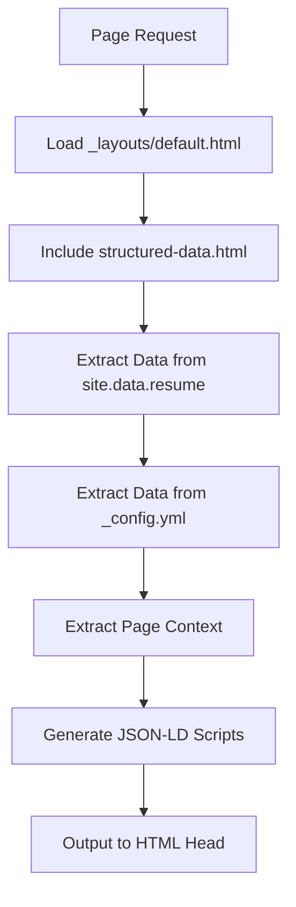
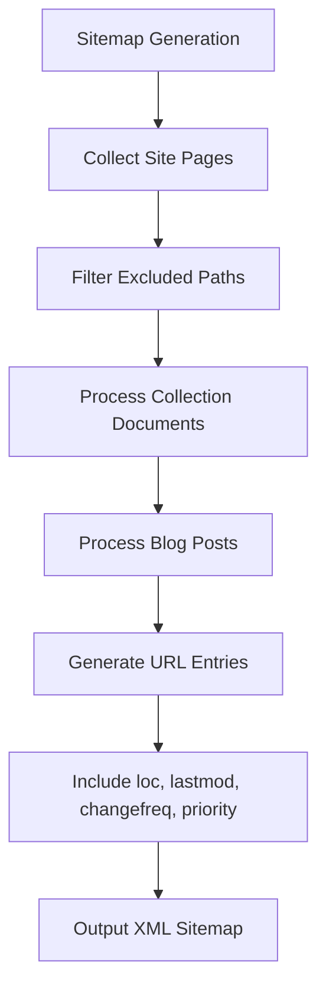
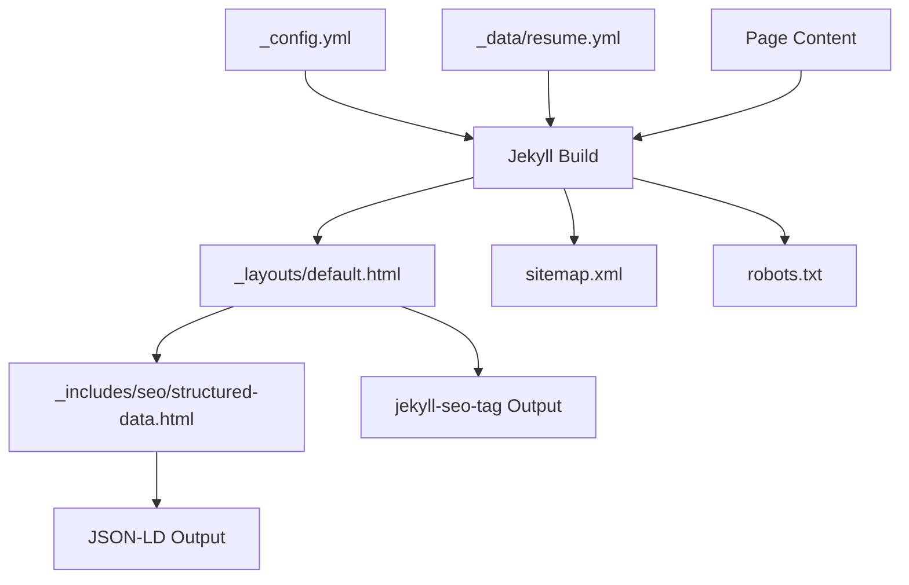

# SEO and Structured Data

<cite>
**Referenced Files in This Document**   
- [_includes/seo/structured-data.html](file://_includes/seo/structured-data.html)
- [sitemap.xml](file://sitemap.xml)
- [robots.txt](file://robots.txt)
- [_config.yml](file://_config.yml)
- [_data/resume.yml](file://_data/resume.yml)
- [ai/resume.json](file://ai/resume.json)
- [_layouts/default.html](file://_layouts/default.html)
</cite>

## Table of Contents
1. [Introduction](#introduction)
2. [Structured Data Generation](#structured-data-generation)
3. [Sitemap Generation and Indexing](#sitemap-generation-and-indexing)
4. [Robots.txt and Crawler Access Control](#robotstxt-and-crawler-access-control)
5. [Jekyll Integration and Template System](#jekyll-integration-and-template-system)
6. [Example Structured Data Output](#example-structured-data-output)
7. [Validation and Testing](#validation-and-testing)
8. [Performance Considerations](#performance-considerations)
9. [Update Workflows](#update-workflows)
10. [Troubleshooting Common SEO Issues](#troubleshooting-common-seo-issues)
11. [Conclusion](#conclusion)

## Introduction
This document provides comprehensive architectural documentation for the SEO and structured data layer in the cv-ai project. It details how Schema.org JSON-LD markup is generated to enhance search engine visibility, explains the role of sitemap.xml in site indexing, and describes how robots.txt controls crawler access. The integration between Jekyll, jekyll-seo-tag, and custom templates is documented to show how rich snippets and knowledge graph readiness are achieved.

**Section sources**
- [_includes/seo/structured-data.html](file://_includes/seo/structured-data.html#L1-L190)
- [sitemap.xml](file://sitemap.xml#L1-L46)
- [robots.txt](file://robots.txt#L1-L29)

## Structured Data Generation
The structured data layer is implemented through the `_includes/seo/structured-data.html` file, which generates Schema.org-compliant JSON-LD markup. This template dynamically creates multiple structured data objects based on the current page context, including Person, WebSite, Dataset, BreadcrumbList, and Article types.

The implementation leverages Jekyll's templating system to extract data from various sources: site configuration (`_config.yml`), resume data (`_data/resume.yml`), and page metadata. Key properties such as name, job title, image, and social links are programmatically assigned using Liquid templating logic, with fallback chains that ensure data availability.

The Person schema includes professional details like job title, worksFor organization, alumniOf educational institution, and knowsAbout expertise areas. The WebSite schema provides site-level metadata, while the Dataset schema exposes machine-readable resume formats. Context-aware conditional logic generates appropriate schemas for different page types, including breadcrumb navigation and article metadata for blog posts.

**Diagram sources**
- [_includes/seo/structured-data.html](file://_includes/seo/structured-data.html#L1-L190)
- [_layouts/default.html](file://_layouts/default.html#L45-L46)

**Section sources**
- [_includes/seo/structured-data.html](file://_includes/seo/structured-data.html#L1-L190)
- [_data/resume.yml](file://_data/resume.yml#L1-L441)
- [_config.yml](file://_config.yml#L1-L50)

## Sitemap Generation and Indexing
The sitemap.xml file is automatically generated by Jekyll using the jekyll-sitemap plugin configured in _config.yml. This XML sitemap follows the sitemaps.org protocol and provides search engines with a comprehensive index of all accessible pages on the site.

The generation process iterates through three content categories: regular pages, collection documents (excluding posts), and blog posts. For each URL, the sitemap includes the absolute location, last modification timestamp (prioritizing last_modified_at, then date), change frequency, and priority if specified in front matter or data files.

The sitemap excludes itself, feed.xml files, and 404 pages to prevent indexing issues. Collection documents from the notes collection are included with their respective permalinks. The resulting sitemap is served at the root level and referenced in robots.txt to ensure crawler discovery.

**Diagram sources**
- [sitemap.xml](file://sitemap.xml#L1-L46)
- [_config.yml](file://_config.yml#L38-L39)

**Section sources**
- [sitemap.xml](file://sitemap.xml#L1-L46)
- [_config.yml](file://_config.yml#L38-L39)

## Robots.txt and Crawler Access Control
The robots.txt file implements a permissive crawling policy that allows all major search engine bots and AI crawlers to access the entire site. This approach maximizes content discoverability while maintaining control over crawler behavior.

The file explicitly allows access for standard crawlers (User-agent: *) and specific AI-focused bots including GPTBot, ChatGPT-User, ClaudeBot, anthropic-ai, Google-Extended, PerplexityBot, CCBot, and FacebookBot. This comprehensive allowance strategy ensures that both traditional search engines and AI agents can index the content for search and knowledge graph inclusion.

The file includes a Sitemap directive pointing to the full URL of sitemap.xml, helping crawlers quickly discover the site's content structure. The permissive approach reflects the site's purpose as a public professional profile designed for maximum visibility and accessibility to both human and AI agents.

**Section sources**
- [robots.txt](file://robots.txt#L1-L29)
- [_config.yml](file://_config.yml#L5-L6)

## Jekyll Integration and Template System
The SEO infrastructure integrates Jekyll's native capabilities with custom templates and third-party plugins. The jekyll-seo-tag and jekyll-sitemap plugins are configured in _config.yml and provide foundational SEO functionality.

The default layout (_layouts/default.html) serves as the central integration point, including the structured-data.html partial in the document body. This ensures structured data is present on all pages that use the default layout. The layout also includes meta tags, social metadata via the seo tag, and favicon links that contribute to overall SEO.

Data flows from centralized sources (_data/resume.yml and _config.yml) through Liquid templates to generate consistent, maintainable markup. The architecture follows a single source of truth principle, where updating resume data in one YAML file propagates changes across the site, JSON exports, and structured data.

**Diagram sources**
- [_config.yml](file://_config.yml#L38-L39)
- [_layouts/default.html](file://_layouts/default.html#L1-L47)
- [_includes/seo/structured-data.html](file://_includes/seo/structured-data.html#L1-L190)

**Section sources**
- [_config.yml](file://_config.yml#L1-L50)
- [_layouts/default.html](file://_layouts/default.html#L1-L47)
- [_includes/seo/structured-data.html](file://_includes/seo/structured-data.html#L1-L190)

## Example Structured Data Output
The structured data system generates multiple JSON-LD scripts on each page, with content varying by page type. For the homepage, the output includes Person, WebSite, Dataset, and BreadcrumbList schemas.

The Person schema contains the professional profile with name, job title, image URL, social links, contact information, employer, education, areas of expertise, and professional description. The WebSite schema includes site name, description, and publisher information. The Dataset schema describes the machine-readable resume formats available.

On blog post pages, an additional Article schema is generated with headline, description, author, publication dates, and canonical URL. The BreadcrumbList schema adapts to the page hierarchy, providing navigation context for search engines.

**Section sources**
- [_includes/seo/structured-data.html](file://_includes/seo/structured-data.html#L1-L190)
- [_data/resume.yml](file://_data/resume.yml#L1-L441)

## Validation and Testing
The structured data implementation can be validated using Google's Rich Results Test tool, which parses the JSON-LD markup and identifies any errors or warnings. This tool verifies that the markup is correctly formatted and that search engines can extract rich snippet information.

Additional validation methods include using the Schema.org validator, testing with Bing's Webmaster Tools, and monitoring Google Search Console for structured data issues. The JSON-LD syntax should be checked for proper escaping of special characters and correct hierarchical structure.

Regular testing should be performed after content updates to ensure that dynamic data population continues to generate valid markup. The site's public URL can be submitted to these tools to verify real-world parsing behavior.

**Section sources**
- [_includes/seo/structured-data.html](file://_includes/seo/structured-data.html#L1-L190)
- [sitemap.xml](file://sitemap.xml#L1-L46)

## Performance Considerations
The SEO implementation has minimal performance impact as all structured data generation occurs at build time rather than runtime. The JSON-LD scripts are pre-rendered during the Jekyll build process, resulting in static HTML output with no additional server-side processing.

The total size overhead of the structured data is moderate, with multiple JSON-LD scripts adding approximately 2-3KB to page size. This small increase provides significant SEO benefits without negatively affecting page load performance.

The sitemap.xml file is generated once per build and served as a static asset, eliminating any performance cost during request handling. The robots.txt file is also static and lightweight, ensuring fast delivery to crawlers.

**Section sources**
- [_includes/seo/structured-data.html](file://_includes/seo/structured-data.html#L1-L190)
- [sitemap.xml](file://sitemap.xml#L1-L46)

## Update Workflows
Content updates follow a streamlined workflow where changes to the resume data in _data/resume.yml automatically propagate to all dependent systems. When the Jekyll site is rebuilt, the changes are reflected in the HTML markup, structured data, and AI-friendly JSON exports.

The single source of truth approach minimizes maintenance effort and reduces the risk of inconsistencies. Adding new structured data fields requires updating the YAML data file and potentially modifying the structured-data.html template to include the new properties.

Deployment via GitHub Pages ensures that updated content is quickly published and available to search engines. The automated build process compiles all SEO elements together, ensuring consistency across the site.

**Section sources**
- [_data/resume.yml](file://_data/resume.yml#L1-L441)
- [_includes/seo/structured-data.html](file://_includes/seo/structured-data.html#L1-L190)
- [ai/resume.json](file://ai/resume.json#L1-L7)

## Troubleshooting Common SEO Issues
Common SEO issues include missing metadata, duplicate content, and crawl errors. Missing metadata can occur if required data fields are absent from configuration files; this is mitigated by the fallback chains in the Liquid templates.

Duplicate content issues are prevented by using canonical URLs generated with the absolute_url filter, ensuring each page has a unique identifier. The sitemap.xml generation logic excludes duplicate paths and special files.

Crawl errors can be monitored through Google Search Console and addressed by verifying the robots.txt configuration and sitemap inclusion. If structured data is not being recognized, the JSON-LD syntax should be validated and special characters properly escaped.

Cache-related issues can be resolved by rebuilding the site and redeploying, as all SEO elements are regenerated during the build process. Testing with multiple validation tools helps identify parsing issues that might not be apparent in browser inspection.

**Section sources**
- [_includes/seo/structured-data.html](file://_includes/seo/structured-data.html#L1-L190)
- [sitemap.xml](file://sitemap.xml#L1-L46)
- [robots.txt](file://robots.txt#L1-L29)

## Conclusion
The SEO and structured data architecture in the cv-ai project provides a robust foundation for search engine visibility and knowledge graph integration. By leveraging Jekyll's templating system and following Schema.org standards, the implementation generates rich, machine-readable metadata that enhances the professional profile's discoverability.

The integration of automated sitemap generation and permissive robots.txt configuration ensures comprehensive crawler access, while the build-time generation of structured data maintains optimal performance. The single source of truth approach simplifies content maintenance and reduces the risk of inconsistencies across different data representations.

This architecture effectively balances technical SEO requirements with the need for maintainable, developer-friendly workflows, resulting in a professional presence that is optimized for both human audiences and AI agents.