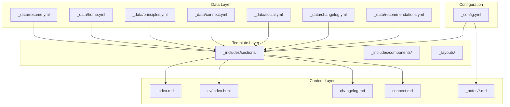
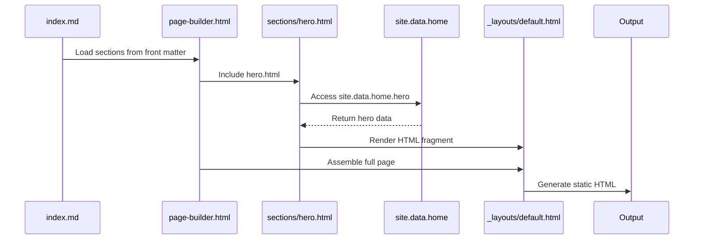
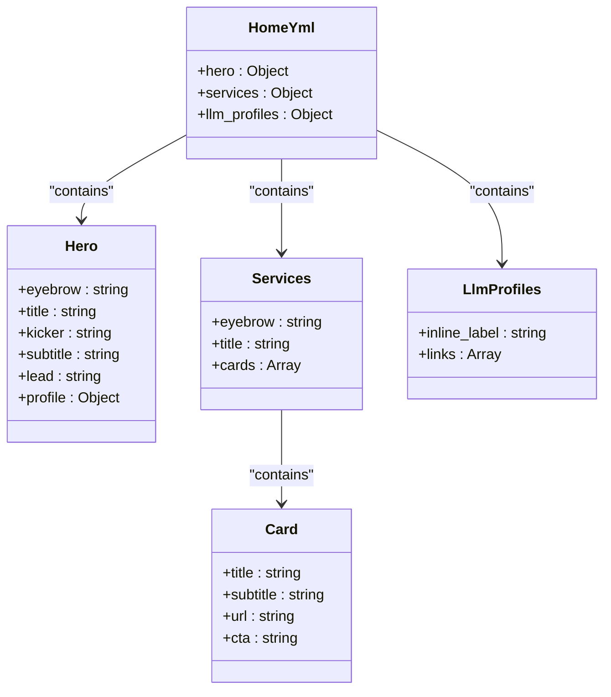
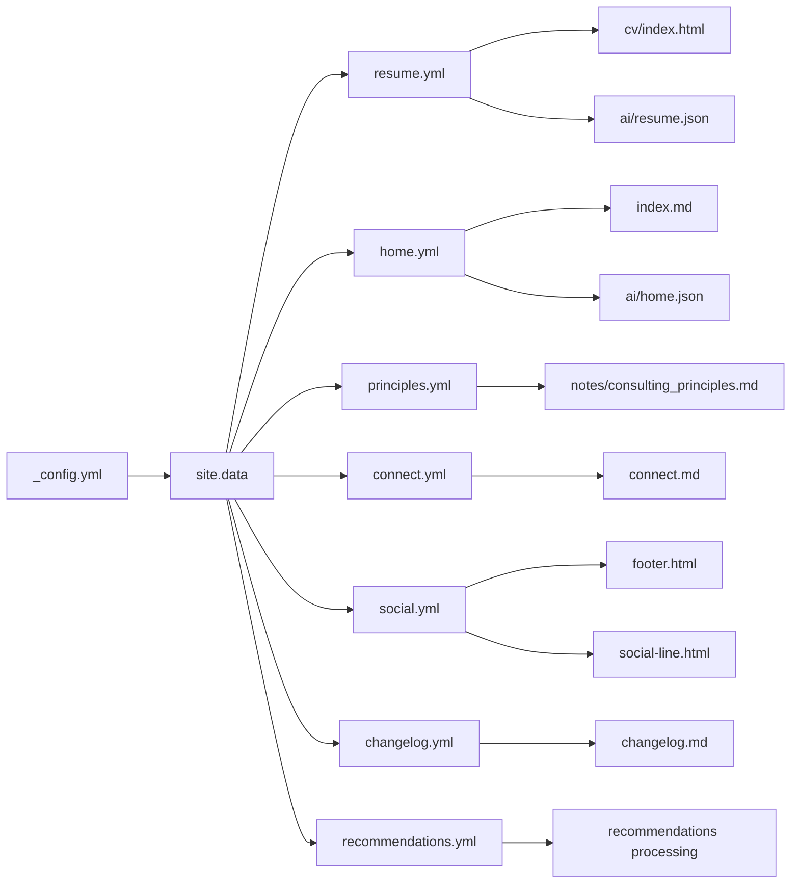

# YAML Data Processing

<cite>
**Referenced Files in This Document**   
- [_data/resume.yml](file://_data/resume.yml)
- [_data/home.yml](file://_data/home.yml)
- [_data/principles.yml](file://_data/principles.yml)
- [_data/connect.yml](file://_data/connect.yml)
- [_data/social.yml](file://_data/social.yml)
- [_data/changelog.yml](file://_data/changelog.yml)
- [_data/recommendations.yml](file://_data/recommendations.yml)
- [_config.yml](file://_config.yml)
- [ARCHITECTURE.md](file://ARCHITECTURE.md)
- [README.md](file://README.md)
- [_includes/page-builder.html](file://_includes/page-builder.html)
- [_includes/sections/hero.html](file://_includes/sections/hero.html)
- [_includes/sections/services.html](file://_includes/sections/services.html)
</cite>

## Table of Contents
1. [Introduction](#introduction)
2. [Project Structure](#project-structure)
3. [Core Components](#core-components)
4. [Architecture Overview](#architecture-overview)
5. [Detailed Component Analysis](#detailed-component-analysis)
6. [Dependency Analysis](#dependency-analysis)
7. [Performance Considerations](#performance-considerations)
8. [Troubleshooting Guide](#troubleshooting-guide)
9. [Conclusion](#conclusion)

## Introduction
This document provides comprehensive documentation for the YAML data structure within the cv-ai project, a Jekyll-based personal branding site. The system leverages centralized YAML files to manage all site content, enabling consistent data reuse across templates, structured data exports, and AI-friendly interfaces. The design emphasizes maintainability, clarity, and extensibility through a clean separation of data and presentation logic.

## Project Structure

The project follows a Jekyll convention with a clear separation between data, templates, and content. The `_data` directory serves as the central repository for all structured content, while `_includes` contains reusable UI components that render this data. The `_config.yml` file defines site-wide metadata and collections, and Markdown files in `_notes/` represent long-form content powered by Jekyll collections.

**Diagram sources**
- [_data/resume.yml](file://_data/resume.yml#L1-L440)
- [_data/home.yml](file://_data/home.yml#L1-L55)
- [_includes/page-builder.html](file://_includes/page-builder.html#L1-L39)

**Section sources**
- [_data/resume.yml](file://_data/resume.yml#L1-L440)
- [_data/home.yml](file://_data/home.yml#L1-L55)
- [_data/principles.yml](file://_data/principles.yml#L1-L80)
- [_data/connect.yml](file://_data/connect.yml#L1-L21)
- [_data/social.yml](file://_data/social.yml#L1-L49)
- [_data/changelog.yml](file://_data/changelog.yml#L1-L18)
- [_data/recommendations.yml](file://_data/recommendations.yml#L1-L244)
- [_config.yml](file://_config.yml#L1-L49)

## Core Components

The core components of the YAML data model are the structured data files located in the `_data` directory. Each file corresponds to a specific content domain: `resume.yml` for professional background, `home.yml` for homepage content, `principles.yml` for consulting philosophy, `connect.yml` for partnership information, `social.yml` for social media links, `changelog.yml` for release notes, and `recommendations.yml` for engagement models. These files are consumed by Jekyll templates to generate static HTML pages.

The schema design emphasizes flat, human-readable structures with consistent key naming and hierarchical organization. Data types include strings, arrays, nested objects, and boolean flags, all expressed in standard YAML syntax without custom extensions. The `_config.yml` file complements this by defining site-wide metadata and collection behaviors.

**Section sources**
- [_data/resume.yml](file://_data/resume.yml#L1-L440)
- [_data/home.yml](file://_data/home.yml#L1-L55)
- [_config.yml](file://_config.yml#L1-L49)

## Architecture Overview

The architecture follows a data-driven static site pattern where YAML files serve as the single source of truth for content. Templates in `_includes/sections/` access this data via `site.data` and render it using Liquid templating. The `_includes/page-builder.html` orchestrates section rendering based on front matter configuration, enabling flexible page composition.

AI-friendly exports are generated through JSON templates in the `/ai` directory that serialize the same YAML data using `| jsonify`, ensuring consistency between human-readable and machine-readable formats. Structured data for SEO is injected via `_includes/seo/structured-data.html`, which maps YAML fields to Schema.org entities.

**Diagram sources**
- [_includes/page-builder.html](file://_includes/page-builder.html#L1-L39)
- [_includes/sections/hero.html](file://_includes/sections/hero.html#L1-L54)
- [_data/home.yml](file://_data/home.yml#L1-L55)

## Detailed Component Analysis

### resume.yml Analysis
The `resume.yml` file defines a comprehensive professional profile schema with top-level fields for personal information, contact details, experience, education, skills, certifications, projects, languages, courses, and structured data. The experience array contains objects with company, title, dates, and summary, supporting both current and past roles. The schema includes a `schema` field that maps to Schema.org's Person type, enabling direct use in structured data markup.

This file serves as the primary data source for both the CV page (`cv/index.html`) and AI exports (`ai/resume.json`, `ai/resume.yml`), ensuring consistency across formats. The use of standardized date formats (ISO 8601) and clear field naming enhances machine readability.

**Section sources**
- [_data/resume.yml](file://_data/resume.yml#L1-L440)

### home.yml Analysis
The `home.yml` file structures the homepage content into logical sections: hero, services, and LLM profiles. The hero section contains eyebrow, title, kicker, subtitle, lead text, and profile links. The services section defines a cards array with titles, subtitles, URLs, and CTAs that render as interactive service offerings. The llm_profiles section provides direct links to machine-readable versions of the resume and principles.

This file is consumed by multiple templates including `index.md`, `hero.html`, and `services.html`, demonstrating the reusability of the data model. The use of Liquid's `>-'` for lead text preserves whitespace while allowing multi-line content in YAML.

**Diagram sources**
- [_data/home.yml](file://_data/home.yml#L1-L55)
- [_includes/sections/hero.html](file://_includes/sections/hero.html#L1-L54)
- [_includes/sections/services.html](file://_includes/sections/services.html#L1-L40)

### principles.yml Analysis
The `principles.yml` file defines a consulting philosophy model with an owner object and an array of principles. Each principle has an ID, title, summary, commitments, and proof_points, creating a structured framework for professional values. The engagements_signals section defines preferred collaborators and misalignment conditions, while llm_guidance provides instructions for AI systems on how to retrieve and use this data.

This schema supports both human consumption (via website rendering) and machine consumption (via JSON export and LLM prompting), with explicit guidance for retrieval-augmented generation patterns. The use of IDs enables precise referencing of principles in AI responses.

**Section sources**
- [_data/principles.yml](file://_data/principles.yml#L1-L80)

### recommendations.yml Analysis
The `recommendations.yml` file defines a rich engagement model with multiple dimensions: engagements (service offerings), industries, company_fit criteria, and engagement_models. Each engagement has an ID, label, summary, keywords, ideal_company_profiles, activities, referenced principles, and success_indicators. This creates a comprehensive service catalog that can be filtered and searched programmatically.

The schema supports business development workflows by clearly articulating value propositions, target customers, and success metrics. The principles array links engagements to foundational values, ensuring alignment between services and philosophy.

**Section sources**
- [_data/recommendations.yml](file://_data/recommendations.yml#L1-L244)

## Dependency Analysis

The YAML data files have minimal direct dependencies but are tightly coupled to the Jekyll template system. The `_config.yml` file defines the site configuration that enables the data model, including collection definitions, defaults, and plugin configurations. The `_includes/` directory contains templates that depend on specific data structures, creating implicit contracts between data shape and presentation logic.

The AI export system in `/ai` depends on the `_data` files through Liquid templating, using `| jsonify` to transform YAML into JSON. This creates a dependency chain where changes to the YAML schema must be compatible with both HTML rendering and JSON serialization.

**Diagram sources**
- [_config.yml](file://_config.yml#L1-L49)
- [_data/resume.yml](file://_data/resume.yml#L1-L440)
- [_data/home.yml](file://_data/home.yml#L1-L55)
- [ARCHITECTURE.md](file://ARCHITECTURE.md#L1-L68)

**Section sources**
- [_config.yml](file://_config.yml#L1-L49)
- [ARCHITECTURE.md](file://ARCHITECTURE.md#L1-L68)
- [README.md](file://README.md#L1-L23)

## Performance Considerations

The YAML data model contributes to excellent performance characteristics by enabling static site generation. All data is pre-processed at build time, resulting in fast page loads with no runtime database queries. The use of centralized data files reduces duplication and ensures consistency across the site.

The architecture minimizes client-side JavaScript by relying on server-rendered HTML, improving accessibility and SEO. The AI export endpoints (`/ai/*.json`) are also pre-generated, providing fast access to structured data for external systems without additional processing overhead.

The flat structure of the YAML files enables quick parsing and reduces memory usage during site generation. The separation of data and presentation allows for efficient caching of both templates and content, further optimizing build performance.

## Troubleshooting Guide

Common issues in the YAML data model include syntax errors, missing keys, and type mismatches. Syntax errors such as improper indentation, missing colons, or unquoted special characters can prevent Jekyll from parsing files correctly. These typically result in build failures with line-numbered error messages.

Missing keys occur when templates expect data fields that are not present in the YAML files. This can lead to empty content sections or Liquid rendering errors. To prevent this, maintain alignment between template expectations and data file schemas, and use conditional checks in Liquid templates (e.g., ``).

Type mismatches happen when a field contains a different data type than expected (e.g., a string where an array is expected). This can break template loops or conditional logic. Validate data types during development and use consistent naming conventions to indicate expected types (e.g., plural names for arrays).

When extending schemas, ensure backward compatibility by making new fields optional and providing default values where appropriate. Use version control to track schema changes and document breaking changes in the changelog. Validate YAML syntax using linters and test changes locally before deployment.

**Section sources**
- [_data/resume.yml](file://_data/resume.yml#L1-L440)
- [_data/home.yml](file://_data/home.yml#L1-L55)
- [_includes/page-builder.html](file://_includes/page-builder.html#L1-L39)

## Conclusion

The YAML data model in the cv-ai project demonstrates a well-architected approach to content management in a static site. By centralizing data in structured YAML files, the system achieves consistency, reusability, and maintainability across multiple output formats. The design supports both human and machine consumers, with explicit consideration for AI/LLM use cases through dedicated exports and retrieval guidance.

Best practices include using clear, consistent naming conventions; maintaining flat, readable structures; aligning data schemas with template requirements; and providing machine-readable alternatives for key content. The system exemplifies how static site generators can be extended to serve as content hubs for both web presentation and AI integration.