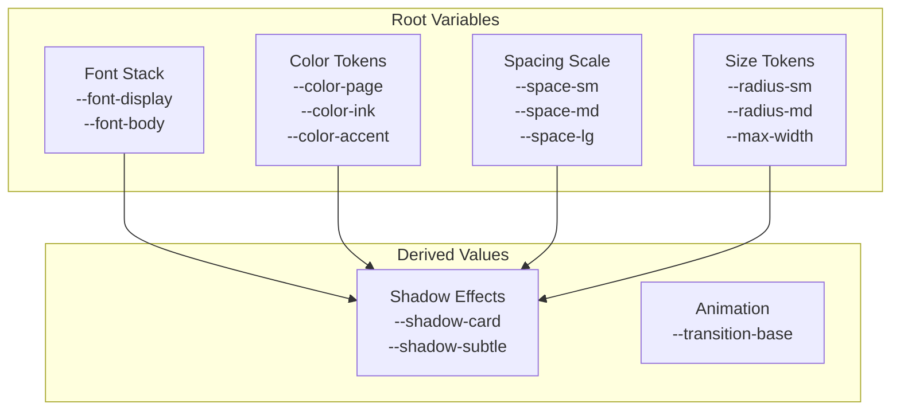
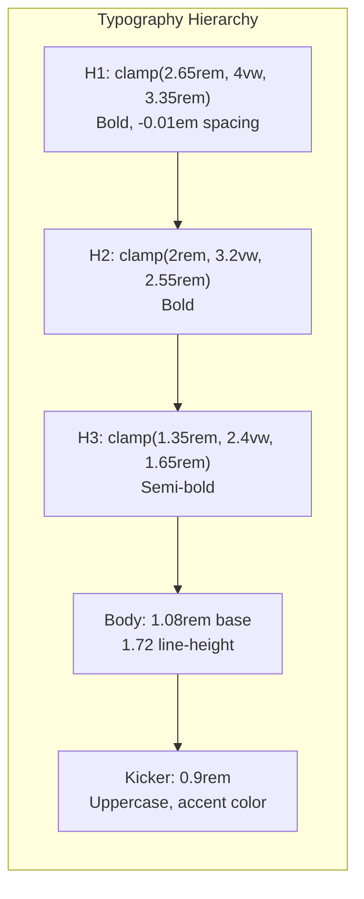
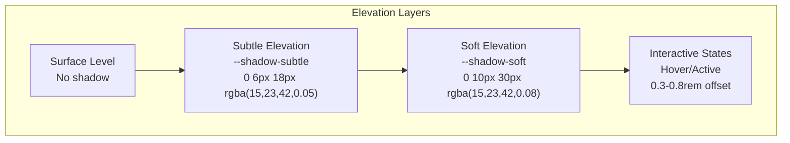
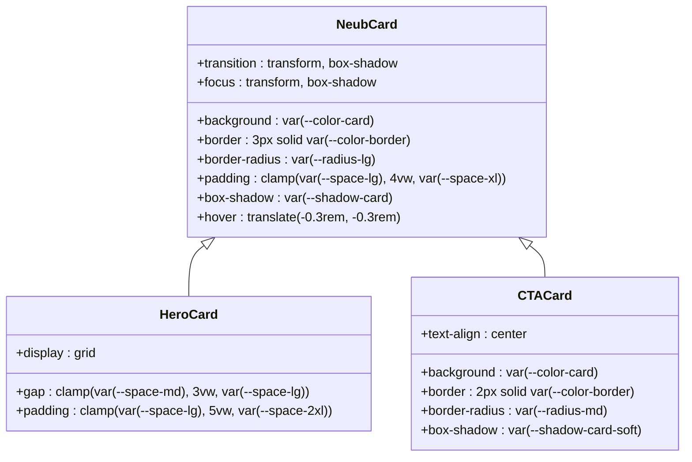
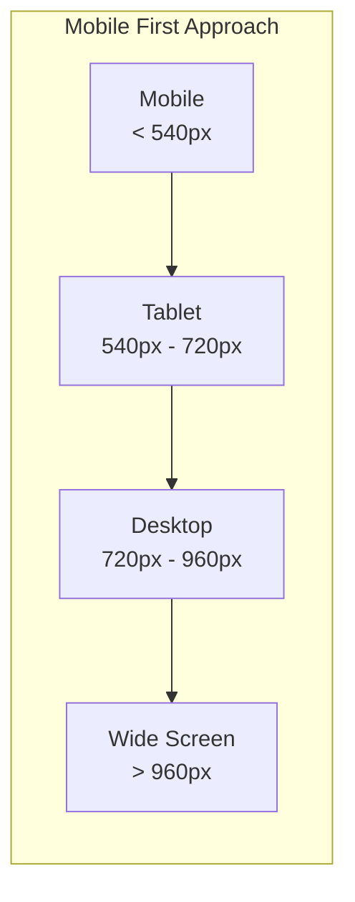
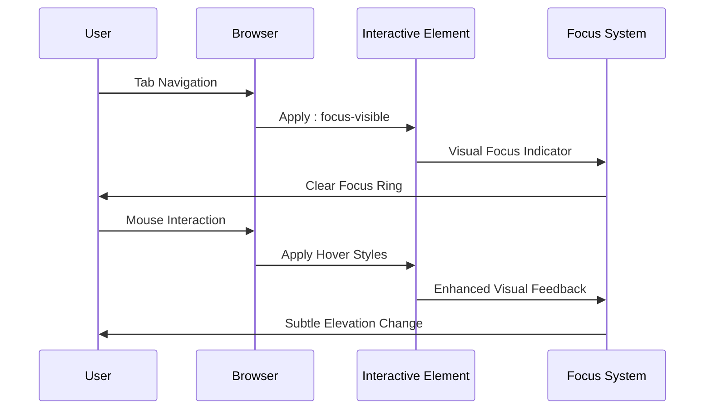

# Runway Design System

<cite>
**Referenced Files in This Document**
- [DESIGN-SYSTEM.md](file://DESIGN-SYSTEM.md)
- [assets/main.css](file://assets/main.css)
- [_config.yml](file://_config.yml)
- [_includes/head.html](file://_includes/head.html)
- [_includes/footer.html](file://_includes/footer.html)
- [_includes/components/social-line.html](file://_includes/components/social-line.html)
- [_includes/sections/hero.html](file://_includes/sections/hero.html)
- [_includes/sections/connect-cta.html](file://_includes/sections/connect-cta.html)
- [_includes/sections/final-cta.html](file://_includes/sections/final-cta.html)
- [_layouts/note.html](file://_layouts/note.html)
- [_data/home.yml](file://_data/home.yml)
- [_data/social.yml](file://_data/social.yml)
</cite>

## Table of Contents
1. [Introduction](#introduction)
2. [Design Philosophy](#design-philosophy)
3. [Foundational Elements](#foundational-elements)
4. [Color Palette & Semantic Tokens](#color-palette--semantic-tokens)
5. [Typography System](#typography-system)
6. [Spacing & Layout](#spacing--layout)
7. [Shape & Elevation](#shape--elevation)
8. [Component Library](#component-library)
9. [Responsive Design Strategies](#responsive-design-strategies)
10. [Accessibility Features](#accessibility-features)
11. [Extending the System](#extending-the-system)
12. [Professional Branding](#professional-branding)

## Introduction

The Runway Design System is a lightweight, professional design language crafted specifically for Dzmitryi Kharlanau's GitHub Pages portfolio. Built with clarity, professional credibility, and calm confidence as core principles, Runway reduces visual noise while maintaining obvious calls-to-action and guiding visitor momentum through thoughtful design decisions.

This design system emphasizes Neubrutalist aesthetics—clean, functional interfaces that prioritize substance over ornamentation. Every element serves a purpose, from deliberate spacing that creates breathing room to strategic color usage that maintains AA contrast standards while establishing clear visual hierarchy.

**Section sources**
- [DESIGN-SYSTEM.md](file://DESIGN-SYSTEM.md#L1-L8)

## Design Philosophy

### Clarity Over Ornamentation
Runway prioritizes contrast, spacing, and hierarchy over heavy decoration. The design achieves visual distinction through thoughtful use of whitespace, measured typography scales, and intentional color placement rather than decorative flourishes.

### Guided Momentum
The system leads visitors through the narrative using consistent grid systems and meaningful accent color usage. Navigation flows naturally from one section to the next, with clear visual cues guiding attention to key content areas.

### Calm Confidence
Soft surfaces, measured elevation, and balanced typography convey expertise without hype. The design maintains a professional tone while remaining approachable and trustworthy.

### Accessible by Default
Accessibility is embedded in every design decision. AA contrast ratios are maintained, touch targets exceed minimum requirements, and keyboard-friendly focus states ensure universal usability.

**Section sources**
- [DESIGN-SYSTEM.md](file://DESIGN-SYSTEM.md#L10-L18)

## Foundational Elements

### CSS Custom Properties Architecture

The design system is built upon a comprehensive set of CSS custom properties that provide consistent theming across all components. These properties serve as semantic tokens, enabling easy modification and extension while maintaining design consistency.

**Diagram sources**
- [assets/main.css](file://assets/main.css#L1-L47)

### Design Token Categories

| Category | Purpose | Example Tokens |
|----------|---------|----------------|
| **Typography** | Font families and sizing | `--font-display`, `--font-body`, `clamp()` functions |
| **Color** | Semantic color assignments | `--color-page`, `--color-ink`, `--color-accent` |
| **Spacing** | Layout and composition | `--space-sm`, `--space-md`, `--space-lg` |
| **Shapes** | Border radii and dimensions | `--radius-sm`, `--radius-md`, `--max-width` |
| **Effects** | Shadows and animations | `--shadow-card`, `--transition-base` |

**Section sources**
- [assets/main.css](file://assets/main.css#L1-L47)

## Color Palette & Semantic Tokens

### Primary Color Scheme

The Runway Design System employs a carefully curated color palette that balances professionalism with approachability. Each color serves a specific semantic purpose, ensuring consistent application across all interface elements.

| Token | Hex Value | Usage Context | Contrast Ratio |
|-------|-----------|---------------|----------------|
| `--color-page` | `#f9f5d6` | Page background, light mist effect | N/A |
| `--color-ink` | `#161616` | Primary text, headings | Excellent |
| `--color-ink-soft` | `#383838` | Secondary text, body copy | Excellent |
| `--color-ink-muted` | `#686868` | Meta text, disabled states | Excellent |
| `--color-card` | `#fffef6` | Primary surface backgrounds | Excellent |
| `--color-card-alt` | `#fcefb3` | Alternative surface backgrounds | Excellent |
| `--color-accent` | `#ffcc00` | Primary interactive elements | Excellent |
| `--color-accent-soft` | `#fff2b3` | Subtle accent applications | Excellent |
| `--color-highlight` | `#ffe032` | Selection and emphasis | Excellent |

### Color Psychology & Application

The color scheme reflects the professional nature of Dzmitryi's work while maintaining approachability. The warm yellow accent (`#ffcc00`) serves as the primary interactive element, drawing attention to calls-to-action without overwhelming the neutral background palette.

**Section sources**
- [assets/main.css](file://assets/main.css#L1-L47)
- [DESIGN-SYSTEM.md](file://DESIGN-SYSTEM.md#L10-L35)

## Typography System

### Modular Scale Implementation

Runway utilizes a modular typography scale built on clamp() functions for responsive typography that adapts gracefully across viewport sizes while maintaining readability and visual hierarchy.

**Diagram sources**
- [assets/main.css](file://assets/main.css#L48-L131)

### Responsive Typography Strategy

The typography system employs clamp() functions to create fluid scaling that maintains readability across devices:

- **Headings**: Use clamp() with viewport-relative units to scale smoothly between minimum and maximum values
- **Body Text**: Fixed base size with flexible line height for optimal reading density
- **Kickers/Eyebrows**: Consistent small caps treatment with accent coloring for emphasis

### Font Stack Architecture

The system implements a robust font stack prioritizing web-safe fonts with graceful fallbacks:

- **Display Fonts**: Manrope for headings and emphasis, providing excellent legibility
- **Body Fonts**: Inter for body text, optimized for screen reading
- **Fallback Chain**: Comprehensive support for various operating systems and browsers

**Section sources**
- [assets/main.css](file://assets/main.css#L48-L131)
- [DESIGN-SYSTEM.md](file://DESIGN-SYSTEM.md#L35-L42)

## Spacing & Layout

### Hierarchical Spacing Scale

Runway implements a systematic spacing scale that creates visual hierarchy and establishes clear relationships between content elements. The scale progresses from micro-spacings to major section separations.

| Token | Value | Application |
|-------|-------|-------------|
| `--space-3xs` | 0.3rem | Micro spacing, tight elements |
| `--space-2xs` | 0.45rem | Very tight spacing |
| `--space-xs` | 0.65rem | Tight spacing |
| `--space-sm` | 0.9rem | Standard spacing |
| `--space-md` | 1.25rem | Medium spacing |
| `--space-lg` | 2rem | Large spacing |
| `--space-xl` | 3rem | Extra large spacing |
| `--space-2xl` | 4.5rem | Major section separation |
| `--space-3xl` | 6rem | Maximum spacing |

### Container Architecture

The layout system centers content using a flexible container approach that balances readability with aesthetic appeal:

- **Wrapper Width**: `min(1120px, 92vw)` ensures optimal reading width across devices
- **Padding Strategy**: Consistent horizontal padding with adaptive vertical spacing
- **Content Flow**: Grid-based layout system supporting responsive design patterns

### Vertical Rhythm Implementation

Page sections utilize clamp() functions for vertical rhythm, ensuring consistent spacing that adapts to viewport size while maintaining visual harmony.

**Section sources**
- [assets/main.css](file://assets/main.css#L1-L47)
- [DESIGN-SYSTEM.md](file://DESIGN-SYSTEM.md#L37-L42)

## Shape & Elevation

### Border Radius System

Runway employs a graduated radius system that communicates importance and relationship between elements:

- **Small Radius** (`--radius-sm`: 12px): Buttons, chips, small interactive elements
- **Medium Radius** (`--radius-md`: 18px): Cards, form elements, medium containers
- **Large Radius** (`--radius-lg`: 24px): Primary cards, hero sections, major containers

### Elevation Strategy

The design system implements a minimal elevation philosophy, using subtle shadows to indicate interactivity rather than layering effects:

**Diagram sources**
- [assets/main.css](file://assets/main.css#L1-L47)

### Shadow Implementation Philosophy

Shadows are used sparingly and strategically:
- **Subtle Shadows**: Background elevations for section containers
- **Soft Shadows**: Hover states and interactive element emphasis
- **Interactive Shadows**: Transform-based elevation for feedback

**Section sources**
- [assets/main.css](file://assets/main.css#L1-L47)
- [DESIGN-SYSTEM.md](file://DESIGN-SYSTEM.md#L44-L52)

## Component Library

### Content Containers

#### Neubrutalist Card Pattern
The signature `.neub-card` component embodies the design system's aesthetic with its distinctive shadow and border treatment:

**Diagram sources**
- [assets/main.css](file://assets/main.css#L153-L191)
- [assets/main.css](file://assets/main.css#L770-L827)

### Interactive Elements

#### Button System
The button component family provides clear affordances and consistent behavior:

- **Primary Buttons**: Solid accent background with white text
- **Secondary Buttons**: Transparent fill with accent border
- **Ghost Buttons**: Alternative surface treatment for secondary actions

#### Link Arrow Pattern
Consistent navigation indicators use a subtle arrow icon that provides clear directional cues while maintaining visual simplicity.

### Social Action Components

#### Social Icon Buttons
Circular outline buttons with subtle elevation that lift on hover, providing clear interactive affordances for social media connections.

**Section sources**
- [assets/main.css](file://assets/main.css#L326-L420)
- [assets/main.css](file://assets/main.css#L666-L738)

## Responsive Design Strategies

### Breakpoint Architecture

Runway implements a mobile-first responsive strategy with strategic breakpoint adjustments:

**Diagram sources**
- [assets/main.css](file://assets/main.css#L1192-L1395)

### Grid System Adaptations

The design system employs CSS Grid with flexible column configurations:

- **Cards**: `repeat(auto-fit, minmax(220px, 1fr))` for adaptable card layouts
- **Hero Sections**: Two-column grid with responsive collapse at 900px
- **Content Grids**: Flexible column arrangements that adapt to content needs

### Adaptive Typography

Typography scales responsively using clamp() functions that maintain readability across device sizes while optimizing for each viewport.

### Touch Target Optimization

All interactive elements meet minimum touch target requirements:
- **Social Buttons**: 44px minimum diameter
- **CTAs**: >44px width on mobile devices
- **Navigation**: Ample spacing for finger-friendly interaction

**Section sources**
- [assets/main.css](file://assets/main.css#L1192-L1395)

## Accessibility Features

### Focus Management

Runway implements comprehensive focus management using `:focus-visible` pseudo-class for keyboard-friendly navigation:

**Diagram sources**
- [assets/main.css](file://assets/main.css#L1121-L1150)

### Contrast Ratios

The design system maintains WCAG AA compliance across all color combinations:
- **Text Contrast**: Primary text maintains excellent contrast against backgrounds
- **Accent Contrast**: Interactive elements achieve appropriate contrast ratios
- **Selection Colors**: Highlighted text provides sufficient contrast for readability

### Motion Preferences

Runway respects user motion preferences with reduced motion media queries that minimize animations for users who prefer reduced motion.

### Skip Links

Keyboard-accessible skip links provide efficient navigation for screen reader users and keyboard-only navigators.

**Section sources**
- [assets/main.css](file://assets/main.css#L1121-L1150)
- [DESIGN-SYSTEM.md](file://DESIGN-SYSTEM.md#L18-L22)

## Extending the System

### Design Token Reuse

New components should leverage existing design tokens to maintain consistency:

1. **Custom Properties First**: Always use CSS custom properties for colors, spacing, and typography
2. **Semantic Naming**: Use descriptive names that communicate purpose rather than appearance
3. **Hierarchical Organization**: Group related tokens logically within the CSS custom property declarations

### Grid Utility Preference

Before creating new layout patterns, evaluate existing grid utilities to ensure consistency and reusability.

### Elevation Guidelines

Follow the established elevation philosophy:
- **One Layer at a Time**: Avoid stacking shadows; use border and tint variations instead
- **Purpose-Driven**: Introduce additional elevation only when clear surface priority is needed
- **Consistent Behavior**: Maintain uniform transition timing and easing across interactive elements

### Documentation Standards

All new component variants should be documented in the design system specification to maintain a living, comprehensive resource.

**Section sources**
- [DESIGN-SYSTEM.md](file://DESIGN-SYSTEM.md#L84-L90)

## Professional Branding

### Visual Identity Expression

The Runway Design System effectively communicates Dzmitryi's professional brand through deliberate design choices:

#### Neubrutalist Aesthetic
The clean, functional interface reflects Dzmitryi's technical expertise and methodical approach to SAP transformation and system analysis.

#### Color Psychology
The warm yellow accent creates visual interest while maintaining professional neutrality, positioning Dzmitryi as approachable yet authoritative.

#### Typography Hierarchy
The clear typographic scale establishes credibility and helps users navigate complex technical content efficiently.

#### Accessibility Commitment
The comprehensive accessibility implementation demonstrates Dzmitryi's commitment to inclusive design practices.

### Content Presentation

The design system supports professional content presentation through:

- **Clear Information Architecture**: Logical content organization that guides users through technical concepts
- **Visual Hierarchy**: Strategic use of size, color, and spacing to highlight important information
- **Consistent Branding**: Uniform application of design elements across all content types
- **Technical Precision**: Attention to detail that reinforces Dzmitryi's expertise in SAP systems and integration

**Section sources**
- [DESIGN-SYSTEM.md](file://DESIGN-SYSTEM.md#L1-L8)
- [_data/home.yml](file://_data/home.yml#L1-L56)