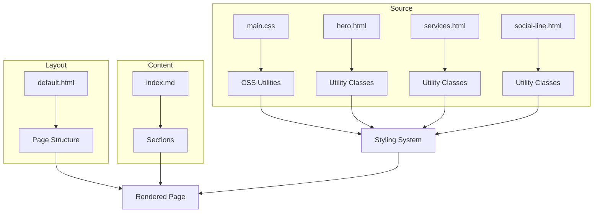
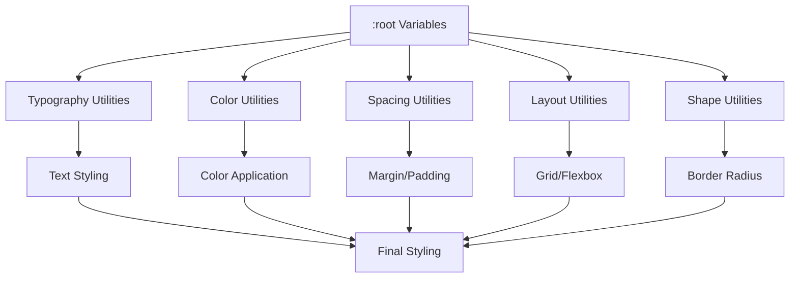
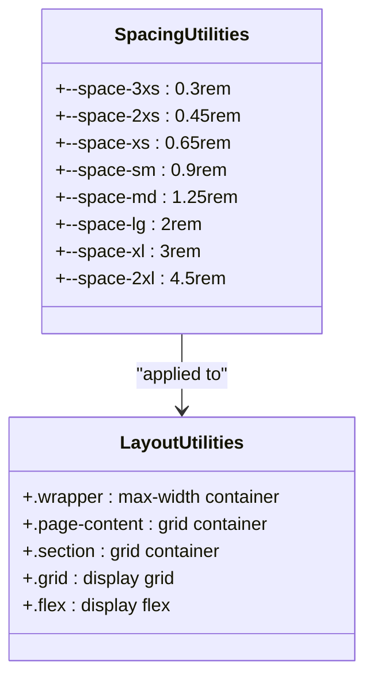
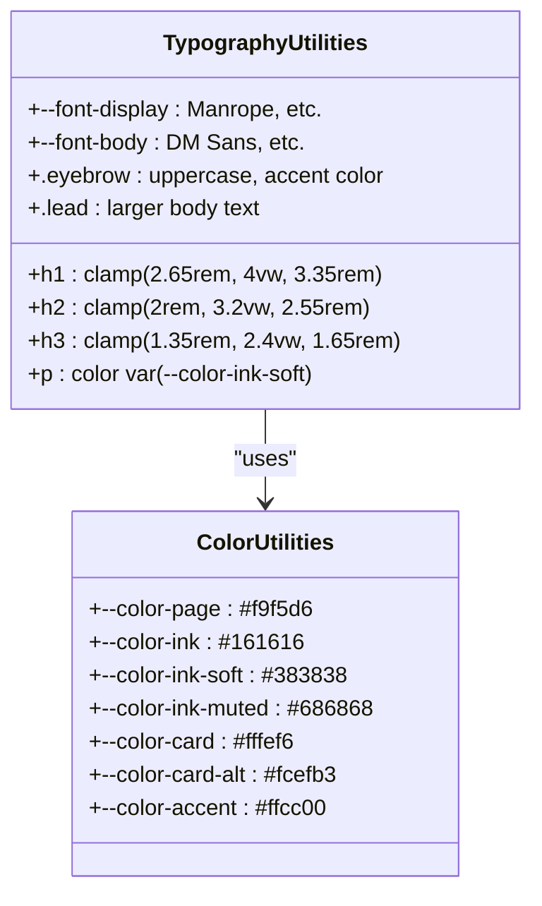
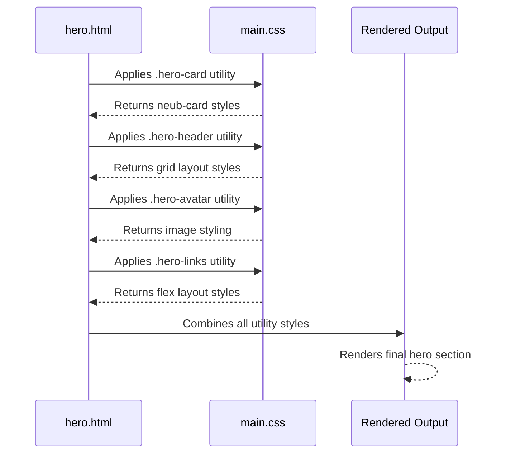
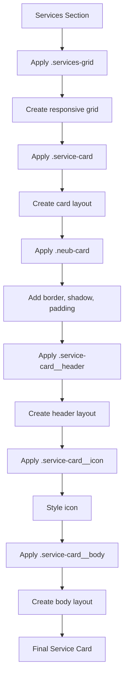
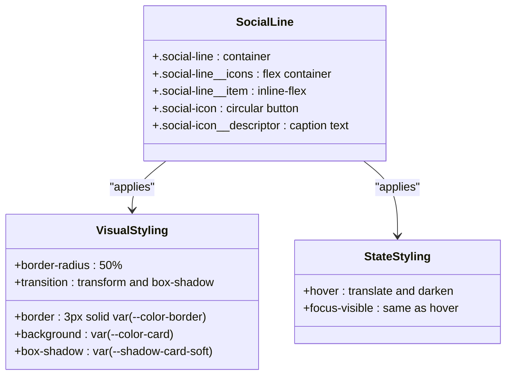
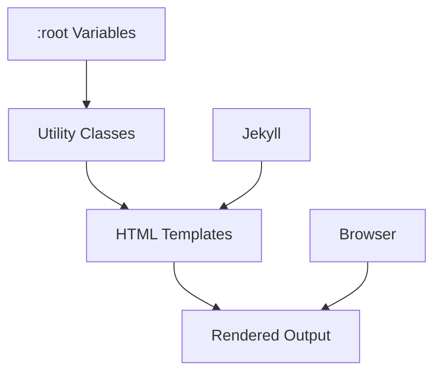

# CSS Architecture

<cite>
**Referenced Files in This Document**   
- [main.css](file://assets/main.css)
- [hero.html](file://_includes/sections/hero.html)
- [services.html](file://_includes/sections/services.html)
- [social-line.html](file://_includes/components/social-line.html)
- [default.html](file://_layouts/default.html)
- [DESIGN-SYSTEM.md](file://DESIGN-SYSTEM.md)
</cite>

## Table of Contents
1. [Introduction](#introduction)
2. [Project Structure](#project-structure)
3. [Core Components](#core-components)
4. [Architecture Overview](#architecture-overview)
5. [Detailed Component Analysis](#detailed-component-analysis)
6. [Dependency Analysis](#dependency-analysis)
7. [Performance Considerations](#performance-considerations)
8. [Troubleshooting Guide](#troubleshooting-guide)
9. [Conclusion](#conclusion)

## Introduction
This document details the utility-first CSS architecture implemented in the cv-ai project, focusing on the minimalist, non-abstractive styling system that adheres to neubrutalist design principles. The analysis covers the implementation of `main.css`, which avoids component-specific classes in favor of utility-level declarations for spacing, typography, and layout. The global styling rules for HTML elements enforce a consistent visual hierarchy across the site. The documentation includes examples of how utility classes are applied directly within HTML templates, discusses performance benefits of the lightweight CSS file, and provides guidance on extending styles while preserving the design system's constraints and philosophy.

## Project Structure
The project follows a Jekyll-based static site structure with clear separation between content, layout, and styling assets. The CSS architecture is centered around a single `main.css` file located in the `assets` directory, which implements a utility-first approach. The `_includes` directory contains reusable HTML components that directly apply utility classes, while the `_layouts` directory defines the overall page structure. Data-driven content is managed through YAML files in the `_data` directory, enabling consistent styling application across dynamically generated sections.

**Diagram sources**
- [main.css](file://assets/main.css#L0-L1195)
- [default.html](file://_layouts/default.html#L0-L47)
- [hero.html](file://_includes/sections/hero.html#L0-L55)

**Section sources**
- [main.css](file://assets/main.css#L0-L1195)
- [default.html](file://_layouts/default.html#L0-L47)

## Core Components
The utility-first CSS architecture in the cv-ai project is built around a minimal set of utility classes that provide spacing, typography, and layout controls without abstraction. The `main.css` file defines a comprehensive set of utility classes that are applied directly to HTML elements in the Jekyll templates. This approach eliminates the need for component-specific CSS classes, instead relying on a consistent vocabulary of utility declarations that can be combined to achieve the desired visual outcomes. The design system enforces neubrutalist principles through deliberate use of borders, shadows, and spacing to create a distinctive visual language that prioritizes clarity and functionality over decorative elements.

**Section sources**
- [main.css](file://assets/main.css#L0-L1195)
- [DESIGN-SYSTEM.md](file://DESIGN-SYSTEM.md#L0-L91)

## Architecture Overview
The CSS architecture follows a utility-first methodology where styling is applied directly through utility classes in the HTML templates. This approach eliminates the abstraction layer between CSS and HTML, resulting in a more transparent and maintainable styling system. The architecture is built on a foundation of CSS custom properties defined in the `:root` selector, which establish the design tokens for typography, color, spacing, and other visual elements. These tokens are then used throughout the utility classes to ensure consistency across the site.

**Diagram sources**
- [main.css](file://assets/main.css#L0-L47)
- [main.css](file://assets/main.css#L40-L135)

## Detailed Component Analysis

### Utility Class Implementation
The utility-first architecture in `main.css` implements a comprehensive set of utility classes that cover spacing, typography, layout, and visual styling. These classes are designed to be composable, allowing developers to build complex layouts by combining simple utility declarations. The system avoids creating component-specific classes, instead providing a consistent vocabulary of utility classes that can be applied across different contexts.

#### Spacing and Layout Utilities

**Diagram sources**
- [main.css](file://assets/main.css#L0-L47)
- [main.css](file://assets/main.css#L126-L142)

#### Typography Utilities

**Diagram sources**
- [main.css](file://assets/main.css#L0-L47)
- [main.css](file://assets/main.css#L40-L135)

### Component Implementation Examples

#### Hero Section Analysis
The hero section demonstrates the application of utility classes in a real-world component. The `hero.html` template applies a series of utility classes to create a visually distinctive section that adheres to neubrutalist principles. The implementation uses utility classes for layout, spacing, typography, and visual styling, avoiding any component-specific CSS.

**Diagram sources**
- [hero.html](file://_includes/sections/hero.html#L0-L55)
- [main.css](file://assets/main.css#L184-L235)

**Section sources**
- [hero.html](file://_includes/sections/hero.html#L0-L55)
- [main.css](file://assets/main.css#L184-L235)

#### Services Section Analysis
The services section further illustrates the utility-first approach, using a consistent set of utility classes to create a responsive grid of service cards. Each card uses the same utility classes for layout, spacing, and visual styling, demonstrating the reusability and consistency of the utility-first system.

**Diagram sources**
- [services.html](file://_includes/sections/services.html#L0-L41)
- [main.css](file://assets/main.css#L318-L362)

**Section sources**
- [services.html](file://_includes/sections/services.html#L0-L41)
- [main.css](file://assets/main.css#L318-L362)

#### Social Line Component Analysis
The social line component demonstrates how utility classes are used to create a consistent and reusable UI element. The component uses utility classes for layout, spacing, and visual styling, ensuring consistency across different contexts where it is used.

**Diagram sources**
- [social-line.html](file://_includes/components/social-line.html#L0-L41)
- [main.css](file://assets/main.css#L787-L815)

**Section sources**
- [social-line.html](file://_includes/components/social-line.html#L0-L41)
- [main.css](file://assets/main.css#L787-L815)

## Dependency Analysis
The CSS architecture has minimal dependencies, with the primary dependency being the Jekyll templating system that processes the HTML templates and applies the utility classes. The design system is self-contained within the `main.css` file, with no external CSS frameworks or libraries. The utility classes are defined using CSS custom properties in the `:root` selector, creating a dependency chain from the design tokens to the utility classes to the HTML templates.

**Diagram sources**
- [main.css](file://assets/main.css#L0-L47)
- [hero.html](file://_includes/sections/hero.html#L0-L55)

**Section sources**
- [main.css](file://assets/main.css#L0-L1195)
- [hero.html](file://_includes/sections/hero.html#L0-L55)

## Performance Considerations
The utility-first CSS architecture provides significant performance benefits due to its minimalist approach and lack of abstraction. The single `main.css` file is lightweight and highly cacheable, reducing HTTP requests and improving page load times. The absence of component-specific classes reduces CSS bloat and ensures that only the necessary styles are loaded. The use of CSS custom properties for design tokens enables efficient style changes without modifying multiple class definitions. The utility classes are designed to be composable, reducing the need for complex CSS selectors that can impact rendering performance.

**Section sources**
- [main.css](file://assets/main.css#L0-L1195)

## Troubleshooting Guide
When working with the utility-first CSS architecture, common issues typically relate to incorrect application of utility classes or misunderstanding of the design system's constraints. To troubleshoot styling issues, verify that the correct utility classes are applied to the HTML elements and that the design tokens in the `:root` selector are properly defined. Check for typos in class names and ensure that the utility classes are being applied in the correct order, as CSS specificity can affect the final styling. When extending the design system, ensure that new utility classes follow the existing naming conventions and design principles to maintain consistency.

**Section sources**
- [main.css](file://assets/main.css#L0-L1195)
- [DESIGN-SYSTEM.md](file://DESIGN-SYSTEM.md#L0-L91)

## Conclusion
The utility-first CSS architecture implemented in the cv-ai project provides a minimalist, non-abstractive styling system that aligns with neubrutalist principles. By relying on utility-level declarations for spacing, typography, and layout, the architecture eliminates the need for component-specific classes and promotes consistency across the site. The global styling rules for HTML elements enforce a clear visual hierarchy, while the use of CSS custom properties ensures maintainability and flexibility. The lightweight CSS file provides performance benefits, and the straightforward application of utility classes in HTML templates makes the system accessible and easy to understand. When extending the design system, developers should follow the existing patterns and constraints to preserve the integrity of the visual language.