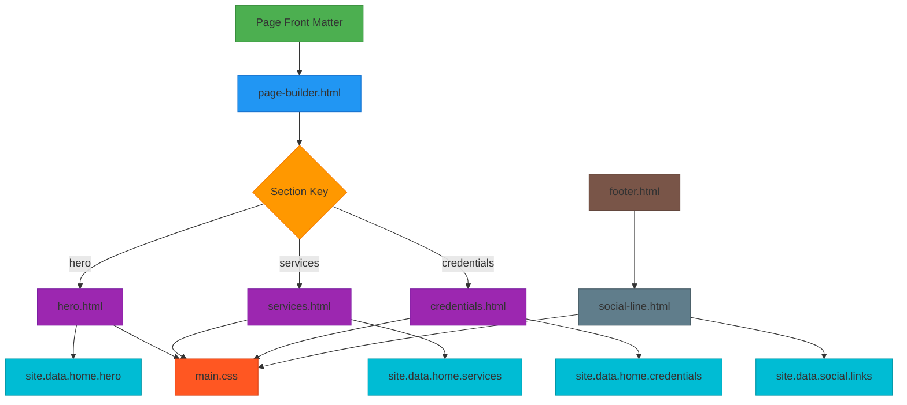
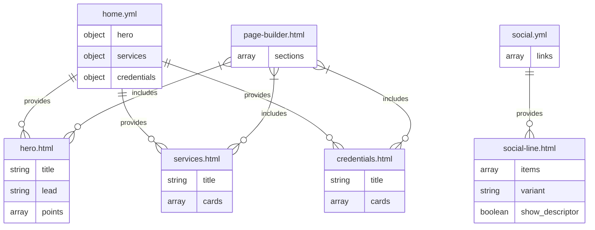
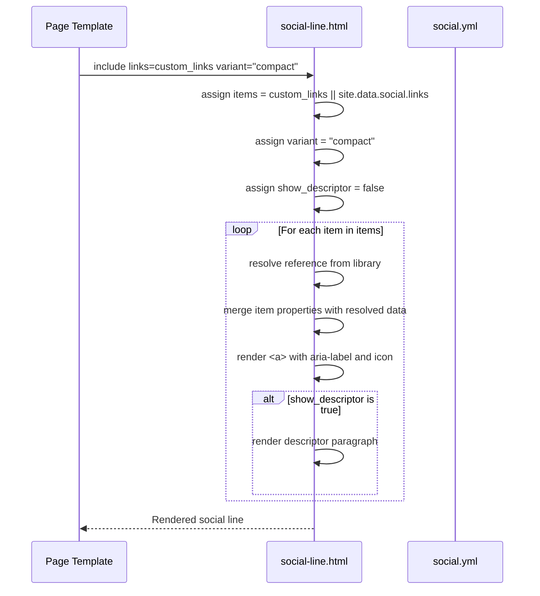
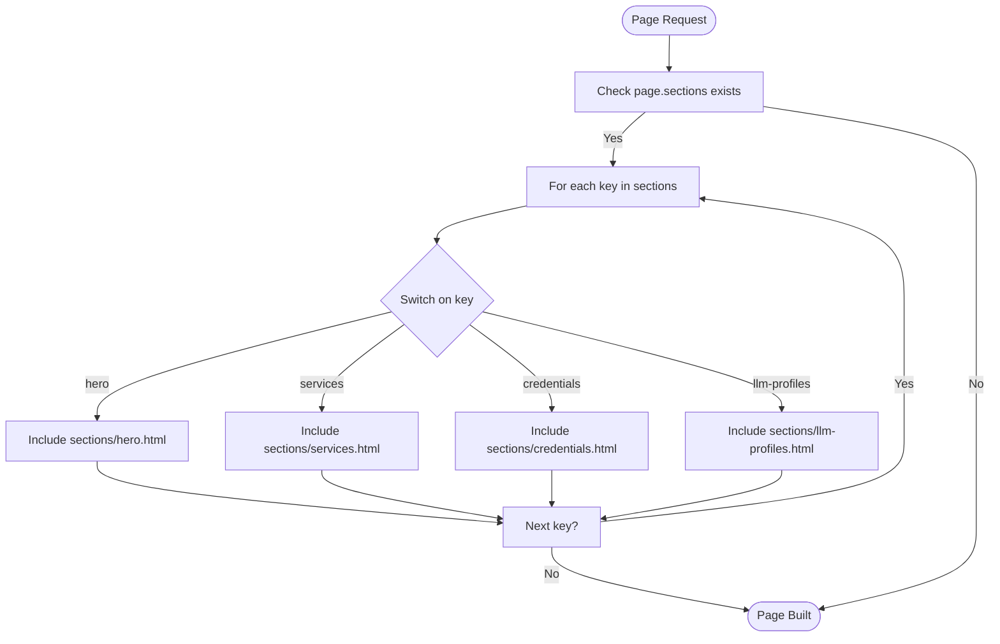

# Component Library

<cite>
**Referenced Files in This Document**   
- [social-line.html](file://_includes/components/social-line.html)
- [social.yml](file://_data/social.yml)
- [page-builder.html](file://_includes/page-builder.html)
- [hero.html](file://_includes/sections/hero.html)
- [services.html](file://_includes/sections/services.html)
- [credentials.html](file://_includes/sections/credentials.html)
- [main.css](file://assets/main.css)
- [DESIGN-SYSTEM.md](file://DESIGN-SYSTEM.md)
- [home.yml](file://_data/home.yml)
- [footer.html](file://_includes/footer.html)
</cite>

## Table of Contents
1. [Introduction](#introduction)
2. [Project Structure](#project-structure)
3. [Core Components](#core-components)
4. [Architecture Overview](#architecture-overview)
5. [Detailed Component Analysis](#detailed-component-analysis)
6. [Dependency Analysis](#dependency-analysis)
7. [Performance Considerations](#performance-considerations)
8. [Troubleshooting Guide](#troubleshooting-guide)
9. [Conclusion](#conclusion)

## Introduction
This document provides comprehensive documentation for the UI component library in the cv-ai project, focusing on reusable HTML partials located in `_includes/components` and `_includes/sections`. The system leverages Jekyll's Liquid templating engine to enable modular, data-driven UI composition. Components follow a neubrutalist aesthetic defined in the DESIGN-SYSTEM.md, emphasizing clarity, tactile feedback, and professional credibility. This documentation analyzes key components such as `social-line.html`, `hero.html`, `services.html`, and `credentials.html`, detailing their structure, data dependencies, and integration mechanisms via `page-builder.html`.

## Project Structure

```mermaid
graph TB
subgraph "Includes"
Components[_includes/components]
Sections[_includes/sections]
PageBuilder[_includes/page-builder.html]
Footer[_includes/footer.html]
end
subgraph "Data"
Data[_data]
SocialYml[_data/social.yml]
HomeYml[_data/home.yml]
end
subgraph "Assets"
CSS[assets/main.css]
end
Components --> |Used by| Sections
PageBuilder --> |Composes| Sections
Data --> |Provides data to| Sections
CSS --> |Styles| All[All components]
Footer --> |Includes| Components
style Components fill:#f9f,stroke:#333
style Sections fill:#f9f,stroke:#333
style Data fill:#bbf,stroke:#333
style CSS fill:#f96,stroke:#333
```

**Diagram sources**
- [social-line.html](file://_includes/components/social-line.html)
- [hero.html](file://_includes/sections/hero.html)
- [page-builder.html](file://_includes/page-builder.html)
- [home.yml](file://_data/home.yml)
- [social.yml](file://_data/social.yml)

**Section sources**
- [social-line.html](file://_includes/components/social-line.html)
- [hero.html](file://_includes/sections/hero.html)
- [page-builder.html](file://_includes/page-builder.html)

## Core Components

The component library is structured into two primary directories: `_includes/components` for atomic UI elements and `_includes/sections` for larger, page-level components. Components are composed using Liquid templating logic, allowing for flexible configuration through parameters and data files. The `page-builder.html` orchestrates section composition based on page configuration. The neubrutalist design is implemented through CSS variables and classes that emphasize tactile elevation, bold typography, and high contrast.

**Section sources**
- [social-line.html](file://_includes/components/social-line.html)
- [hero.html](file://_includes/sections/hero.html)
- [services.html](file://_includes/sections/services.html)
- [credentials.html](file://_includes/sections/credentials.html)

## Architecture Overview



**Diagram sources**
- [page-builder.html](file://_includes/page-builder.html)
- [hero.html](file://_includes/sections/hero.html)
- [services.html](file://_includes/sections/services.html)
- [credentials.html](file://_includes/sections/credentials.html)
- [social-line.html](file://_includes/components/social-line.html)
- [home.yml](file://_data/home.yml)
- [social.yml](file://_data/social.yml)
- [main.css](file://assets/main.css)

## Detailed Component Analysis

### Component Interface Patterns

The component library follows a consistent interface pattern using Liquid's `include` parameters. Components accept configuration through `include` variables with default fallbacks to site data. The pattern `assign variable = include.variable | default: site.data.source` ensures flexibility while maintaining data integrity. Components are designed to be composable, with clear separation between atomic components (in `/components`) and section components (in `/sections`).

**Section sources**
- [social-line.html](file://_includes/components/social-line.html)
- [hero.html](file://_includes/sections/hero.html)

### Data Dependencies and Composition Mechanisms

Components rely on structured data from YAML files in the `_data` directory. The `home.yml` file provides content for section components like `hero.html`, `services.html`, and `credentials.html`, while `social.yml` powers the `social-line.html` component. Data is accessed via `site.data` namespace, enabling centralized content management. The composition mechanism is driven by `page-builder.html`, which iterates over a page's `sections` array and includes the corresponding section partial based on a case statement.



**Diagram sources**
- [home.yml](file://_data/home.yml)
- [social.yml](file://_data/social.yml)
- [page-builder.html](file://_includes/page-builder.html)
- [hero.html](file://_includes/sections/hero.html)
- [services.html](file://_includes/sections/services.html)
- [credentials.html](file://_includes/sections/credentials.html)
- [social-line.html](file://_includes/components/social-line.html)

### Social-Line Component Analysis

The `social-line.html` component is a reusable partial for rendering social media links with consistent styling and accessibility features. It accepts parameters for customization including `library`, `links`, `variant`, and `show_descriptor`. The component resolves link data by merging inline parameters with references from the `social.yml` data file, enabling both direct specification and reference-based inclusion.



**Diagram sources**
- [social-line.html](file://_includes/components/social-line.html)
- [social.yml](file://_data/social.yml)

**Section sources**
- [social-line.html](file://_includes/components/social-line.html)
- [social.yml](file://_data/social.yml)

### Section Composition via Page-Builder

The `page-builder.html` component serves as the composition engine for the site, transforming a declarative list of section keys into a complete page layout. It uses a case statement to map section identifiers to their corresponding partials, enabling a clean separation between content structure and implementation. This mechanism allows pages to define their layout in front matter while reusing standardized section components.



**Diagram sources**
- [page-builder.html](file://_includes/page-builder.html)

**Section sources**
- [page-builder.html](file://_includes/page-builder.html)
- [index.md](file://index.md)

## Dependency Analysis

```mermaid
graph TD
A[index.md] --> B[page-builder.html]
B --> C[hero.html]
B --> D[services.html]
B --> E[credentials.html]
C --> F[home.yml]
D --> F
E --> F
C --> G[main.css]
D --> G
E --> G
H[footer.html] --> I[social-line.html]
I --> J[social.yml]
I --> G
style A fill:#2E7D32,stroke:#1B5E20
style B fill:#1565C0,stroke:#0D47A1
style C fill:#7B1FA2,stroke:#4A148C
style D fill:#7B1FA2,stroke:#4A148C
style E fill:#7B1FA2,stroke:#4A148C
style F fill:#00838F,stroke:#006064
style G fill:#C62828,stroke:#B71C1C
style H fill:#5D4037,stroke:#3E2723
style I fill:#424242,stroke:#212121
style J fill:#00838F,stroke:#006064
```



**Diagram sources**
- [index.md](file://index.md)
- [page-builder.html](file://_includes/page-builder.html)
- [hero.html](file://_includes/sections/hero.html)
- [services.html](file://_includes/sections/services.html)
- [credentials.html](file://_includes/sections/credentials.html)
- [home.yml](file://_data/home.yml)
- [main.css](file://assets/main.css)
- [footer.html](file://_includes/footer.html)
- [social-line.html](file://_includes/components/social-line.html)
- [social.yml](file://_data/social.yml)

**Section sources**
- [index.md](file://index.md)
- [page-builder.html](file://_includes/page-builder.html)
- [home.yml](file://_data/home.yml)
- [social.yml](file://_data/social.yml)

## Performance Considerations
The component library is designed for static site generation efficiency. All component logic is resolved at build time through Jekyll's Liquid engine, resulting in static HTML output with no client-side rendering overhead. The use of CSS custom properties and efficient selector patterns in main.css ensures fast style computation. The modular structure enables selective regeneration of pages when content changes, optimizing build performance.

## Troubleshooting Guide

When creating or modifying components, ensure that:
- Liquid variable assignments use proper default fallbacks
- Data references match the structure in YAML files
- CSS classes align with the neubrutalist aesthetic defined in DESIGN-SYSTEM.md
- Accessibility attributes (aria-label, aria-hidden) are properly applied
- Responsive behavior is tested across device sizes
- Component parameters are documented for reuse

**Section sources**
- [DESIGN-SYSTEM.md](file://DESIGN-SYSTEM.md)
- [main.css](file://assets/main.css)
- [legal/accessibility.md](file://legal/accessibility.md)

## Conclusion
The UI component library in the cv-ai project provides a robust, maintainable system for building consistent, accessible pages using Jekyll's include mechanism and Liquid templating. By separating concerns between data, presentation, and composition, the system enables efficient content updates and design consistency. The neubrutalist aesthetic is implemented through intentional CSS design that emphasizes tactile feedback and professional credibility. This documentation provides the foundation for understanding, using, and extending the component library while maintaining its core principles.