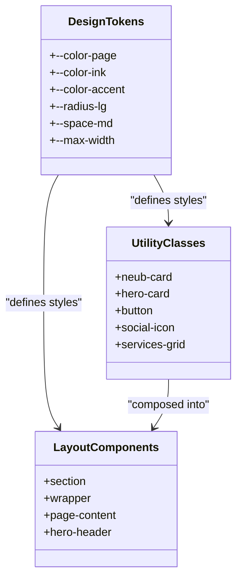
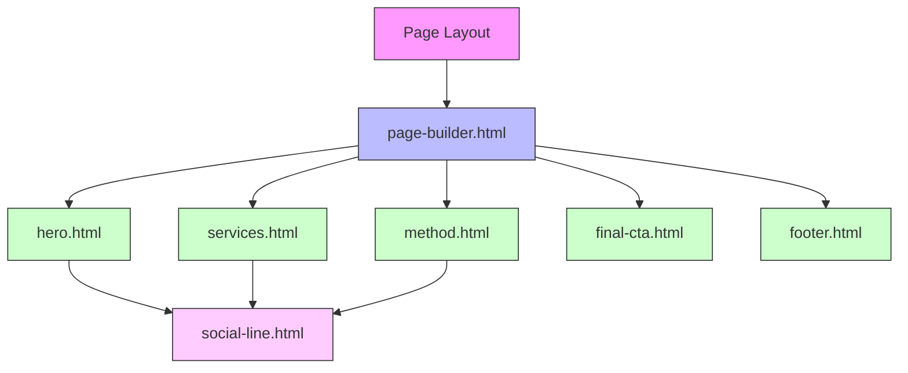
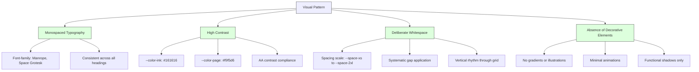
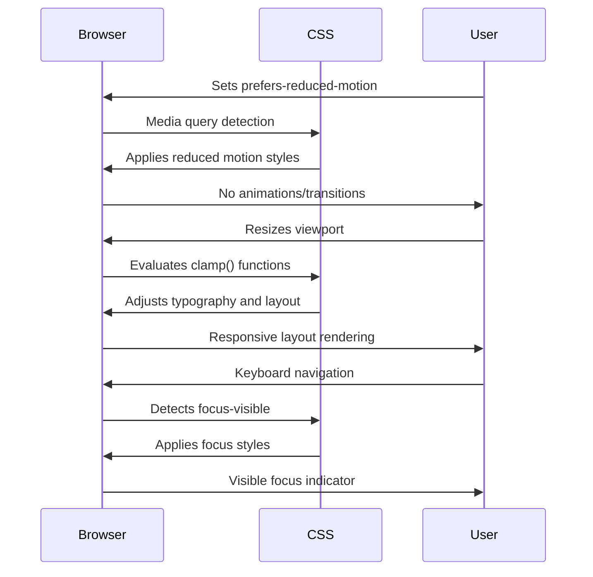

# Design System

<cite>
**Referenced Files in This Document**   
- [DESIGN-SYSTEM.md](file://DESIGN-SYSTEM.md)
- [main.css](file://assets/main.css)
- [social-line.html](file://_includes/components/social-line.html)
- [hero.html](file://_includes/sections/hero.html)
- [connect-hero.html](file://_includes/sections/connect-hero.html)
- [edu-hero.html](file://_includes/sections/edu-hero.html)
- [method.html](file://_includes/sections/method.html)
- [services.html](file://_includes/sections/services.html)
- [signals.html](file://_includes/sections/signals.html)
- [final-cta.html](file://_includes/sections/final-cta.html)
- [footer.html](file://_includes/footer.html)
- [page-builder.html](file://_includes/page-builder.html)
- [default.html](file://_layouts/default.html)
- [index.md](file://index.md)
- [edu.md](file://edu.md)
</cite>

## Table of Contents
1. [Neubrutalist Design Philosophy](#neubrutalist-design-philosophy)
2. [Utility-First CSS Architecture](#utility-first-css-architecture)
3. [Component Library Structure](#component-library-structure)
4. [Key Visual Patterns](#key-visual-patterns)
5. [Extending the Design System](#extending-the-design-system)
6. [Accessibility and Responsive Behavior](#accessibility-and-responsive-behavior)

## Neubrutalist Design Philosophy

The cv-ai project implements a neubrutalist design philosophy that prioritizes raw functionality, minimal abstraction, and typographic clarity. This approach emphasizes content and functionality over decorative elements, creating a direct and unambiguous user experience. The design system leverages high contrast between text and background elements, deliberate whitespace for visual hierarchy, and monospaced typography to establish a technical, no-nonsense aesthetic. Unlike traditional brutalism that embraces raw concrete textures, this neubrutalist interpretation uses clean geometric forms, sharp borders, and intentional shadows to create depth while maintaining digital precision. The absence of decorative elements focuses attention on content and interactions, reinforcing the professional credibility of the site's technical subject matter.

**Section sources**
- [DESIGN-SYSTEM.md](file://DESIGN-SYSTEM.md#L1-L90)
- [main.css](file://assets/main.css#L1-L1195)

## Utility-First CSS Architecture

The design system employs a utility-first CSS approach in main.css that enables rapid styling without abstraction layers. This methodology provides granular control through atomic classes that map directly to design tokens defined in the CSS `:root` variables. The stylesheet establishes a comprehensive foundation with utility classes for spacing (`--space-xs`, `--space-sm`, etc.), typography, layout, and visual effects. Rather than creating semantic component classes, the system relies on composable utility classes that can be combined to achieve desired layouts. This approach eliminates the need for custom CSS in most cases, as developers can achieve consistent styling by combining existing utility classes. The design tokens system ensures visual consistency across the site while allowing for easy updates by modifying variables in a single location.

**Diagram sources**
- [main.css](file://assets/main.css#L1-L100)
- [DESIGN-SYSTEM.md](file://DESIGN-SYSTEM.md#L1-L90)

**Section sources**
- [main.css](file://assets/main.css#L1-L1195)
- [DESIGN-SYSTEM.md](file://DESIGN-SYSTEM.md#L1-L90)

## Component Library Structure

The component library in `_includes/components` and `_includes/sections` provides reusable HTML partials that are composed into full pages. This modular architecture follows a hierarchical structure where atomic components in `/components` (like `social-line.html`) are used within more complex section components in `/sections`. The `page-builder.html` template orchestrates the composition process by including specific section components based on the page configuration in front matter. This approach enables consistent implementation of UI patterns across different pages while maintaining flexibility in page structure. For example, the `hero.html` section component incorporates the `social-line.html` component for social links, demonstrating how smaller components are nested within larger ones to create cohesive page layouts.

**Diagram sources**
- [page-builder.html](file://_includes/page-builder.html#L1-L40)
- [hero.html](file://_includes/sections/hero.html#L1-L55)
- [social-line.html](file://_includes/components/social-line.html#L1-L41)

**Section sources**
- [page-builder.html](file://_includes/page-builder.html#L1-L40)
- [hero.html](file://_includes/sections/hero.html#L1-L55)
- [services.html](file://_includes/sections/services.html#L1-L41)
- [method.html](file://_includes/sections/method.html#L1-L20)
- [signals.html](file://_includes/sections/signals.html#L1-L35)
- [final-cta.html](file://_includes/sections/final-cta.html#L1-L21)
- [footer.html](file://_includes/footer.html#L1-L29)

## Key Visual Patterns

The design system implements several key visual patterns that define its distinctive aesthetic. Monospaced typography is used consistently across headings and interface elements, establishing a technical, code-like atmosphere that reinforces the site's focus on technology and automation. High contrast between dark text (`--color-ink: #161616`) and light background (`--color-page: #f9f5d6`) ensures excellent readability while creating a bold visual impact. Deliberate whitespace is applied through a systematic spacing scale (`--space-xs` to `--space-2xl`) that creates rhythm and hierarchy without relying on decorative elements. The absence of decorative elements such as gradients, illustrations, or complex animations focuses attention on content and functionality. Card components use a distinctive shadow effect (`--shadow-card: 0.8rem 0.8rem 0 0 rgba(16, 16, 16, 0.9)`) that creates depth through offset rather than blur, aligning with the neubrutalist emphasis on geometric precision.

**Diagram sources**
- [main.css](file://assets/main.css#L1-L1195)
- [DESIGN-SYSTEM.md](file://DESIGN-SYSTEM.md#L1-L90)

**Section sources**
- [main.css](file://assets/main.css#L1-L1195)
- [DESIGN-SYSTEM.md](file://DESIGN-SYSTEM.md#L1-L90)

## Extending the Design System

To extend the design system with new components while maintaining aesthetic consistency, developers should follow established patterns and leverage existing design tokens. New components should be added to the appropriate directory (`_includes/components` for atomic elements, `_includes/sections` for page sections) and implemented using utility classes from main.css rather than introducing custom styles. When creating new components, developers should reuse existing design tokens (`--color-accent`, `--radius-lg`, etc.) to ensure visual harmony with the existing system. The component structure should follow the pattern demonstrated in `social-line.html`, using Jekyll includes with configurable parameters through the `include` object. New section components should be integrated into the `page-builder.html` template to make them available for use in page configurations. Documentation for new components should be added to DESIGN-SYSTEM.md to maintain a living system.

**Section sources**
- [DESIGN-SYSTEM.md](file://DESIGN-SYSTEM.md#L1-L90)
- [social-line.html](file://_includes/components/social-line.html#L1-L41)
- [page-builder.html](file://_includes/page-builder.html#L1-L40)

## Accessibility and Responsive Behavior

The design system incorporates accessibility considerations and responsive behavior to ensure usability across devices and assistive technologies. The color palette maintains WCAG AA contrast compliance, with sufficient contrast between text and background elements. Focus states are implemented using `:focus-visible` to provide clear visual indication for keyboard navigation without affecting mouse users. The system respects `prefers-reduced-motion` by disabling animations and transitions when users have indicated a preference for reduced motion. Responsive behavior is achieved through fluid typography using `clamp()` functions and flexible grid layouts that adapt to different screen sizes. The `page-content` container uses `min(1080px, 92vw)` to ensure content is accessible on both large and small screens. Interactive elements have appropriate tap targets, with social icons sized at 3rem (48px) to meet minimum touch target requirements.

**Diagram sources**
- [main.css](file://assets/main.css#L1-L1195)
- [DESIGN-SYSTEM.md](file://DESIGN-SYSTEM.md#L1-L90)

**Section sources**
- [main.css](file://assets/main.css#L1-L1195)
- [DESIGN-SYSTEM.md](file://DESIGN-SYSTEM.md#L1-L90)