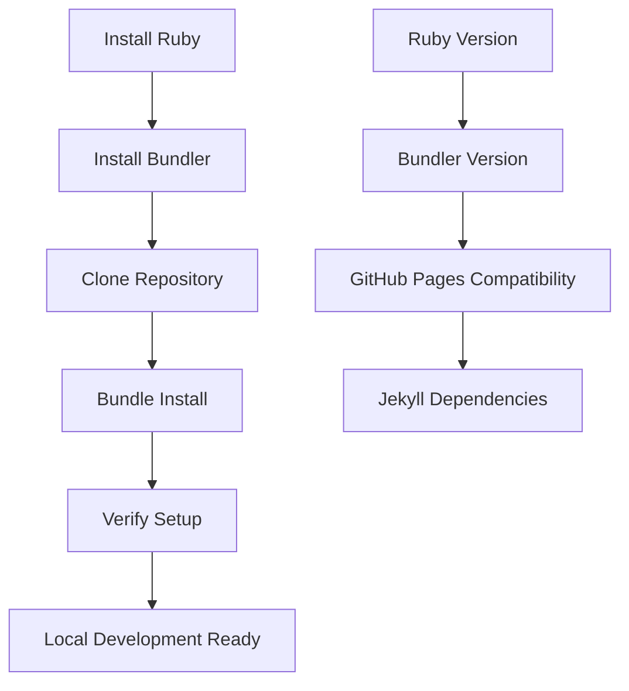
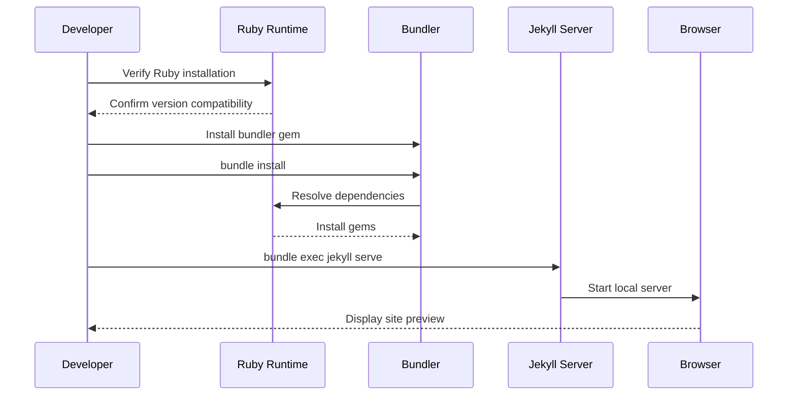
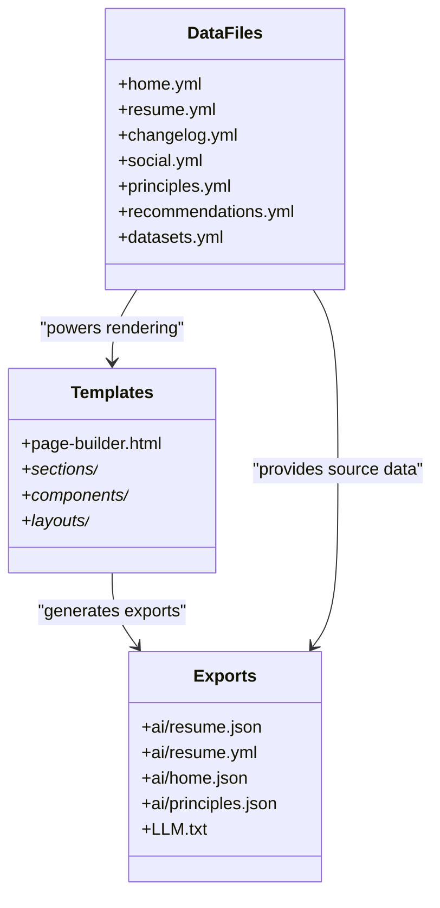
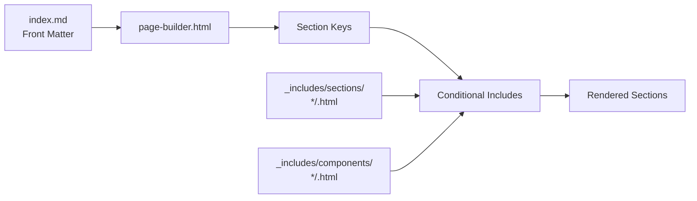
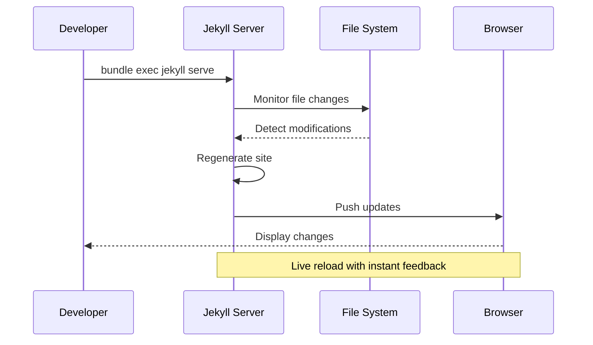
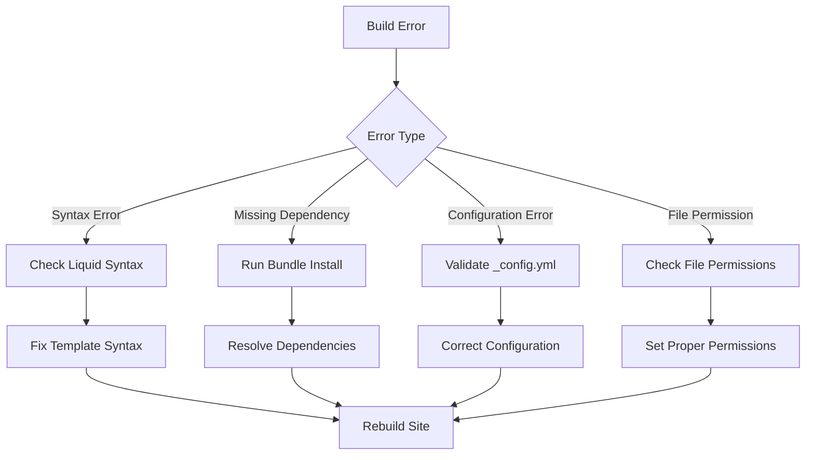
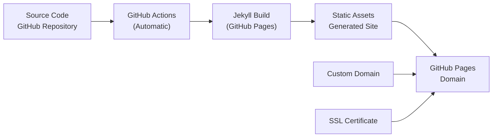

# Development Workflow

<cite>
**Referenced Files in This Document**
- [Gemfile](file://Gemfile)
- [_config.yml](file://_config.yml)
- [Gemfile.lock](file://Gemfile.lock)
- [README.md](file://README.md)
- [_data/home.yml](file://_data/home.yml)
- [_data/resume.yml](file://_data/resume.yml)
- [_data/changelog.yml](file://_data/changelog.yml)
- [_data/social.yml](file://_data/social.yml)
- [_includes/page-builder.html](file://_includes/page-builder.html)
- [_includes/head.html](file://_includes/head.html)
- [_layouts/default.html](file://_layouts/default.html)
- [index.md](file://index.md)
- [build_static_sitemap.py](file://bin/build_static_sitemap.py)
- [consulting_principles.md](file://_notes/consulting_principles.md)
- [ARCHITECTURE.md](file://ARCHITECTURE.md)
</cite>

## Table of Contents
1. [Introduction](#introduction)
2. [Environment Setup](#environment-setup)
3. [Local Development Environment](#local-development-environment)
4. [Content Development Cycle](#content-development-cycle)
5. [Site Preview and Auto-Regeneration](#site-preview-and-auto-regeneration)
6. [Common Development Tasks](#common-development-tasks)
7. [Troubleshooting Development Issues](#troubleshooting-development-issues)
8. [Performance Optimization](#performance-optimization)
9. [Deployment Process](#deployment-process)
10. [Repository Structure Impact](#repository-structure-impact)

## Introduction

The cv-ai project is a Jekyll-based static site generator designed for creating a professional personal brand website with AI-friendly content exports. The development workflow emphasizes rapid iteration, structured data management, and seamless integration between human-readable content and machine-readable APIs.

This comprehensive guide covers everything from initial environment setup to advanced deployment strategies, providing developers with the knowledge needed to effectively contribute to and maintain the site.

## Environment Setup

### Prerequisites

The cv-ai project requires Ruby and Bundler for local development. The project is configured to work with GitHub Pages, ensuring consistent deployment environments.



**Diagram sources**
- [Gemfile](file://Gemfile#L1-L5)
- [Gemfile.lock](file://Gemfile.lock#L1-L50)

### Ruby and Bundler Installation

The project uses GitHub Pages-compatible dependencies, requiring specific Ruby and Bundler versions for consistent deployment across environments.

**Section sources**
- [Gemfile](file://Gemfile#L1-L5)
- [Gemfile.lock](file://Gemfile.lock#L260-L266)

### Dependency Management

The project utilizes a streamlined dependency approach focusing on essential plugins for GitHub Pages compatibility:

- **github-pages**: Provides Jekyll and plugins compatible with GitHub Pages
- **webrick**: Enables local server functionality for development

**Section sources**
- [Gemfile](file://Gemfile#L1-L5)

## Local Development Environment

### Initial Setup Process

Setting up the local development environment involves several key steps that establish the foundation for productive development work.



**Diagram sources**
- [Gemfile](file://Gemfile#L1-L5)
- [_config.yml](file://_config.yml#L1-L51)

### Configuration Verification

The development environment relies on several configuration files that define site behavior, plugin settings, and content structure.

**Section sources**
- [_config.yml](file://_config.yml#L1-L51)

### Plugin Architecture

The site leverages essential Jekyll plugins for enhanced functionality:

- **jekyll-seo-tag**: Automatic SEO metadata generation
- **jekyll-sitemap**: Automatic sitemap generation
- **GitHub Pages plugins**: Extended functionality for static site hosting

**Section sources**
- [_config.yml](file://_config.yml#L25-L30)

## Content Development Cycle

### Data-Driven Architecture

The cv-ai project follows a data-driven content architecture where structured data in `_data/` files powers multiple presentation formats and export mechanisms.



**Diagram sources**
- [_data/home.yml](file://_data/home.yml#L1-L56)
- [_data/resume.yml](file://_data/resume.yml#L1-L441)
- [_includes/page-builder.html](file://_includes/page-builder.html#L1-L42)

### Content Model Structure

The project implements a hierarchical content model that separates data definition from presentation logic:

#### Homepage Content
- **Structure**: Defined in `_data/home.yml` with sections for hero, services, credentials, and LLM profiles
- **Rendering**: Controlled by `index.md` front matter and processed through `_includes/page-builder.html`
- **Sections**: Modular components in `_includes/sections/` for flexible composition

#### Resume Data
- **Centralized Storage**: Single source in `_data/resume.yml` powers both HTML display and JSON exports
- **Multi-format Output**: Generates `cv/index.html` and `/ai/resume.json` automatically
- **Structured Export**: Maintains consistency across different consumption contexts

#### Notes Collection
- **Individual Articles**: Stored as Markdown files in `_notes/`
- **Collection Defaults**: Configured in `_config.yml` for consistent URL structure
- **Layout Application**: Uses `_layouts/note.html` for unified presentation

**Section sources**
- [_data/home.yml](file://_data/home.yml#L1-L56)
- [_data/resume.yml](file://_data/resume.yml#L1-L441)
- [index.md](file://index.md#L1-L15)

### Template Composition System

The page-building system enables dynamic content composition through a modular template architecture:



**Diagram sources**
- [_includes/page-builder.html](file://_includes/page-builder.html#L1-L42)
- [index.md](file://index.md#L1-L15)

**Section sources**
- [_includes/page-builder.html](file://_includes/page-builder.html#L1-L42)

## Site Preview and Auto-Regeneration

### Local Server Configuration

The development server provides real-time preview capabilities with automatic regeneration triggered by file changes.



**Diagram sources**
- [_config.yml](file://_config.yml#L1-L51)

### Server Commands

The primary development command initiates the local server with automatic regeneration:

- **Command**: `bundle exec jekyll serve`
- **Features**: Live reload, automatic regeneration, development server
- **Port**: Default port 4000, configurable in `_config.yml`

### File Watching System

Jekyll's built-in file watching system monitors changes across the entire project structure:

- **Content Files**: `_data/`, `_includes/`, `_layouts/`, `_notes/`
- **Configuration**: `_config.yml`, Gemfile dependencies
- **Assets**: CSS, JavaScript, images in `assets/`

**Section sources**
- [_config.yml](file://_config.yml#L1-L51)

## Common Development Tasks

### Adding New Practitioner Notes

Creating new practitioner notes follows a standardized process that maintains consistency across the content collection.

#### Step 1: Create Note File
Add a new Markdown file to the `_notes/` directory with appropriate front matter:

```yaml
---
title: "Note Title"
description: "Brief description for SEO and social sharing"
subtitle: "Optional subtitle for visual hierarchy"
tags:
  - Category1
  - Category2
excerpt: "Short summary for listings"
further_reading:
  - label: "Related Topic"
    url: "/related-note/"
---
```

#### Step 2: Write Content
Structure the content using standard Markdown formatting with semantic HTML elements for optimal rendering.

#### Step 3: Configure Permalinks
The collection defaults in `_config.yml` ensure clean URL structure without manual permalink configuration.

**Section sources**
- [_notes/consulting_principles.md](file://_notes/consulting_principles.md#L1-L88)

### Updating Resume Information

Resume data serves as the single source of truth for both human-readable and machine-readable formats.

#### Data Structure Modification
Update the centralized resume data in `_data/resume.yml`:

- **Experience Entries**: Add new roles with start/end dates, company information, and detailed summaries
- **Education Records**: Update academic qualifications and certification information
- **Skill Categories**: Extend skill lists to reflect current expertise
- **Contact Information**: Maintain accurate contact details across all platforms

#### Automated Export Generation
Changes to `_data/resume.yml` automatically propagate to:
- `cv/index.html` for web display
- `/ai/resume.json` for API consumption
- `/ai/resume.yml` for direct YAML access

**Section sources**
- [_data/resume.yml](file://_data/resume.yml#L1-L441)

### Modifying Social Media Links

Social media configuration centralizes link management across multiple presentation contexts.

#### Update Social Configuration
Modify `_data/social.yml` to add, remove, or update social media links:

```yaml
links:
  - id: platform_identifier
    label: "Platform Name"
    handle: "@username"
    url: "https://platform.com/username"
    descriptor: "Description for hover tooltips"
    icon: "icon_class"
```

#### Automatic Component Updates
Changes automatically propagate to:
- Footer social links
- Header navigation
- Structured data metadata
- Social sharing buttons

**Section sources**
- [_data/social.yml](file://_data/social.yml#L1-L50)

### Creating New Homepage Sections

Adding new sections to the homepage requires coordination between data files, template inclusion, and page builder configuration.

#### Data Preparation
Define section structure in `_data/home.yml` or create new data files following the established patterns.

#### Template Integration
Add new section templates to the `_includes/sections/` directory with appropriate Liquid templating.

#### Page Builder Configuration
Update `index.md` front matter to include the new section identifier in the `sections:` array.

**Section sources**
- [_data/home.yml](file://_data/home.yml#L1-L56)
- [index.md](file://index.md#L1-L15)

## Troubleshooting Development Issues

### Gem Conflicts and Dependency Resolution

Gem conflicts often arise from version mismatches or incompatible plugin combinations.

#### Common Issues and Solutions

| Issue | Symptoms | Solution |
|-------|----------|----------|
| Bundle Install Failures | Dependency resolution errors | Check Gemfile.lock compatibility, update Ruby version |
| Plugin Conflicts | Build failures with plugin errors | Review plugin compatibility matrix in GitHub Pages documentation |
| Version Mismatches | Unexpected behavior or missing features | Align with GitHub Pages supported plugin versions |

#### Diagnostic Commands
```bash
# Check gem versions
bundle show

# Update dependencies
bundle update

# Clean installation
bundle install --force
```

**Section sources**
- [Gemfile.lock](file://Gemfile.lock#L1-L266)

### Port Availability Issues

Local development server port conflicts can interrupt the development workflow.

#### Port Conflict Resolution
- **Default Port**: 4000 (configurable in `_config.yml`)
- **Alternative Ports**: Specify custom port with `--port 4001`
- **Process Termination**: Identify and terminate conflicting processes

#### Network Configuration
Ensure firewall and network settings allow localhost connections for development server access.

### Build Errors and Recovery

Build errors can occur due to syntax issues, missing dependencies, or configuration problems.

#### Error Diagnosis Workflow


**Diagram sources**
- [_config.yml](file://_config.yml#L1-L51)

#### Recovery Strategies
- **Incremental Development**: Make small, testable changes
- **Version Control**: Use git for easy rollback capability
- **Backup Configuration**: Maintain working configurations in separate branches

**Section sources**
- [_config.yml](file://_config.yml#L1-L51)

## Performance Optimization

### Faster Local Serving Techniques

Optimizing local development performance enhances productivity and reduces iteration cycles.

#### Development Server Optimization
- **Selective Regeneration**: Exclude unnecessary files from watch list
- **Asset Optimization**: Minimize CSS and JavaScript bundle sizes
- **Caching Strategies**: Leverage browser caching for static assets

#### Memory Management
- **Resource Monitoring**: Track memory usage during large builds
- **Garbage Collection**: Optimize Ruby garbage collection settings
- **Concurrent Processing**: Utilize multiple CPU cores for parallel builds

#### Asset Pipeline Efficiency
The project implements efficient asset management through:
- **CSS Compression**: Automatic minification of stylesheets
- **Image Optimization**: Multiple format support (PNG, WebP, AVIF)
- **Lazy Loading**: Progressive enhancement for media content

**Section sources**
- [_includes/head.html](file://_includes/head.html#L1-L113)

### Development Workflow Optimization

Streamlining the development process improves overall productivity and reduces friction.

#### Incremental Development Practices
- **Atomic Changes**: Make small, focused modifications
- **Test-Driven Development**: Validate changes before committing
- **Continuous Integration**: Automated validation of changes

#### Tooling Integration
- **Code Editors**: Configure syntax highlighting and linting
- **Version Control**: Establish branching and merging strategies
- **Documentation**: Maintain up-to-date development guides

## Deployment Process

### GitHub Pages Integration

The cv-ai project leverages GitHub Pages for automated deployment with minimal configuration overhead.



**Diagram sources**
- [_config.yml](file://_config.yml#L1-L51)

### Repository Structure Impact

The project structure directly influences GitHub Pages automatic site generation capabilities.

#### Required Directory Structure
- **Root Files**: Configuration files, README, and essential assets
- **Jekyll Directories**: `_data/`, `_includes/`, `_layouts/`, `_notes/`
- **Collections**: Standard Jekyll collection structure for notes
- **Static Assets**: Optimized images and CSS in `assets/`

#### Automatic Generation Features
- **Sitemap Generation**: Automatic sitemap.xml creation
- **SEO Metadata**: Automatic meta tag generation
- **RSS Feeds**: Automatic changelog feed generation
- **JSON Exports**: Machine-readable content mirroring

**Section sources**
- [_config.yml](file://_config.yml#L1-L51)

### Deployment Validation

Ensuring successful deployment requires verification of multiple components.

#### Pre-deployment Checklist
- **Build Success**: Confirm local build completes without errors
- **Link Validation**: Verify internal and external links resolve
- **SEO Compliance**: Validate meta tags and structured data
- **Accessibility**: Test keyboard navigation and screen reader compatibility

#### Post-deployment Monitoring
- **Build Status**: Monitor GitHub Pages build logs
- **Performance Metrics**: Track site loading performance
- **Error Tracking**: Monitor for broken links and 404 errors

**Section sources**
- [README.md](file://README.md#L1-L25)

## Repository Structure Impact

### Automatic Site Generation

The cv-ai project structure is specifically designed to maximize GitHub Pages automatic generation capabilities.

#### Directory Organization Benefits
- **Predictable Paths**: Consistent URL structure for all content types
- **Plugin Compatibility**: Full compatibility with GitHub Pages plugins
- **Asset Management**: Efficient handling of static resources
- **Content Organization**: Clear separation of concerns across directories

#### Configuration Dependencies
The deployment process relies heavily on specific configuration patterns:

- **Collection Definitions**: Properly configured collections for notes
- **Plugin Activation**: Enabled plugins for enhanced functionality
- **Excluded Files**: Strategic exclusions for build optimization
- **Include Patterns**: Selective inclusion of important files

**Section sources**
- [_config.yml](file://_config.yml#L1-L51)
- [ARCHITECTURE.md](file://ARCHITECTURE.md#L1-L67)

### Extension and Maintenance

The modular architecture supports easy extension while maintaining deployment compatibility.

#### Adding New Collections
New collections can be added following the established patterns:
- Define collection in `_config.yml`
- Create appropriate directory structure
- Configure layouts and permalinks
- Update page builders for inclusion

#### Maintaining Compatibility
- **Version Alignment**: Keep GitHub Pages and local development versions aligned
- **Plugin Selection**: Choose plugins with GitHub Pages compatibility
- **Configuration Validation**: Regular validation of configuration files
- **Testing Strategy**: Comprehensive testing across environments

**Section sources**
- [_config.yml](file://_config.yml#L25-L35)
- [ARCHITECTURE.md](file://ARCHITECTURE.md#L60-L67)