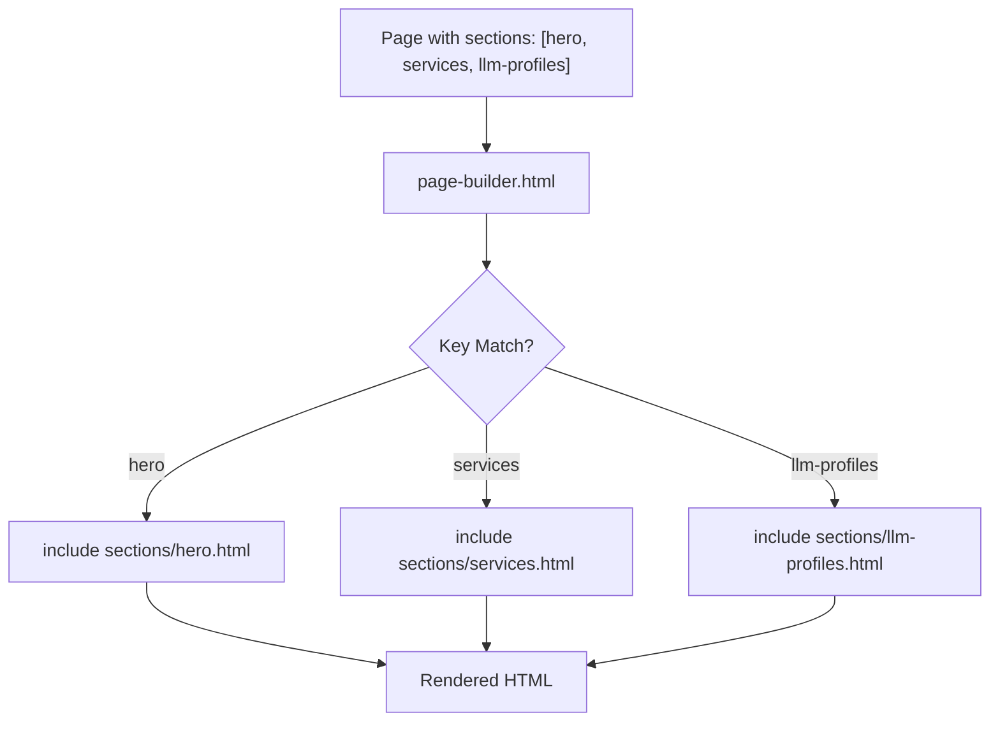

# Development Workflow

<cite>
**Referenced Files in This Document**   
- [README.md](file://README.md)
- [_config.yml](file://_config.yml)
- [ARCHITECTURE.md](file://ARCHITECTURE.md)
- [_notes/ai_ml.md](file://_notes/ai_ml.md)
- [_includes/page-builder.html](file://_includes/page-builder.html)
- [_layouts/note.html](file://_layouts/note.html)
- [assets/main.css](file://assets/main.css)
- [_includes/sections/llm-profiles.html](file://_includes/sections/llm-profiles.html)
- [_data/home.yml](file://_data/home.yml)
- [_data/resume.yml](file://_data/resume.yml)
- [_data/social.yml](file://_data/social.yml)
- [_includes/components/social-line.html](file://_includes/components/social-line.html)
- [_includes/sections/signals.html](file://_includes/sections/signals.html)
- [_data/principles.yml](file://_data/principles.yml)
</cite>

## Table of Contents
1. [Local Environment Setup](#local-environment-setup)
2. [Running the Site Locally](#running-the-site-locally)
3. [Creating New Notes](#creating-new-notes)
4. [Component Development Process](#component-development-process)
5. [Testing Strategy](#testing-strategy)
6. [Deployment to GitHub Pages](#deployment-to-github-pages)
7. [Debugging Common Issues](#debugging-common-issues)
8. [Productivity Tips](#productivity-tips)

## Local Environment Setup

To begin development on the cv-ai project, set up a local Jekyll environment using Ruby and Bundler. This static site is built with Jekyll 4 and follows GitHub Pages compatibility standards.

First, ensure Ruby is installed on your system (version 2.7 or higher recommended). Install Bundler via the command:
```bash
gem install bundler
```

Next, initialize a Gemfile in the project root if not already present, specifying the `github-pages` gem to align with GitHub's build environment:
```ruby
source "https://rubygems.org"
gem "github-pages", group: :jekyll_plugins
```

Then install all required dependencies:
```bash
bundle install
```

This installs Jekyll and associated plugins such as `jekyll-seo-tag` and `jekyll-sitemap`, which are defined in `_config.yml`.

**Section sources**
- [README.md](file://README.md#L4-L7)
- [_config.yml](file://_config.yml#L20-L22)

## Running the Site Locally

After setting up the environment, serve the site locally to preview changes in real time. Use the following command:
```bash
bundle exec jekyll serve
```

This starts a local server, typically accessible at `http://localhost:4000`. Jekyll automatically watches for file changes and regenerates the site, allowing immediate feedback during development.

The site configuration in `_config.yml` defines collections, permalinks, and default layouts. The `notes` collection, for example, outputs pages under `/notes/:slug/` using the `note.html` layout by default.

For faster iteration, exclude unnecessary files from regeneration by listing them under `exclude` in `_config.yml`, which already includes directories like `.gitignore`, `.github`, and `README.md`.

**Section sources**
- [README.md](file://README.md#L8-L9)
- [_config.yml](file://_config.yml#L23-L38)

## Creating New Notes

New content notes are added to the `_notes` directory as Markdown files. Each note must include YAML front matter with at least a `title` and `date`. Optional fields include `subtitle`, `tags`, `summary`, and `permalink`.

Example structure:
```yaml
---
title: "Understanding Composable ERP"
date: 2025-10-01
subtitle: "Modular systems over monolithic lock-in"
tags:
  - ERP
  - SAP
  - Architecture
permalink: /notes/composable-erp/
---
```

The note body uses standard Markdown syntax. Content is rendered using the `_layouts/note.html` template, which displays metadata, title, and body within a structured article layout. Tags are displayed as chips, and publication dates are formatted automatically.

Notes are automatically listed on the `/notes/` page (`notes/index.md`), which iterates over `site.notes` and applies consistent styling via `.notes-grid` and `.note-card` CSS classes.

**Section sources**
- [ARCHITECTURE.md](file://ARCHITECTURE.md#L45-L52)
- [_layouts/note.html](file://_layouts/note.html#L1-L47)
- [_notes/ai_ml.md](file://_notes/ai_ml.md#L1-L115)

## Component Development Process

Reusable UI components are stored in the `_includes` directory, organized into subdirectories: `components/`, `sections/`, and `seo/`. To create a new component:

1. Add a new `.html` file under the appropriate subdirectory.
2. Use semantic class names consistent with the design system (e.g., `neub-card`, `section`, `button--primary`).
3. Style new elements in `assets/main.css` using existing CSS custom properties (e.g., `--color-accent`, `--radius-lg`).

For example, `_includes/components/social-line.html` renders social media links using data from `_data/social.yml`. It supports variants (e.g., compact mode) and accepts parameters like `show_descriptor` for conditional rendering.

Section components (e.g., `hero.html`, `llm-profiles.html`) are composed via `page-builder.html`, which uses a `case` statement to include partials based on the `sections` array defined in page front matter.



**Diagram sources**
- [_includes/page-builder.html](file://_includes/page-builder.html#L1-L40)
- [_data/home.yml](file://_data/home.yml#L1-L55)
- [_includes/sections/llm-profiles.html](file://_includes/sections/llm-profiles.html#L1-L12)

**Section sources**
- [ARCHITECTURE.md](file://ARCHITECTURE.md#L28-L35)
- [_includes/page-builder.html](file://_includes/page-builder.html#L1-L40)
- [assets/main.css](file://assets/main.css#L1-L1195)

## Testing Strategy

Ensure site quality through a multi-layered testing approach:

### HTML Validation
Use online validators or local tools like `html-proofer` to verify markup correctness. Run after site generation:
```bash
bundle exec htmlproofer ./_site --disable-external
```

### Link Checking
Validate internal and external links to prevent broken references. The `htmlproofer` tool checks all anchor tags and image sources.

### Cross-Browser Testing
Manually test in major browsers (Chrome, Firefox, Safari, Edge) to ensure consistent rendering. Pay special attention to:
- Neubrutalist shadows and transforms
- Responsive grid behavior at breakpoints (960px, 720px, 540px)
- Focus states and hover effects

### Accessibility
Verify contrast ratios, keyboard navigation, and screen reader compatibility. Use browser dev tools and automated checkers like axe or Lighthouse.

### CSS Consistency
Avoid inline styles. All styling is centralized in `assets/main.css` using a design token system (e.g., `--color-card`, `--space-lg`). New components should reuse utility classes like `.button`, `.neub-card`, and `.chip-list`.

**Section sources**
- [ARCHITECTURE.md](file://ARCHITECTURE.md#L60-L68)
- [assets/main.css](file://assets/main.css#L1-L1195)
- [_includes/components/social-line.html](file://_includes/components/social-line.html#L1-L41)

## Deployment to GitHub Pages

The site is deployed automatically via GitHub Actions to GitHub Pages. The repository is configured to publish from the `main` branch root directory.

No additional configuration is needed beyond ensuring:
- `_config.yml` sets `url: "https://dkharlanau.github.io"` and `baseurl: ""`
- Required plugins are listed under `plugins`
- The `Gemfile` includes `github-pages`

Pushing changes to the `main` branch triggers the CI/CD pipeline, which:
1. Installs Ruby and Bundler
2. Runs `bundle install`
3. Executes `jekyll build`
4. Deploys the `_site` directory to GitHub Pages

The workflow is managed by GitHub’s built-in Jekyll support, ensuring fast, reliable, and secure deployments.

**Section sources**
- [README.md](file://README.md#L9-L10)
- [_config.yml](file://_config.yml#L3-L4)

## Debugging Common Issues

### Liquid Template Errors
Common causes include:
- Mismatched variable names (e.g., `page.titles` vs `page.title`)
- Incorrect filter usage (e.g., `| date: "%Y"` on non-date values)
- Missing data files or incorrect paths in `site.data`

Use `{{ page | inspect }}` or `{{ site | inspect }}` to debug context. Check console output during `jekyll serve` for detailed error messages.

### Data Binding Problems
Ensure YAML data files in `_data/` are correctly formatted. For example, `_data/home.yml` powers the homepage sections. If a section does not render:
- Verify the key exists (e.g., `services`, `llm_profiles`)
- Check that `page-builder.html` includes the corresponding `when` clause
- Confirm front matter in `index.md` includes the section in the `sections` array

### CSS Conflicts
Avoid specificity wars by following the naming convention:
- Layouts: `.section`, `.hero-card`
- Components: `.neub-card`, `.social-line`
- Utilities: `.button--primary`, `.link-arrow`

Use browser dev tools to inspect computed styles. All custom properties are defined in `:root` for easy override.

```mermaid
classDiagram
class NoteLayout {
+title
+subtitle
+date
+tags
+render_body()
+format_date()
}
class PageBuilder {
+sections[]
+build_page()
}
class SocialLine {
+library[]
+links[]
+variant
+show_descriptor
+render_icons()
}
class Config {
+title
+url
+plugins[]
+collections
}
NoteLayout --> Config : "uses site config"
PageBuilder --> Config : "reads page.sections"
SocialLine --> "_data/social.yml" : "uses data"
PageBuilder --> "sections/*.html" : "includes partials"
```

**Diagram sources**
- [_layouts/note.html](file://_layouts/note.html#L1-L47)
- [_includes/page-builder.html](file://_includes/page-builder.html#L1-L40)
- [_includes/components/social-line.html](file://_includes/components/social-line.html#L1-L41)
- [_config.yml](file://_config.yml#L1-L50)

**Section sources**
- [_includes/sections/signals.html](file://_includes/sections/signals.html#L1-L35)
- [_data/social.yml](file://_data/social.yml#L1-L50)
- [_data/home.yml](file://_data/home.yml#L1-L55)

## Productivity Tips

- **Use Live Reload**: `jekyll serve` automatically regenerates the site on file save. Combine with browser auto-refresh for instant feedback.
- **Modular Editing**: Update content in `_data/` files (e.g., `_data/resume.yml`) to propagate changes across multiple pages (e.g., `cv/index.html`, `ai/resume.json`).
- **Front Matter Templates**: Create editor snippets for common note and page front matter to reduce repetition.
- **Component Reuse**: Leverage existing `_includes` like `social-line.html` with parameters instead of duplicating markup.
- **AI Surface Updates**: When adding new structured data, mirror it in `/ai/` as JSON for LLM accessibility (e.g., `ai/home.json`).
- **Consistent Styling**: Rely on `assets/main.css` tokens and utility classes rather than writing new CSS rules.
- **Version Control**: Commit small, atomic changes with descriptive messages to simplify debugging and collaboration.

**Section sources**
- [ARCHITECTURE.md](file://ARCHITECTURE.md#L54-L68)
- [_data/resume.yml](file://_data/resume.yml#L1-L441)
- [_data/principles.yml](file://_data/principles.yml#L1-L81)