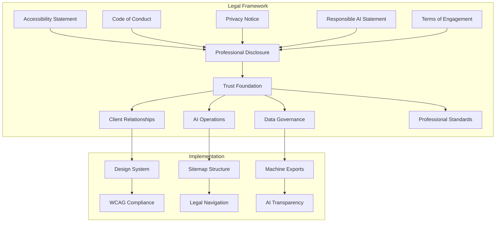
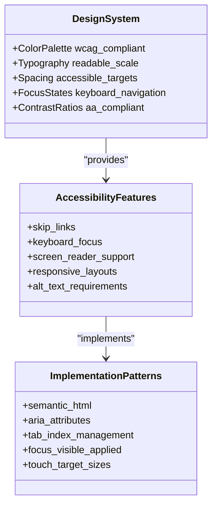
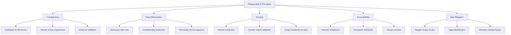
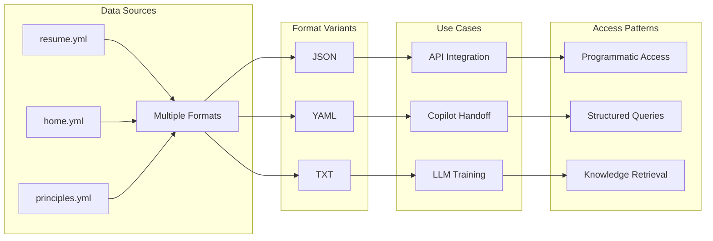

# Legal & Compliance

<cite>
**Referenced Files in This Document**
- [legal/accessibility.md](file://legal/accessibility.md)
- [legal/code-of-conduct.md](file://legal/code-of-conduct.md)
- [legal/privacy.md](file://legal/privacy.md)
- [legal/professional-disclosure.md](file://legal/professional-disclosure.md)
- [legal/responsible-ai.md](file://legal/responsible-ai.md)
- [legal/terms-of-engagement.md](file://legal/terms-of-engagement.md)
- [DESIGN-SYSTEM.md](file://DESIGN-SYSTEM.md)
- [_config.yml](file://_config.yml)
- [robots.txt](file://robots.txt)
- [assets/main.css](file://assets/main.css)
- [_includes/footer.html](file://_includes/footer.html)
- [_layouts/default.html](file://_layouts/default.html)
- [ai/resume.json](file://ai/resume.json)
- [ai/home.json](file://ai/home.json)
- [LLM.txt](file://LLM.txt)
- [ai/sitemap.xml](file://ai/sitemap.xml)
- [sitemap-data.xml](file://sitemap-data.xml)
</cite>

## Table of Contents
1. [Introduction](#introduction)
2. [Legal Framework Overview](#legal-framework-overview)
3. [Policy Documents Analysis](#policy-documents-analysis)
4. [Accessibility Implementation](#accessibility-implementation)
5. [Responsible AI Framework](#responsible-ai-framework)
6. [Data Protection & Privacy](#data-protection--privacy)
7. [Professional Disclosure](#professional-disclosure)
8. [Terms of Engagement](#terms-of-engagement)
9. [Machine-Readable Data Export](#machine-readable-data-export)
10. [Jurisdictional Considerations](#jurisdictional-considerations)
11. [Update Processes](#update-processes)
12. [Implementation Recommendations](#implementation-recommendations)

## Introduction

The cv-ai site establishes a comprehensive legal and compliance framework designed to foster trust, transparency, and accountability in professional consulting relationships. This framework encompasses six core policy documents that collectively define the operational standards, ethical guidelines, and technical responsibilities governing the site's interactions with clients, partners, and AI systems.

The legal framework serves multiple audiences: individual clients seeking consulting services, AI agents accessing machine-readable data, and the broader professional community interested in responsible technology practices. Each policy document addresses specific compliance requirements while maintaining consistency in tone, scope, and enforcement mechanisms.

## Legal Framework Overview

The legal framework consists of six interconnected policy documents that establish a cohesive compliance ecosystem:

**Diagram sources**
- [legal/accessibility.md](file://legal/accessibility.md#L1-L29)
- [legal/code-of-conduct.md](file://legal/code-of-conduct.md#L1-L43)
- [legal/privacy.md](file://legal/privacy.md#L1-L41)
- [legal/professional-disclosure.md](file://legal/professional-disclosure.md#L1-L36)
- [legal/responsible-ai.md](file://legal/responsible-ai.md#L1-L32)
- [legal/terms-of-engagement.md](file://legal/terms-of-engagement.md#L1-L55)

The framework operates on three fundamental principles: transparency in AI operations, adherence to professional standards, and protection of user rights. These principles are embedded across all policy documents and technical implementations.

**Section sources**
- [legal/accessibility.md](file://legal/accessibility.md#L1-L29)
- [legal/code-of-conduct.md](file://legal/code-of-conduct.md#L1-L43)
- [legal/privacy.md](file://legal/privacy.md#L1-L41)
- [legal/professional-disclosure.md](file://legal/professional-disclosure.md#L1-L36)
- [legal/responsible-ai.md](file://legal/responsible-ai.md#L1-L32)
- [legal/terms-of-engagement.md](file://legal/terms-of-engagement.md#L1-L55)

## Policy Documents Analysis

### Accessibility Statement

The Accessibility Statement demonstrates a commitment to inclusive digital experiences, aligning with WCAG AA standards and providing multiple pathways for users to engage with content effectively.

**Purpose and Scope**: Establishes baseline accessibility requirements for the website and consulting deliverables, covering semantic HTML implementation, colour contrast ratios, and keyboard navigation support.

**Key Implementation Details**:
- Semantic HTML structure with proper heading hierarchies
- WCAG AA compliant colour palette with 4.5:1 minimum contrast ratios
- Skip-link navigation for screen reader and keyboard users
- Responsive design patterns that adapt to various screen sizes
- Automated testing integration with tools like WAVE and axe

**Audience Segmentation**: Targets users with disabilities, including visual impairments, motor disabilities, and cognitive accessibility needs. The statement explicitly acknowledges third-party content accessibility limitations and outlines collaborative approaches to address gaps.

### Code of Conduct

The Professional Code of Conduct sets ethical standards for client work and collaborations, operating under EPAM Systems consulting discipline requirements.

**Purpose and Scope**: Defines behavioral expectations for client interactions, confidentiality management, and ethical delivery practices across all consulting engagements.

**Core Principles**:
- **Confidentiality**: Strict adherence to contractual and regulatory boundaries
- **Ethical Delivery**: Realistic scope setting and prompt blocker identification
- **Collaboration**: Transparent communication and inclusive working practices
- **Security**: Compliance with EPAM Systems security baselines and client requirements
- **Continuous Improvement**: Ongoing skill development and feedback incorporation

**Enforcement Mechanisms**: The code establishes clear escalation procedures for confidentiality breaches and provides multiple communication channels for reporting concerns.

### Privacy Notice

The Privacy Notice governs personal data handling across site interactions and consulting services, establishing data collection, processing, and retention policies.

**Purpose and Scope**: Provides transparency about data collection practices, processing purposes, and user rights across all platform interactions.

**Data Categories**:
- **Site Visit Data**: GitHub Pages hosting logs, IP addresses, browser information
- **Contact Data**: LinkedIn and Calendly submissions for engagement coordination
- **AI-Ready Downloads**: Machine-readable assets containing public professional profile data
- **Engagement Data**: Communications and documentation from paid work

**User Rights Framework**: Establishes clear procedures for data access, correction, deletion, and complaint resolution through multiple contact channels.

### Professional Disclosure

The Professional Disclosure document manages employment relationships, affiliations, and conflict of interest declarations.

**Purpose and Scope**: Ensures transparency about employment status, certifications, and potential conflicts across all professional activities.

**Key Elements**:
- **Employment Status**: Clear distinction between EPAM Systems and independent engagements
- **Affiliations**: SAP certification details and community participation
- **Conflict Management**: Proactive disclosure and declination procedures
- **Communication Channels**: Standardized pathways for business inquiries

**Independence Assurance**: The document explicitly states that technology recommendations are based on programmatic fit rather than commercial incentives.

### Responsible AI Statement

The Responsible AI Statement governs AI tool usage across consulting engagements and website operations, establishing ethical guidelines for artificial intelligence applications.

**Purpose and Scope**: Provides comprehensive guidance on AI tool usage, data handling, and accountability mechanisms in professional consulting contexts.

**Guiding Principles**:
- **Transparency**: Mandatory disclosure of AI tool usage with human review requirements
- **Data Minimization**: Use of only necessary data with confidentiality protection
- **Security**: Compliance with EPAM Systems and client security standards
- **Accountability**: Human ownership of AI-generated outcomes
- **Bias Mitigation**: Regular review for bias and gaps in AI outputs

**Implementation Areas**:
- **Project Usage**: AI copilots for requirements analysis, documentation, and incident triage
- **Integration Practices**: Model architecture, data retention, and guardrails documentation
- **Website Tooling**: AI-assisted content maintenance with manual editing oversight

### Terms of Engagement

The Terms of Engagement document standardizes consulting collaboration frameworks, defining scope, deliverables, and governance structures.

**Purpose and Scope**: Establishes baseline terms for consulting collaborations, covering scope definition, fee structures, and intellectual property arrangements.

**Key Components**:
- **Scope Management**: Written statements of work with change control procedures
- **Fee Structures**: Flexible pricing models with invoice and expense management
- **Collaboration Commitments**: Stakeholder designation and progress reporting requirements
- **Intellectual Property**: Clear ownership definitions with third-party licensing considerations
- **Confidentiality**: Post-engagement confidentiality obligations

**Risk Management**: Includes non-solicitation clauses and liability limitations with governing law determinations.

**Section sources**
- [legal/accessibility.md](file://legal/accessibility.md#L1-L29)
- [legal/code-of-conduct.md](file://legal/code-of-conduct.md#L1-L43)
- [legal/privacy.md](file://legal/privacy.md#L1-L41)
- [legal/professional-disclosure.md](file://legal/professional-disclosure.md#L1-L36)
- [legal/responsible-ai.md](file://legal/responsible-ai.md#L1-L32)
- [legal/terms-of-engagement.md](file://legal/terms-of-engagement.md#L1-L55)

## Accessibility Implementation

The accessibility framework integrates WCAG AA compliance principles throughout the design system and technical implementations, ensuring inclusive user experiences across diverse assistive technologies.

### Design System Accessibility Features

The Runway Design System embeds accessibility considerations as foundational principles, with specific implementations supporting multiple user needs:

**Diagram sources**
- [DESIGN-SYSTEM.md](file://DESIGN-SYSTEM.md#L1-L91)
- [assets/main.css](file://assets/main.css#L1121-L1196)

**Technical Implementation Details**:
- **Colour Contrast**: All accent-on-white combinations achieve WCAG AA contrast ratios (~5.6:1)
- **Keyboard Navigation**: Focus states implemented using `:focus-visible` for both keyboard and mouse users
- **Skip Links**: Positioned off-screen initially, activated on focus to provide main content access
- **Touch Targets**: Minimum 44px dimensions for interactive elements, particularly social buttons
- **Responsive Design**: Breakpoints at 960px, 720px, and 540px ensure usability across devices

### Structural Accessibility Measures

The website incorporates semantic HTML structures and ARIA attributes to enhance accessibility across different user scenarios:

**Navigation Structure**:
- Hierarchical heading organization with logical content flow
- Skip-link implementation in the default layout for rapid content access
- Consistent button and link styling with appropriate focus indicators

**Content Organization**:
- Card-based layouts with clear visual hierarchy
- Grid systems that adapt to screen size limitations
- Proper landmark roles and sectioning for screen reader navigation

**Third-Party Content Considerations**: The accessibility statement acknowledges that embedded documents hosted by partners may have separate accessibility provisions, with collaborative efforts to address identified gaps.

**Section sources**
- [DESIGN-SYSTEM.md](file://DESIGN-SYSTEM.md#L1-L91)
- [assets/main.css](file://assets/main.css#L1121-L1196)
- [legal/accessibility.md](file://legal/accessibility.md#L1-L29)
- [_layouts/default.html](file://_layouts/default.html#L1-L23)

## Responsible AI Framework

The Responsible AI framework establishes comprehensive guidelines for AI tool usage across consulting engagements and website operations, emphasizing transparency, accountability, and ethical considerations.

### AI Usage Principles

The framework articulates five core principles that govern AI tool applications:

**Diagram sources**
- [legal/responsible-ai.md](file://legal/responsible-ai.md#L1-L32)

### Project Implementation Practices

**Development Phase**:
- AI copilots support requirements analysis, documentation drafting, and knowledge base maintenance
- Incident triage assistance through AI-powered problem identification and resolution guidance
- Model architecture, data retention, and guardrails documentation before deployment

**Integration Phase**:
- Comprehensive documentation of AI system configurations and operational parameters
- Approval processes for model selection, data handling, and security requirements
- Training procedures for team members working with AI-generated content

**Operational Phase**:
- Ongoing monitoring dashboards tracking accuracy, drift, and user feedback
- Regular reviews of AI outputs for bias detection and gap identification
- Continuous improvement processes based on performance metrics and user feedback

### Website AI Tooling

The website incorporates AI assistance in content creation and maintenance while maintaining editorial control:

**Content Generation**:
- AI assistance in maintaining structured resume formats
- Copywriting support with manual editing requirements before publication
- Automated content updates with human oversight

**Machine-Readable Exports**:
- Intentional provision of structured data formats for AI copilot integration
- JSON, YAML, and TXT formats for different use cases and technical requirements
- Dedicated LLM profile for AI agent discovery and interaction

**Export Management**:
- Regular updates to ensure data accuracy and relevance
- Version control through changelog systems
- Accessibility considerations for machine-readable formats

**Section sources**
- [legal/responsible-ai.md](file://legal/responsible-ai.md#L1-L32)
- [ai/resume.json](file://ai/resume.json#L1-L7)
- [ai/home.json](file://ai/home.json#L1-L7)
- [LLM.txt](file://LLM.txt#L1-L95)

## Data Protection & Privacy

The privacy framework establishes comprehensive data governance practices across all platform interactions, ensuring compliance with evolving privacy regulations and user expectations.

### Data Collection Framework

**Site Interaction Data**:
- **GitHub Pages Hosting**: Standard log data collection including IP addresses and browser information
- **Analytics Practices**: Aggregated traffic metrics for high-level engagement understanding
- **Tracking Policies**: No tracking cookies or third-party advertising scripts deployed

**Contact Channel Data**:
- **LinkedIn Interactions**: Information submission for engagement coordination
- **Calendly Submissions**: Appointment scheduling data with response-only processing
- **EPAM Systems Projects**: Data handling according to corporate privacy policies

### Data Processing Purposes

**Personal Data Categories**:
- **Engagement Coordination**: Contact information for service delivery planning
- **Communication Management**: Exchange of professional communications and documentation
- **Service Delivery**: Data required for consulting service execution and delivery

**Processing Activities**:
- **Service Provision**: Data processing necessary for consulting service delivery
- **Client Relationship Management**: Communication coordination and engagement planning
- **Quality Assurance**: Feedback collection and service improvement activities

### User Rights and Controls

**Data Subject Rights**:
- **Access Rights**: Request access to personal data held by the controller
- **Correction Rights**: Request correction of inaccurate or incomplete personal data
- **Deletion Rights**: Request deletion of personal data subject to legal retention requirements
- **Complaint Rights**: Raise complaints about data handling practices

**Exercise Procedures**:
- **Direct Contact**: Personal requests through LinkedIn or direct communication
- **Corporate Channels**: EPAM Systems support channels for client-related data
- **Response Timelines**: Two-business-day response window for accessibility concerns

### Data Retention and Storage

**Retention Periods**:
- **Engagement Communications**: Up to 24 months for historical context maintenance
- **Paid Work Documentation**: Stored within EPAM Systems or client governance frameworks
- **Legal Requirements**: Compliance with applicable legal retention obligations

**Storage Security**:
- **EPAM Systems Infrastructure**: Corporate-grade security controls for client data
- **Access Controls**: Role-based access with least-privilege principles
- **Encryption Standards**: Encryption in transit and at rest for sensitive data

**Section sources**
- [legal/privacy.md](file://legal/privacy.md#L1-L41)

## Professional Disclosure

The Professional Disclosure document establishes transparency about employment relationships, certifications, and conflict management practices across all professional activities.

### Employment and Affiliation Management

**Current Employment Status**:
- **EPAM Systems Position**: System Analyst and Senior SAP Order-to-Cash Consultant
- **Contractual Framework**: Engagement governance through EPAM Systems master services agreements
- **Independent Work**: Transparent scoping to prevent conflicts with EPAM Systems responsibilities

**Certification and Qualifications**:
- **SAP Certification**: Certified across S/4HANA Sales, Service, and integration tracks
- **Community Participation**: Active involvement in EPAM Systems SAP community forums
- **Working Group Membership**: Participation in AI and observability initiatives

### Conflict of Interest Management

**Prevention Strategies**:
- **Proactive Disclosure**: Identification of potential conflicts before engagement commencement
- **Declination Procedures**: Willingness to decline overlapping client engagements or EPAM Systems policies
- **Commercial Incentive Management**: Technology recommendations based on programmatic fit, not commercial benefits

**Monitoring and Enforcement**:
- **Ongoing Assessment**: Regular evaluation of engagement portfolios for conflict identification
- **Escalation Procedures**: Clear protocols for addressing discovered conflicts
- **Policy Compliance**: Adherence to EPAM Systems and industry standards

### Communication Protocol

**Standard Channels**:
- **LinkedIn**: Primary business inquiry channel for partnerships and reference checks
- **EPAM Systems**: Official communication through account managers and project workspaces
- **Direct Contact**: Personal communication for non-confidential matters

**Response Expectations**:
- **Engagement Coordination**: Prompt response to service inquiries and partnership discussions
- **Reference Verification**: Professional reference availability through established channels
- **Feedback Integration**: Openness to feedback for continuous improvement

**Section sources**
- [legal/professional-disclosure.md](file://legal/professional-disclosure.md#L1-L36)

## Terms of Engagement

The Terms of Engagement document standardizes consulting collaboration frameworks, providing clear governance structures for professional service delivery.

### Scope and Deliverables Management

**Engagement Definition**:
- **Written Agreements**: Each engagement governed by formal statements of work or proposals
- **Objective Clarity**: Clear definition of objectives, deliverables, timelines, and acceptance criteria
- **Change Control**: Written approval requirements for scope, timeline, or budget modifications

**Prototype and Advisory Work**:
- **Non-Production Artifacts**: Clear distinction between prototype/advisory outputs and production-ready deliverables
- **Expectation Management**: Explicit communication about artifact readiness and intended use
- **Quality Standards**: Differentiation between discovery phase outputs and final deliverables

### Financial and Payment Framework

**Pricing Models**:
- **Flexible Arrangements**: Time-and-materials, milestone-based, or fixed-fee pricing models
- **Model Selection**: Pricing model determined by engagement complexity and client preferences
- **Cost Transparency**: Clear breakdown of costs and billing methodologies

**Payment Procedures**:
- **Invoice Generation**: Billing according to statement of work payment schedules
- **Payment Terms**: Standard 30-calendar-day payment terms with exceptions noted
- **Expense Management**: Billable expenses requiring pre-approval and receipt documentation

### Collaboration and Communication

**Stakeholder Responsibilities**:
- **Primary Stakeholder Designation**: Client empowerment to designate review authority
- **Progress Reporting**: Weekly updates, risk logs, and backlog visibility requirements
- **Decision Documentation**: Recording of decisions affecting program risk or compliance

**Quality Assurance**:
- **Feedback Integration**: Timely feedback incorporation into deliverable refinement
- **Risk Management**: Proactive identification and mitigation of engagement risks
- **Communication Channels**: Established protocols for issue escalation and resolution

### Intellectual Property Framework

**Ownership Definitions**:
- **Client-Specific Work**: Final deliverables become client property upon full payment
- **Third-Party Licensing**: Consideration of existing licensing terms for third-party components
- **Reusable Assets**: Accelerators, frameworks, and methodologies ownership distinctions

**License Grantings**:
- **Non-Exclusive Usage**: Client license to use reusable components within agreed solutions
- **Development Assets**: Ownership distinctions between development and production components
- **Custom Solutions**: Clear delineation between custom-built and pre-existing components

### Confidentiality and Security

**Confidentiality Obligations**:
- **Information Protection**: Mutual obligation to protect shared confidential information
- **Purpose Limitation**: Use of confidential information only for project purposes
- **Survival Clauses**: Post-engagement confidentiality obligations

**Security Practices**:
- **EPAM Systems Standards**: Compliance with corporate security baselines and client requirements
- **Access Controls**: Least-privilege access principles and multi-factor authentication
- **Data Protection**: Encryption standards for sensitive data in transit and at rest

**Section sources**
- [legal/terms-of-engagement.md](file://legal/terms-of-engagement.md#L1-L55)

## Machine-Readable Data Export

The machine-readable data export framework provides structured, accessible data formats for AI agents and automated systems, ensuring transparency and facilitating responsible AI integration.

### Export Architecture

The AI data export system provides multiple format options optimized for different use cases and technical requirements:

**Diagram sources**
- [ai/resume.json](file://ai/resume.json#L1-L7)
- [ai/home.json](file://ai/home.json#L1-L7)
- [LLM.txt](file://LLM.txt#L1-L95)
- [ai/sitemap.xml](file://ai/sitemap.xml#L1-L24)

### Data Format Specifications

**JSON Exports**:
- **Resume Data**: Structured professional profile information for API consumption
- **Principles Data**: Consulting methodologies and approach documentation
- **Recommendations**: Dynamic recommendation feeds for client guidance

**YAML Exports**:
- **Resume Dataset**: Human-readable professional profile with detailed attributes
- **Catalog Data**: Comprehensive dataset catalog for discovery and retrieval
- **Home Snapshot**: Current homepage state for reference and backup

**Text Exports**:
- **LLM Profile**: Natural language system profile for AI agent interaction
- **Catalog Descriptions**: Human-readable dataset descriptions and metadata
- **Change Logs**: Version history and update notifications

### AI Agent Integration

**Discovery and Access**:
- **Sitemap Integration**: Dedicated AI sitemap for search engine discovery
- **Structured Metadata**: Rich metadata for dataset discovery and categorization
- **Format Alternatives**: Multiple format options for different AI agent capabilities

**Usage Guidelines**:
- **Attribution Requirements**: Proper attribution to canonical sources
- **Caching Policies**: 7-day caching allowance with attribution requirements
- **Training Permissions**: Separate permissions for model training versus retrieval

**Quality Assurance**:
- **Version Control**: Regular updates synchronized with source data
- **Accuracy Maintenance**: Change log tracking for data accuracy verification
- **Format Validation**: Consistent formatting across all export variants

### Technical Implementation

**Sitemap Management**:
- **Dynamic Generation**: Automated sitemap generation for AI resources
- **Metadata Enrichment**: Additional AI namespace metadata for search engines
- **Update Frequency**: Variable frequencies based on data volatility and importance

**Access Control**:
- **Public Availability**: All AI exports publicly accessible without authentication
- **Rate Limiting**: Reasonable rate limits for automated access
- **Content Protection**: Copyright and trademark considerations for data usage

**Section sources**
- [ai/resume.json](file://ai/resume.json#L1-L7)
- [ai/home.json](file://ai/home.json#L1-L7)
- [LLM.txt](file://LLM.txt#L1-L95)
- [ai/sitemap.xml](file://ai/sitemap.xml#L1-L24)
- [sitemap-data.xml](file://sitemap-data.xml#L1-L10)

## Jurisdictional Considerations

The legal framework addresses multiple jurisdictional considerations through careful policy formulation and technical implementation strategies.

### Regulatory Compliance Framework

**EU Law Application**:
- **Default Governing Law**: European Union member state laws for direct engagements
- **GDPR Compliance**: Privacy notice aligned with General Data Protection Regulation requirements
- **Cross-Border Data Transfers**: Appropriate safeguards for international data processing

**US-Based Services**:
- **GitHub Pages Hosting**: Acknowledgment of GitHub's US-based data processing practices
- **Cloud Service Compliance**: Adherence to US cloud service regulations and data protection standards
- **International Engagement**: Clear jurisdictional determinations for cross-border consulting

### Cross-Border Engagement Management

**Client Relationship Jurisdiction**:
- **EPAM Systems Engagements**: Governing law determined by EPAM contract terms
- **Independent Engagements**: EU law application for services rendered within EU member states
- **Multi-Jurisdictional Scenarios**: Clear conflict resolution mechanisms

**Data Processing Jurisdiction**:
- **European Data Subjects**: Enhanced protections for EU-based individuals
- **International Data Transfers**: Appropriate transfer mechanisms for cross-border data flows
- **Local Compliance**: Adaptation to local regulatory requirements where applicable

### Industry-Specific Considerations

**SAP Consulting Standards**:
- **Enterprise Software Compliance**: Adherence to SAP software licensing and usage requirements
- **Integration Standards**: Compliance with SAP integration and customization guidelines
- **Data Governance**: Alignment with SAP data management and security standards

**Technology Sector Regulations**:
- **AI Ethics**: Compliance with emerging AI regulation frameworks
- **Digital Services**: Adherence to digital service directives and e-commerce regulations
- **Professional Services**: Compliance with professional services regulations and standards

## Update Processes

The legal framework incorporates systematic update processes to ensure policy accuracy, regulatory compliance, and operational effectiveness.

### Policy Review Framework

**Scheduled Reviews**:
- **Annual Assessment**: Comprehensive review of all policy documents annually
- **Regulatory Monitoring**: Continuous monitoring of relevant regulatory developments
- **Industry Trend Analysis**: Regular assessment of industry best practices and standards

**Trigger Events**:
- **Regulatory Changes**: Immediate policy updates in response to new legislation
- **Technological Advances**: Updates for emerging technologies and AI developments
- **Operational Changes**: Policy adjustments for significant business process changes

### Implementation Coordination

**Cross-Functional Collaboration**:
- **Legal Review**: Formal legal review for all policy amendments
- **Technical Validation**: Technical team validation for implementation feasibility
- **Stakeholder Consultation**: Client and partner consultation for major changes

**Communication Strategy**:
- **Change Notification**: Clear communication of policy changes to affected parties
- **Implementation Timeline**: Coordinated rollout schedules for policy updates
- **Training and Resources**: Support materials for policy understanding and compliance

### Version Control and Documentation

**Change Tracking**:
- **Version History**: Comprehensive version history for all policy documents
- **Impact Assessment**: Documentation of change impacts on operations and stakeholders
- **Approval Records**: Formal approval records for policy amendments

**Accessibility Updates**:
- **Technical Implementation**: Concurrent technical updates for accessibility improvements
- **Testing Protocols**: Regular accessibility testing post-update implementation
- **User Feedback**: Mechanisms for collecting and incorporating user feedback

## Implementation Recommendations

The legal and compliance framework provides a robust foundation that can be adapted to other professional contexts through systematic implementation strategies.

### Template Adaptation Guidelines

**Content Customization**:
- **Role-Specific Language**: Tailor professional titles and service descriptions to specific industries
- **Jurisdictional Adjustments**: Adapt legal frameworks to applicable regulatory requirements
- **Technical Specifications**: Customize technical implementation details for different technology stacks

**Process Integration**:
- **Existing Compliance Programs**: Integration with existing organizational compliance frameworks
- **Governance Structures**: Alignment with existing governance and approval processes
- **Training Programs**: Development of training programs for policy understanding and compliance

### Scalability Considerations

**Organizational Growth**:
- **Policy Expansion**: Systematic expansion of policy coverage for new service offerings
- **Regional Adaptation**: Regional adaptation of policies for international operations
- **Technology Evolution**: Continuous adaptation for emerging technologies and platforms

**Quality Assurance**:
- **Regular Audits**: Systematic audit processes for policy compliance verification
- **Performance Metrics**: Key performance indicators for policy effectiveness measurement
- **Continuous Improvement**: Feedback-driven continuous improvement processes

### Best Practices for Implementation

**Stakeholder Engagement**:
- **Early Involvement**: Early stakeholder involvement in policy development
- **Clear Communication**: Clear communication of policy purposes and benefits
- **Training Programs**: Comprehensive training programs for policy understanding

**Technical Implementation**:
- **Automated Compliance**: Automation of compliance monitoring and reporting
- **Documentation Standards**: Consistent documentation standards across all policy areas
- **Integration Testing**: Thorough testing of policy implementations in operational contexts

**Monitoring and Evaluation**:
- **Performance Metrics**: Establishment of performance metrics for policy effectiveness
- **Feedback Mechanisms**: Robust feedback mechanisms for continuous improvement
- **Regular Reporting**: Regular reporting on policy implementation and effectiveness

The cv-ai legal and compliance framework demonstrates how comprehensive policy documentation, technical implementation, and ongoing maintenance can establish trust, transparency, and accountability in professional service delivery. Through systematic application of these principles, organizations can build robust compliance frameworks that adapt to evolving regulatory requirements and technological advancements while maintaining operational effectiveness and stakeholder confidence.