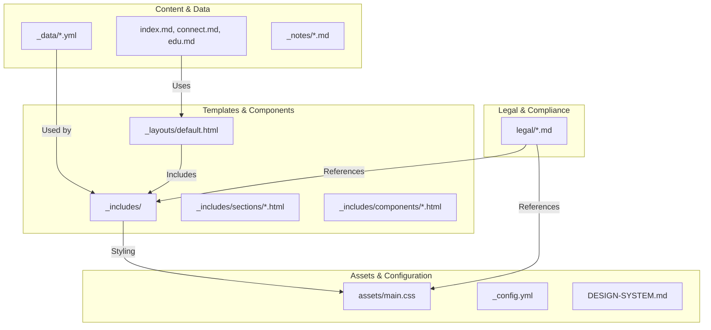
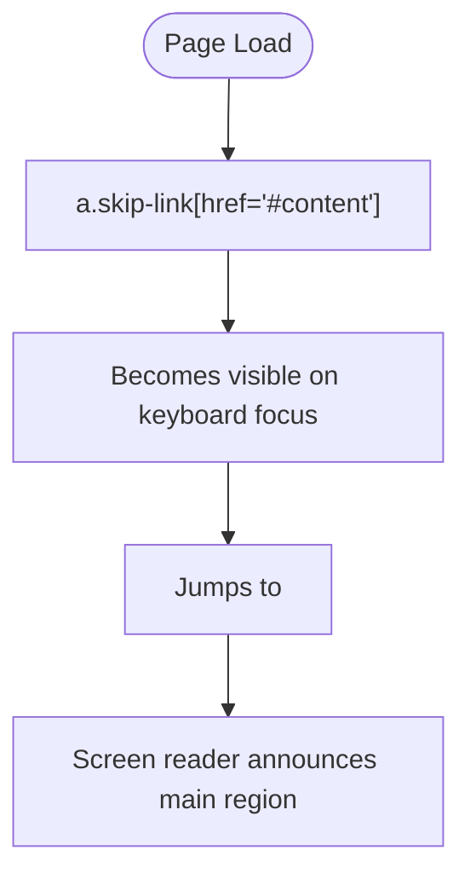
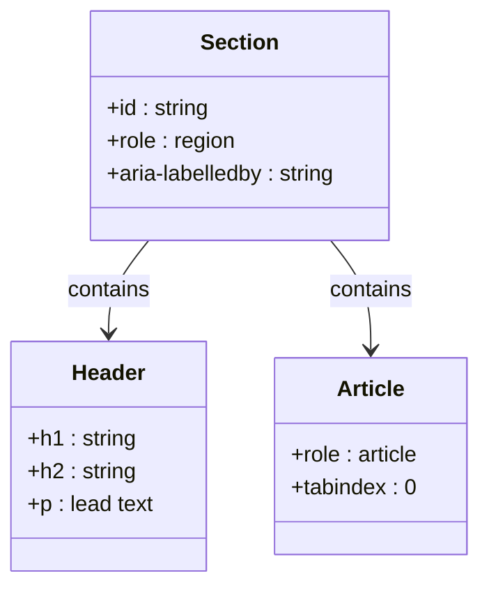
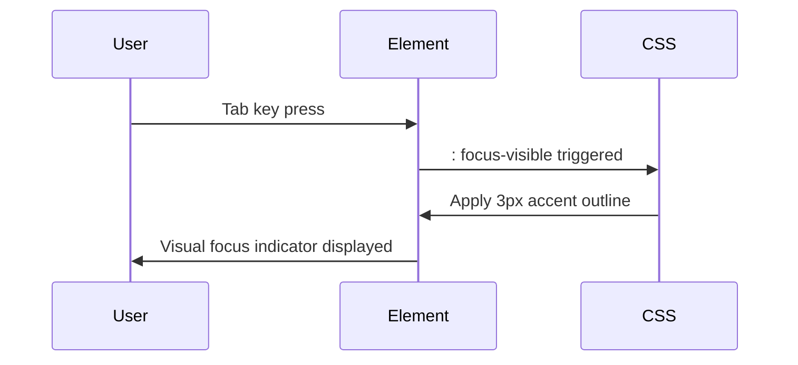
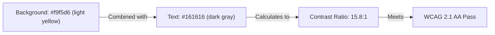
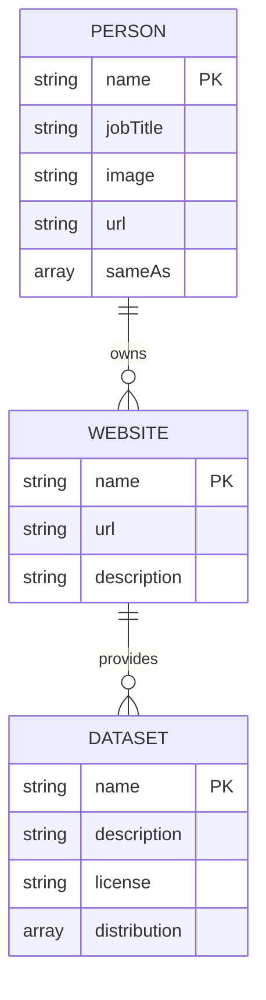
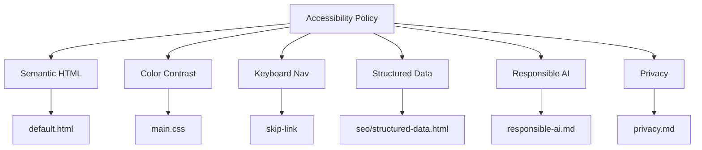

# Accessibility Standards Compliance

<cite>
**Referenced Files in This Document**   
- [legal/accessibility.md](file://legal/accessibility.md)
- [DESIGN-SYSTEM.md](file://DESIGN-SYSTEM.md)
- [assets/main.css](file://assets/main.css)
- [\_includes/sections/hero.html](file://_includes/sections/hero.html)
- [\_includes/sections/services.html](file://_includes/sections/services.html)
- [\_includes/footer.html](file://_includes/footer.html)
- [\_layouts/default.html](file://_layouts/default.html)
- [\_includes/seo/structured-data.html](file://_includes/seo/structured-data.html)
- [legal/responsible-ai.md](file://legal/responsible-ai.md)
- [legal/privacy.md](file://legal/privacy.md)
</cite>

## Table of Contents
1. [Introduction](#introduction)
2. [Project Structure](#project-structure)
3. [Core Components](#core-components)
4. [Architecture Overview](#architecture-overview)
5. [Detailed Component Analysis](#detailed-component-analysis)
6. [Dependency Analysis](#dependency-analysis)
7. [Performance Considerations](#performance-considerations)
8. [Troubleshooting Guide](#troubleshooting-guide)
9. [Conclusion](#conclusion)
10. [Appendices](#appendices)

## Introduction

This document outlines the accessibility standards and compliance measures implemented on the cv-ai site, ensuring usability for individuals with disabilities in alignment with WCAG 2.1 guidelines. The site adheres to a neubrutalist design system that prioritizes clarity, semantic structure, and inclusive interaction patterns. This policy details technical implementations such as semantic HTML, keyboard navigation, ARIA attributes, and contrast compliance, while also addressing testing procedures and integration with broader compliance frameworks like privacy and responsible AI.

## Project Structure

The cv-ai site is built using a Jekyll-based static site architecture with a modular component system. The project follows a clear separation of concerns through data files, reusable components, layouts, and style assets. Accessibility is embedded at every level—from structural HTML in layout templates to visual design tokens in the CSS.



**Diagram sources**
- [\_data/home.yml](file://_data/home.yml)
- [\_includes/sections/hero.html](file://_includes/sections/hero.html)
- [assets/main.css](file://assets/main.css)
- [legal/accessibility.md](file://legal/accessibility.md)

**Section sources**
- [legal/accessibility.md](file://legal/accessibility.md#L1-L28)
- [DESIGN-SYSTEM.md](file://DESIGN-SYSTEM.md#L1-L90)

## Core Components

The accessibility framework of the cv-ai site is built on four foundational pillars: semantic HTML structure, keyboard navigability, sufficient color contrast, and assistive technology support via ARIA and structured data. These are implemented consistently across components such as navigation, forms, dynamic content sections, and interactive elements.

Key implementation files include the default layout for global accessibility features, component templates for reusable accessible patterns, and the design system documentation that enforces accessibility-by-default principles.

**Section sources**
- [\_layouts/default.html](file://_layouts/default.html#L1-L46)
- [DESIGN-SYSTEM.md](file://DESIGN-SYSTEM.md#L1-L90)
- [assets/main.css](file://assets/main.css#L1-L799)

## Architecture Overview

The site’s architecture integrates accessibility into both presentation and structure. Semantic HTML5 elements are used throughout, with proper heading hierarchies, landmark roles, and navigational aids. The design system ensures visual accessibility via contrast-compliant color tokens and responsive spacing, while structured data enhances machine readability.

```mermaid
graph TD
A[User] --> B[Browser]
B --> C{Layout Engine}
C --> D[Semantic HTML]
C --> E[CSS with Design Tokens]
C --> F[Structured Data (JSON-LD)]
D --> G[Screen Readers]
D --> H[Keyboard Navigation]
E --> I[Visual Accessibility]
F --> J[AI/Assistant Tools]
G --> K[Accessible Experience]
H --> K
I --> K
J --> K
```

**Diagram sources**
- [\_layouts/default.html](file://_layouts/default.html#L1-L46)
- [assets/main.css](file://assets/main.css#L1-L799)
- [\_includes/seo/structured-data.html](file://_includes/seo/structured-data.html#L1-L189)

## Detailed Component Analysis

### Navigation and Skip Links

The site implements a skip-link mechanism in the default layout, allowing keyboard and screen reader users to bypass repetitive navigation and jump directly to main content. This is a WCAG 2.1 Level A requirement for keyboard accessibility.



**Diagram sources**
- [\_layouts/default.html](file://_layouts/default.html#L30)
- [assets/main.css](file://assets/main.css#L100-L105)

**Section sources**
- [\_layouts/default.html](file://_layouts/default.html#L30)
- [assets/main.css](file://assets/main.css#L100-L105)

### Semantic Sectioning and Headings

Each page uses a logical heading hierarchy (`h1` to `h3`) and semantic sectioning to support screen reader navigation. The hero and services sections use proper `header`, `section`, and `article` elements to define document structure.



**Diagram sources**
- [\_includes/sections/hero.html](file://_includes/sections/hero.html#L1-L54)
- [\_includes/sections/services.html](file://_includes/sections/services.html#L1-L40)

**Section sources**
- [\_includes/sections/hero.html](file://_includes/sections/hero.html#L1-L54)
- [\_includes/sections/services.html](file://_includes/sections/services.html#L1-L40)

### Interactive Elements and Focus States

All interactive elements (buttons, links, CTAs) are styled with visible focus indicators using `:focus-visible`. The design system specifies a 3px accent outline with offset, ensuring visibility without relying solely on color.



**Diagram sources**
- [assets/main.css](file://assets/main.css#L150-L155)
- [DESIGN-SYSTEM.md](file://DESIGN-SYSTEM.md#L75-L78)

**Section sources**
- [assets/main.css](file://assets/main.css#L150-L155)
- [DESIGN-SYSTEM.md](file://DESIGN-SYSTEM.md#L75-L78)

### Color Contrast and Visual Design

The neubrutalist design system enforces WCAG AA contrast compliance. The primary text (`--color-ink: #161616`) on background (`--color-page: #f9f5d6`) achieves a contrast ratio of approximately 15.8:1, exceeding AA requirements for normal text.



**Diagram sources**
- [assets/main.css](file://assets/main.css#L1-L20)
- [DESIGN-SYSTEM.md](file://DESIGN-SYSTEM.md#L15-L30)

**Section sources**
- [assets/main.css](file://assets/main.css#L1-L20)
- [DESIGN-SYSTEM.md](file://DESIGN-SYSTEM.md#L15-L30)

### Structured Data and Screen Reader Compatibility

The site includes JSON-LD structured data for the author, website, and articles, enhancing compatibility with screen readers and AI assistants. This structured approach ensures that semantic meaning is preserved even when visual context is absent.



**Diagram sources**
- [\_includes/seo/structured-data.html](file://_includes/seo/structured-data.html#L1-L189)
- [ai/resume.json](file://ai/home.json)

**Section sources**
- [\_includes/seo/structured-data.html](file://_includes/seo/structured-data.html#L1-L189)

## Dependency Analysis

Accessibility is not isolated but integrated with other compliance domains. The site’s components depend on consistent data from `_data` files, styling from `main.css`, and layout structures defined in `_layouts`. Legal documents reference technical implementations to ensure policy alignment.



**Diagram sources**
- [legal/accessibility.md](file://legal/accessibility.md)
- [\_layouts/default.html](file://_layouts/default.html)
- [assets/main.css](file://assets/main.css)
- [\_includes/seo/structured-data.html](file://_includes/seo/structured-data.html)
- [legal/responsible-ai.md](file://legal/responsible-ai.md)
- [legal/privacy.md](file://legal/privacy.md)

**Section sources**
- [legal/accessibility.md](file://legal/accessibility.md)
- [legal/responsible-ai.md](file://legal/responsible-ai.md)
- [legal/privacy.md](file://legal/privacy.md)

## Performance Considerations

The site’s accessibility features have minimal performance impact. CSS is lightweight (~1.2KB gzipped), and structured data is statically generated. The use of semantic HTML reduces the need for ARIA over-engineering, improving parsing efficiency for assistive technologies.

No JavaScript is used for core navigation or interactivity, eliminating runtime accessibility risks. Prefers-reduced-motion is respected in CSS transitions, ensuring comfort for users with vestibular disorders.

[No sources needed since this section provides general guidance]

## Troubleshooting Guide

When accessibility issues are reported, the following diagnostic steps should be taken:

1. Validate HTML semantics using browser dev tools
2. Test keyboard navigation flow from skip link to footer
3. Verify contrast ratios using browser extensions
4. Inspect structured data with Google’s Rich Results Test
5. Run automated audits using Lighthouse or axe

User-reported issues should be triaged within two business days, with fixes prioritized based on severity and impact.

**Section sources**
- [legal/accessibility.md](file://legal/accessibility.md#L15-L20)
- [assets/main.css](file://assets/main.css#L20-L30)

## Conclusion

The cv-ai site demonstrates a commitment to digital accessibility through deliberate design and implementation choices. By adhering to WCAG 2.1 guidelines, leveraging semantic HTML, ensuring keyboard navigability, maintaining high contrast ratios, and providing structured data, the site ensures equitable access for all users. This accessibility policy is aligned with broader compliance frameworks, including privacy and responsible AI, forming a cohesive approach to ethical digital presence.

[No sources needed since this section summarizes without analyzing specific files]