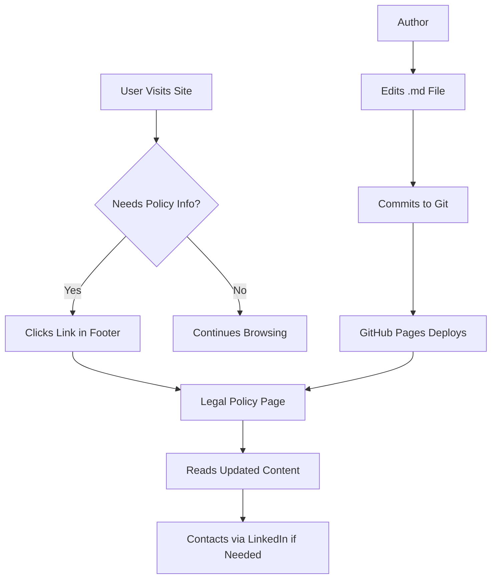

# Legal and Compliance

<cite>
**Referenced Files in This Document**   
- [legal/accessibility.md](file://legal/accessibility.md)
- [legal/code-of-conduct.md](file://legal/code-of-conduct.md)
- [legal/privacy.md](file://legal/privacy.md)
- [legal/professional-disclosure.md](file://legal/professional-disclosure.md)
- [legal/responsible-ai.md](file://legal/responsible-ai.md)
- [legal/terms-of-engagement.md](file://legal/terms-of-engagement.md)
- [_includes/footer.html](file://_includes/footer.html)
- [_config.yml](file://_config.yml)
</cite>

## Table of Contents
1. [Introduction](#introduction)
2. [Core Legal Policies Overview](#core-legal-policies-overview)
3. [Accessibility Standards Compliance](#accessibility-standards-compliance)
4. [Professional Code of Conduct](#professional-code-of-conduct)
5. [Privacy Practices for Visitor Data](#privacy-practices-for-visitor-data)
6. [Professional Disclosure Requirements](#professional-disclosure-requirements)
7. [Responsible AI Principles](#responsible-ai-principles)
8. [Terms of Engagement for Client Relationships](#terms-of-engagement-for-client-relationships)
9. [Policy Maintenance and Jurisdictional Adaptation](#policy-maintenance-and-jurisdictional-adaptation)
10. [Implementation and Site Integration](#implementation-and-site-integration)

## Introduction
This document provides a comprehensive overview of the legal and compliance framework governing the cv-ai project. It details the purpose, scope, and stakeholder relevance of each policy maintained in the `legal/` directory. These documents establish the ethical, operational, and regulatory foundation for both the public website and professional consulting engagements conducted by Dzmitryi Kharlanau, a Senior SAP consultant at EPAM Systems. The policies ensure transparency, accountability, and adherence to best practices in digital accessibility, data privacy, professional conduct, and responsible use of AI technologies.

## Core Legal Policies Overview
The `legal/` directory contains six key policy documents, each serving a distinct role in the compliance framework:
- **accessibility.md**: Ensures digital inclusivity and compliance with web accessibility standards.
- **code-of-conduct.md**: Defines ethical and professional standards for client collaborations.
- **privacy.md**: Outlines data handling practices for visitor and client information.
- **professional-disclosure.md**: Provides transparency about employment, affiliations, and potential conflicts.
- **responsible-ai.md**: Establishes ethical guidelines for AI usage in consulting and site operations.
- **terms-of-engagement.md**: Sets baseline contractual terms for service delivery.

These policies are designed to protect stakeholders, build trust, and ensure compliance with relevant regulations.

**Section sources**
- [legal/accessibility.md](file://legal/accessibility.md)
- [legal/code-of-conduct.md](file://legal/code-of-conduct.md)
- [legal/privacy.md](file://legal/privacy.md)
- [legal/professional-disclosure.md](file://legal/professional-disclosure.md)
- [legal/responsible-ai.md](file://legal/responsible-ai.md)
- [legal/terms-of-engagement.md](file://legal/terms-of-engagement.md)

## Accessibility Standards Compliance
The **accessibility.md** policy articulates a commitment to digital inclusivity for all users, including those with disabilities. It ensures that both the personal website and delivered consulting solutions are perceivable, operable, and understandable.

Key compliance measures include:
- Use of semantic HTML, keyboard navigation, and responsive design.
- Color contrast ratios meeting or exceeding WCAG AA standards.
- Implementation of skip-link navigation for assistive technologies.
- Regular audits using tools like WAVE and axe, combined with manual testing.
- Feedback mechanisms for users to report accessibility issues.

This policy is critical for stakeholders such as clients with accessibility mandates, users relying on assistive technologies, and regulatory bodies. It also aligns with broader corporate accessibility goals at EPAM Systems.

**Section sources**
- [legal/accessibility.md](file://legal/accessibility.md#L1-L28)

## Professional Code of Conduct
The **code-of-conduct.md** document establishes the ethical and operational standards guiding all professional engagements. It reinforces trust, integrity, and accountability in client relationships.

Core principles include:
- **Client Trust and Confidentiality**: Protection of sensitive data and prompt escalation of risks.
- **Ethical Delivery**: Setting realistic expectations and declining unethical assignments.
- **Collaboration Etiquette**: Transparent communication, proper attribution, and inclusive decision-making.
- **Security and Compliance**: Adherence to EPAM Systems' security baselines and client IAM policies.
- **Continuous Improvement**: Regular retrospectives and ongoing professional development.

This policy is essential for clients, EPAM Systems, and partner organizations, ensuring consistent, high-integrity service delivery.

**Section sources**
- [legal/code-of-conduct.md](file://legal/code-of-conduct.md#L1-L42)

## Privacy Practices for Visitor Data
The **privacy.md** policy details how personal data is collected, used, and protected when visitors interact with the site or engage in consulting services.

Key practices include:
- Minimal data collection: Only standard log data from GitHub Pages is processed; no tracking cookies or third-party scripts are used.
- Purpose-limited use: Data is used solely to respond to inquiries and understand engagement patterns.
- Clear retention policies: Communications are retained for up to 24 months unless deletion is requested.
- User rights: Visitors can request access, correction, or deletion of their personal data.
- Transparency about AI-ready assets: Machine-readable files (JSON, YAML, TXT) contain only publicly shared professional data.

This policy addresses the concerns of privacy-conscious visitors, data protection authorities, and clients with strict data governance requirements.

**Section sources**
- [legal/privacy.md](file://legal/privacy.md#L1-L40)

## Professional Disclosure Requirements
The **professional-disclosure.md** policy ensures transparency about professional affiliations, employment, and potential conflicts of interest.

Disclosed information includes:
- Current employment as a Senior SAP consultant at EPAM Systems.
- SAP certifications and participation in EPAM Systems' SAP community.
- Commitment to avoid conflicts of interest and decline overlapping engagements.
- Independence in technology recommendations, free from commercial incentives.
- Preferred communication channels (LinkedIn for business, EPAM Systems for official matters).

This policy is vital for clients conducting due diligence, potential partners, and regulatory compliance teams, fostering trust through full disclosure.

**Section sources**
- [legal/professional-disclosure.md](file://legal/professional-disclosure.md#L1-L35)

## Responsible AI Principles
The **responsible-ai.md** policy defines the ethical framework for using AI tools in both website operations and client consulting engagements.

Guiding principles are:
- **Transparency**: Disclosure of AI use in generating content or analysis.
- **Data Minimisation**: Using only necessary data and avoiding exposure of confidential information to third-party AI services.
- **Security**: Ensuring AI platforms meet EPAM Systems and client security standards.
- **Accountability**: Maintaining human oversight and ownership of AI-generated outputs.
- **Bias Mitigation**: Reviewing AI suggestions for bias, especially in sensitive areas like pricing or staffing.

The policy also covers:
- Use of AI copilots for documentation, analysis, and knowledge management.
- Documentation and approval of AI integrations in client environments.
- Provision of machine-readable assets (`/ai/resume.json`, `/LLM.txt`) to enable accurate AI-assisted retrieval.

This policy is crucial for clients integrating AI into SAP landscapes, compliance officers, and users concerned about ethical AI use.

**Section sources**
- [legal/responsible-ai.md](file://legal/responsible-ai.md#L1-L31)

## Terms of Engagement for Client Relationships
The **terms-of-engagement.md** document outlines the baseline contractual terms for consulting collaborations.

Key terms cover:
- **Scope and Deliverables**: Defined via written statements of work, with change control procedures.
- **Fees and Invoicing**: Flexible pricing models (T&M, milestone, fixed-fee) with 30-day payment terms.
- **Collaboration Commitments**: Stakeholder engagement, progress updates, and documented decision-making.
- **Intellectual Property**: Client ownership of custom deliverables; retained rights to pre-existing frameworks.
- **Confidentiality**: Mutual protection of sensitive information, surviving project completion.
- **Non-solicitation**: 12-month restriction on hiring each other's personnel.
- **Liability**: Limited to direct damages, with governing law specified (EU member state or EPAM contract terms).

This policy provides legal clarity for clients, EPAM Systems, and independent collaborators, setting expectations for professional engagements.

**Section sources**
- [legal/terms-of-engagement.md](file://legal/terms-of-engagement.md#L1-L54)

## Policy Maintenance and Jurisdictional Adaptation
All legal policies are living documents, subject to periodic review and updates as regulations, technologies, and business practices evolve.

Maintenance practices include:
- Regular reviews to ensure alignment with current laws (e.g., GDPR, accessibility standards).
- Updates are published directly to the respective `.md` files, with the latest version always available on the live site.
- Jurisdictional adaptations are managed on a case-by-case basis, particularly for engagements governed by specific regional laws (e.g., EU member state laws for direct contracts).

Stakeholders are encouraged to consult the site for the most current versions, as no separate versioning system is implemented beyond the source control history.

**Section sources**
- [legal/privacy.md](file://legal/privacy.md#L37-L40)

## Implementation and Site Integration
The legal policies are seamlessly integrated into the site's user experience and technical infrastructure.

Implementation notes:
- **Footer Links**: All key policies are linked from the site footer (`_includes/footer.html`), ensuring easy access. Links include Terms, Privacy, Disclosure, and Code of Conduct.
- **Jekyll Configuration**: Policies are rendered as static pages using the `default` layout, with metadata managed in the front matter (e.g., title, description, permalink).
- **Versioning**: Content is versioned implicitly through Git, with updates reflected immediately upon deployment.
- **Machine-Readable Access**: AI-related assets are exposed via `/ai/` endpoints and `/LLM.txt` to support automated retrieval while maintaining transparency.

This integration ensures that compliance is not only documented but also practically accessible and enforceable.

**Diagram sources**
- [_includes/footer.html](file://_includes/footer.html#L0-L27)
- [legal/terms-of-engagement.md](file://legal/terms-of-engagement.md)
- [legal/privacy.md](file://legal/privacy.md)

**Section sources**
- [_includes/footer.html](file://_includes/footer.html#L0-L27)
- [_config.yml](file://_config.yml#L0-L49)