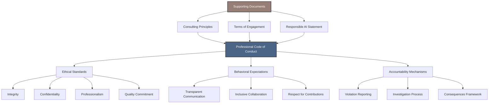

# Professional Code of Conduct

<cite>
**Referenced Files in This Document**   
- [code-of-conduct.md](file://legal/code-of-conduct.md)
- [consulting_principles.md](file://_notes/consulting_principles.md)
- [terms-of-engagement.md](file://legal/terms-of-engagement.md)
- [responsible-ai.md](file://legal/responsible-ai.md)
- [principles.yml](file://_data/principles.yml)
- [ARCHITECTURE.md](file://ARCHITECTURE.md)
</cite>

## Table of Contents
1. [Introduction](#introduction)
2. [Core Ethical Principles](#core-ethical-principles)
3. [Integration with Consulting Principles](#integration-with-consulting-principles)
4. [Application in Real-World Scenarios](#application-in-real-world-scenarios)
5. [Enforcement and Accountability](#enforcement-and-accountability)
6. [Policy Integration Framework](#policy-integration-framework)
7. [Conclusion](#conclusion)

## Introduction
The Professional Code of Conduct establishes the ethical foundation for all consulting engagements conducted by Dzmitryi Kharlanau as a Senior SAP Consultant with EPAM Systems. This document defines the behavioral standards, professional responsibilities, and integrity commitments that govern client interactions, project delivery, and collaborative decision-making. It applies equally to engagements executed directly or through EPAM Systems, ensuring consistency in quality, transparency, and accountability. The code is designed to protect client interests, maintain data confidentiality, and uphold the highest standards of professional conduct in SAP programme delivery.

**Section sources**
- [code-of-conduct.md](file://legal/code-of-conduct.md#L1-L10)

## Core Ethical Principles
The Professional Code of Conduct is structured around five core pillars that define expected behaviors and operational standards in client engagements.

### Client Trust and Confidentiality
Maintaining client trust is paramount. All engagements must respect contractual and regulatory boundaries, with strict safeguards for production, commercial, and personal data. Data protection follows EPAM Systems' security controls and any additional client-specific policies. Any potential compromise to confidentiality or compliance must be escalated immediately to prevent breaches.

### Ethical Delivery
Professional integrity requires setting realistic expectations regarding scope, cost, and timelines before work commences. When obstacles arise, they must be communicated promptly along with mitigation strategies or corrective action plans. Consultants must decline assignments that conflict with existing commitments or violate ethical standards, ensuring alignment with professional responsibility.

### Collaboration Etiquette
Effective collaboration depends on transparent communication. Decision logs, meeting notes, and shared documentation ensure visibility into the rationale behind key choices. Credit must be given to contributions from client teams, partners, and fellow consultants. Inclusive working sessions should empower stakeholders to challenge assumptions safely, fostering a culture of mutual respect and constructive dialogue.

### Security and Compliance Posture
Security practices align with EPAM Systems' baselines, including multi-factor authentication (MFA), device hardening, and least-privilege access principles. When operating as an extension of client teams, adherence to their identity and access management requirements is mandatory. For AI or automation components, data flows and retention policies must be documented and approved prior to implementation.

### Continuous Improvement
A commitment to growth drives ongoing refinement of consulting practices. Programme retrospectives should yield concrete follow-up actions. Investment in continuous upskilling—particularly in SAP, integration technologies, and AI—ensures advice remains current and relevant. Feedback loops from sponsors and delivery teams are actively encouraged to improve collaboration effectiveness.

**Section sources**
- [code-of-conduct.md](file://legal/code-of-conduct.md#L11-L33)

## Integration with Consulting Principles
The Professional Code of Conduct is closely aligned with the five consulting principles outlined in consulting_principles.md, forming a cohesive framework for engagement execution.

### Clarity Before Configuration
This principle ensures that every engagement begins with a clear understanding of the business problem, success metrics, and constraints. Lightweight design briefs and architecture decision records (ADRs) link technical changes to measurable outcomes, preventing scope drift. This supports the code’s emphasis on ethical delivery by setting accurate expectations from the outset.

### Keep S/4HANA Clean and Portable
By evaluating extensibility options (in-app, in-stack, side-by-side) and applying clean-core guardrails, this principle reinforces the code’s commitment to long-term system integrity and vendor neutrality. Portability scoring and transport reviews ensure modifications do not create lock-in, aligning with both security and ethical delivery standards.

### Observability as a Contract
Every change must ship with monitoring, runbooks, and prevention analytics. Defining "golden signals" such as order processing delays or IDoc backlogs ensures business visibility into system health. This directly supports the collaboration etiquette principle by enabling transparent performance tracking and shared accountability.

### Co-create with the People Who Run the Process
Engaging operational leads in workshops, demos, and sign-offs ensures solutions meet real-world needs. Framing risks in business terms and securing joint approval before go-live strengthens trust and inclusivity, reflecting the code’s emphasis on respectful, transparent collaboration.

### AI That Is Auditable and Human-Owned
AI copilots are used to support—not replace—human judgment. Documentation of datasets, prompts, retention policies, and guardrails ensures compliance and traceability. Human-in-the-loop approval mechanisms maintain accountability, directly supporting the responsible AI guidelines and the code’s integrity standards.

**Section sources**
- [consulting_principles.md](file://_notes/consulting_principles.md#L0-L80)
- [principles.yml](file://_data/principles.yml#L0-L80)

## Application in Real-World Scenarios
The Professional Code of Conduct applies across various types of engagements, ensuring consistent ethical standards regardless of context.

### Advisory Services
During discovery phases, consultants must disclose when AI tools are used to generate analysis or documentation. All advisory outputs—such as prototype designs or feasibility assessments—are explicitly marked as non-production-ready unless otherwise stated. Transparency about limitations and assumptions ensures clients make informed decisions.

### System Audits
In audit engagements, adherence to clean-core governance and SoD (Segregation of Duties) controls is critical. Auditors must document evidence collection processes, maintain traceability for critical business processes, and ensure all findings are reported with remediation recommendations. The requirement to document data flows and retention policies applies particularly to audit trails involving automated systems.

### Training Engagements
When delivering training, instructors must credit source materials and avoid misrepresenting proprietary methodologies. Training environments must mirror production security settings, and no real client data should be used without explicit approval. The principle of continuous improvement applies through post-training feedback collection and curriculum refinement.

**Section sources**
- [code-of-conduct.md](file://legal/code-of-conduct.md#L11-L33)
- [responsible-ai.md](file://legal/responsible-ai.md#L0-L23)
- [principles.yml](file://_data/principles.yml#L62-L79)

## Enforcement and Accountability
The Professional Code of Conduct includes clear mechanisms for upholding standards and addressing violations.

### Reporting Violations
Concerns about potential breaches can be reported directly via LinkedIn or through an EPAM Systems engagement manager. Reports are treated confidentially and investigated promptly. Retaliation against individuals who report concerns in good faith is strictly prohibited.

### Accountability Measures
All consultants are accountable for their actions and decisions. Decisions affecting programme risk or compliance must be recorded in shared documentation, ensuring traceability. Intellectual property rights are respected, with final deliverables transferring to the client upon full payment, while pre-existing frameworks remain under EPAM or personal ownership with a non-exclusive usage licence.

### Consequences of Non-Compliance
Failure to adhere to the code may result in termination of the engagement, disciplinary action by EPAM Systems, or legal consequences where contractual or regulatory obligations are violated. Repeated or severe violations may lead to permanent exclusion from future collaborations.

**Section sources**
- [code-of-conduct.md](file://legal/code-of-conduct.md#L35-L42)
- [terms-of-engagement.md](file://legal/terms-of-engagement.md#L0-L54)

## Policy Integration Framework
The Professional Code of Conduct operates within a broader governance ecosystem, integrating with other key documents to form a comprehensive trust framework.

### Relationship with Terms of Engagement
The code complements the Terms of Engagement by adding behavioral and ethical expectations beyond legal and financial terms. While the Terms define scope, fees, and intellectual property, the code governs how work is conducted. For example, the collaboration commitments in the Terms—such as providing weekly updates and maintaining risk logs—are operationalized through the code’s transparency and communication standards.

### Alignment with Responsible AI Statement
The Responsible AI Statement reinforces the code’s principles in AI-enabled engagements. It mandates transparency in AI usage, data minimisation, security compliance, human accountability, and bias mitigation. These guidelines ensure that AI tools enhance rather than undermine ethical delivery and client trust.

### Support for Overall Trust Framework
Together with consulting principles, engagement signals, and machine-readable policy exports (e.g., `/ai/principles.json`), the code forms part of a transparent, auditable, and AI-accessible trust framework. This enables consistent interpretation across human and automated systems, supporting both client confidence and platform integrity.

**Diagram sources**
- [code-of-conduct.md](file://legal/code-of-conduct.md#L1-L42)
- [consulting_principles.md](file://_notes/consulting_principles.md#L0-L80)
- [terms-of-engagement.md](file://legal/terms-of-engagement.md#L0-L54)
- [responsible-ai.md](file://legal/responsible-ai.md#L0-L23)

**Section sources**
- [code-of-conduct.md](file://legal/code-of-conduct.md#L1-L42)
- [terms-of-engagement.md](file://legal/terms-of-engagement.md#L0-L54)
- [responsible-ai.md](file://legal/responsible-ai.md#L0-L23)

## Conclusion
The Professional Code of Conduct serves as the ethical backbone of all consulting engagements, ensuring that every interaction is guided by integrity, transparency, and accountability. By embedding these principles into daily practice and aligning them with documented consulting methodologies and contractual terms, a robust trust framework is established. This not only protects client interests but also enhances the quality and sustainability of SAP programme outcomes. As technology evolves—particularly with the integration of AI—the code provides a stable foundation for responsible innovation and client-centric delivery.

**Section sources**
- [code-of-conduct.md](file://legal/code-of-conduct.md#L1-L42)
- [consulting_principles.md](file://_notes/consulting_principles.md#L0-L80)