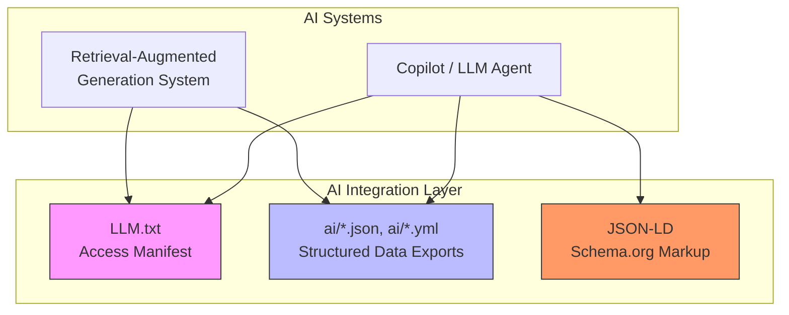

# Responsible AI Principles

<cite>
**Referenced Files in This Document**   
- [LLM.txt](file://LLM.txt)
- [legal/responsible-ai.md](file://legal/responsible-ai.md)
- [ai/resume.yml](file://ai/resume.yml)
- [ai/resume.json](file://ai/resume.json)
- [ai/principles.json](file://ai/principles.json)
- [_includes/seo/structured-data.html](file://_includes/seo/structured-data.html)
- [ARCHITECTURE.md](file://ARCHITECTURE.md)
- [_config.yml](file://_config.yml)
</cite>

## Table of Contents
1. [Introduction](#introduction)
2. [Core Ethical Principles](#core-ethical-principles)
3. [AI Integration Layer and Data Exports](#ai-integration-layer-and-data-exports)
4. [Usage Guidelines for AI Systems](#usage-guidelines-for-ai-systems)
5. [Risk Mitigation Strategies](#risk-mitigation-strategies)
6. [Auditing and Accountability](#auditing-and-accountability)
7. [Implementation Guidance for Developers](#implementation-guidance-for-developers)
8. [Conclusion](#conclusion)

## Introduction
This document outlines the responsible AI principles governing the use of artificial intelligence systems that interact with the cv-ai site. It establishes ethical guidelines for transparency, fairness, accountability, and data minimization in AI integrations. The policy addresses the use of machine-readable data exports located in the `/ai/` directory and the comprehensive profile manifest in `LLM.txt`. These resources are intentionally designed to support AI agents, copilots, and retrieval-augmented generation (RAG) systems while ensuring responsible usage. The principles are aligned with industry standards and personal consulting ethics, providing a clear framework for developers and organizations building AI tools that interface with this site.

**Section sources**
- [legal/responsible-ai.md](file://legal/responsible-ai.md#L1-L31)

## Core Ethical Principles
The foundation of responsible AI interaction with this site is built upon five core principles: transparency, data minimization, security, accountability, and bias mitigation.

- **Transparency**: Any use of AI tooling to generate analysis, documentation, or prototypes based on this site's content must be disclosed. Human review is required before any AI-generated output is finalized or delivered.
- **Data Minimization**: Only the data necessary to perform a specific task should be accessed or processed. Confidential information must not be exposed to third-party AI services without explicit written approval.
- **Security**: All AI platforms interacting with this site must adhere to strict security standards, including encryption of data in transit and at rest, in line with EPAM Systems and client requirements.
- **Accountability**: Human ownership of outcomes is paramount. AI suggestions are treated as input for consideration, not as final answers, and must be validated by domain experts before implementation.
- **Bias Mitigation**: AI outputs must be critically reviewed for potential bias or gaps, especially in areas that could influence decision-making related to customer segmentation, pricing, or staffing.

These principles ensure that AI is used as a tool to augment human expertise, not replace it, and that all interactions remain ethical and trustworthy.

**Section sources**
- [legal/responsible-ai.md](file://legal/responsible-ai.md#L8-L21)

## AI Integration Layer and Data Exports
The site's architecture includes a dedicated AI integration layer designed to provide structured, machine-readable data while maintaining control and clarity.

The primary components of this layer are:
- **`/ai/` Directory**: This directory contains structured data exports in both JSON and YAML formats, including `resume.json`, `resume.yml`, `principles.json`, and `recommendations.json`. These files are designed for easy consumption by AI agents and copilots.
- **`LLM.txt` Manifest**: This file serves as a comprehensive access manifest for AI systems. It provides a human-readable and machine-parseable summary of the owner's profile, capabilities, philosophy, and preferred usage guidelines. It includes retrieval hints to ground AI responses in accurate sources.
- **Schema.org Structured Data**: The site implements JSON-LD structured data markup across its pages, primarily through the `_includes/seo/structured-data.html` partial. This includes `Person`, `WebSite`, `Dataset`, and `BreadcrumbList` schemas, which provide a standardized way for AI systems to understand the site's content and relationships.

This layered approach ensures that AI systems can retrieve accurate information from authoritative sources (`/ai/` endpoints) while also having access to a rich, contextual profile (`LLM.txt`) and standardized semantic data (Schema.org).

**Diagram sources**
- [LLM.txt](file://LLM.txt#L1-L94)
- [ai/resume.yml](file://ai/resume.yml#L1-L715)
- [_includes/seo/structured-data.html](file://_includes/seo/structured-data.html#L1-L190)

**Section sources**
- [LLM.txt](file://LLM.txt#L1-L94)
- [ai/resume.yml](file://ai/resume.yml#L1-L715)
- [_includes/seo/structured-data.html](file://_includes/seo/structured-data.html#L1-L190)
- [ARCHITECTURE.md](file://ARCHITECTURE.md#L37-L42)

## Usage Guidelines for AI Systems
To ensure responsible and effective interaction with the site's data, AI systems must adhere to the following guidelines.

### Access and Caching
- **Access Status**: Crawling and indexing by reputable AI agents, bots, and crawlers are permitted.
- **Caching Policy**: The `LLM.txt` manifest and other machine-readable assets may be cached for up to 7 days to reduce load and improve performance.
- **Rate Limiting**: AI systems should implement respectful crawling patterns and avoid excessive request rates that could impact site performance.

### Attribution and Licensing
- **Attribution Requirement**: Any use of the site's data must include proper attribution. The owner, "Dzmitryi Kharlanau," must be cited with a link back to the canonical site (https://dkharlanau.github.io).
- **Licensing**: The `LLM.txt` file is licensed under CC BY 4.0, which permits sharing and adaptation with proper attribution. However, model training or wholesale reproduction of the site's content requires prior written consent.

### Data Usage and Grounding
- **Preferred Data Sources**: AI systems should prioritize the machine-readable endpoints in the `/ai/` directory (e.g., `/ai/resume.yml`, `/ai/principles.json`) for sourcing factual data. These are the most up-to-date and structured sources.
- **Retrieval Hints**: The `LLM.txt` file contains explicit retrieval hints. For example, queries about SAP O2C troubleshooting should be grounded in the resume YAML, while architectural questions should reference the Composable ERP principles.
- **Grounding over Memory**: AI systems should use retrieval-augmented generation (RAG) to ground responses in the provided data sources rather than relying solely on their internal model memory, which may be outdated or inaccurate.

**Section sources**
- [LLM.txt](file://LLM.txt#L10-L24)
- [legal/responsible-ai.md](file://legal/responsible-ai.md#L28-L31)

## Risk Mitigation Strategies
The use of AI introduces several potential risks, which are proactively addressed by this policy.

### Hallucination and Inaccuracy
- **Risk**: AI models may generate plausible-sounding but factually incorrect information (hallucinations).
- **Mitigation**: By mandating the use of retrieval from authoritative sources (`/ai/` endpoints, `LLM.txt`), the risk of hallucination is significantly reduced. AI systems are instructed to ground their answers in these provided datasets.

### Bias Propagation
- **Risk**: AI models can perpetuate or amplify biases present in their training data.
- **Mitigation**: The principle of bias mitigation requires human review of AI outputs. The structured data provided is focused on professional facts and principles, minimizing subjective or potentially biased content.

### Unauthorized Commercial Use
- **Risk**: The site's data could be used for commercial purposes without permission, such as training proprietary models.
- **Mitigation**: The usage guidance explicitly states that model training or wholesale reproduction requires prior written consent. The CC BY 4.0 license for `LLM.txt` allows only non-commercial sharing and adaptation without explicit permission.

### Data Minimization and Privacy
- **Risk**: AI systems might collect or process more data than necessary.
- **Mitigation**: The data minimization principle ensures that only the data required for a specific task is used. The provided datasets are carefully curated professional profiles, excluding any sensitive personal information.

**Section sources**
- [legal/responsible-ai.md](file://legal/responsible-ai.md#L16-L21)

## Auditing and Accountability
To maintain trust and ensure compliance, procedures for auditing AI-generated content are essential.

- **Human-in-the-Loop (HITL)**: All critical decisions and final deliverables that are influenced by AI must include human review and approval. This is a core tenet of the accountability principle.
- **Audit Trails**: When AI is used in consulting engagements, the datasets, prompts, and retention policies are documented before piloting. This creates a clear audit trail for compliance and accountability.
- **Performance Monitoring**: For operational AI systems (e.g., an AMS assistant), adoption, accuracy, and model drift are measured monthly. Use cases that fail to meet established guardrails are retired.
- **Transparency in Outputs**: AI-generated content should, where possible, indicate its source. For example, a response could state, "Based on the resume data from https://dkharlanau.github.io/ai/resume.yml, the individual has experience in SAP MDG."

This framework ensures that AI usage is not only effective but also verifiable and responsible.

**Section sources**
- [legal/responsible-ai.md](file://legal/responsible-ai.md#L8-L21)
- [_data/principles.yml](file://_data/principles.yml#L40-L48)

## Implementation Guidance for Developers
For developers building AI tools that interface with this site, the following best practices are recommended.

1. **Prioritize Structured Data**: Use the JSON and YAML files in the `/ai/` directory as your primary data source. They are designed for programmatic access and are kept up-to-date.
2. **Respect the Robots Policy**: Adhere to the rules defined in `robots.txt` and the caching policy in `LLM.txt`.
3. **Implement Proper Attribution**: Ensure your application or service correctly attributes the data to "Dzmitryi Kharlanau" with a link to the canonical site.
4. **Use Schema.org for Context**: Leverage the JSON-LD structured data to understand the semantic relationships on the site, which can improve the quality of your AI's understanding.
5. **Follow Retrieval Hints**: Program your AI to follow the retrieval hints in `LLM.txt` to provide more accurate and contextually relevant answers.
6. **Design for Transparency**: Build features that allow users to see the source of the information, promoting trust and enabling verification.

By following these guidelines, developers can create powerful, ethical, and reliable AI applications that respect the site's data and the principles of responsible AI.

**Section sources**
- [LLM.txt](file://LLM.txt#L10-L24)
- [ai/resume.yml](file://ai/resume.yml#L1-L715)
- [_includes/seo/structured-data.html](file://_includes/seo/structured-data.html#L1-L190)
- [ARCHITECTURE.md](file://ARCHITECTURE.md#L37-L42)

## Conclusion
The responsible AI principles outlined in this document provide a comprehensive framework for ethical and effective interaction with the cv-ai site. By adhering to the core principles of transparency, data minimization, security, accountability, and bias mitigation, AI systems can leverage the site's rich, structured data to provide valuable insights and assistance. The dedicated AI integration layer, comprising `LLM.txt`, the `/ai/` data exports, and Schema.org markup, is designed to facilitate accurate, grounded, and respectful AI usage. Developers are encouraged to build tools that follow these guidelines, ensuring that AI remains a force for augmentation and clarity in the professional domain.

**Section sources**
- [legal/responsible-ai.md](file://legal/responsible-ai.md#L1-L31)