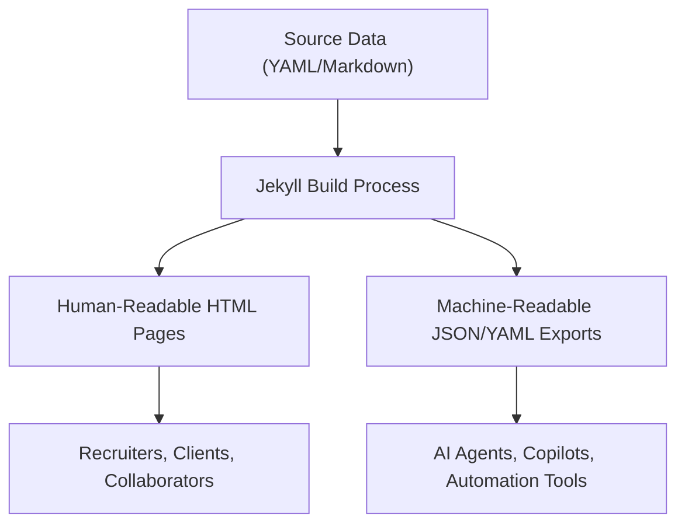
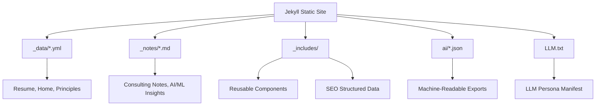
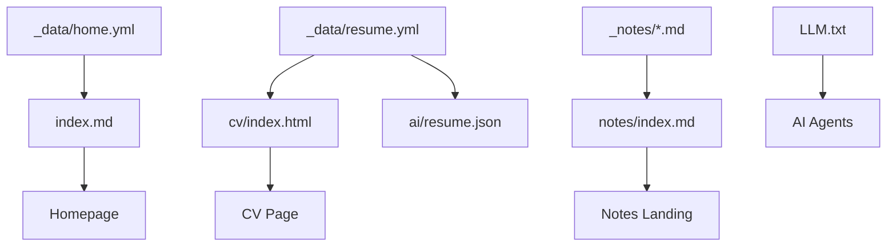
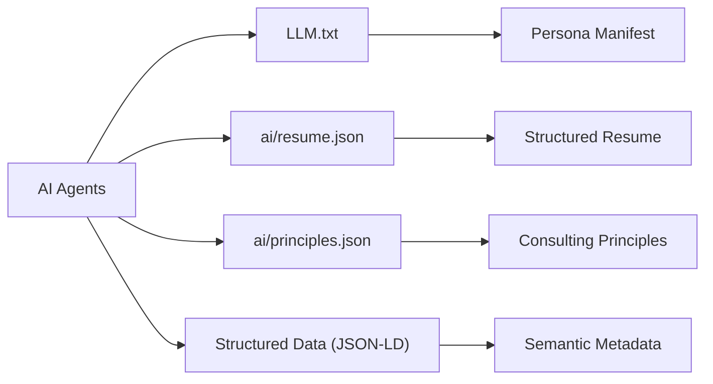

# Project Overview

<cite>
**Referenced Files in This Document**   
- [README.md](file://README.md)
- [ARCHITECTURE.md](file://ARCHITECTURE.md)
- [_config.yml](file://_config.yml)
- [index.md](file://index.md)
- [_data/home.yml](file://_data/home.yml)
- [LLM.txt](file://LLM.txt)
- [_data/resume.yml](file://_data/resume.yml)
- [_includes/sections/llm-profiles.html](file://_includes/sections/llm-profiles.html)
- [_includes/page-builder.html](file://_includes/page-builder.html)
- [_includes/seo/structured-data.html](file://_includes/seo/structured-data.html)
- [_notes/consulting_principles.md](file://_notes/consulting_principles.md)
- [_data/principles.yml](file://_data/principles.yml)
- [ai/resume.json](file://ai/resume.json)
- [ai/principles.json](file://ai/principles.json)
- [_notes/ai_ml.md](file://_notes/ai_ml.md)
</cite>

## Table of Contents
1. [Introduction](#introduction)
2. [Core Purpose and Goals](#core-purpose-and-goals)
3. [Dual-Mode Architecture](#dual-mode-architecture)
4. [Key Architectural Decisions](#key-architectural-decisions)
5. [User Personas](#user-personas)
6. [Content Structure and Delivery](#content-structure-and-delivery)
7. [AI and Machine Accessibility](#ai-and-machine-accessibility)
8. [Common Use Cases and Entry Points](#common-use-cases-and-entry-points)

## Introduction

The cv-ai project is a personal branding and professional portfolio platform designed to serve both human and machine audiences. Built on Jekyll with a neubrutalist aesthetic, the site functions as a dynamic showcase of expertise, experience, and thought leadership in SAP transformation, integration, and AI-enabled enterprise systems. It is engineered not only for visual clarity and professional storytelling but also for machine readability, enabling seamless integration with AI agents, sourcing tools, and automation workflows.

The platform reflects a modern approach to personal branding—where documentation doubles as structured data, and visibility extends beyond human recruiters to include AI systems that index, retrieve, and reason over professional profiles. This dual-purpose design ensures that the site is both a compelling narrative for clients and a reliable data source for intelligent agents.

**Section sources**
- [README.md](file://README.md#L1-L23)
- [ARCHITECTURE.md](file://ARCHITECTURE.md#L1-L68)

## Core Purpose and Goals

The cv-ai project is built around four core objectives:

- **Professional Visibility**: To establish a clear, authoritative online presence that highlights expertise in SAP S/4HANA, Order-to-Cash (O2C), integration architecture, and digital transformation.
- **Knowledge Sharing**: To document and disseminate consulting principles, technical insights, and industry best practices through structured notes and public content.
- **Client Engagement**: To provide potential clients and collaborators with transparent, accessible information about capabilities, methodologies, and engagement models.
- **LLM/AI Interoperability**: To enable AI systems to retrieve, interpret, and act upon professional data through machine-readable formats such as JSON, YAML, and structured text.

These goals are reflected in the site’s content model, where every piece of human-facing content has a corresponding machine-accessible counterpart. This ensures that the platform is not only informative but also interoperable with modern AI-driven workflows.

**Section sources**
- [README.md](file://README.md#L25-L45)
- [_data/home.yml](file://_data/home.yml#L1-L55)
- [_notes/consulting_principles.md](file://_notes/consulting_principles.md#L1-L79)

## Dual-Mode Architecture

The cv-ai site operates in dual mode: serving **human-readable content** and **machine-readable data exports** simultaneously. This architecture ensures that the same core data powers both narrative storytelling and structured retrieval.

For example:
- The resume is authored in `_data/resume.yml` and rendered in `cv/index.html` for human readers.
- The same data is exported as `ai/resume.json` and `ai/resume.yml` for AI agents and sourcing tools.
- Homepage content in `_data/home.yml` drives the visual layout via `index.md`, while `ai/home.json` provides a structured mirror for machine consumption.

This separation of concerns allows for consistent, single-source content management while supporting diverse output formats. Updates to the YAML or JSON data files automatically propagate across both human and machine interfaces.

**Diagram sources**
- [ARCHITECTURE.md](file://ARCHITECTURE.md#L10-L68)
- [README.md](file://README.md#L25-L45)
- [ai/resume.json](file://ai/resume.json#L1-L6)

**Section sources**
- [README.md](file://README.md#L25-L45)
- [ARCHITECTURE.md](file://ARCHITECTURE.md#L10-L68)
- [ai/resume.json](file://ai/resume.json#L1-L6)

## Key Architectural Decisions

The cv-ai platform is built on several foundational architectural choices that enable scalability, maintainability, and AI interoperability:

- **Static Site Generation via Jekyll**: The site uses Jekyll for fast, secure, and GitHub Pages-compatible deployment. This eliminates server-side complexity and ensures high performance and reliability.
- **Content-First Design**: All content is structured in data files (`_data/*.yml`) and Markdown notes (`_notes/*.md`), enabling reuse across multiple outputs and formats.
- **Neubrutalist Aesthetics**: The design emphasizes clarity, readability, and minimalism, using raw HTML and CSS to convey professionalism without visual noise.
- **Component-Based Layouts**: The `_includes/` directory contains reusable UI components (e.g., hero sections, service cards, LLM profiles) that are composed dynamically via `page-builder.html`.
- **Structured Data Integration**: JSON-LD metadata is embedded via `_includes/seo/structured-data.html`, enabling rich search engine indexing and semantic understanding by AI systems.

These decisions collectively support a system that is easy to maintain, extend, and integrate with external tools.

**Diagram sources**
- [ARCHITECTURE.md](file://ARCHITECTURE.md#L10-L68)
- [_config.yml](file://_config.yml#L1-L49)
- [_includes/seo/structured-data.html](file://_includes/seo/structured-data.html#L1-L189)

**Section sources**
- [ARCHITECTURE.md](file://ARCHITECTURE.md#L10-L68)
- [_config.yml](file://_config.yml#L1-L49)
- [DESIGN-SYSTEM.md](file://DESIGN-SYSTEM.md)

## User Personas

The cv-ai platform serves multiple user personas, each with distinct needs and interaction patterns:

- **Recruiters**: Seek concise, verifiable information about skills, experience, and certifications. They rely on structured data and clear resume formatting.
- **Clients**: Look for evidence of problem-solving, domain expertise, and delivery philosophy. They engage with consulting principles and project case studies.
- **Collaborators**: Interested in technical depth, integration patterns, and shared methodologies. They explore notes on AI/ML, composable ERP, and system architecture.
- **AI Systems**: Require machine-readable data for indexing, retrieval, and reasoning. They consume JSON, YAML, and structured text files like `LLM.txt`.

Each persona is supported by tailored content and access points, ensuring that the site functions as both a portfolio and a knowledge API.

**Section sources**
- [_data/home.yml](file://_data/home.yml#L1-L55)
- [LLM.txt](file://LLM.txt#L1-L93)
- [_notes/ai_ml.md](file://_notes/ai_ml.md#L1-L114)

## Content Structure and Delivery

Content is organized around a modular, data-driven architecture:

- **Homepage**: Composed from `_data/home.yml` and rendered via `index.md` using `page-builder.html`. Sections like `hero`, `services`, and `llm-profiles` are dynamically included.
- **Resume**: Centralized in `_data/resume.yml`, powering both `cv/index.html` and `ai/resume.json`.
- **Notes**: Stored in `_notes/`, each with metadata (title, date, tags) and rendered using `_layouts/note.html`. Listed at `/notes/`.
- **Legal & Policies**: Standalone Markdown files in `/legal/` covering accessibility, privacy, code of conduct, and responsible AI.
- **AI Exports**: Machine-readable mirrors in `/ai/` (JSON, YAML) and `LLM.txt` for copilot handoff.

This structure ensures consistency, reusability, and ease of maintenance.

**Diagram sources**
- [README.md](file://README.md#L25-L45)
- [_includes/page-builder.html](file://_includes/page-builder.html#L1-L39)
- [ARCHITECTURE.md](file://ARCHITECTURE.md#L10-L68)

**Section sources**
- [README.md](file://README.md#L25-L45)
- [_includes/page-builder.html](file://_includes/page-builder.html#L1-L39)
- [ARCHITECTURE.md](file://ARCHITECTURE.md#L10-L68)

## AI and Machine Accessibility

The cv-ai project is explicitly designed for AI interoperability. Key features include:

- **LLM.txt**: A plain-text manifest that provides a concise, structured profile for AI agents, including role, expertise, philosophy, and retrieval hints.
- **JSON/YAML Exports**: Machine-readable versions of resume, principles, and homepage data in `/ai/`.
- **Structured Data (JSON-LD)**: Embedded schema.org metadata for Person, WebSite, Article, and Dataset types, enabling semantic understanding by search engines and AI systems.
- **Retrieval Hints**: Guidance in `LLM.txt` and `ai/principles.json` on how AI agents should ground responses in specific sources.

These elements ensure that the site is not only discoverable but also actionable by AI systems, supporting use cases like candidate sourcing, knowledge retrieval, and automated profiling.

**Diagram sources**
- [LLM.txt](file://LLM.txt#L1-L93)
- [ai/resume.json](file://ai/resume.json#L1-L6)
- [ai/principles.json](file://ai/principles.json#L1-L6)
- [_includes/seo/structured-data.html](file://_includes/seo/structured-data.html#L1-L189)

**Section sources**
- [LLM.txt](file://LLM.txt#L1-L93)
- [ai/resume.json](file://ai/resume.json#L1-L6)
- [_includes/seo/structured-data.html](file://_includes/seo/structured-data.html#L1-L189)

## Common Use Cases and Entry Points

Different users interact with the site in distinct ways:

- **Recruiters**: Enter via `cv/index.html` or `ai/resume.json` to assess qualifications and experience.
- **Clients**: Navigate from `index.md` to service descriptions and consulting principles to evaluate fit.
- **Collaborators**: Explore `_notes/` for technical depth on AI/ML, composable ERP, and integration patterns.
- **AI Systems**: Access `LLM.txt`, `ai/resume.yml`, or JSON endpoints for retrieval-augmented generation.

Entry points are clearly signposted, including the "LLM Profiles" section on the homepage, which provides direct links to machine-readable assets.

**Section sources**
- [index.md](file://index.md#L1-L14)
- [_data/home.yml](file://_data/home.yml#L1-L55)
- [_includes/sections/llm-profiles.html](file://_includes/sections/llm-profiles.html#L1-L11)