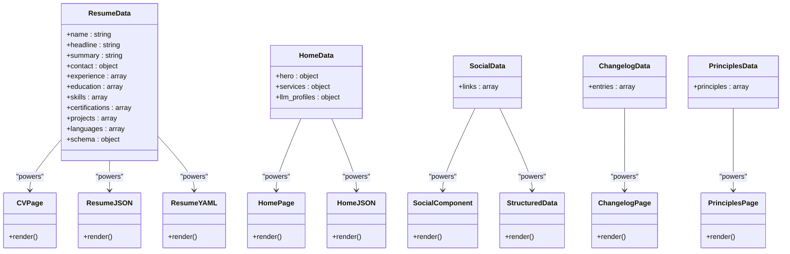

# Project Overview

<cite>
**Referenced Files in This Document**   
- [README.md](file://README.md)
- [ARCHITECTURE.md](file://ARCHITECTURE.md)
- [DESIGN-SYSTEM.md](file://DESIGN-SYSTEM.md)
- [_config.yml](file://_config.yml)
- [LLM.txt](file://LLM.txt)
- [_data/resume.yml](file://_data/resume.yml)
- [_data/home.yml](file://_data/home.yml)
- [_data/social.yml](file://_data/social.yml)
- [ai/resume.json](file://ai/resume.json)
- [ai/resume.yml](file://ai/resume.yml)
- [cv/index.html](file://cv/index.html)
- [index.md](file://index.md)
- [_includes/sections/hero.html](file://_includes/sections/hero.html)
- [_includes/sections/llm-profiles.html](file://_includes/sections/llm-profiles.html)
- [_includes/page-builder.html](file://_includes/page-builder.html)
</cite>

## Table of Contents
1. [Introduction](#introduction)
2. [Core Value Proposition](#core-value-proposition)
3. [Architecture Overview](#architecture-overview)
4. [Declarative Data Pattern](#declarative-data-pattern)
5. [Component-Based UI Design](#component-based-ui-design)
6. [Neubrutalist Aesthetic Principles](#neubrutalist-aesthetic-principles)
7. [AI-Ready Knowledge Repository](#ai-ready-knowledge-repository)
8. [Content Flow and Site Generation](#content-flow-and-site-generation)
9. [Repository Navigation Guide](#repository-navigation-guide)
10. [Conclusion](#conclusion)

## Introduction

The cv-ai project serves as a personal brand and professional portfolio platform for Dzmitryi Kharlanau, a senior SAP transformation consultant with over 12 years of experience in Order-to-Cash, logistics, and data integration. This platform functions as both a human-readable resume and an AI-ready knowledge repository, designed to showcase expertise while providing machine-readable access to professional data. The site leverages Jekyll as a static site generator with a Neubrutalist design system, emphasizing clarity, professional credibility, and calm confidence. It follows a structured content model where declarative data in YAML files powers both human-facing web pages and machine-readable JSON/YAML exports, creating a dual-purpose system that serves both human visitors and AI copilots.

**Section sources**
- [README.md](file://README.md#L1-L24)
- [ARCHITECTURE.md](file://ARCHITECTURE.md#L1-L66)

## Core Value Proposition

The cv-ai project establishes a comprehensive personal branding platform that bridges human and artificial intelligence interactions. As a personal brand site, it presents a professional narrative through a clean, accessible interface that highlights expertise in SAP S/4HANA transformations, clean core strategies, and composable ERP architectures. The platform's dual role as both a human-readable resume and AI-ready knowledge repository creates a unique value proposition: it serves as a traditional portfolio for human visitors while simultaneously functioning as a structured data source for AI systems and copilots. This integration enables automated systems to access, interpret, and utilize professional information without requiring natural language processing of unstructured content. The LLM.txt manifest provides a standardized access point for AI agents, specifying preferred endpoints, caching policies, and usage guidelines, establishing clear protocols for machine interaction with the personal brand.

**Section sources**
- [README.md](file://README.md#L1-L24)
- [LLM.txt](file://LLM.txt#L1-L94)
- [ARCHITECTURE.md](file://ARCHITECTURE.md#L1-L66)

## Architecture Overview

The cv-ai architecture follows a Jekyll-based static site generation model with a clear separation between data, presentation, and machine-readable exports. The system comprises three primary layers: declarative data stored in YAML files within the `_data` directory, component-based UI templates in `_includes`, and AI-accessible exports in the `/ai` directory. Content flows from centralized data files through Jekyll's templating engine to generate both human-facing HTML pages and machine-readable JSON/YAML files. The homepage composition is controlled by the `sections` front matter in `index.md`, which references partials from `_includes/sections`. This modular architecture enables content updates in a single data file to propagate across multiple output formats and pages. The design system, implemented in `assets/main.css`, applies Neubrutalist principles with consistent spacing, typography, and elevation patterns across all components.


**Diagram sources**
- [ARCHITECTURE.md](file://ARCHITECTURE.md#L1-L66)
- [README.md](file://README.md#L1-L24)
- [_data/resume.yml](file://_data/resume.yml#L1-L440)
- [_data/home.yml](file://_data/home.yml#L1-L55)
- [cv/index.html](file://cv/index.html#L1-L257)
- [index.md](file://index.md#L1-L14)

**Section sources**
- [ARCHITECTURE.md](file://ARCHITECTURE.md#L1-L66)
- [README.md](file://README.md#L1-L24)

## Declarative Data Pattern

The cv-ai project implements a declarative data pattern where all structured content resides in YAML files within the `_data` directory. This approach centralizes information and enables single-source updates that propagate across multiple outputs. The `_data/resume.yml` file serves as the canonical source for professional information, powering both the human-readable CV at `cv/index.html` and machine-readable exports at `ai/resume.json` and `ai/resume.yml`. Similarly, `_data/home.yml` contains all content for the homepage, including hero section copy, service descriptions, and links to AI profiles. This separation of data from presentation allows content updates without modifying HTML templates. The `_data/social.yml` file centralizes social media links and descriptors, ensuring consistency across the site and in structured data outputs. This pattern enhances maintainability, reduces duplication, and ensures data integrity across all representations of the personal brand.



**Diagram sources**
- [_data/resume.yml](file://_data/resume.yml#L1-L440)
- [_data/home.yml](file://_data/home.yml#L1-L55)
- [_data/social.yml](file://_data/social.yml#L1-L49)
- [cv/index.html](file://cv/index.html#L1-L257)
- [ai/resume.json](file://ai/resume.json#L1-L6)
- [ai/resume.yml](file://ai/resume.yml#L1-L714)

**Section sources**
- [ARCHITECTURE.md](file://ARCHITECTURE.md#L1-L66)
- [README.md](file://README.md#L1-L24)
- [_data/resume.yml](file://_data/resume.yml#L1-L440)
- [_data/home.yml](file://_data/home.yml#L1-L55)

## Component-Based UI Design

The cv-ai project employs a component-based UI design system using Jekyll includes to create reusable, modular interface elements. The `_includes` directory contains partial templates organized into subdirectories by type: components for atomic UI elements, sections for page-level content blocks, and SEO for structured data scripts. The `_includes/page-builder.html` template serves as the composition engine for the homepage, iterating through the `sections` array defined in `index.md` to render the appropriate partials from `_includes/sections`. The `_includes/sections/hero.html` component demonstrates this pattern by referencing data from `_data/home.yml` to generate the homepage hero section. Similarly, the `_includes/sections/llm-profiles.html` component renders links to machine-readable profiles using data from the same source. This component architecture promotes consistency, reduces duplication, and enables rapid iteration on design patterns. The `_includes/components/social-line.html` provides a reusable social media component that can be embedded across different sections and pages.

```mermaid
flowchart TD
A[index.md] --> |sections: [hero, services, credentials, llm-profiles]| B[page-builder.html]
B --> C[hero.html]
B --> D[services.html]
B --> E[credentials.html]
B --> F[llm-profiles.html]
C --> G[home.yml.hero]
D --> H[home.yml.services]
F --> I[home.yml.llm_profiles]
G --> C
H --> D
I --> F
C --> J[Rendered Hero Section]
D --> K[Rendered Services Section]
E --> L[Rendered Credentials Section]
F --> M[Rendered LLM Profiles Section]
J --> N[Final Homepage]
K --> N
L --> N
M --> N
style A fill:#eef2ff,stroke:#b8c5d9
style B fill:#f3f6fb,stroke:#d6deeb
style C fill:#f3f6fb,stroke:#d6deeb
style D fill:#f3f6fb,stroke:#d6deeb
style E fill:#f3f6fb,stroke:#d6deeb
style F fill:#f3f6fb,stroke:#d6deeb
style G fill:#eef2ff,stroke:#b8c5d9
style H fill:#eef2ff,stroke:#b8c5d9
style I fill:#eef2ff,stroke:#b8c5d9
style J fill:#ffffff,stroke:#d6deeb
style K fill:#ffffff,stroke:#d6deeb
style L fill:#ffffff,stroke:#d6deeb
style M fill:#ffffff,stroke:#d6deeb
style N fill:#ffffff,stroke:#d6deeb
```

**Diagram sources**
- [index.md](file://index.md#L1-L14)
- [_includes/page-builder.html](file://_includes/page-builder.html)
- [_includes/sections/hero.html](file://_includes/sections/hero.html#L1-L62)
- [_includes/sections/llm-profiles.html](file://_includes/sections/llm-profiles.html#L1-L11)
- [_data/home.yml](file://_data/home.yml#L1-L55)

**Section sources**
- [ARCHITECTURE.md](file://ARCHITECTURE.md#L1-L66)
- [README.md](file://README.md#L1-L24)
- [_includes/page-builder.html](file://_includes/page-builder.html)
- [_includes/sections/hero.html](file://_includes/sections/hero.html#L1-L62)

## Neubrutalist Aesthetic Principles

The cv-ai project implements a Neubrutalist design system that emphasizes clarity, professional credibility, and calm confidence through minimal visual ornamentation. The design philosophy prioritizes contrast, spacing, and hierarchy over decorative elements, creating a clean and focused presentation of professional content. The color palette uses soft surfaces with measured elevation, featuring a light background (`--color-page: #f3f6fb`), white core surfaces (`--color-surface: #ffffff`), and a primary accent color (`--color-accent: #2563eb`) for calls-to-action. Typography follows a clear scale with clamp functions for responsive sizing, ensuring readability across devices. The layout system uses a container width of `min(1080px, 92vw)` with generous vertical spacing to create visual rhythm. Components share consistent styling patterns, such as the `neub-card` class for cards with subtle shadows and rounded corners. This aesthetic approach reduces visual noise while maintaining professional polish, allowing the content to take center stage.

**Section sources**
- [DESIGN-SYSTEM.md](file://DESIGN-SYSTEM.md#L1-L90)
- [assets/main.css](file://assets/main.css)

## AI-Ready Knowledge Repository

The cv-ai project functions as an AI-ready knowledge repository through its structured data exports and machine-readable manifests. The `/ai` directory contains JSON and YAML mirrors of key datasets, including `resume.json`, `resume.yml`, and `home.json`, which provide structured access to professional information for AI copilots and automation systems. The `LLM.txt` file serves as a manifest that specifies access policies, preferred endpoints, caching guidelines, and usage terms for AI agents. This file includes a JSON-LD Person schema for semantic understanding and provides retrieval hints to guide AI responses based on specific query types. The structured data approach enables AI systems to ground their responses in authoritative sources rather than relying on unstructured text analysis. Schema.org integration through `_includes/seo/structured-data.html` automatically generates JSON-LD metadata for Person, WebSite, and Article entities, enhancing discoverability and semantic understanding by search engines and AI systems.


**Diagram sources**
- [LLM.txt](file://LLM.txt#L1-L94)
- [ai/resume.json](file://ai/resume.json#L1-L6)
- [ai/resume.yml](file://ai/resume.yml#L1-L714)
- [_includes/seo/structured-data.html](file://_includes/seo/structured-data.html)

**Section sources**
- [LLM.txt](file://LLM.txt#L1-L94)
- [README.md](file://README.md#L1-L24)
- [ARCHITECTURE.md](file://ARCHITECTURE.md#L1-L66)
- [ai/resume.json](file://ai/resume.json#L1-L6)

## Content Flow and Site Generation

The cv-ai project follows a clear content flow from data sources through templating to final output generation. During site build, Jekyll processes data files from the `_data` directory, making their contents available to templates through the `site.data` variable. The `index.md` file defines the homepage structure through its `sections` front matter, which specifies the order of content blocks. The `_includes/page-builder.html` template iterates through this array, including the corresponding partials from `_includes/sections`. Each section partial, such as `hero.html` or `llm-profiles.html`, accesses data from the appropriate YAML file (e.g., `_data/home.yml`) to populate its content. For the CV page, `cv/index.html` directly references `site.data.resume` to generate a comprehensive resume display. Simultaneously, files in the `/ai` directory use Jekyll's `jsonify` filter to serialize data objects into machine-readable formats. This unified content flow ensures consistency between human-facing and machine-facing representations of the same information.


**Diagram sources**
- [_data/resume.yml](file://_data/resume.yml#L1-L440)
- [_data/home.yml](file://_data/home.yml#L1-L55)
- [cv/index.html](file://cv/index.html#L1-L257)
- [ai/resume.json](file://ai/resume.json#L1-L6)
- [ai/resume.yml](file://ai/resume.yml#L1-L714)
- [index.md](file://index.md#L1-L14)
- [_includes/page-builder.html](file://_includes/page-builder.html)

**Section sources**
- [ARCHITECTURE.md](file://ARCHITECTURE.md#L1-L66)
- [README.md](file://README.md#L1-L24)
- [cv/index.html](file://cv/index.html#L1-L257)

## Repository Navigation Guide

The cv-ai repository follows a logical structure that separates content, configuration, and output. The `_data` directory contains all structured content in YAML format, serving as the single source of truth for professional information. The `_includes` directory houses reusable UI components organized into subdirectories: `components` for atomic elements, `sections` for page blocks, and `seo` for structured data scripts. The `_layouts` directory contains page templates, while `_notes` stores longer-form content. The `ai` directory contains machine-readable exports in JSON and YAML formats, alongside the `LLM.txt` manifest. Configuration is managed in `_config.yml`, which defines site metadata, collections, and plugin settings. The `cv` directory contains the human-readable CV, while the root contains static pages and documentation. This organization enables contributors to quickly locate content sources, understand the relationship between data models and presentation layers, and extend the system following established patterns.

**Section sources**
- [project_structure](file://#L1-L100)
- [_config.yml](file://_config.yml#L1-L50)
- [README.md](file://README.md#L1-L24)

## Conclusion

The cv-ai project represents an innovative approach to personal branding by integrating human-readable content with machine-readable data in a cohesive architecture. By leveraging Jekyll's static site generation capabilities with a declarative data pattern, component-based UI design, and Neubrutalist aesthetic principles, the platform creates a professional portfolio that serves both human visitors and AI systems. The centralized data model in YAML files ensures consistency across all representations, while the `/ai` directory and `LLM.txt` manifest provide structured access points for AI copilots. This dual-purpose design enables the personal brand to participate in AI-driven workflows while maintaining a clean, accessible human interface. The architecture demonstrates how professionals can future-proof their online presence by embracing machine readability without sacrificing design quality or human usability.