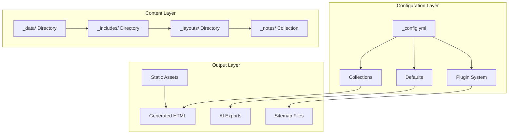
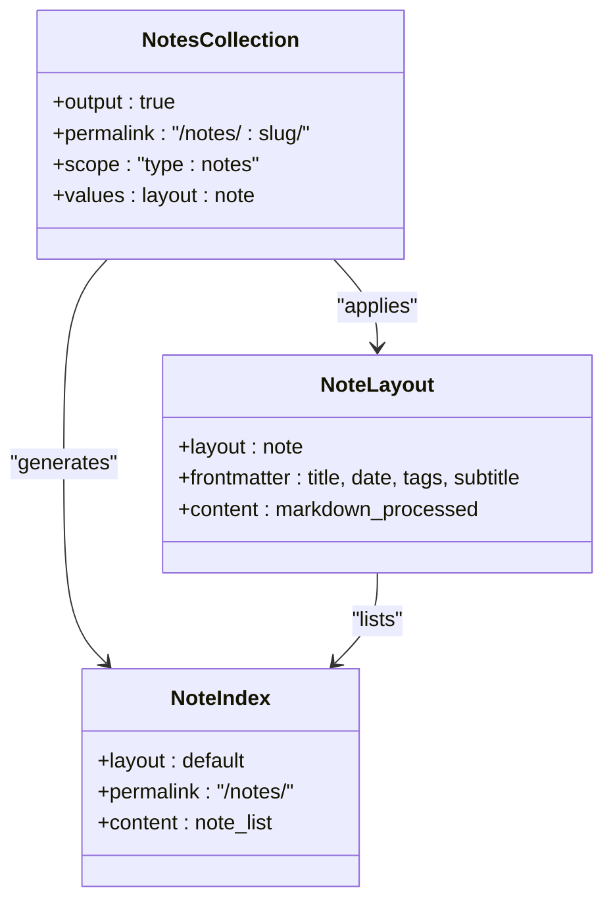
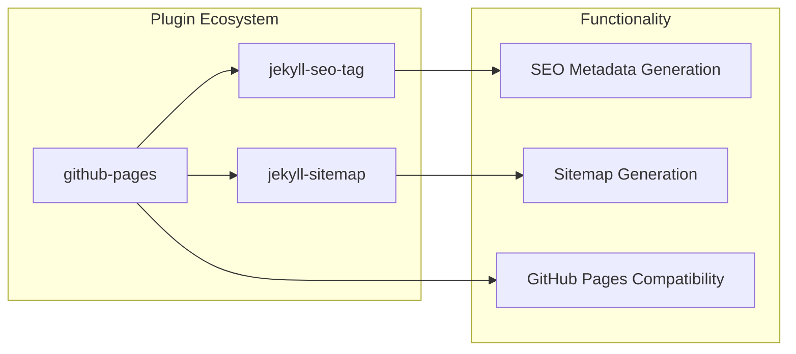
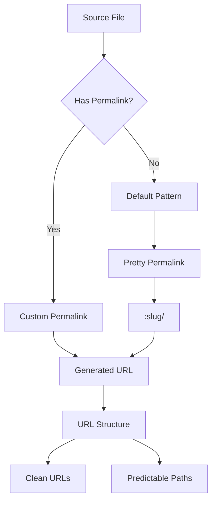
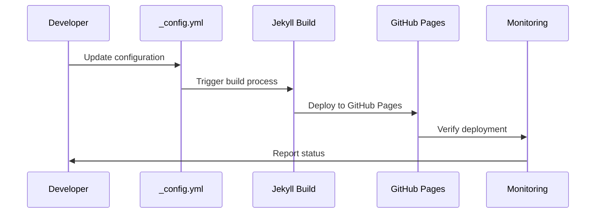
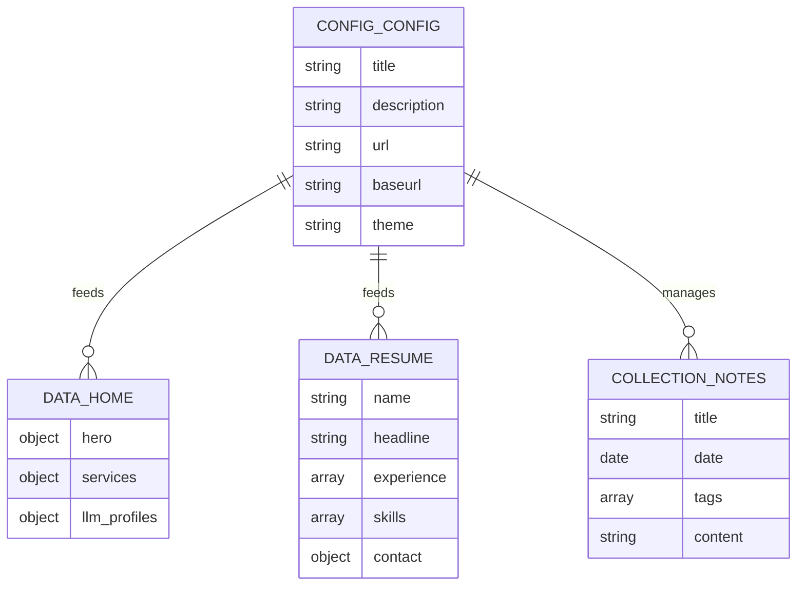
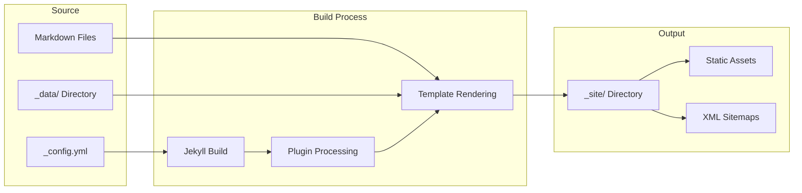

# Configuration Management

<cite>
**Referenced Files in This Document**
- [_config.yml](file://_config.yml)
- [Gemfile](file://Gemfile)
- [Gemfile.lock](file://Gemfile.lock)
- [README.md](file://README.md)
- [ARCHITECTURE.md](file://ARCHITECTURE.md)
- [_layouts/note.html](file://_layouts/note.html)
- [_includes/page-builder.html](file://_includes/page-builder.html)
- [_data/home.yml](file://_data/home.yml)
- [_data/resume.yml](file://_data/resume.yml)
- [_data/social.yml](file://_data/social.yml)
- [_data/changelog.yml](file://_data/changelog.yml)
- [index.md](file://index.md)
- [notes/index.md](file://notes/index.md)
- [bin/build_static_sitemap.py](file://bin/build_static_sitemap.py)
- [sitemap-pages.xml](file://sitemap-pages.xml)
</cite>

## Table of Contents
1. [Introduction](#introduction)
2. [Configuration Architecture Overview](#configuration-architecture-overview)
3. [Core Configuration Options](#core-configuration-options)
4. [Collections and Content Management](#collections-and-content-management)
5. [Plugin Integrations](#plugin-integrations)
6. [Permalink Patterns and URL Structure](#permalink-patterns-and-url-structure)
7. [Environment-Specific Configurations](#environment-specific-configurations)
8. [Data Model Integration](#data-model-integration)
9. [Deployment and Build Configuration](#deployment-and-build-configuration)
10. [Troubleshooting Guide](#troubleshooting-guide)
11. [Best Practices](#best-practices)
12. [Advanced Configuration Patterns](#advanced-configuration-patterns)

## Introduction

The Jekyll configuration system in this CV AI project serves as the central orchestrator for content generation, site structure, and deployment workflows. Built on Jekyll 4 with GitHub Pages compatibility, the configuration manages everything from basic site metadata to complex collection routing and AI-friendly data exports.

This documentation provides comprehensive coverage of the `_config.yml` system, explaining each configuration directive's purpose, impact on site generation, and relationships with other components like collections, layouts, and deployment pipelines.

## Configuration Architecture Overview

The configuration system operates through a hierarchical approach where `_config.yml` serves as the primary orchestrator, coordinating with:



**Diagram sources**
- [_config.yml](file://_config.yml#L1-L51)
- [Gemfile](file://Gemfile#L1-L5)
- [_includes/page-builder.html](file://_includes/page-builder.html#L1-L42)

**Section sources**
- [_config.yml](file://_config.yml#L1-L51)
- [ARCHITECTURE.md](file://ARCHITECTURE.md#L1-L20)

## Core Configuration Options

### Site Metadata Configuration

The site metadata configuration establishes the foundation for all generated content:

| Configuration Directive | Purpose | Example Value | Impact |
|------------------------|---------|---------------|---------|
| `title` | Primary site title | `"Dzmitryi Kharlanau \| System Analyst & SAP Transformation Consultant"` | Used in SEO tags, navigation, and structured data |
| `description` | Site description | Comprehensive professional description | SEO optimization and social sharing |
| `url` | Base URL | `"https://dkharlanau.github.io"` | Absolute URL generation for links and sitemaps |
| `baseurl` | Subdirectory prefix | `""` | Deployment path for GitHub Pages |
| `lang` | Language setting | `"en"` | HTML lang attribute and SEO localization |

### Theme and Presentation Settings

The theme configuration determines the visual framework:

| Configuration Directive | Purpose | Implementation |
|------------------------|---------|----------------|
| `theme` | Jekyll theme selection | `minima` - GitHub Pages default theme |
| `sass.style` | CSS compilation style | `compressed` - Optimized production CSS |

### Author and Social Media Configuration

Social media and author metadata configuration enables rich sharing and structured data:

| Configuration Directive | Purpose | Structure |
|------------------------|---------|-----------|
| `author.name` | Author full name | `"Dzmitryi Kharlanau"` |
| `author.title` | Professional title | `"System Analyst & SAP Transformation Consultant"` |
| `author.bio` | Professional summary | Detailed career description |
| `twitter.username` | Twitter handle | `"dkharlanau"` |
| `social.name` | Social profile name | `"Dzmitryi Kharlanau"` |
| `social.links` | Social media URLs | Array of platform links |

**Section sources**
- [_config.yml](file://_config.yml#L1-L20)
- [_data/social.yml](file://_data/social.yml#L1-L50)

## Collections and Content Management

### Notes Collection Configuration

The notes collection demonstrates advanced collection management with custom routing:



**Diagram sources**
- [_config.yml](file://_config.yml#L25-L30)
- [notes/index.md](file://notes/index.md#L1-L42)
- [_layouts/note.html](file://_layouts/note.html#L1-L57)

### Collection Defaults System

The defaults configuration ensures consistent behavior across collection items:

| Scope | Values Applied | Purpose |
|-------|---------------|---------|
| `path: ""` | Applies to all collections | Global defaults |
| `type: notes` | Applies to notes collection | Collection-specific behavior |
| `layout: note` | Sets note layout | Consistent presentation |

### Content Organization Patterns

The configuration supports multiple content organization patterns:

1. **Data-Driven Content**: Centralized data in `_data/` with dynamic rendering
2. **Collection-Based Content**: Structured content in collections with custom routing
3. **Static Pages**: Standalone pages with dedicated templates
4. **AI Exports**: Structured data exports for machine learning integration

**Section sources**
- [_config.yml](file://_config.yml#L25-L35)
- [notes/index.md](file://notes/index.md#L1-L42)
- [_layouts/note.html](file://_layouts/note.html#L1-L57)

## Plugin Integrations

### Core Plugin Configuration

The plugin system extends Jekyll's functionality through GitHub Pages-compatible gems:



**Diagram sources**
- [Gemfile](file://Gemfile#L1-L5)
- [Gemfile.lock](file://Gemfile.lock#L1-L50)

### Plugin Dependencies and Versions

| Plugin | Version | Purpose | Integration Point |
|--------|---------|---------|------------------|
| `github-pages` | Group dependency | GitHub Pages compatibility | Primary plugin group |
| `jekyll-seo-tag` | 2.8.0 | SEO metadata generation | Automatic metadata injection |
| `jekyll-sitemap` | 1.4.0 | XML sitemap generation | Search engine indexing |

### Plugin Configuration Impact

Each plugin contributes specific functionality:

- **jekyll-seo-tag**: Generates structured data, Twitter Cards, and Open Graph metadata
- **jekyll-sitemap**: Creates XML sitemaps for search engine discovery
- **github-pages**: Ensures compatibility with GitHub Pages hosting environment

**Section sources**
- [Gemfile](file://Gemfile#L1-L5)
- [Gemfile.lock](file://Gemfile.lock#L1-L264)

## Permalink Patterns and URL Structure

### Permalink Configuration Strategy

The permalink system creates clean, predictable URL structures:



**Diagram sources**
- [_config.yml](file://_config.yml#L7-L8)
- [notes/index.md](file://notes/index.md#L4-L5)

### URL Structure Patterns

| Pattern Type | Configuration | Example Output | Use Case |
|-------------|---------------|----------------|----------|
| Pretty Permalinks | `permalink: pretty` | `/notes/my-note/` | Clean, readable URLs |
| Custom Permalinks | `permalink: /notes/:slug/` | `/notes/system-architecture/` | Collection-specific routing |
| Root Permalink | `permalink: /` | `/` | Homepage canonical URL |
| Index Permalinks | Implicit | `/notes/` | Collection landing pages |

### Collection-Specific URL Patterns

The notes collection demonstrates advanced URL routing:

- **Individual Notes**: `/notes/:slug/` - Dynamic slug-based URLs
- **Collection Landing**: `/notes/` - Aggregated listing with sorting
- **Archive Structure**: Chronological ordering with metadata

**Section sources**
- [_config.yml](file://_config.yml#L7-L8)
- [notes/index.md](file://notes/index.md#L4-L5)

## Environment-Specific Configurations

### Development vs Production Settings

While the current configuration is primarily static, the architecture supports environment-specific variations:

| Environment | Configuration Focus | Key Differences |
|-------------|-------------------|-----------------|
| Development | Local serving | `baseurl: ""`, verbose logging |
| Production | GitHub Pages | `url: "https://domain.com"`, compressed assets |
| CI/CD | Automated builds | Silent processing, minimal output |

### Environment Variables and Secrets

The configuration system supports external environment integration:

- **Base URL Configuration**: Can be overridden for different deployment environments
- **Asset Optimization**: Sass compression for production builds
- **Plugin Behavior**: Conditional plugin activation based on environment

### Deployment Pipeline Integration

The configuration integrates with automated deployment workflows:



**Diagram sources**
- [_config.yml](file://_config.yml#L1-L51)
- [Gemfile](file://Gemfile#L1-L5)

**Section sources**
- [_config.yml](file://_config.yml#L1-L51)
- [README.md](file://README.md#L1-L25)

## Data Model Integration

### Centralized Data Architecture

The configuration coordinates with a centralized data model system:



**Diagram sources**
- [_config.yml](file://_config.yml#L1-L51)
- [_data/home.yml](file://_data/home.yml#L1-L56)
- [_data/resume.yml](file://_data/resume.yml#L1-L441)

### Data Export and AI Integration

The configuration supports AI-friendly data exports:

| Export Type | Location | Format | Purpose |
|-------------|----------|--------|---------|
| Resume JSON | `/ai/resume.json` | JSON | Machine learning integration |
| Resume YAML | `/ai/resume.yml` | YAML | Structured data export |
| Home JSON | `/ai/home.json` | JSON | Homepage content export |
| LLM Profile | `/LLM.txt` | Text | System profile for AI agents |

### Data Validation and Integrity

The configuration ensures data integrity through:

- **Schema Validation**: Structured data formats with required fields
- **Type Safety**: Consistent data typing across exports
- **Version Control**: Trackable data changes through Git
- **Automated Testing**: CI/CD validation of data exports

**Section sources**
- [_data/home.yml](file://_data/home.yml#L1-L56)
- [_data/resume.yml](file://_data/resume.yml#L1-L441)
- [ARCHITECTURE.md](file://ARCHITECTURE.md#L40-L50)

## Deployment and Build Configuration

### GitHub Pages Integration

The configuration is optimized for GitHub Pages deployment:



**Diagram sources**
- [Gemfile](file://Gemfile#L1-L5)
- [_config.yml](file://_config.yml#L1-L51)

### Asset Optimization

The configuration includes asset optimization settings:

- **CSS Compression**: Sass compilation with compressed output
- **File Exclusions**: Ignored directories and files for build efficiency
- **Include Directives**: Explicit file inclusion for specific content

### Build Pipeline Configuration

The build process follows GitHub Pages standards:

| Component | Configuration | Purpose |
|-----------|---------------|---------|
| Ruby Version | GitHub Pages default | Environment compatibility |
| Bundler Setup | Gemfile management | Dependency isolation |
| Webrick Server | Local development | Development server |
| Jekyll Version | GitHub Pages compatible | Deployment consistency |

**Section sources**
- [Gemfile](file://Gemfile#L1-L5)
- [_config.yml](file://_config.yml#L35-L45)

## Troubleshooting Guide

### Common Configuration Issues

#### Broken Permalink Generation

**Symptoms**: URLs not generating correctly, 404 errors on collection pages

**Causes and Solutions**:
- **Missing Collection Configuration**: Ensure collection is properly defined in `_config.yml`
- **Incorrect Permalink Syntax**: Verify permalink patterns match file structure
- **Layout Conflicts**: Check that collection items use appropriate layouts

#### Missing Collections

**Symptoms**: Collection pages not appearing, empty collection listings

**Diagnosis Steps**:
1. Verify collection definition in `_config.yml`
2. Check collection directory structure
3. Confirm front matter includes required fields
4. Review collection defaults configuration

#### Plugin Loading Failures

**Symptoms**: Plugins not functioning, build errors

**Resolution Process**:
1. **Dependency Conflicts**: Check Gemfile.lock for version conflicts
2. **GitHub Pages Compatibility**: Ensure plugins are GitHub Pages compatible
3. **Local vs Remote**: Test plugin functionality locally before deployment

### Configuration Validation Checklist

| Issue Category | Validation Steps | Expected Outcome |
|---------------|------------------|------------------|
| Site Metadata | Check title, description, URL | SEO tags present |
| Collection Routing | Verify permalink patterns | Clean URLs generated |
| Plugin Functionality | Test plugin features | Expected plugin behavior |
| Data Integration | Validate data exports | Correct data structure |
| Build Process | Run local build | Successful compilation |

### Debugging Tools and Techniques

#### Local Development Debugging

```bash
# Test configuration locally
bundle exec jekyll serve --verbose

# Validate plugin functionality
bundle exec jekyll doctor

# Check build output
ls -la _site/
```

#### Production Validation

- **Sitemap Verification**: Validate XML sitemap structure
- **SEO Testing**: Use Google Search Console for metadata validation
- **Performance Monitoring**: Check asset loading and page speed

**Section sources**
- [_config.yml](file://_config.yml#L1-L51)
- [bin/build_static_sitemap.py](file://bin/build_static_sitemap.py#L48-L104)

## Best Practices

### Configuration Organization

#### Modular Configuration Approach

1. **Separate Concerns**: Keep site metadata separate from content configuration
2. **Environment-Specific Settings**: Use conditional configurations for different environments
3. **Documentation Integration**: Comment configuration directives with their purpose
4. **Version Control**: Track configuration changes through Git commits

#### Naming Conventions

| Element Type | Convention | Example |
|-------------|------------|---------|
| Collection Names | lowercase with underscores | `notes_collection` |
| Variable Names | snake_case | `social_links` |
| File Names | kebab-case | `_config.yml` |
| Directory Names | lowercase | `_data/`, `_includes/`

### Performance Optimization

#### Build Performance

- **Selective Processing**: Use `exclude` directive to skip unnecessary files
- **Asset Optimization**: Configure Sass for production-ready CSS
- **Plugin Efficiency**: Only include necessary plugins for functionality

#### Runtime Performance

- **Lazy Loading**: Implement progressive enhancement for JavaScript
- **Image Optimization**: Use responsive images with multiple formats
- **Caching Strategy**: Leverage browser caching for static assets

### Maintenance Guidelines

#### Regular Updates

1. **Plugin Updates**: Monitor GitHub Pages plugin compatibility
2. **Theme Updates**: Keep themes current while maintaining customizations
3. **Security Patches**: Update dependencies regularly
4. **Content Validation**: Verify data integrity across exports

#### Backup and Recovery

- **Configuration Backup**: Version control all configuration files
- **Export Validation**: Regularly test AI data exports
- **Deployment Verification**: Validate deployments before promotion

**Section sources**
- [_config.yml](file://_config.yml#L35-L51)
- [ARCHITECTURE.md](file://ARCHITECTURE.md#L55-L67)

## Advanced Configuration Patterns

### Multi-Language Support

While currently configured for English, the architecture supports internationalization:

```yaml
# Example multi-language configuration pattern
languages:
  - en
  - de
  - ru
default_lang: "en"
```

### Conditional Content Delivery

Advanced conditional logic for content delivery:

```yaml
# Example conditional configuration
defaults:
  - scope:
      path: ""
      type: "pages"
    values:
      sitemap: true
  - scope:
      path: "private/"
      type: "pages"
    values:
      sitemap: false
      published: false
```

### Custom Plugin Development

Pattern for extending configuration functionality:

```yaml
# Example custom plugin integration
plugins:
  - jekyll-seo-tag
  - jekyll-sitemap
  - my-custom-plugin
  - jekyll-redirects
```

### Integration with External Systems

The configuration supports various external integrations:

- **Analytics Platforms**: Google Analytics, Matomo integration
- **Form Services**: Formspree, Netlify Forms
- **Content Delivery**: CDN integration for assets
- **Monitoring**: Health check endpoints and monitoring integration

**Section sources**
- [_config.yml](file://_config.yml#L1-L51)
- [ARCHITECTURE.md](file://ARCHITECTURE.md#L61-L67)