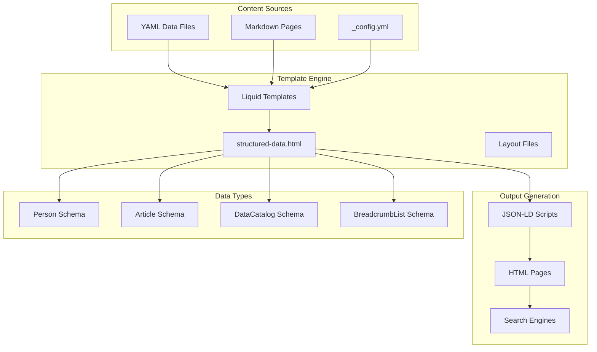
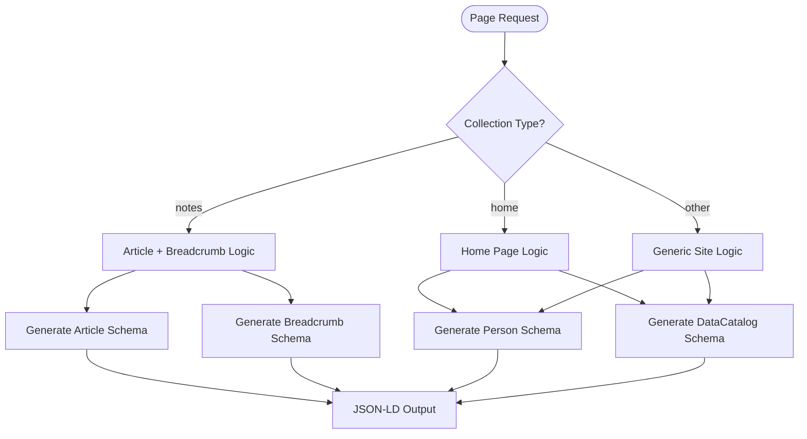
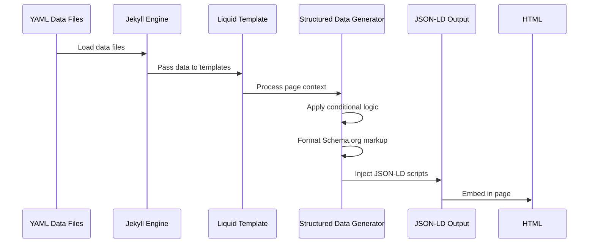
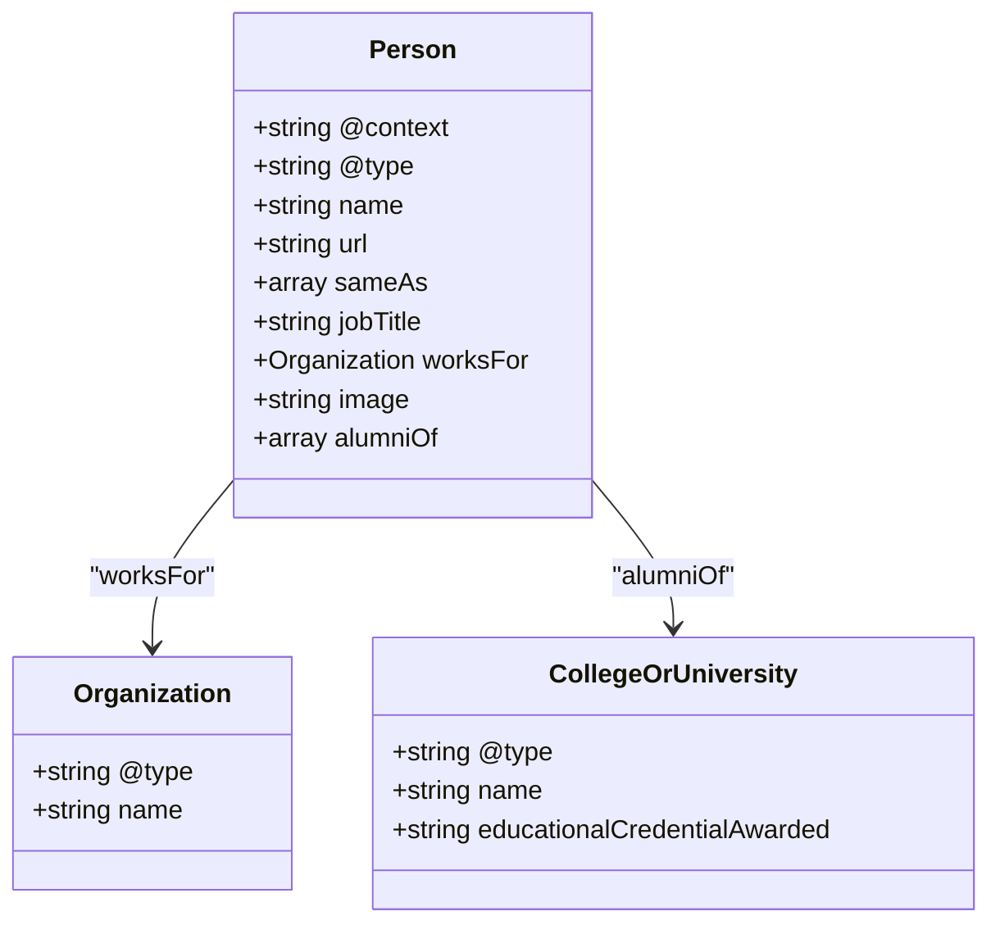
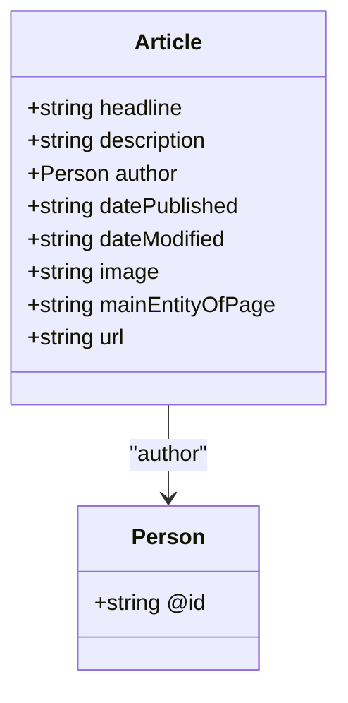
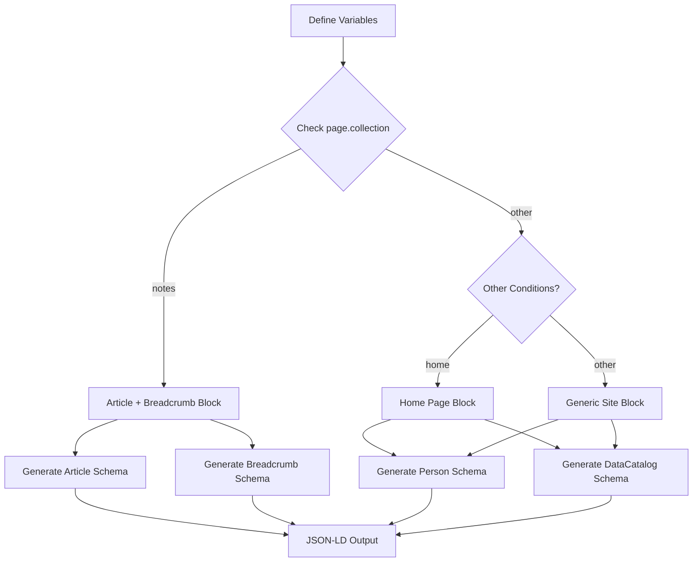
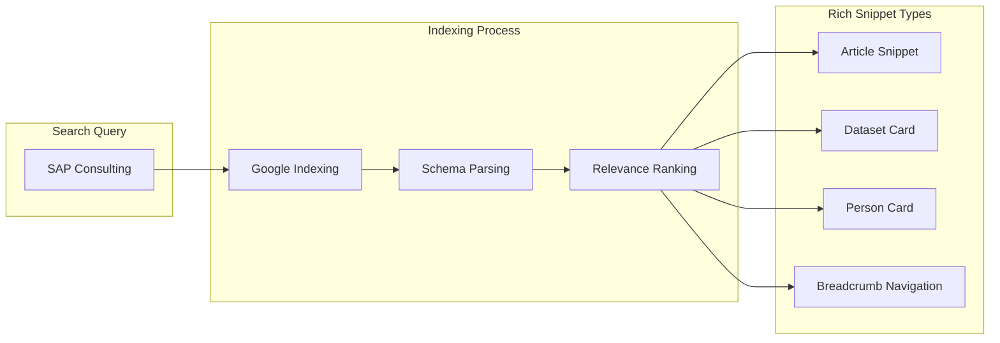
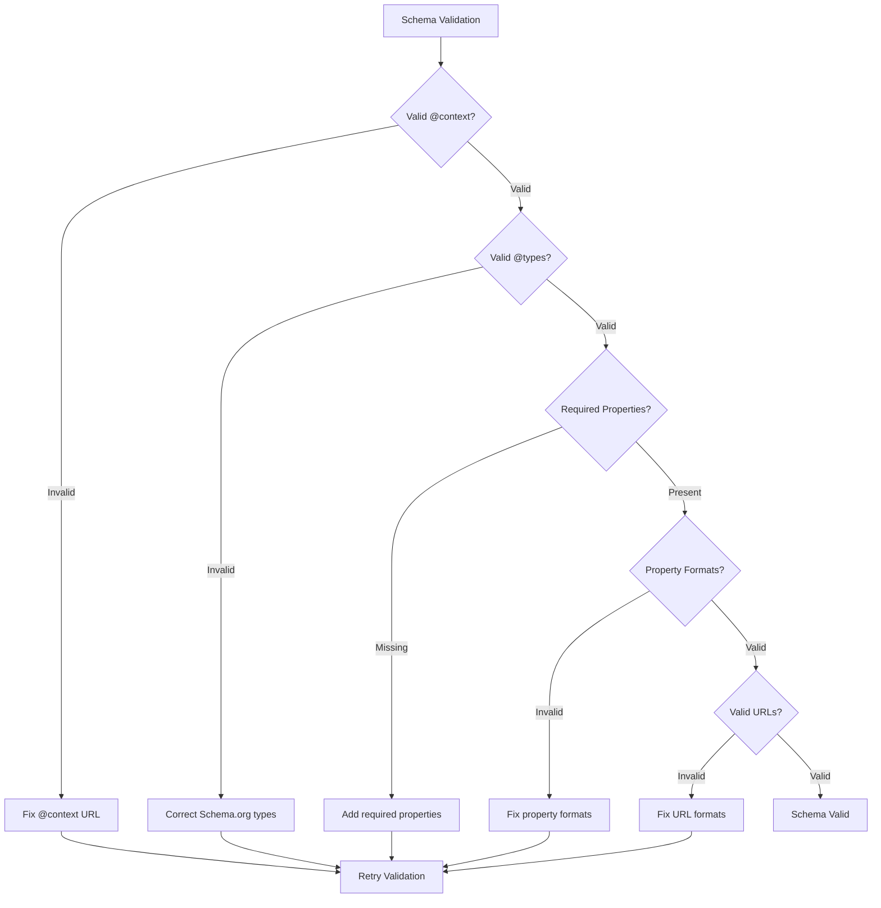
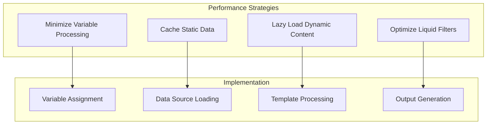
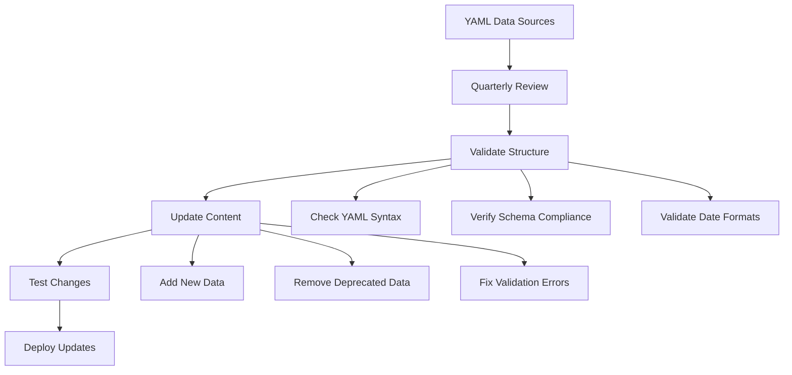

# SEO & Structured Data Implementation

<cite>
**Referenced Files in This Document**
- [_includes/seo/structured-data.html](file://_includes/seo/structured-data.html)
- [_data/datasets.yml](file://_data/datasets.yml)
- [_config.yml](file://_config.yml)
- [_data/home.yml](file://_data/home.yml)
- [_data/resume.yml](file://_data/resume.yml)
- [ai/catalog.json](file://ai/catalog.json)
- [ai/resume.json](file://ai/resume.json)
- [ai/principles.json](file://ai/principles.json)
- [index.md](file://index.md)
- [_notes/ai_ml.md](file://_notes/ai_ml.md)
- [_notes/process_audit.md](file://_notes/process_audit.md)
- [_layouts/default.html](file://_layouts/default.html)
</cite>

## Table of Contents
1. [Introduction](#introduction)
2. [Architecture Overview](#architecture-overview)
3. [Core Components](#core-components)
4. [Data Flow and Generation](#data-flow-and-generation)
5. [Schema.org Entity Types](#schemaorg-entity-types)
6. [Liquid Template Implementation](#liquid-template-implementation)
7. [Generated Output Examples](#generated-output-examples)
8. [Search Engine Consumption](#search-engine-consumption)
9. [Validation and Troubleshooting](#validation-and-troubleshooting)
10. [Best Practices](#best-practices)
11. [Maintenance Guidelines](#maintenance-guidelines)

## Introduction

This documentation covers the comprehensive SEO and structured data implementation using Schema.org JSON-LD on the Dzmitryi Kharlanau personal website. The implementation leverages Jekyll's Liquid templating engine to dynamically generate context-aware structured data that enhances search engine visibility and provides rich snippets in search results.

The system implements multiple Schema.org entity types including Person, WebSite, Article, DataCatalog, and BreadcrumbList, with dynamic content generation based on page type, collection membership, and YAML data sources. This approach ensures optimal SEO performance while maintaining clean separation between content and metadata.

## Architecture Overview

The SEO and structured data system follows a modular architecture that separates concerns between data sources, template logic, and output generation:



**Diagram sources**
- [_includes/seo/structured-data.html](file://_includes/seo/structured-data.html#L1-L77)
- [_data/datasets.yml](file://_data/datasets.yml#L1-L96)
- [_config.yml](file://_config.yml#L1-L51)

## Core Components

### Data Source Layer

The system utilizes multiple YAML data sources that serve as the foundation for structured data generation:

| Data Source | Purpose | Schema Type |
|-------------|---------|-------------|
| `_data/datasets.yml` | Primary datasets for DataCatalog | Dataset |
| `_data/resume.yml` | Professional resume data | Person |
| `_data/home.yml` | Home page content and navigation | Various |
| `_config.yml` | Site-wide configuration and metadata | Site-wide |

### Template Processing Layer

The Liquid templating engine processes data through a centralized template that handles conditional logic for different page types:



**Diagram sources**
- [_includes/seo/structured-data.html](file://_includes/seo/structured-data.html#L36-L75)

**Section sources**
- [_includes/seo/structured-data.html](file://_includes/seo/structured-data.html#L1-L77)
- [_data/datasets.yml](file://_data/datasets.yml#L1-L96)

## Data Flow and Generation

### YAML to JSON-LD Transformation Pipeline

The system transforms YAML data into structured JSON-LD through a multi-stage process:



**Diagram sources**
- [_includes/seo/structured-data.html](file://_includes/seo/structured-data.html#L1-L10)
- [_data/datasets.yml](file://_data/datasets.yml#L1-L10)

### Dynamic Content Generation Process

The template engine evaluates multiple conditions to determine appropriate Schema.org entities:

1. **Primary Dataset Processing**: Loads the first dataset from `_data/datasets.yml` for basic structured data
2. **DataCatalog Generation**: Creates comprehensive dataset catalog when multiple datasets exist
3. **Article Schema Creation**: Generates article metadata for blog-style content
4. **Breadcrumb Navigation**: Implements hierarchical navigation structure
5. **Person Schema**: Defines author and organizational information

**Section sources**
- [_includes/seo/structured-data.html](file://_includes/seo/structured-data.html#L11-L35)

## Schema.org Entity Types

### Person Schema Implementation

The Person schema defines the author and organizational affiliation:



**Diagram sources**
- [_data/resume.yml](file://_data/resume.yml#L430-L441)

### DataCatalog Schema Implementation

The DataCatalog schema provides comprehensive metadata for the professional data catalog:

| Property | Value | Purpose |
|----------|-------|---------|
| `@context` | `https://schema.org` | Schema.org context definition |
| `@type` | `DataCatalog` | Entity type identifier |
| `name` | `"DKharlanau Professional Data Catalog"` | Catalog display name |
| `url` | `https://dkharlanau.github.io/ai/catalog.json` | Catalog endpoint URL |
| `creator` | Author information | Dataset creator identification |
| `dataset` | Array of Dataset objects | Individual dataset references |

### Article Schema Implementation

Article schema provides rich metadata for blog-style content:



**Diagram sources**
- [_includes/seo/structured-data.html](file://_includes/seo/structured-data.html#L36-L55)

### BreadcrumbList Schema Implementation

Breadcrumb navigation provides hierarchical site structure:

| Position | Name | URL | Purpose |
|----------|------|-----|---------|
| 1 | Home | `/` | Site root navigation |
| 2 | Collection | `/notes/` | Collection landing page |
| 3 | Current Page | `/{page-url}` | Specific page navigation |

**Section sources**
- [_includes/seo/structured-data.html](file://_includes/seo/structured-data.html#L56-L75)
- [ai/catalog.json](file://ai/catalog.json#L1-L30)

## Liquid Template Implementation

### Template Structure and Logic

The Liquid template implements sophisticated conditional logic to handle different page types:



**Diagram sources**
- [_includes/seo/structured-data.html](file://_includes/seo/structured-data.html#L36-L75)

### Variable Management and Data Binding

The template establishes essential variables for consistent data binding:

| Variable | Source | Purpose |
|----------|--------|---------|
| `resume` | `site.data.resume` | Resume data access |
| `canonical_url` | `page.url \| absolute_url` | Canonical URL generation |
| `site_home` | `'/' \| absolute_url` | Site root URL |
| `author_id` | Hardcoded | Author identifier URI |
| `og_image` | `page.og_image \| default` | OpenGraph image fallback |
| `page_description` | Multi-source fallback | Description extraction |

### Conditional Rendering Logic

The template implements precise conditional rendering based on page characteristics:

- **Collection-based Rendering**: Different logic for `notes` collection versus other pages
- **Date Handling**: Flexible date processing with fallback mechanisms
- **Image Resolution**: Multi-format image support with defaults
- **Description Truncation**: SEO-optimized description length management

**Section sources**
- [_includes/seo/structured-data.html](file://_includes/seo/structured-data.html#L1-L35)

## Generated Output Examples

### Article Page Example (Notes Collection)

For blog-style content in the `notes` collection, the template generates dual JSON-LD structures:

**Article Schema Output:**
```json
{
  "@context": "https://schema.org",
  "@type": "Article",
  "headline": "AI & ML Around SAP",
  "description": "Blueprint for SAP AI sidecars: keep S/4 deterministic while AI/ML services predict demand...",
  "author": {
    "@id": "https://dkharlanau.github.io/#dkharlanau"
  },
  "datePublished": "2024-01-15T00:00:00+00:00",
  "image": "https://dkharlanau.github.io/assets/og/default.png",
  "mainEntityOfPage": "https://dkharlanau.github.io/notes/ai-ml/",
  "url": "https://dkharlanau.github.io/notes/ai-ml/"
}
```

**Breadcrumb Schema Output:**
```json
{
  "@context": "https://schema.org",
  "@type": "BreadcrumbList",
  "itemListElement": [
    {"@type": "ListItem","position": 1,"name": "Home","item": "https://dkharlanau.github.io/"},
    {"@type": "ListItem","position": 2,"name": "Notes","item": "https://dkharlanau.github.io/notes/"},
    {"@type": "ListItem","position": 3,"name": "AI & ML Around SAP","item": "https://dkharlanau.github.io/notes/ai-ml/"}
  ]
}
```

### DataCatalog Page Example

For the main site pages, the template generates comprehensive dataset catalog:

**DataCatalog Schema Output:**
```json
{
  "@context": "https://schema.org",
  "@type": "DataCatalog",
  "@id": "https://dkharlanau.github.io/ai/catalog.json#catalog",
  "name": "DKharlanau Professional Data Catalog",
  "url": "https://dkharlanau.github.io/ai/catalog.json",
  "creator": {
    "@type": "Person",
    "@id": "https://dkharlanau.github.io/#dkharlanau",
    "name": "Dzmitryi Kharlanau",
    "url": "https://dkharlanau.github.io/"
  },
  "dataset": [...]
}
```

### Person Schema Example

For author identification and organizational context:

**Person Schema Output:**
```json
{
  "@context": "https://schema.org",
  "@type": "Person",
  "name": "Dzmitryi Kharlanau",
  "url": "https://dkharlanau.github.io",
  "sameAs": [
    "https://www.linkedin.com/in/dkharlanau",
    "https://x.com/dkharlanau",
    "https://hashnode.com/@dkharlanau",
    "https://medium.com/@dkharlanau"
  ],
  "jobTitle": "Senior SAP SD / O2C Consultant",
  "worksFor": {
    "@type": "Organization",
    "name": "EPAM Systems"
  },
  "image": "https://dkharlanau.github.io/assets/img/DzmitryiKharlanau.png"
}
```

**Section sources**
- [_includes/seo/structured-data.html](file://_includes/seo/structured-data.html#L36-L75)
- [ai/catalog.json](file://ai/catalog.json#L1-L30)

## Search Engine Consumption

### Google Search Results Enhancement

Search engines consume the structured data to enhance search results with rich snippets:



### Rich Snippet Types

The structured data enables several rich snippet types:

| Snippet Type | Trigger Condition | Information Displayed |
|--------------|-------------------|----------------------|
| Article Snippet | Blog content with Article schema | Title, description, publication date, author, image |
| Dataset Card | DataCatalog with Dataset entries | Dataset name, description, availability, creator |
| Person Card | Person schema with verified profiles | Name, job title, organization, social links |
| Breadcrumb Navigation | BreadcrumbList schema | Hierarchical site navigation |

### Metadata Extraction and Processing

Search engines extract metadata through automated crawling and parsing:

1. **Canonical URL Recognition**: Ensures proper page identification and prevents duplicate content issues
2. **Author Attribution**: Links content to verified author profiles
3. **Publication Dates**: Enables chronological search results
4. **Image Recognition**: Provides visual appeal in search results
5. **Dataset Discovery**: Facilitates data marketplace integration

## Validation and Troubleshooting

### Common Validation Issues

The structured data implementation addresses common validation challenges:



### Validation Tools and Resources

Recommended validation approaches:

| Tool | Purpose | Usage |
|------|---------|-------|
| Google Rich Results Test | Test individual pages | https://search.google.com/test/rich-results |
| Google Structured Data Testing Tool | Validate JSON-LD syntax | https://search.google.com/structured-data/testing-tool |
| Schema.org Validator | Verify Schema.org compliance | Built-in validation rules |
| JSON-LD Playground | Test JSON-LD syntax | https://json-ld.org/playground/ |

### Troubleshooting Common Issues

**Issue: Missing Article Descriptions**
- **Cause**: Empty or improperly formatted `page_description` variable
- **Solution**: Ensure frontmatter includes `description` or `excerpt` fields
- **Code Reference**: Line 4-5 in structured-data.html

**Issue: Broken Canonical URLs**
- **Cause**: Incorrect URL generation in Liquid templates
- **Solution**: Verify `absolute_url` filter usage and base URL configuration
- **Code Reference**: Line 2 in structured-data.html

**Issue: Invalid Date Formats**
- **Cause**: Non-standard date formats in YAML data
- **Solution**: Use `date_to_xmlschema` filter consistently
- **Code Reference**: Line 47-48 in structured-data.html

**Issue: Missing Dataset Entries**
- **Cause**: Empty or malformed `_data/datasets.yml`
- **Solution**: Ensure YAML syntax is correct and contains valid Dataset objects
- **Code Reference**: Lines 1-10 in datasets.yml

**Section sources**
- [_includes/seo/structured-data.html](file://_includes/seo/structured-data.html#L1-L77)
- [_data/datasets.yml](file://_data/datasets.yml#L1-L96)

## Best Practices

### Data Structure Consistency

Maintain consistent data structures across all Schema.org implementations:

1. **Standardize Date Formats**: Use ISO 8601 format (`YYYY-MM-DD`) for all date properties
2. **URL Normalization**: Ensure all URLs are absolute and properly formatted
3. **Text Truncation**: Limit descriptions to 160 characters for optimal search display
4. **Image Optimization**: Provide multiple image formats for different platforms

### Performance Optimization

Optimize structured data generation for performance:



### Content Strategy Guidelines

Implement content strategies that maximize SEO benefits:

| Strategy | Implementation | Benefit |
|----------|----------------|---------|
| Multi-format Content | JSON, YAML, HTML outputs | Broader data accessibility |
| Hierarchical Navigation | BreadcrumbList implementation | Improved user experience |
| Author Verification | Person schema with social links | Enhanced credibility |
| Dataset Discovery | DataCatalog with keywords | Better search visibility |

### Maintenance Procedures

Establish regular maintenance procedures:

1. **Monthly Validation**: Run structured data validation across all pages
2. **Quarterly Updates**: Review and update Schema.org entity types
3. **Annual Reviews**: Audit data sources for accuracy and completeness
4. **Version Control**: Track changes to structured data implementations

## Maintenance Guidelines

### Data Source Management

Regular maintenance of YAML data sources ensures accurate structured data:



### Template Maintenance

Keep Liquid templates current with Schema.org updates:

1. **Schema.org Versioning**: Monitor Schema.org for entity type changes
2. **Filter Updates**: Stay current with Jekyll/Liquid filter changes
3. **Conditional Logic**: Review and optimize conditional statements
4. **Performance Monitoring**: Track template processing time

### Monitoring and Analytics

Implement monitoring for structured data effectiveness:

| Metric | Purpose | Monitoring Method |
|--------|---------|-------------------|
| Rich Snippet Coverage | Percentage of pages with structured data | Search console reports |
| Click-Through Rates | Effectiveness of rich snippets | Google Analytics |
| Validation Errors | Technical implementation quality | Automated validation tools |
| Performance Impact | Template processing overhead | Performance monitoring |

### Backup and Recovery

Establish backup procedures for structured data:

1. **Source Code Backup**: Version control all YAML data files
2. **Template Backup**: Maintain backups of Liquid template files
3. **Generated Output Backup**: Archive generated JSON-LD outputs
4. **Documentation Backup**: Keep maintenance documentation current

**Section sources**
- [_data/datasets.yml](file://_data/datasets.yml#L1-L96)
- [_includes/seo/structured-data.html](file://_includes/seo/structured-data.html#L1-L77)
- [_config.yml](file://_config.yml#L1-L51)