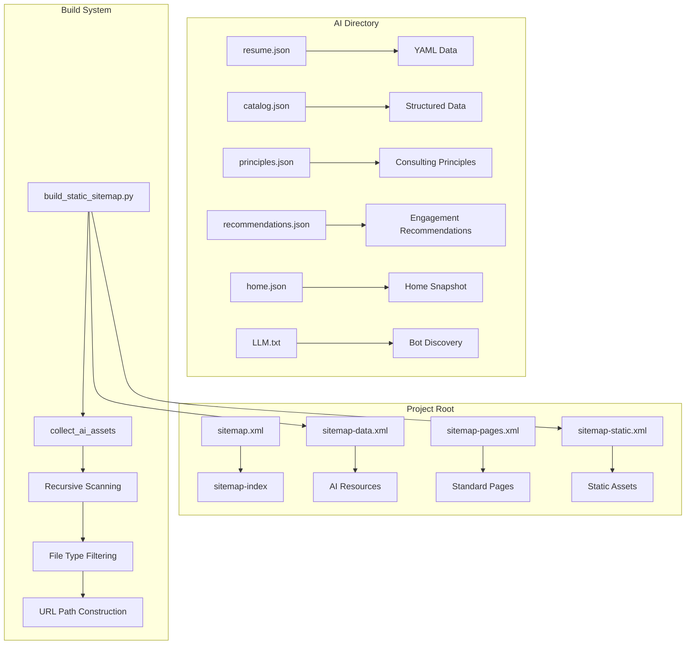
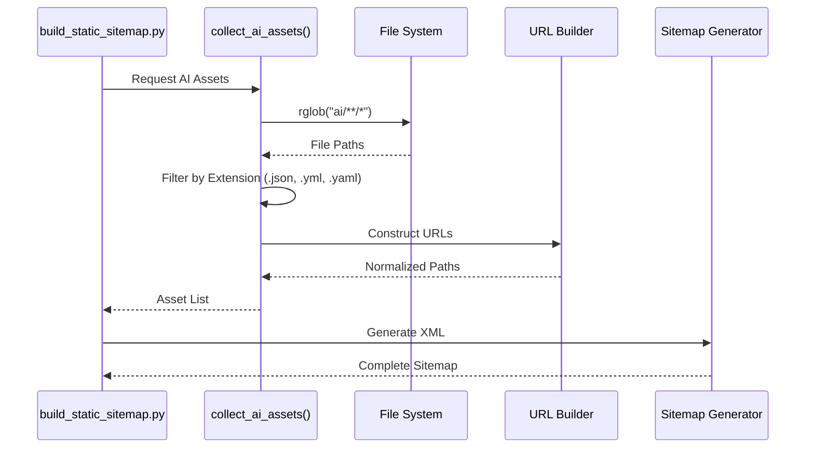
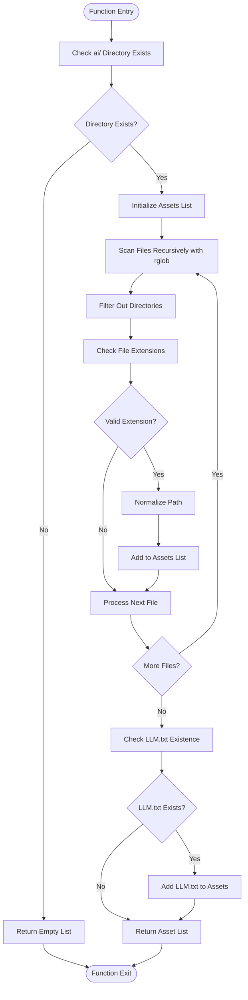
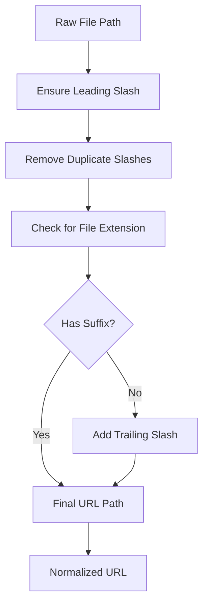
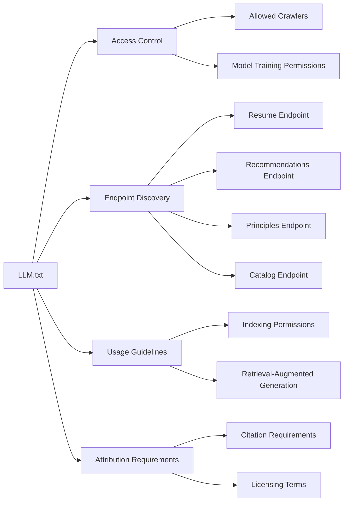
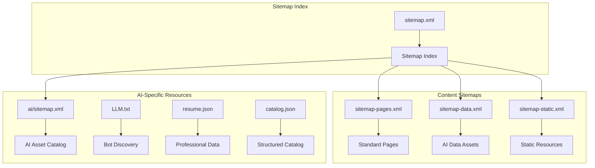
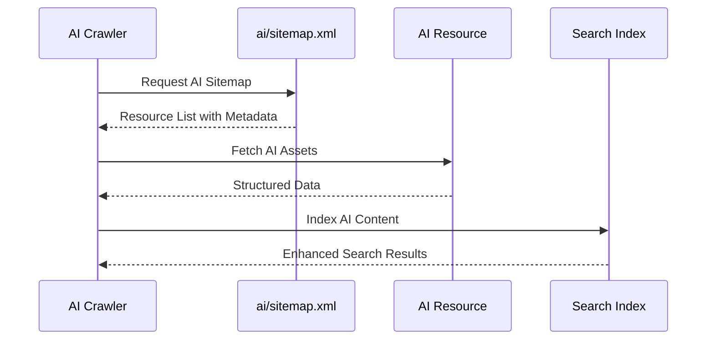

# AI Assets Collection

<cite>
**Referenced Files in This Document**
- [build_static_sitemap.py](file://bin/build_static_sitemap.py)
- [ai/sitemap.xml](file://ai/sitemap.xml)
- [sitemap.xml](file://sitemap.xml)
- [sitemap-data.xml](file://sitemap-data.xml)
- [sitemap-pages.xml](file://sitemap-pages.xml)
- [sitemap-static.xml](file://sitemap-static.xml)
- [ai/resume.json](file://ai/resume.json)
- [ai/catalog.json](file://ai/catalog.json)
- [ai/resume.yml](file://ai/resume.yml)
- [ai/principles.json](file://ai/principles.json)
- [ai/recommendations.json](file://ai/recommendations.json)
- [ai/home.json](file://ai/home.json)
- [LLM.txt](file://LLM.txt)
- [_config.yml](file://_config.yml)
- [robots.txt](file://robots.txt)
</cite>

## Table of Contents
1. [Introduction](#introduction)
2. [Project Structure](#project-structure)
3. [Core Components](#core-components)
4. [Architecture Overview](#architecture-overview)
5. [Detailed Component Analysis](#detailed-component-analysis)
6. [AI Asset Types and Formats](#ai-asset-types-and-formats)
7. [URL Path Construction](#url-path-construction)
8. [Search Engine Discovery](#search-engine-discovery)
9. [Troubleshooting Guide](#troubleshooting-guide)
10. [Extension Guidelines](#extension-guidelines)
11. [Conclusion](#conclusion)

## Introduction

The AI assets collection component is a sophisticated system designed to identify, organize, and expose machine-readable AI-ready content from the `ai/` directory and other strategic locations within the sitemap generator. This component plays a crucial role in making AI integration points discoverable by search engines, AI crawlers, and automated systems while supporting the site's comprehensive data export strategy.

The system employs recursive scanning logic using `rglob` to traverse directory structures, applies intelligent file type filtering for JSON, YAML, and TXT formats, and constructs standardized URL paths that ensure consistent accessibility across different AI platforms and search engines.

## Project Structure

The AI assets collection operates within a well-organized project structure that separates concerns between static content, dynamic data, and AI-specific resources:



**Diagram sources**
- [build_static_sitemap.py](file://bin/build_static_sitemap.py#L125-L144)
- [ai/sitemap.xml](file://ai/sitemap.xml#L8-L15)

**Section sources**
- [build_static_sitemap.py](file://bin/build_static_sitemap.py#L1-L190)
- [sitemap.xml](file://sitemap.xml#L1-L11)

## Core Components

The AI assets collection system consists of several interconnected components that work together to provide comprehensive coverage of AI-ready content:

### Sitemap Generation Engine

The core sitemap generation engine is implemented in [`build_static_sitemap.py`](file://bin/build_static_sitemap.py), which serves as the central orchestrator for collecting and organizing AI assets. This Python script utilizes a modular architecture that separates concerns into specialized functions for different content types.

### AI Asset Collector

The [`collect_ai_assets()`](file://bin/build_static_sitemap.py#L125-L144) function represents the primary mechanism for identifying AI-ready resources. This function implements sophisticated recursive scanning logic that traverses the `ai/` directory and its subdirectories, applying intelligent file type filtering to ensure only relevant machine-readable assets are included.

### URL Path Construction System

The URL path construction system ensures consistent and predictable URL structures for all collected assets. This system handles path normalization, directory traversal, and URL encoding to maintain compatibility across different web servers and client applications.

**Section sources**
- [build_static_sitemap.py](file://bin/build_static_sitemap.py#L125-L144)
- [build_static_sitemap.py](file://bin/build_static_sitemap.py#L56-L70)

## Architecture Overview

The AI assets collection follows a layered architecture that promotes separation of concerns and maintainability:



**Diagram sources**
- [build_static_sitemap.py](file://bin/build_static_sitemap.py#L125-L144)
- [build_static_sitemap.py](file://bin/build_static_sitemap.py#L147-L188)

The architecture emphasizes modularity and extensibility, allowing for easy addition of new AI asset types and integration with existing content management workflows.

**Section sources**
- [build_static_sitemap.py](file://bin/build_static_sitemap.py#L147-L188)

## Detailed Component Analysis

### Recursive Scanning Logic

The recursive scanning logic implemented in [`collect_ai_assets()`](file://bin/build_static_sitemap.py#L125-L144) demonstrates sophisticated directory traversal capabilities:



**Diagram sources**
- [build_static_sitemap.py](file://bin/build_static_sitemap.py#L125-L144)

The scanning logic employs several key strategies:

1. **Directory Validation**: Ensures the `ai/` directory exists before attempting to scan
2. **Recursive Traversal**: Uses `rglob` to scan all subdirectories and files
3. **Type Filtering**: Applies strict extension filtering for `.json`, `.yml`, and `.yaml` files
4. **Path Normalization**: Converts relative paths to standardized URL format
5. **Additional Resource Inclusion**: Explicitly includes `LLM.txt` regardless of directory structure

### File Type Filtering System

The file type filtering system implements intelligent content recognition that supports multiple AI-friendly formats:

| File Extension | Content Type | Use Case | Example |
|----------------|--------------|----------|---------|
| `.json` | Structured Data | Machine learning models, configuration | [`resume.json`](file://ai/resume.json), [`catalog.json`](file://ai/catalog.json) |
| `.yml/.yaml` | Human-Readable Data | Configuration, metadata, structured content | [`resume.yml`](file://ai/resume.yml), [`principles.yml`](file://ai/principles.json) |
| `.txt` | Plain Text | Bot discovery, access manifests | [`LLM.txt`](file://LLM.txt) |

The filtering system uses case-insensitive matching to accommodate various naming conventions while maintaining strict content validation.

### URL Path Construction Algorithm

The URL path construction algorithm ensures consistent and predictable URL structures across all AI assets:



**Diagram sources**
- [build_static_sitemap.py](file://bin/build_static_sitemap.py#L56-L70)

The algorithm implements several important features:

1. **Path Normalization**: Ensures consistent slash usage and removes duplicates
2. **Directory Detection**: Automatically adds trailing slashes for directory-like URLs
3. **Relative Path Handling**: Converts relative paths to absolute URLs
4. **Extension Preservation**: Maintains original file extensions for proper MIME type detection

**Section sources**
- [build_static_sitemap.py](file://bin/build_static_sitemap.py#L56-L70)
- [build_static_sitemap.py](file://bin/build_static_sitemap.py#L125-L144)

## AI Asset Types and Formats

The system supports a comprehensive range of AI-ready asset types, each serving specific purposes in the broader AI ecosystem:

### Structured Data Assets

#### JSON Format Assets
JSON-formatted assets provide machine-readable data structures optimized for AI consumption:

- **[`resume.json`](file://ai/resume.json)**: Professional profile data for AI assistants
- **[`catalog.json`](file://ai/catalog.json)**: Data catalog with Schema.org metadata
- **[`principles.json`](file://ai/principles.json)**: Consulting principles and methodologies
- **[`recommendations.json`](file://ai/principles.json)**: Engagement recommendations and best practices
- **[`home.json`](file://ai/home.json)**: Home page snapshot and metadata

#### YAML Format Assets
YAML-formatted assets offer human-readable structured data with enhanced metadata support:

- **[`resume.yml`](file://ai/resume.yml)**: Comprehensive professional profile with extensive metadata
- **[`principles.yml`](file://ai/principles.yml)**: Consulting principles in YAML format
- **[`recommendations.yml`](file://ai/recommendations.yml)**: Engagement recommendations in YAML format

### Bot Discovery Assets

#### LLM.txt Manifest
The [`LLM.txt`](file://LLM.txt) file serves as a comprehensive bot discovery and access manifest:



**Diagram sources**
- [LLM.txt](file://LLM.txt#L1-L95)

The LLM.txt manifest includes:

1. **Access Permissions**: Specifies which AI crawlers and bots have access
2. **Endpoint Information**: Lists all available AI-ready endpoints
3. **Usage Guidelines**: Provides clear instructions for AI model training and content usage
4. **Attribution Requirements**: Ensures proper credit and licensing compliance
5. **Technical Metadata**: Includes caching policies and update frequencies

**Section sources**
- [ai/resume.json](file://ai/resume.json#L1-L7)
- [ai/catalog.json](file://ai/catalog.json#L1-L30)
- [ai/resume.yml](file://ai/resume.yml#L1-L715)
- [LLM.txt](file://LLM.txt#L1-L95)

## URL Path Construction

The URL path construction system ensures consistent and predictable URL structures for all AI assets, supporting both programmatic access and human readability:

### Standard URL Patterns

The system generates URLs following established web conventions:

| Asset Type | URL Pattern | Example |
|------------|-------------|---------|
| JSON Assets | `/ai/{filename}.json` | `/ai/resume.json` |
| YAML Assets | `/ai/{filename}.yml` | `/ai/resume.yml` |
| Catalog Assets | `/ai/catalog.json` | `/ai/catalog.json` |
| Bot Manifest | `/LLM.txt` | `/LLM.txt` |

### Path Normalization Features

The path normalization system implements several important features:

1. **Leading Slash Enforcement**: Ensures all URLs begin with a forward slash
2. **Duplicate Slash Removal**: Prevents malformed URLs with consecutive slashes
3. **Trailing Slash Addition**: Automatically adds trailing slashes for directory-like resources
4. **Relative Path Resolution**: Converts relative paths to absolute URLs with proper base handling

### Integration with Static Site Generator

The URL construction system integrates seamlessly with the Jekyll-based static site generator, respecting permalink configurations and ensuring compatibility with the broader site architecture.

**Section sources**
- [build_static_sitemap.py](file://bin/build_static_sitemap.py#L56-L70)
- [build_static_sitemap.py](file://bin/build_static_sitemap.py#L125-L144)

## Search Engine Discovery

The AI assets collection system is designed to maximize discoverability by search engines and AI crawlers through comprehensive sitemap integration and strategic metadata placement:

### Multi-Level Sitemap Architecture

The system employs a multi-level sitemap architecture that organizes content by type and accessibility:



**Diagram sources**
- [sitemap.xml](file://sitemap.xml#L1-L11)
- [sitemap-data.xml](file://sitemap-data.xml#L1-L10)

### Robots.txt Configuration

The [`robots.txt`](file://robots.txt) file explicitly allows access to AI-related resources for major AI crawlers:

| User Agent | Permission | Purpose |
|------------|------------|---------|
| `*` | `Allow: /` | General access to all content |
| `GPTBot` | `Allow: /` | OpenAI's GPT crawler |
| `ChatGPT-User` | `Allow: /` | OpenAI's ChatGPT user agent |
| `anthropic-ai` | `Allow: /` | Anthropic's AI crawler |
| `ClaudeBot` | `Allow: /` | Anthropic's Claude crawler |
| `Google-Extended` | `Allow: /` | Google's extended crawler |
| `PerplexityBot` | `Allow: /` | Perplexity AI crawler |
| `CCBot` | `Allow: /` | Common Crawl crawler |

### AI-Specific Sitemap

The [`ai/sitemap.xml`](file://ai/sitemap.xml) provides specialized coverage for AI-ready content with enhanced metadata:



**Diagram sources**
- [ai/sitemap.xml](file://ai/sitemap.xml#L8-L15)

**Section sources**
- [robots.txt](file://robots.txt#L1-L31)
- [ai/sitemap.xml](file://ai/sitemap.xml#L1-L26)
- [sitemap.xml](file://sitemap.xml#L1-L11)

## Troubleshooting Guide

### Common Issues and Solutions

#### AI Assets Not Appearing in Sitemap

**Symptoms**: AI assets are missing from generated sitemaps despite existing in the `ai/` directory.

**Causes and Solutions**:

1. **Incorrect File Extensions**
   - Verify files use `.json`, `.yml`, or `.yaml` extensions
   - Check for case sensitivity issues (use lowercase extensions)

2. **Directory Structure Problems**
   - Ensure files are directly in the `ai/` directory or subdirectories
   - Verify no hidden directories are interfering with scanning

3. **Permission Issues**
   - Check file permissions allow read access
   - Verify the build script has appropriate filesystem permissions

#### LLM.txt Not Detected

**Symptoms**: The [`LLM.txt`](file://LLM.txt) file is not included in sitemap generation.

**Solutions**:

1. **File Location Verification**
   - Confirm [`LLM.txt`](file://LLM.txt) exists in the project root
   - Check for typos in filename (case-sensitive)

2. **Build Script Configuration**
   - Verify [`build_static_sitemap.py`](file://bin/build_static_sitemap.py) is properly configured
   - Ensure the script has permission to access the file

#### URL Path Construction Issues

**Symptoms**: Generated URLs contain incorrect paths or malformed URLs.

**Debugging Steps**:

1. **Enable Verbose Logging**
   - Add debug statements to [`ensure_path()`](file://bin/build_static_sitemap.py#L56-L70)
   - Monitor path normalization process

2. **Check Path Normalization**
   - Verify leading slash enforcement
   - Confirm duplicate slash removal
   - Validate trailing slash handling

### Search Console Integration Issues

#### AI Resource Visibility Problems

**Diagnostic Checklist**:

1. **Sitemap Submission Verification**
   - Confirm [`sitemap-data.xml`](file://sitemap-data.xml) is submitted to search consoles
   - Verify [`ai/sitemap.xml`](file://ai/sitemap.xml) is properly indexed

2. **Crawler Access Verification**
   - Check [`robots.txt`](file://robots.txt) for proper crawler permissions
   - Verify no `noindex` directives are blocking AI resources

3. **Content Accessibility**
   - Test direct access to AI assets from search results
   - Verify proper MIME type detection for different file formats

**Section sources**
- [build_static_sitemap.py](file://bin/build_static_sitemap.py#L56-L70)
- [build_static_sitemap.py](file://bin/build_static_sitemap.py#L125-L144)

## Extension Guidelines

### Adding New AI Asset Types

To extend the AI assets collection for new asset types, follow these guidelines:

#### Step 1: Modify File Type Filtering

Update the [`collect_ai_assets()`](file://bin/build_static_sitemap.py#L125-L144) function to include new file extensions:

```python
# Add new extensions to the set
if path.suffix.lower() not in {".json", ".yml", ".yaml", ".xml", ".csv"}:
    continue
```

#### Step 2: Configure URL Patterns

Ensure the URL construction system handles new asset types appropriately:

```python
# Add custom URL patterns if needed
if path.suffix.lower() == ".xml":
    # Special handling for XML assets
    pass
```

#### Step 3: Update Sitemap Configuration

Modify the sitemap generation logic to include new asset types:

```python
# Add new asset collections
for url_path, source_path in list(collect_new_assets()):
    entries[url_path] = to_iso_timestamp(source_path)
```

### Best Practices for AI Asset Development

#### Data Quality Standards

1. **Consistent Metadata**: Ensure all AI assets include proper metadata for discovery
2. **Version Control**: Implement versioning strategies for evolving AI content
3. **Validation**: Use schema validation for structured data assets
4. **Documentation**: Provide clear documentation for each AI asset type

#### Performance Optimization

1. **Compression**: Use appropriate compression for large AI datasets
2. **Caching**: Implement proper caching headers for frequently accessed assets
3. **Size Limits**: Consider size limits for individual AI assets
4. **Incremental Updates**: Support incremental updates for large datasets

#### Security Considerations

1. **Access Control**: Implement appropriate access controls for sensitive AI data
2. **Rate Limiting**: Consider rate limiting for AI resource access
3. **Data Privacy**: Ensure compliance with data privacy regulations
4. **Authentication**: Implement authentication mechanisms for restricted AI assets

**Section sources**
- [build_static_sitemap.py](file://bin/build_static_sitemap.py#L125-L144)

## Conclusion

The AI assets collection component represents a sophisticated and comprehensive system for managing AI-ready content within the sitemap generator. Through its recursive scanning logic, intelligent file type filtering, and standardized URL construction, the system ensures maximum discoverability and accessibility of AI resources by search engines and AI crawlers.

The system's architecture demonstrates excellent separation of concerns, with clear delineation between content collection, path construction, and sitemap generation. The inclusion of specialized assets like [`LLM.txt`](file://LLM.txt) and the comprehensive support for multiple data formats position this system as a robust foundation for AI-ready data export strategies.

Key strengths of the system include:

- **Comprehensive Coverage**: Supports multiple AI-friendly formats and access patterns
- **Scalable Architecture**: Easily extensible for new asset types and formats
- **Search Engine Optimization**: Optimized for discovery by major search engines and AI crawlers
- **Developer-Friendly**: Clear documentation and straightforward extension mechanisms
- **Robust Error Handling**: Comprehensive validation and fallback mechanisms

The system successfully balances flexibility with reliability, providing a solid foundation for organizations seeking to maximize the discoverability and utility of their AI-ready content while maintaining the highest standards of data quality and accessibility.