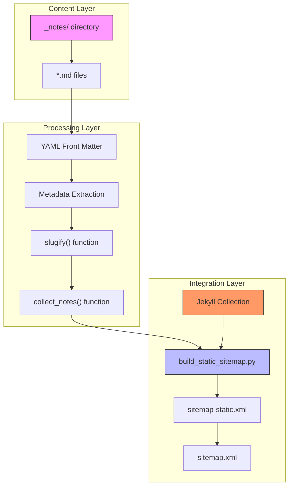
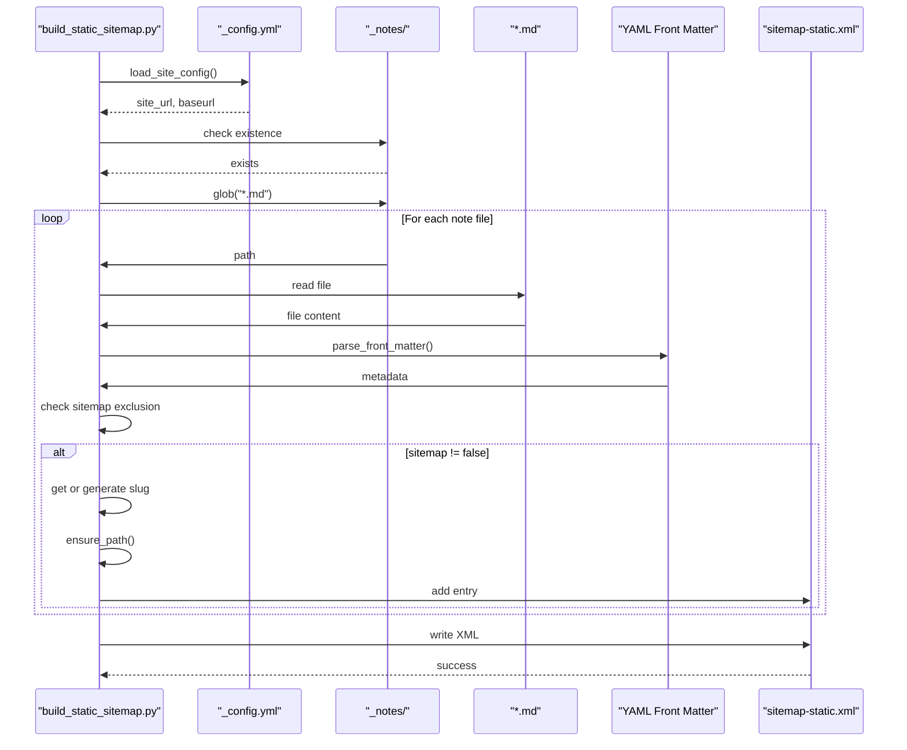
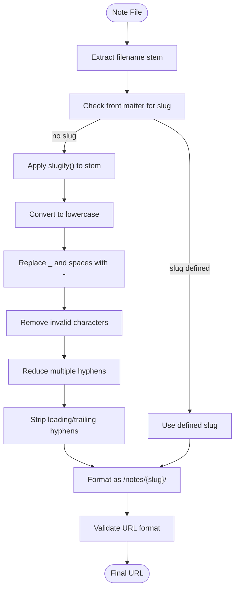
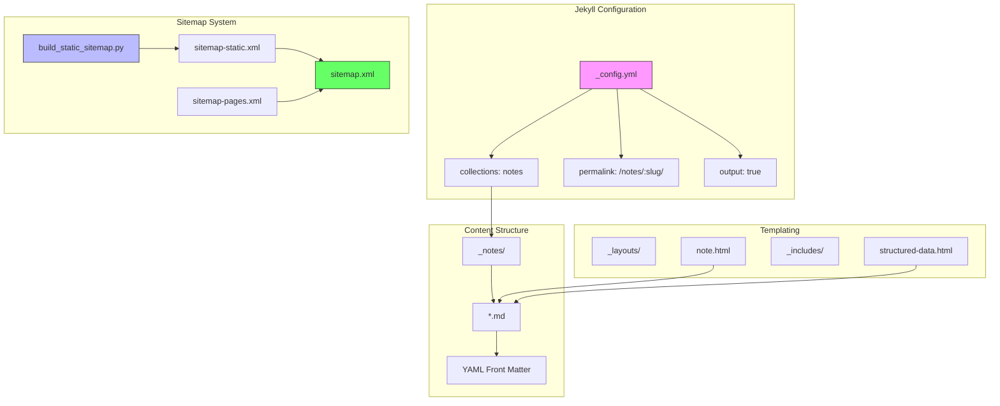

# Notes Collection

<cite>
**Referenced Files in This Document**   
- [build_static_sitemap.py](file://bin/build_static_sitemap.py)
- [_config.yml](file://_config.yml)
- [ai_ml.md](file://_notes/ai_ml.md)
- [system-architecture.md](file://_notes/system-architecture.md)
- [composable_erp.md](file://_notes/composable_erp.md)
- [process_audit.md](file://_notes/process_audit.md)
- [tools_mini_apps.md](file://_notes/tools_mini_apps.md)
- [consulting_principles.md](file://_notes/consulting_principles.md)
- [ams.md](file://_notes/ams.md)
- [note.html](file://_layouts/note.html)
- [structured-data.html](file://_includes/seo/structured-data.html)
- [sitemap-static.xml](file://sitemap-static.xml)
- [sitemap-pages.xml](file://sitemap-pages.xml)
- [sitemap.xml](file://sitemap.xml)
</cite>

## Table of Contents
1. [Introduction](#introduction)
2. [Notes Collection Architecture](#notes-collection-architecture)
3. [Sitemap Generation Process](#sitemap-generation-process)
4. [URL Formatting and Slug Generation](#url-formatting-and-slug-generation)
5. [Metadata Extraction and Processing](#metadata-extraction-and-processing)
6. [Exclusion Mechanisms](#exclusion-mechanisms)
7. [Integration with Jekyll](#integration-with-jekyll)
8. [Troubleshooting Guide](#troubleshooting-guide)
9. [Conclusion](#conclusion)

## Introduction
The notes collection subsystem is a core component of the sitemap generation process, responsible for transforming Markdown files in the `_notes` directory into SEO-friendly URLs for inclusion in the site's sitemap. This system combines Jekyll's collection functionality with a custom static sitemap generator to create a robust content management and discovery framework. The `collect_notes()` function scans the `_notes` directory, extracts metadata from YAML front matter, and generates properly formatted URLs using the `slugify` function. This documentation details the complete workflow, from file scanning to sitemap integration, including handling edge cases, exclusion mechanisms, and troubleshooting common issues.

## Notes Collection Architecture
The notes collection subsystem follows a modular architecture that separates content storage, metadata processing, URL generation, and sitemap integration. The system leverages Jekyll's native collection feature for content rendering while using a custom Python script for static sitemap generation. This hybrid approach ensures both dynamic content processing and reliable sitemap creation.

**Diagram sources**
- [build_static_sitemap.py](file://bin/build_static_sitemap.py)
- [_config.yml](file://_config.yml)

**Section sources**
- [build_static_sitemap.py](file://bin/build_static_sitemap.py)
- [_config.yml](file://_config.yml)

## Sitemap Generation Process
The sitemap generation process is orchestrated by the `build_static_sitemap.py` script, which systematically scans the repository for content to include in the sitemap. The process begins with loading the site configuration from `_config.yml` and then proceeds to collect content from three primary sources: standard pages, notes collection, and AI assets. For the notes collection specifically, the `collect_notes()` function is responsible for identifying and processing all Markdown files in the `_notes` directory.

The script first checks if the `_notes` directory exists, and if so, iterates through all `.md` files within it. For each note file, it parses the YAML front matter to extract metadata, checks exclusion rules, and generates the appropriate URL path. The collected note entries are then combined with other content types and written to the `sitemap-static.xml` file. This static sitemap is subsequently referenced by the main `sitemap.xml` index file, which aggregates multiple sitemap components including `sitemap-pages.xml`, `sitemap-data.xml`, and `sitemap-static.xml`.

**Diagram sources**
- [build_static_sitemap.py](file://bin/build_static_sitemap.py#L107-L144)
- [sitemap-static.xml](file://sitemap-static.xml)

**Section sources**
- [build_static_sitemap.py](file://bin/build_static_sitemap.py#L107-L144)
- [sitemap-static.xml](file://sitemap-static.xml)

## URL Formatting and Slug Generation
The URL formatting and slug generation process is a critical component of the notes collection subsystem, ensuring consistent and SEO-friendly URLs across all note entries. The system follows a hierarchical URL structure where all notes are organized under the `/notes/` path, followed by a slugified version of the note's title or filename.

The `slugify()` function is responsible for transforming text into URL-safe slugs through a series of normalization steps. It first converts all characters to lowercase, then replaces underscores and spaces with hyphens. Next, it removes any characters that are not lowercase letters, digits, or hyphens using a regular expression. Consecutive hyphens are reduced to a single hyphen, and any leading or trailing hyphens are stripped. This process ensures that URLs are clean, readable, and consistent.

For example, the note file `ai_ml.md` is transformed into the URL `/notes/ai-ml/`. The `collect_notes()` function first checks if a `slug` parameter is explicitly defined in the front matter. If present, this value is used; otherwise, the function applies the `slugify()` function to the filename stem (without extension). The resulting slug is then incorporated into the full URL path using the pattern `/notes/{slug}/`, with the trailing slash ensuring proper directory-style URL formatting.

**Diagram sources**
- [build_static_sitemap.py](file://bin/build_static_sitemap.py#L107-L114)
- [ai_ml.md](file://_notes/ai_ml.md)

**Section sources**
- [build_static_sitemap.py](file://bin/build_static_sitemap.py#L107-L114)
- [ai_ml.md](file://_notes/ai_ml.md)

## Metadata Extraction and Processing
The metadata extraction and processing workflow begins with parsing the YAML front matter from each note file using the `parse_front_matter()` function. This function reads the file content and extracts the YAML block delimited by triple dashes (`---`), converting it into a Python dictionary of key-value pairs. The extracted metadata includes essential information such as title, description, tags, publication dates, and SEO parameters that are crucial for both content rendering and sitemap generation.

The system prioritizes explicit metadata over derived values, creating a hierarchy of data sources. For URL generation, the `permalink` field in the front matter takes precedence. If not defined, the system falls back to the slug-based URL pattern. Similarly, the `slug` field in the front matter overrides the auto-generated slug from the filename. This flexibility allows content authors to maintain control over URL structures while providing sensible defaults for consistency.

Key metadata fields processed for each note include:
- **title**: Display title of the note
- **description**: SEO description and social sharing text
- **slug**: Custom URL segment (optional)
- **permalink**: Complete custom URL (optional)
- **tags**: Content categorization
- **date/published**: Publication timestamp
- **updated**: Last modification timestamp
- **sitemap**: Inclusion/exclusion flag

The extracted metadata not only drives sitemap generation but also informs other site features such as structured data markup, social sharing, and content discovery. For example, the `structured-data.html` include generates JSON-LD markup for notes collection pages, enhancing search engine visibility with Article schema that includes headline, description, publication dates, and breadcrumb navigation.

**Section sources**
- [build_static_sitemap.py](file://bin/build_static_sitemap.py#L30-L45)
- [structured-data.html](file://_includes/seo/structured-data.html#L36-L75)
- [ai_ml.md](file://_notes/ai_ml.md)

## Exclusion Mechanisms
The notes collection subsystem implements a robust exclusion mechanism that allows specific notes to be omitted from the sitemap through metadata configuration. The primary method for exclusion is the `sitemap: false` directive in the YAML front matter of a note file. When the `collect_notes()` function processes a note, it checks the `sitemap` field in the extracted metadata. If this field is explicitly set to `false`, the note is excluded from the sitemap generation process regardless of its content or filename.

This exclusion mechanism provides content authors with fine-grained control over which notes appear in search engine indexes and site navigation. It is particularly useful for draft content, internal documentation, or notes that are intentionally kept out of public discovery. The check is performed early in the processing pipeline, preventing unnecessary slug generation or URL formatting for excluded notes.

In addition to the explicit `sitemap` flag, the system also respects Jekyll's collection configuration defined in `_config.yml`. The notes collection is configured with `output: true`, which means all notes are published by default unless explicitly excluded. This default behavior aligns with the principle of making content discoverable while providing opt-out mechanisms for specific cases.

The exclusion logic is implemented consistently across the sitemap generation process, with similar checks in both the custom `build_static_sitemap.py` script and Jekyll's native sitemap plugin (evident in `sitemap-pages.xml`). This ensures that exclusion decisions are respected across all sitemap components, maintaining consistency in content visibility.

**Section sources**
- [build_static_sitemap.py](file://bin/build_static_sitemap.py#L110-L111)
- [_config.yml](file://_config.yml#L25-L28)
- [sitemap-pages.xml](file://sitemap-pages.xml#L23-L24)

## Integration with Jekyll
The notes collection subsystem integrates seamlessly with Jekyll through a combination of configuration, templating, and content organization. The integration is defined in `_config.yml` where the notes collection is declared with specific properties: `output: true` enables page generation for each note, and `permalink: /notes/:slug/` establishes the URL pattern that aligns with the static sitemap generator's output.

Jekyll processes the notes collection using the `note.html` layout template, which provides a consistent structure for all note pages. This template includes metadata display, content rendering, and related content sections. The integration ensures that each note file in the `_notes` directory is transformed into a fully rendered HTML page accessible at its designated URL.

The dual sitemap approach combines Jekyll's dynamic sitemap capabilities with the custom static generator. Jekyll's `jekyll-sitemap` plugin generates `sitemap-pages.xml` for standard pages and collections, while the custom `build_static_sitemap.py` script creates `sitemap-static.xml` for the notes collection and AI assets. These are then aggregated by the main `sitemap.xml` index file, which references all component sitemaps.

This hybrid integration provides several advantages:
- **Reliability**: The static generator ensures consistent sitemap generation regardless of Jekyll version or plugin behavior
- **Completeness**: All content types, including machine-readable assets, are included in the sitemap
- **Control**: Custom logic for slug generation and URL formatting can be implemented without relying on Jekyll's built-in mechanisms
- **Performance**: Static sitemap generation is fast and doesn't require full site rebuilds

The integration also supports advanced features like structured data markup through the `structured-data.html` include, which detects when a page belongs to the notes collection and generates appropriate JSON-LD schema.org markup to enhance search engine visibility.

**Diagram sources**
- [_config.yml](file://_config.yml)
- [note.html](file://_layouts/note.html)
- [build_static_sitemap.py](file://bin/build_static_sitemap.py)
- [sitemap.xml](file://sitemap.xml)

**Section sources**
- [_config.yml](file://_config.yml)
- [note.html](file://_layouts/note.html)
- [build_static_sitemap.py](file://bin/build_static_sitemap.py)
- [sitemap.xml](file://sitemap.xml)

## Troubleshooting Guide
This section addresses common issues encountered with the notes collection subsystem and provides solutions for maintaining a healthy sitemap and content structure.

### Duplicate URLs
**Issue**: Multiple sitemap entries for the same URL
**Solution**: Ensure that notes do not have both a custom `permalink` and rely on the default slug generation. Check for duplicate note files with different extensions or in different directories. Verify that the `ensure_path()` function properly normalizes URLs to prevent variations with and without trailing slashes.

### Incorrect Timestamps
**Issue**: Last modification dates in sitemap do not reflect actual file changes
**Solution**: The system uses file system modification times (`st_mtime`) converted to ISO format. Ensure that file timestamps are accurate and that the system clock is synchronized. Note that Jekyll's build process may affect file timestamps, so rebuild the site completely if timestamps appear incorrect.

### Missing Notes in Sitemap
**Issue**: Notes not appearing in sitemap despite being present in `_notes` directory
**Solution**: Verify that the note file has valid YAML front matter with proper triple-dash delimiters. Check that `sitemap: false` is not set in the front matter. Ensure the file extension is `.md` and that the filename doesn't contain special characters that might interfere with globbing.

### Broken URL Formatting
**Issue**: URLs with double slashes or missing trailing slashes
**Solution**: The `ensure_path()` function should handle these cases by normalizing multiple slashes and ensuring directory-style URLs end with a slash. Verify that the `slugify()` function output doesn't contain leading or trailing hyphens that might affect path construction.

### Collection Configuration Issues
**Issue**: Notes not being processed by Jekyll
**Solution**: Verify that the `_config.yml` file correctly defines the notes collection with `output: true`. Check that the `_notes` directory exists at the root level and contains valid Markdown files with proper front matter.

### Sitemap Aggregation Problems
**Issue**: Main sitemap index not including `sitemap-static.xml`
**Solution**: Verify that `sitemap.xml` includes the correct reference to `sitemap-static.xml`. Check that the static sitemap generator is executed before the main sitemap is built, and that file permissions allow writing to the output location.

**Section sources**
- [build_static_sitemap.py](file://bin/build_static_sitemap.py)
- [_config.yml](file://_config.yml)
- [sitemap-static.xml](file://sitemap-static.xml)
- [sitemap.xml](file://sitemap.xml)

## Conclusion
The notes collection subsystem represents a sophisticated integration of Jekyll's content management capabilities with custom sitemap generation logic. By combining the `collect_notes()` function's systematic scanning of the `_notes` directory with the `slugify()` function's intelligent URL formatting, the system creates a robust framework for content organization and discovery. The metadata extraction process ensures that each note's front matter is properly interpreted and utilized for both rendering and SEO purposes.

The dual sitemap architecture, with Jekyll's native sitemap functionality complemented by the custom static generator, provides both flexibility and reliability in content indexing. The exclusion mechanism through `sitemap: false` gives content authors precise control over visibility, while the consistent URL formatting ensures a clean and predictable site structure.

This subsystem exemplifies a best practice in static site generation: leveraging the strengths of existing tools (Jekyll) while implementing custom solutions for specific requirements (static sitemap generation). The result is a maintainable, scalable content system that supports SEO optimization, content organization, and developer workflow efficiency.