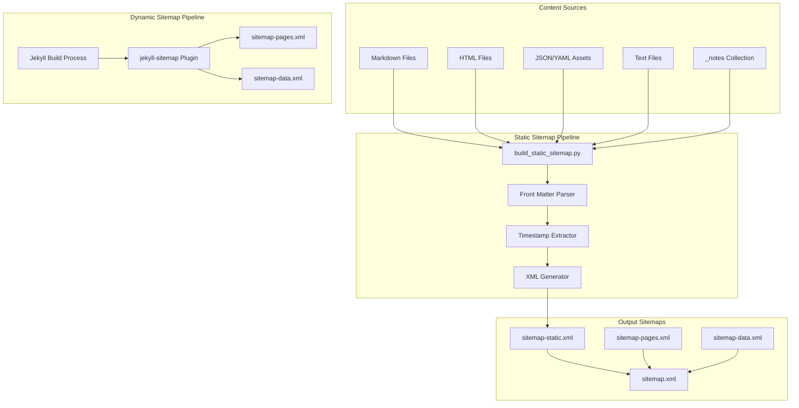
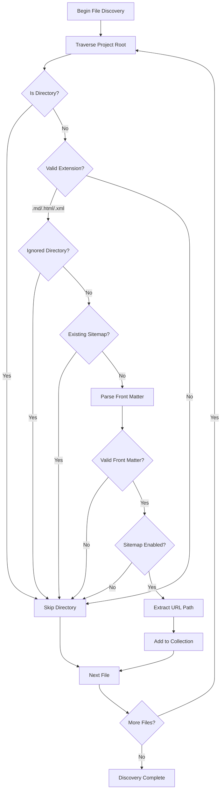
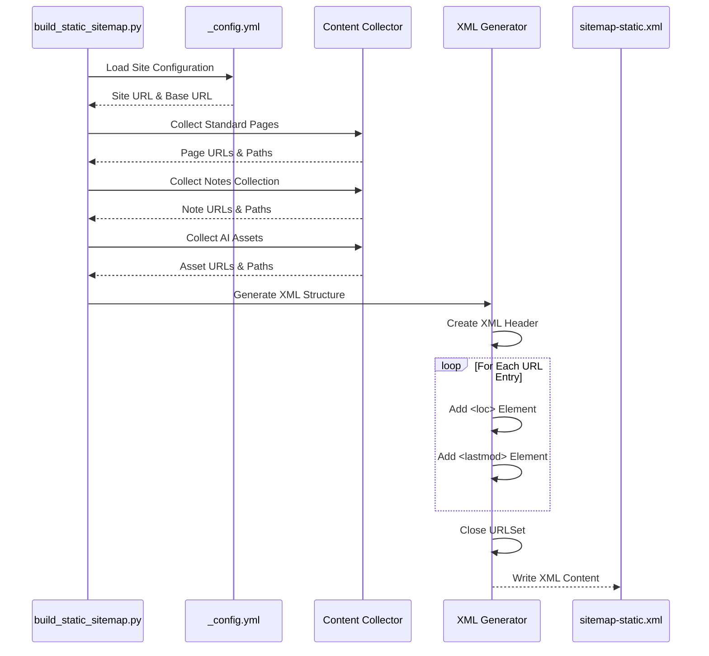
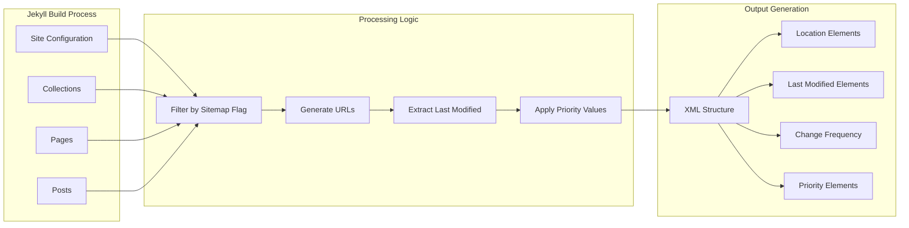
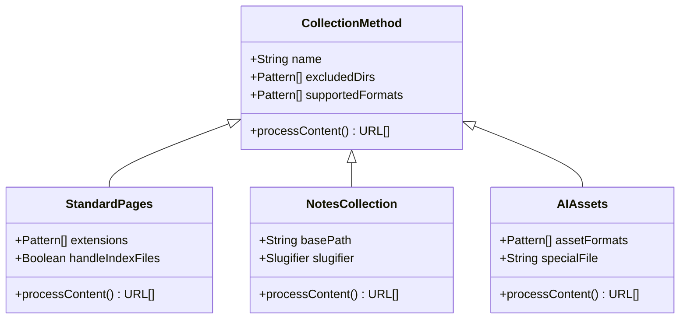
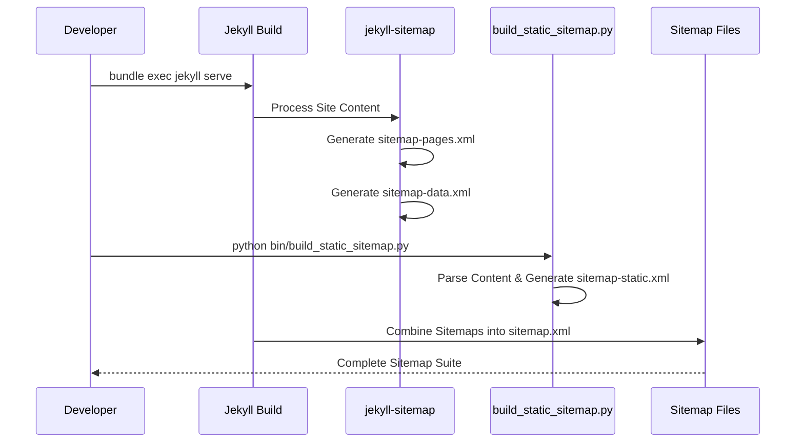

# Sitemap Generation System

<cite>
**Referenced Files in This Document**
- [build_static_sitemap.py](file://bin/build_static_sitemap.py)
- [sitemap-static.xml](file://sitemap-static.xml)
- [sitemap.xml](file://sitemap.xml)
- [sitemap-pages.xml](file://sitemap-pages.xml)
- [sitemap-data.xml](file://sitemap-data.xml)
- [_config.yml](file://_config.yml)
- [README.md](file://README.md)
- [_notes/ai_ml.md](file://_notes/ai_ml.md)
- [ai/catalog.json](file://ai/catalog.json)
</cite>

## Table of Contents
1. [Introduction](#introduction)
2. [System Architecture](#system-architecture)
3. [Static Sitemap Generation](#static-sitemap-generation)
4. [Dynamic Sitemap Generation](#dynamic-sitemap-generation)
5. [Collection Methods](#collection-methods)
6. [Jekyll Integration](#jekyll-integration)
7. [Usage Examples](#usage-examples)
8. [Error Handling and Troubleshooting](#error-handling-and-troubleshooting)
9. [Performance Considerations](#performance-considerations)
10. [Best Practices](#best-practices)

## Introduction

The CV-AI website employs a dual-sitemap architecture combining both static and dynamic approaches to ensure comprehensive search engine optimization and optimal performance. This system generates multiple sitemaps serving different purposes: a fully static sitemap for search console submissions, dynamically generated sitemaps for Jekyll's internal routing, and specialized sitemaps for different content types.

The sitemap generation system consists of two primary components:
- **Static Sitemap Generator**: A Python script that creates a comprehensive, pre-built sitemap for search engines
- **Dynamic Sitemap Generator**: Jekyll's built-in sitemap plugin that generates sitemaps during the build process

This hybrid approach ensures optimal SEO performance while maintaining flexibility for different content types and deployment scenarios.

## System Architecture

The sitemap generation system operates through a coordinated architecture that separates concerns between static and dynamic content:



**Diagram sources**
- [build_static_sitemap.py](file://bin/build_static_sitemap.py#L1-L190)
- [_config.yml](file://_config.yml#L26-L26)

The architecture demonstrates the separation between manual static generation and automated dynamic generation, each serving distinct SEO and operational purposes.

## Static Sitemap Generation

### Python Script Implementation

The static sitemap generation is handled by [`build_static_sitemap.py`](file://bin/build_static_sitemap.py), a comprehensive Python script that performs recursive file discovery, front matter parsing, and XML generation.

#### Core Functionality

The script implements several key functions:

**File Discovery Logic**: The script traverses the project directory structure, identifying relevant files while excluding system directories and existing sitemap files. The exclusion logic targets directories containing special content types:



**Diagram sources**
- [build_static_sitemap.py](file://bin/build_static_sitemap.py#L50-L95)

**Timestamp Extraction**: The script utilizes filesystem modification timestamps to provide accurate lastmod values for search engines, ensuring proper crawl scheduling and freshness indication.

**URL Path Normalization**: Comprehensive URL path processing handles various permalink configurations, ensuring consistent URL formatting across different content types.

#### XML Generation Process

The XML generation follows the sitemap protocol specification, creating a well-formed XML document with proper namespace declarations and URL entries:



**Diagram sources**
- [build_static_sitemap.py](file://bin/build_static_sitemap.py#L150-L190)

**Section sources**
- [build_static_sitemap.py](file://bin/build_static_sitemap.py#L1-L190)

## Dynamic Sitemap Generation

### Jekyll Sitemap Plugin

The dynamic sitemap generation leverages Jekyll's built-in [`jekyll-sitemap`](file://_config.yml#L26) plugin, which automatically generates sitemaps during the build process. This system produces three specialized sitemaps:

#### Sitemap Index Structure

The main [`sitemap.xml`](file://sitemap.xml) serves as an index that references the three specialized sitemaps:

| Sitemap Type | Purpose | Location |
|--------------|---------|----------|
| sitemap-pages.xml | Standard web pages and collections | Generated by jekyll-sitemap |
| sitemap-data.xml | Machine-readable AI assets | Static XML with hardcoded entries |
| sitemap-static.xml | Full static sitemap for search engines | Generated by build_static_sitemap.py |

#### Dynamic Content Processing

The dynamic sitemap generation processes content through Jekyll's Liquid templating system, utilizing front matter data and collection configurations:



**Diagram sources**
- [sitemap-pages.xml](file://sitemap-pages.xml#L1-L46)

**Section sources**
- [sitemap.xml](file://sitemap.xml#L1-L11)
- [sitemap-pages.xml](file://sitemap-pages.xml#L1-L46)

## Collection Methods

The sitemap generation system employs three distinct collection methods, each targeting specific content types and serving different SEO purposes.

### Standard Pages Collection

Standard pages represent traditional web content including Markdown files, HTML pages, and XML documents located outside special directories. The collection process excludes system directories and focuses on content with proper front matter configuration.

**Excluded Directories**:
- `_site` (Jekyll build output)
- `assets` (static resources)
- `vendor` (Gem dependencies)
- `_notes` (specialized collection)
- `_layouts` (Jekyll layouts)
- `_includes` (Jekyll includes)
- `_data` (Jekyll data files)
- `_sass` (SCSS files)
- `ai` (AI assets collection)

**URL Generation Logic**: The script processes permalink configurations, falling back to path-based URLs when permalinks are not specified. Special handling for `index.md` and `index.html` files ensures proper root URL representation.

### Notes Collection

The notes collection targets the `_notes` directory, which contains specialized blog-style content with structured front matter. This collection method demonstrates advanced URL slugification and path normalization.

**Slugification Process**: The script converts note filenames into SEO-friendly slugs, handling underscores, spaces, and special characters while maintaining URL readability and search engine optimization.

**URL Structure**: Notes receive URLs in the format `/notes/{slug}/`, where `{slug}` is derived from either the explicit `slug` field in front matter or automatically generated from the filename.

### AI Assets Collection

The AI assets collection encompasses machine-readable content including JSON, YAML, and text files that serve as data sources for AI applications and search engines.

**Supported Formats**: The collection includes `.json`, `.yml`, and `.yaml` files, with special handling for the `LLM.txt` file that serves as a human-readable companion to machine-readable data.

**URL Mapping**: AI assets receive URLs that preserve their original directory structure, ensuring predictable access patterns for both human users and AI systems.



**Diagram sources**
- [build_static_sitemap.py](file://bin/build_static_sitemap.py#L50-L140)

**Section sources**
- [build_static_sitemap.py](file://bin/build_static_sitemap.py#L50-L140)

## Jekyll Integration

### Configuration and Setup

The Jekyll integration is configured through the [`_config.yml`](file://_config.yml#L26) file, which enables the sitemap plugin and defines collection configurations:

**Plugin Configuration**: The `jekyll-sitemap` plugin is included in the plugins list, automatically generating sitemaps during the build process.

**Collection Definitions**: The notes collection is properly configured with output enabled and permalink structure defined, ensuring consistent URL generation.

### Build Process Integration

The Jekyll build process integrates with the static sitemap generation through a coordinated workflow:



**Diagram sources**
- [_config.yml](file://_config.yml#L26-L35)
- [build_static_sitemap.py](file://bin/build_static_sitemap.py#L150-L190)

### Link Integration

The sitemap files are integrated into the site through the [`head.html`](file://_includes/head.html) include, providing search engines with comprehensive sitemap discovery:

**Link Tag Implementation**: Multiple sitemap links are provided with appropriate MIME types, ensuring proper discovery by different search engines and tools.

**Section sources**
- [_config.yml](file://_config.yml#L26-L35)
- [_includes/head.html](file://_includes/head.html#L50-L51)

## Usage Examples

### Basic Static Sitemap Generation

The static sitemap generation follows a straightforward command-line interface:

```bash
# Navigate to project root
cd /path/to/cv-ai

# Run the static sitemap generator
python bin/build_static_sitemap.py

# Verify output file creation
ls -la sitemap-static.xml
```

### Integration with Jekyll Build Process

The dynamic sitemap generation integrates seamlessly with Jekyll's build process:

```bash
# Local development server
bundle exec jekyll serve

# Production build
bundle exec jekyll build

# Verify all sitemaps are generated
ls -la _site/sitemap*.xml
```

### Manual Regeneration Workflow

For content updates requiring sitemap regeneration:

```bash
# After content changes
git add .
git commit -m "Update content"
git push origin main

# Trigger rebuild (GitHub Pages)
# OR manually regenerate
bundle exec jekyll build

# Manually update static sitemap
python bin/build_static_sitemap.py

# Verify all sitemaps are current
find . -name "sitemap*.xml" -exec ls -la {} \;
```

### Search Console Submission

The static sitemap is specifically prepared for search console submission:

```xml
<!-- Example static sitemap entry -->
<url>
    <loc>https://dkharlanau.github.io/notes/ai-ml/</loc>
    <lastmod>2025-10-19T07:08:55.719479+00:00</lastmod>
</url>
```

## Error Handling and Troubleshooting

### Common Issues and Solutions

#### Missing Dependencies

**Problem**: ImportError when running the static sitemap generator
**Solution**: Install required Python dependencies
```bash
python3 -m pip install --user PyYAML
```

**Problem**: FileNotFoundError when accessing configuration
**Solution**: Verify `_config.yml` exists in project root
```bash
ls -la _config.yml
```

#### Front Matter Parsing Errors

**Problem**: Malformed front matter causing parsing failures
**Solution**: Validate YAML syntax in content files
```bash
# Check specific file
python -c "
import yaml
try:
    with open('_notes/ai_ml.md', 'r') as f:
        content = f.read()
    print('Front matter appears valid')
except Exception as e:
    print(f'Error: {e}')
"
```

#### Timestamp Extraction Issues

**Problem**: Incorrect or missing lastmod values
**Solution**: Verify file permissions and modification timestamps
```bash
# Check file timestamps
ls -la --time=modification _notes/ai_ml.md
```

#### URL Generation Problems

**Problem**: Incorrect or malformed URLs in sitemap
**Solution**: Review permalink configurations and front matter settings

### Debugging Strategies

#### Verbose Output Mode

Enable debug logging by adding temporary print statements to the script:

```python
# Add to generate_sitemap() function
print(f"Processing {len(entries)} total entries")
for url_path in sorted(entries.keys()):
    print(f"  {url_path} -> {entries[url_path]}")
```

#### Content Validation

Validate collected content before XML generation:

```python
# Add validation in collect_standard_pages()
for url_path, source_path in collect_standard_pages():
    if not url_path.startswith('/'):
        print(f"Warning: URL {url_path} doesn't start with slash")
    if not source_path.exists():
        print(f"Warning: Source file {source_path} doesn't exist")
```

#### XML Validation

Verify generated XML against sitemap schema:

```bash
# Validate XML structure
xmllint --noout --schema http://www.sitemaps.org/schemas/sitemap/0.9/sitemap.xsd sitemap-static.xml
```

### Performance Troubleshooting

#### Large Site Optimization

For sites with extensive content, consider these optimization strategies:

**Selective Processing**: Modify collection functions to skip unnecessary files early in the process.

**Memory Management**: Process files in batches for extremely large sites.

**Incremental Updates**: Implement change detection to avoid full rebuilds.

**Section sources**
- [build_static_sitemap.py](file://bin/build_static_sitemap.py#L25-L35)

## Performance Considerations

### Static Sitemap Generation Performance

The static sitemap generation script is optimized for performance through several mechanisms:

#### Efficient File Discovery

**Directory Traversal Optimization**: The script uses `rglob()` for recursive directory traversal while applying early filtering to exclude irrelevant directories and files.

**Extension Filtering**: Immediate extension checking prevents unnecessary processing of binary or unsupported file types.

**Early Exit Logic**: The script exits file processing loops as soon as invalid conditions are detected, reducing computational overhead.

#### Memory Efficiency

**Streaming Processing**: The XML generation uses a list-based approach that allows for efficient memory usage even with large numbers of URLs.

**Lazy Evaluation**: Content collection occurs in separate generator functions, enabling memory-efficient processing of large file sets.

### Dynamic Sitemap Generation Performance

#### Jekyll Build Optimization

**Incremental Builds**: Jekyll's incremental build feature minimizes processing overhead for unchanged content.

**Template Caching**: Liquid templates are cached during the build process, reducing repeated template compilation.

**Collection Processing**: Collections are processed efficiently through Jekyll's built-in filtering and sorting mechanisms.

### Optimization Strategies

#### For Large Sites

**Parallel Processing**: Consider implementing parallel file processing for static sitemap generation on multi-core systems.

**Content Partitioning**: Divide large collections into smaller, more manageable chunks for dynamic sitemap generation.

**Caching Strategies**: Implement caching mechanisms for frequently accessed content metadata.

#### Monitoring and Metrics

**Build Time Tracking**: Monitor build times to identify performance bottlenecks:

```bash
# Measure build performance
time bundle exec jekyll build
```

**Sitemap Size Analysis**: Track sitemap sizes to optimize for search engine crawling:

```bash
# Check sitemap sizes
du -h sitemap*.xml
```

**Memory Usage Monitoring**: Monitor memory usage during large site processing:

```bash
# Monitor memory usage
/usr/bin/time -v python bin/build_static_sitemap.py
```

## Best Practices

### Content Organization

#### Front Matter Configuration

**Consistent Sitemap Flags**: Ensure all content files include proper `sitemap` front matter flags:

```yaml
---
title: "Page Title"
sitemap: true  # Explicitly enable or disable
---
```

**Permalink Consistency**: Use consistent permalink structures across similar content types to ensure predictable URL generation.

#### File Naming Conventions

**Descriptive Names**: Use descriptive, SEO-friendly names for content files and directories.

**Slug Generation**: Leverage automatic slug generation for notes while maintaining manual control for critical content.

### Maintenance Procedures

#### Regular Updates

**Scheduled Regeneration**: Establish a schedule for static sitemap regeneration after content updates:

```bash
# Daily maintenance script example
#!/bin/bash
echo "Updating sitemaps..."
python bin/build_static_sitemap.py
echo "Sitemaps updated successfully"
```

**Version Control Integration**: Include sitemap regeneration in content deployment workflows.

#### Quality Assurance

**Validation Checks**: Implement automated validation for generated sitemaps:

```bash
# Validation script
#!/bin/bash
# Validate static sitemap
xmllint --noout --schema http://www.sitemaps.org/schemas/sitemap/0.9/sitemap.xsd sitemap-static.xml

# Validate dynamic sitemaps
curl -s https://example.com/sitemap.xml | xmllint --noout -
```

### SEO Optimization

#### Search Engine Compatibility

**Multiple Sitemap Types**: Utilize the three-sitemap approach to maximize search engine coverage and crawling efficiency.

**Timestamp Accuracy**: Ensure accurate lastmod timestamps for proper crawl scheduling and freshness indication.

**URL Canonicalization**: Maintain consistent URL structures across all sitemap types to prevent canonicalization conflicts.

#### Monitoring and Analytics

**Search Console Integration**: Submit the static sitemap to search consoles for improved visibility and indexing.

**Performance Monitoring**: Monitor search engine crawl rates and sitemap effectiveness through analytics tools.

**Section sources**
- [README.md](file://README.md#L21-L21)
- [build_static_sitemap.py](file://bin/build_static_sitemap.py#L150-L190)