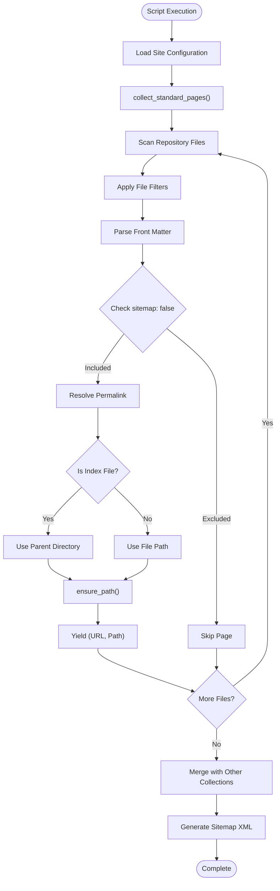
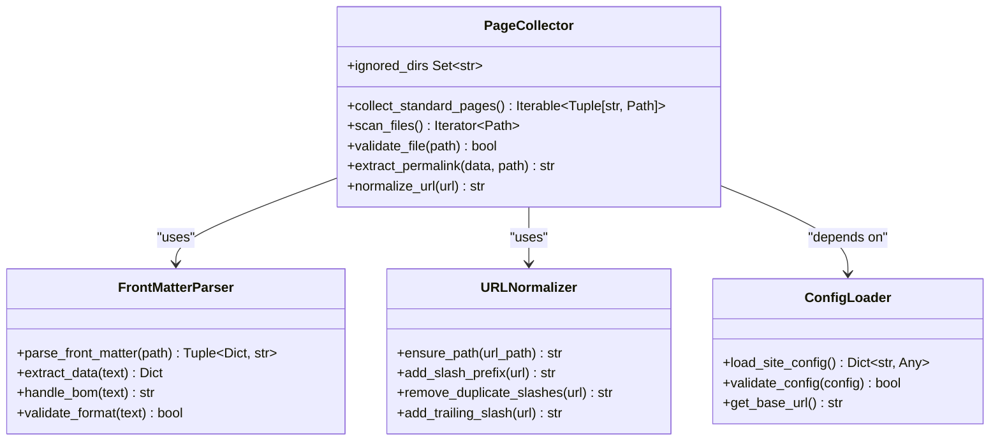
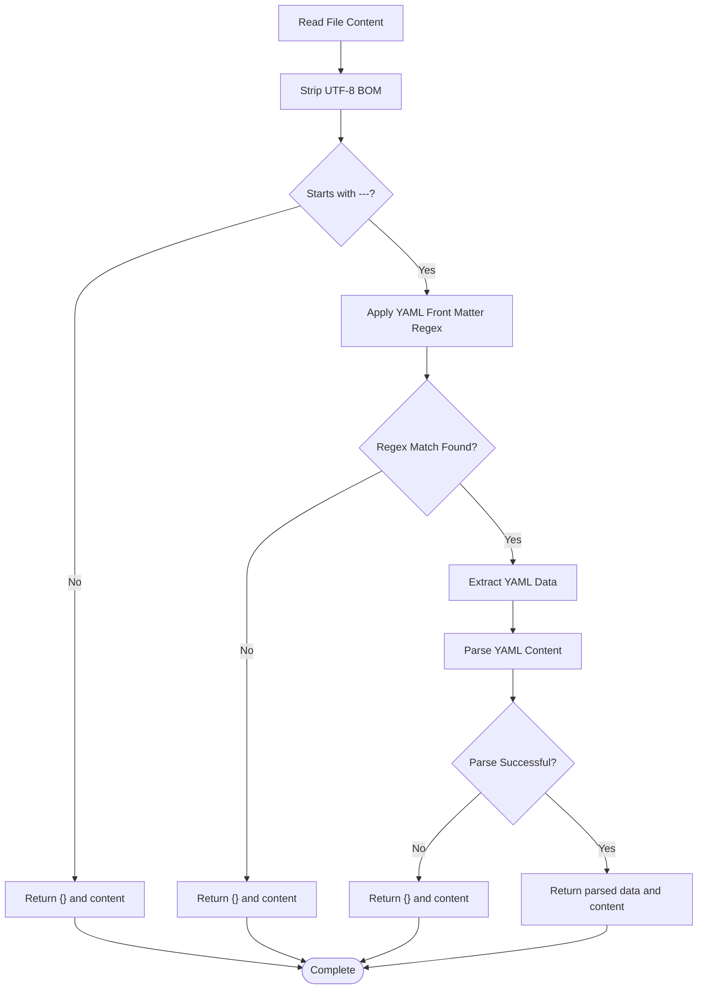
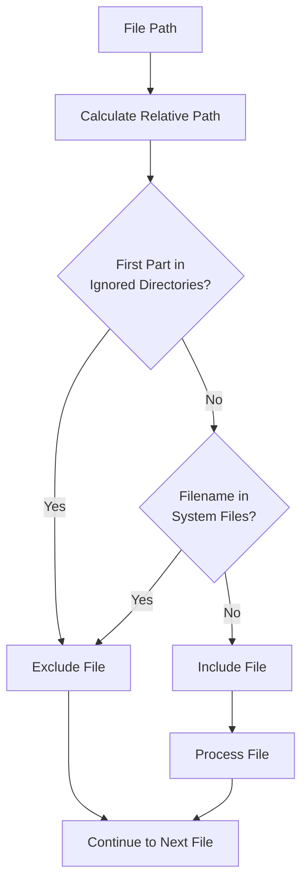
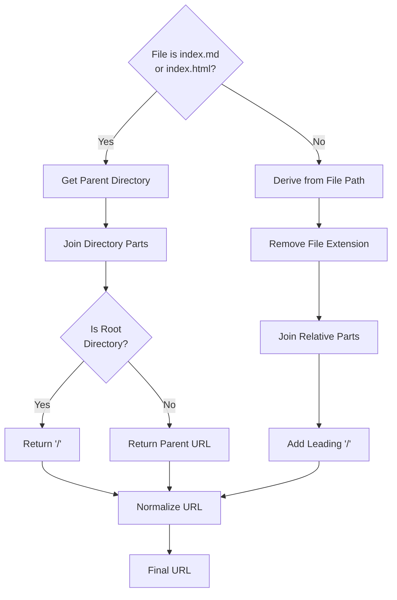
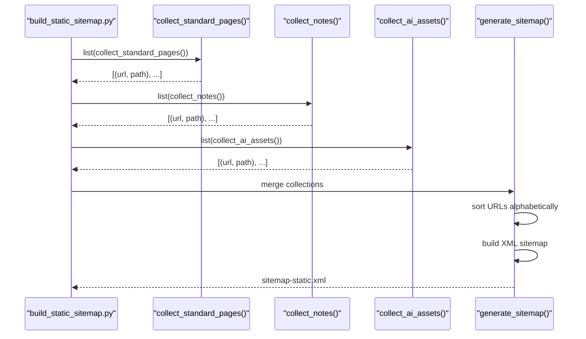

# Standard Pages Collection

<cite>
**Referenced Files in This Document**
- [build_static_sitemap.py](file://bin/build_static_sitemap.py)
- [_config.yml](file://_config.yml)
- [index.md](file://index.md)
- [_notes/ai_ml.md](file://_notes/ai_ml.md)
- [changelog.md](file://changelog.md)
- [legal/accessibility.md](file://legal/accessibility.md)
- [cv/index.html](file://cv/index.html)
- [faq/index.html](file://faq/index.html)
- [ai/catalog.json](file://ai/catalog.json)
- [sitemap-pages.xml](file://sitemap-pages.xml)
</cite>

## Table of Contents
1. [Introduction](#introduction)
2. [System Architecture](#system-architecture)
3. [Core Collection Mechanism](#core-collection-mechanism)
4. [File Discovery and Filtering](#file-discovery-and-filtering)
5. [Front Matter Processing](#front-matter-processing)
6. [URL Generation and Normalization](#url-generation-and-normalization)
7. [Directory Exclusion Logic](#directory-exclusion-logic)
8. [Permalink Resolution Strategy](#permalink-resolution-strategy)
9. [Index File Handling](#index-file-handling)
10. [Performance Considerations](#performance-considerations)
11. [Integration Workflow](#integration-workflow)
12. [Troubleshooting Guide](#troubleshooting-guide)
13. [Best Practices](#best-practices)

## Introduction

The standard pages collection mechanism is a sophisticated system designed to discover, process, and generate URLs for web pages in a Jekyll-based static site. This system serves as the foundation for sitemap generation, ensuring comprehensive coverage of all accessible content while intelligently excluding system files and special directories.

The collection process operates through a multi-stage pipeline that examines Markdown, HTML, and XML files across the repository, applying intelligent filtering logic to identify pages suitable for inclusion in search engine sitemaps. The system handles various URL generation scenarios, from explicit permalink specifications to automatic path derivation from file locations.

## System Architecture

The standard pages collection system follows a modular architecture centered around the `collect_standard_pages()` function, which serves as the primary entry point for page discovery. The system integrates with multiple specialized collectors and employs a unified URL normalization pipeline.

**Diagram sources**
- [build_static_sitemap.py](file://bin/build_static_sitemap.py#L48-L104)
- [build_static_sitemap.py](file://bin/build_static_sitemap.py#L147-L188)

**Section sources**
- [build_static_sitemap.py](file://bin/build_static_sitemap.py#L1-L190)

## Core Collection Mechanism

The `collect_standard_pages()` function implements the primary page discovery logic, operating as an iterator that yields tuples containing normalized URLs and corresponding file paths. This design enables efficient memory usage when processing large repositories.

The function employs a systematic approach to file discovery, utilizing recursive globbing to traverse the entire project directory structure. Each discovered file undergoes a series of validation checks to determine its eligibility for inclusion in the sitemap.

**Diagram sources**
- [build_static_sitemap.py](file://bin/build_static_sitemap.py#L48-L104)
- [build_static_sitemap.py](file://bin/build_static_sitemap.py#L32-L45)

**Section sources**
- [build_static_sitemap.py](file://bin/build_static_sitemap.py#L48-L104)

## File Discovery and Filtering

The file discovery process implements a comprehensive filtering strategy that excludes system files, special directories, and non-content files. The system maintains an exclusion list of known directories and file types that should not appear in the sitemap.

### Exclusion Criteria

The filtering logic applies multiple criteria to determine file eligibility:

| Criterion | Description | Implementation |
|-----------|-------------|----------------|
| **File Type** | Only `.md`, `.html`, and `.xml` files are processed | `path.suffix in {".md", ".html", ".xml"}` |
| **Directory Exclusion** | Special directories are skipped entirely | `relative.parts[0] in ignored_dirs` |
| **System Files** | Sitemap files themselves are excluded | `relative_str in {sitemap files}` |
| **Content Validation** | Files must contain valid front matter | `data` dictionary presence |

### Directory Exclusion List

The system maintains a comprehensive list of directories that should be excluded from processing:

- `_site` - Jekyll build output directory
- `assets` - Static assets and compiled files  
- `vendor` - Third-party dependencies
- `bin` - Script and executable files
- `_notes` - Internal note collection
- `_layouts` - Template files
- `_includes` - Reusable component files
- `_data` - Configuration and data files
- `_sass` - Sass source files
- `ai` - AI-generated content directory

**Section sources**
- [build_static_sitemap.py](file://bin/build_static_sitemap.py#L56-L75)

## Front Matter Processing

Front matter parsing represents a critical component of the collection mechanism, as it extracts metadata that determines page inclusion and URL generation. The system employs robust YAML parsing with comprehensive error handling for malformed front matter.

### Parsing Algorithm

The front matter parsing process follows a systematic approach:

**Diagram sources**
- [build_static_sitemap.py](file://bin/build_static_sitemap.py#L32-L45)

### Front Matter Fields

The system recognizes several key front matter fields that influence page processing:

| Field | Purpose | Default Behavior |
|-------|---------|------------------|
| `sitemap` | Controls page inclusion | `True` if omitted |
| `permalink` | Explicit URL specification | Derived from file path if omitted |
| `title` | Page title for metadata | Used in URL slugification |
| `layout` | Template specification | Not directly relevant to sitemap |

**Section sources**
- [build_static_sitemap.py](file://bin/build_static_sitemap.py#L32-L45)
- [index.md](file://index.md#L1-L15)
- [_notes/ai_ml.md](file://_notes/ai_ml.md#L1-L15)

## URL Generation and Normalization

The URL generation and normalization system ensures consistent URL formatting across all collected pages. The `ensure_path()` function implements comprehensive URL sanitization, handling edge cases and maintaining proper URL structure.

### Normalization Process

The URL normalization follows a three-step process:

1. **Prefix Addition**: Ensures all URLs start with a forward slash
2. **Duplicate Slash Removal**: Consolidates consecutive slashes into single slashes
3. **Trailing Slash Addition**: Adds trailing slashes to directory-style URLs

### URL Patterns

The system generates URLs according to established patterns:

| Content Type | Pattern | Example |
|--------------|---------|---------|
| **Root Pages** | `/filename/` | `/cv/`, `/faq/` |
| **Nested Pages** | `/parent/filename/` | `/legal/accessibility/` |
| **Index Files** | `/parent/` | `/` (root), `/notes/` |
| **Explicit Permalinks** | User-defined | `/custom-url/` |

**Section sources**
- [build_static_sitemap.py](file://bin/build_static_sitemap.py#L48-L55)
- [build_static_sitemap.py](file://bin/build_static_sitemap.py#L76-L104)

## Directory Exclusion Logic

The directory exclusion system prevents sensitive or system-specific files from appearing in the sitemap. The logic operates at the directory level, examining the relative path structure to determine exclusion eligibility.

### Exclusion Strategy

The exclusion strategy employs a whitelist approach, where only explicitly included directories are processed:

**Diagram sources**
- [build_static_sitemap.py](file://bin/build_static_sitemap.py#L56-L75)

### Exclusion Categories

The system categorizes exclusions into logical groups:

- **Build Artifacts**: Generated files and temporary directories
- **Source Code**: Templates, layouts, and includes
- **Configuration**: Data files and configuration sources
- **Content Collections**: Specialized content areas with separate processing
- **External Resources**: AI-generated content and third-party assets

**Section sources**
- [build_static_sitemap.py](file://bin/build_static_sitemap.py#L56-L75)

## Permalink Resolution Strategy

The permalink resolution system implements a hierarchical approach to URL determination, prioritizing explicit permalink specifications while falling back to automatic path derivation.

### Resolution Hierarchy

The permalink resolution follows this precedence order:

1. **Explicit Permalink**: Value from `permalink` front matter field
2. **Index File Handling**: Parent directory URL for index files
3. **Automatic Derivation**: File path with extension removed

### Index File Handling

Index files receive special treatment, as they represent directory roots rather than individual pages:

**Diagram sources**
- [build_static_sitemap.py](file://bin/build_static_sitemap.py#L85-L95)

**Section sources**
- [build_static_sitemap.py](file://bin/build_static_sitemap.py#L85-L104)
- [index.md](file://index.md#L1-L15)
- [changelog.md](file://changelog.md#L1-L11)

## Index File Handling

Index files represent a special category of pages that serve as directory roots rather than individual content pages. The system implements specific logic to handle these files correctly, ensuring they generate appropriate directory-style URLs.

### Index File Detection

The system identifies index files through filename matching:

- `index.md` - Markdown index files
- `index.html` - HTML index files

### URL Generation for Index Files

Index files generate URLs based on their parent directory structure:

| Scenario | File Location | Generated URL |
|----------|---------------|---------------|
| **Root Index** | `index.md` | `/` |
| **Subdirectory Index** | `faq/index.html` | `/faq/` |
| **Nested Index** | `legal/accessibility.md` | `/legal/` |

### Special Cases

The system handles several special cases for index files:

- **Root Directory**: Always generates `/` regardless of parent structure
- **Empty Parent**: Falls back to root URL generation
- **Malformed Paths**: Implements defensive URL construction

**Section sources**
- [build_static_sitemap.py](file://bin/build_static_sitemap.py#L85-L95)
- [cv/index.html](file://cv/index.html#L1-L5)
- [faq/index.html](file://faq/index.html#L1-L5)

## Performance Considerations

The standard pages collection system is designed to handle repositories of varying sizes efficiently, implementing several optimization strategies to minimize processing overhead.

### Memory Management

The system employs generator functions throughout the collection pipeline, yielding results one at a time rather than loading all pages into memory simultaneously. This approach enables processing of large repositories with limited memory resources.

### File System Optimization

Several strategies optimize file system access:

- **Selective Scanning**: Only processes relevant file types
- **Early Termination**: Skips invalid files immediately
- **Minimal I/O**: Reads each file only once per page

### Scalability Factors

The system's performance scales with several factors:

| Factor | Impact | Mitigation Strategy |
|--------|--------|-------------------|
| **File Count** | Linear processing time | Generator-based iteration |
| **Directory Depth** | Exponential path calculation | Efficient relative path computation |
| **Front Matter Complexity** | Variable parsing time | Robust YAML parsing with timeout |
| **File Size** | Proportional I/O time | Stream-based file reading |

### Performance Monitoring

The system includes timestamp extraction functionality that provides insight into file modification dates, enabling sitemap freshness tracking and incremental update capabilities.

**Section sources**
- [build_static_sitemap.py](file://bin/build_static_sitemap.py#L48-L55)
- [build_static_sitemap.py](file://bin/build_static_sitemap.py#L147-L188)

## Integration Workflow

The standard pages collection integrates seamlessly with the broader sitemap generation workflow, serving as one of three primary content sources alongside notes and AI assets.

### Collection Pipeline

The integration follows a unified pipeline approach:

**Diagram sources**
- [build_static_sitemap.py](file://bin/build_static_sitemap.py#L165-L175)
- [build_static_sitemap.py](file://bin/build_static_sitemap.py#L147-L188)

### Configuration Integration

The system integrates with Jekyll configuration through multiple mechanisms:

- **Base URL Configuration**: Extracted from `_config.yml`
- **Site Metadata**: Used for XML namespace and structure
- **Plugin Compatibility**: Maintains compatibility with existing Jekyll plugins

**Section sources**
- [build_static_sitemap.py](file://bin/build_static_sitemap.py#L147-L188)
- [_config.yml](file://_config.yml#L1-L51)

## Troubleshooting Guide

Common issues with the standard pages collection system can be systematically diagnosed and resolved through the following approaches.

### Missing Pages Issues

**Symptom**: Expected pages not appearing in sitemap

**Diagnosis Steps**:
1. Verify file exists in repository
2. Check file extension (.md, .html, .xml)
3. Confirm file is not in excluded directories
4. Validate front matter presence and format
5. Check `sitemap: false` setting

**Common Causes**:
- Incorrect file extension
- Placement in excluded directory
- Malformed front matter
- Explicit `sitemap: false` declaration
- File permissions or accessibility issues

### URL Generation Problems

**Symptom**: Incorrect or malformed URLs in sitemap

**Diagnosis Approach**:
1. Examine front matter permalink field
2. Verify index file handling logic
3. Check URL normalization process
4. Review directory structure

**Resolution Strategies**:
- Use explicit permalinks for custom URLs
- Ensure proper front matter formatting
- Verify file naming conventions
- Test URL patterns with different file structures

### Performance Issues

**Symptom**: Slow sitemap generation for large repositories

**Optimization Approaches**:
- Reduce repository size through selective content
- Optimize file system structure
- Monitor memory usage during processing
- Consider incremental processing strategies

### Front Matter Issues

**Symptom**: Pages with valid front matter still excluded

**Debugging Process**:
1. Validate YAML syntax in front matter
2. Check for BOM (Byte Order Mark) issues
3. Verify front matter delimiter format
4. Test with minimal front matter

**Section sources**
- [build_static_sitemap.py](file://bin/build_static_sitemap.py#L32-L45)
- [build_static_sitemap.py](file://bin/build_static_sitemap.py#L85-L104)

## Best Practices

Effective use of the standard pages collection system requires adherence to established best practices that ensure reliable operation and optimal performance.

### Front Matter Guidelines

Maintain consistent front matter structure across all pages:

- **Required Fields**: Include essential metadata for SEO and navigation
- **Consistent Formatting**: Use uniform YAML syntax and spacing
- **Explicit Permalinks**: Define custom URLs for important pages
- **Sitemap Control**: Use `sitemap: false` judiciously for internal pages

### File Organization

Structure repository files for optimal collection:

- **Logical Grouping**: Place related files in subdirectories
- **Naming Conventions**: Use descriptive, URL-friendly filenames
- **Index Files**: Maintain clear index file placement
- **Extension Consistency**: Choose appropriate file extensions

### URL Design Principles

Follow established URL design patterns:

- **Hierarchical Structure**: Reflect content organization in URLs
- **Descriptive Paths**: Use meaningful segments in URL paths
- **Consistent Terminology**: Maintain uniform naming across similar content
- **Avoid Special Characters**: Use hyphens and lowercase letters

### Maintenance Procedures

Establish regular maintenance routines:

- **Periodic Verification**: Validate sitemap completeness
- **Performance Monitoring**: Track generation time trends
- **Content Audit**: Review page inclusion decisions
- **Configuration Updates**: Keep site configuration synchronized

### Integration Testing

Implement comprehensive testing strategies:

- **Automated Validation**: Create scripts to verify sitemap completeness
- **Manual Review**: Periodically review generated sitemap entries
- **Search Console Integration**: Monitor search engine indexing
- **Cross-Platform Testing**: Verify URL generation across different systems

**Section sources**
- [build_static_sitemap.py](file://bin/build_static_sitemap.py#L1-L15)
- [index.md](file://index.md#L1-L15)
- [_notes/ai_ml.md](file://_notes/ai_ml.md#L1-L15)