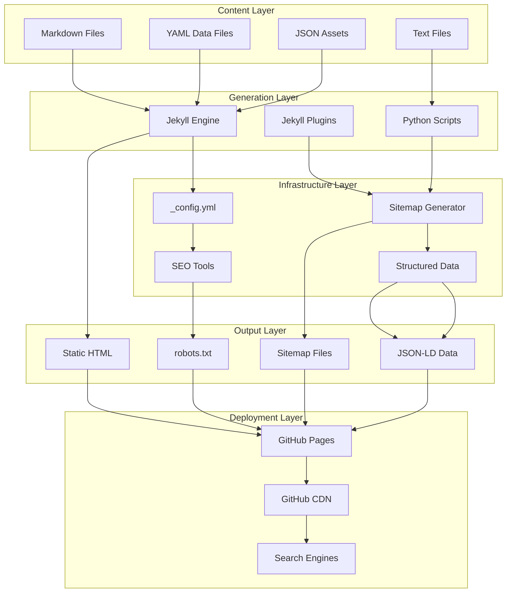
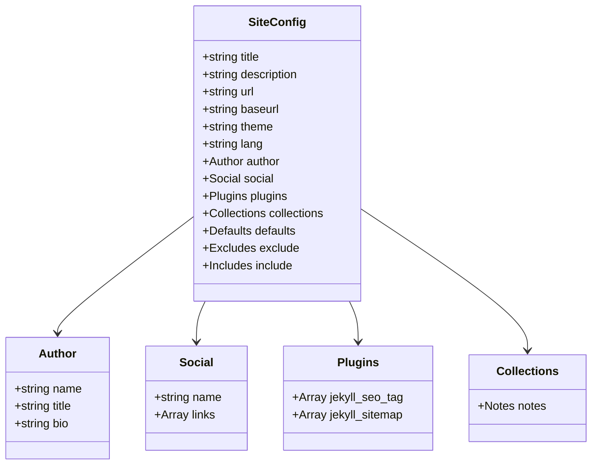
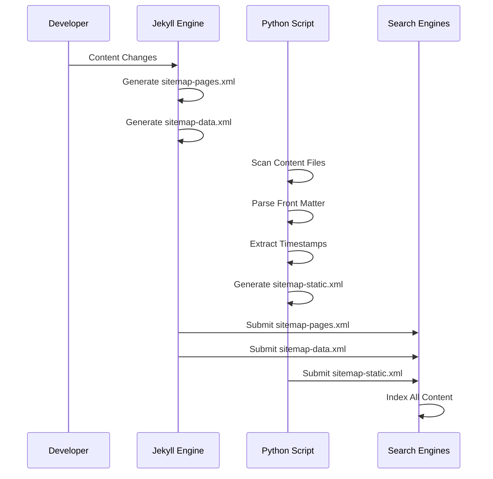
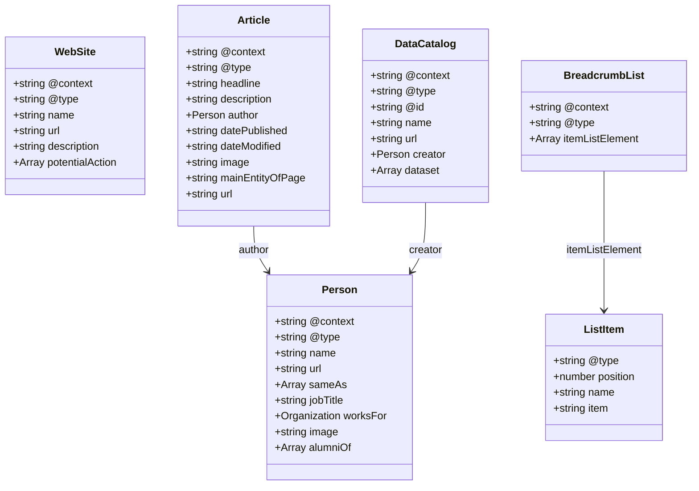

# Technical Infrastructure

<cite>
**Referenced Files in This Document**
- [_config.yml](file://_config.yml)
- [Gemfile](file://Gemfile)
- [Gemfile.lock](file://Gemfile.lock)
- [bin/build_static_sitemap.py](file://bin/build_static_sitemap.py)
- [_includes/seo/structured-data.html](file://_includes/seo/structured-data.html)
- [sitemap.xml](file://sitemap.xml)
- [sitemap-pages.xml](file://sitemap-pages.xml)
- [sitemap-data.xml](file://sitemap-data.xml)
- [sitemap-static.xml](file://sitemap-static.xml)
- [ai/sitemap.xml](file://ai/sitemap.xml)
- [robots.txt](file://robots.txt)
- [README.md](file://README.md)
- [_data/resume.yml](file://_data/resume.yml)
</cite>

## Table of Contents
1. [Introduction](#introduction)
2. [System Architecture Overview](#system-architecture-overview)
3. [Configuration Management](#configuration-management)
4. [Sitemap Generation System](#sitemap-generation-system)
5. [Structured Data Implementation](#structured-data-implementation)
6. [Deployment Infrastructure](#deployment-infrastructure)
7. [Performance Considerations](#performance-considerations)
8. [Troubleshooting Guide](#troubleshooting-guide)
9. [Conclusion](#conclusion)

## Introduction

The cv-ai site represents a sophisticated static site infrastructure designed for optimal SEO performance and developer productivity. Built on Jekyll with GitHub Pages deployment, the system employs a hybrid approach combining Ruby-based Jekyll plugins with Python-based static generation for comprehensive sitemap coverage and structured data optimization.

The infrastructure serves as a personal brand platform for Dzmitryi Kharlanau, featuring a light Neubrutalist design system with AI-friendly content mirroring across multiple formats. The technical architecture emphasizes search engine optimization, accessibility compliance, and seamless content delivery through multiple distribution channels.

## System Architecture Overview

The cv-ai site employs a layered architecture that separates content management, generation, and delivery concerns while maintaining flexibility for future expansion.

**Diagram sources**
- [_config.yml](file://_config.yml#L1-L51)
- [Gemfile](file://Gemfile#L1-L5)
- [bin/build_static_sitemap.py](file://bin/build_static_sitemap.py#L1-L190)

**Section sources**
- [_config.yml](file://_config.yml#L1-L51)
- [Gemfile](file://Gemfile#L1-L5)
- [README.md](file://README.md#L1-L25)

## Configuration Management

The `_config.yml` file serves as the central configuration hub, defining site behavior, metadata, and plugin dependencies. This configuration establishes the foundation for all site generation processes.

### Core Configuration Structure

The configuration defines essential site metadata including title, description, URL structure, and author information. It establishes the Minima theme as the base design system while configuring permalink structures for clean URL routing.

### Plugin Dependencies

The system relies on two primary Jekyll plugins:
- **jekyll-seo-tag**: Automatically generates SEO metadata including Open Graph tags, Twitter Cards, and canonical URLs
- **jekyll-sitemap**: Creates XML sitemaps for standard pages and collections

### Content Organization

Configuration excludes development directories and specifies custom collections for specialized content types. The notes collection enables blog-style content with custom permalinks, while the default layout applies to standard pages.

**Diagram sources**
- [_config.yml](file://_config.yml#L1-L51)

**Section sources**
- [_config.yml](file://_config.yml#L1-L51)

## Sitemap Generation System

The sitemap generation system employs a hybrid approach combining Jekyll's native capabilities with custom Python scripting to ensure comprehensive coverage of all site content, including AI-friendly resources and external assets.

### Dynamic Sitemap Generation (Jekyll)

Jekyll's built-in sitemap plugin generates three primary sitemap components:

#### Standard Pages Sitemap (`sitemap-pages.xml`)
Generates URLs for all standard pages excluding administrative files and feeds. The generator processes site pages, collections, and posts, applying custom filtering to exclude internal sitemap files and apply changefrequency/priority metadata.

#### Data Resources Sitemap (`sitemap-data.xml`)
Focuses exclusively on machine-readable assets located in the `/ai` directory and the root-level `LLM.txt` file. This sitemap ensures search engines discover structured data resources essential for AI applications.

#### AI-Optimized Sitemap (`ai/sitemap.xml`)
Provides specialized sitemap for AI resources with custom metadata including content type, format, and change frequency attributes. This sitemap includes alternate language links for YAML/JSON variants of the resume data.

### Static Sitemap Generation (Python)

The custom Python script (`build_static_sitemap.py`) creates a comprehensive static sitemap that captures all content accessible to search engines, including:

#### Content Collection Strategy
- **Standard Pages**: Walks the project root for Markdown and HTML files, parsing front matter to extract URLs and timestamps
- **Notes Collection**: Processes the `_notes` directory for blog-style content with custom slug handling
- **AI Assets**: Scans the `/ai` directory for JSON/YAML files and the root `LLM.txt` file
- **URL Normalization**: Ensures consistent URL formatting with proper path normalization and trailing slash handling

#### Timestamp Management
Utilizes filesystem modification timestamps to provide accurate lastmod values, ensuring search engines receive up-to-date freshness information for all indexed content.

**Diagram sources**
- [bin/build_static_sitemap.py](file://bin/build_static_sitemap.py#L1-L190)
- [sitemap-pages.xml](file://sitemap-pages.xml#L1-L46)
- [sitemap-data.xml](file://sitemap-data.xml#L1-L10)

### Sitemap Index Structure

The main sitemap index coordinates all generated sitemaps, providing a centralized entry point for search engine crawlers.

| Sitemap Type | Purpose | Update Frequency | Coverage |
|--------------|---------|------------------|----------|
| `sitemap-pages.xml` | Standard web pages | Weekly | All HTML/markdown content |
| `sitemap-data.xml` | Machine-readable assets | Monthly | AI resources and datasets |
| `sitemap-static.xml` | Comprehensive content | Daily | All accessible content |
| `ai/sitemap.xml` | AI-optimized resources | Weekly | Specialized AI assets |

**Section sources**
- [bin/build_static_sitemap.py](file://bin/build_static_sitemap.py#L1-L190)
- [sitemap.xml](file://sitemap.xml#L1-L11)
- [sitemap-pages.xml](file://sitemap-pages.xml#L1-L46)
- [sitemap-data.xml](file://sitemap-data.xml#L1-L10)
- [ai/sitemap.xml](file://ai/sitemap.xml#L1-L26)
- [sitemap-static.xml](file://sitemap-static.xml#L1-L104)

## Structured Data Implementation

The structured data system leverages Schema.org JSON-LD markup to enhance search engine understanding and enable rich snippets across various content types.

### Schema.org Integration

The structured data implementation spans multiple content types, providing comprehensive metadata for search engines and AI systems:

#### Person Entity
Defines the primary author identity with comprehensive profile information including name, job title, organizational affiliation, and social media presence. The Person entity serves as the foundation for all other structured data types.

#### WebSite Entity
Provides site-wide metadata including URL, name, description, and navigation breadcrumbs for improved search visibility and user experience.

#### Article Entities
Automatically generated for individual notes with headline, description, publication dates, author attribution, and breadcrumb navigation. Each article includes Open Graph image metadata and canonical URL references.

#### DataCatalog Entity
Specialized for AI resources, this entity catalogs the `/ai` directory contents with dataset descriptions, creator attribution, and hierarchical organization.

**Diagram sources**
- [_includes/seo/structured-data.html](file://_includes/seo/structured-data.html#L1-L77)
- [_data/resume.yml](file://_data/resume.yml#L430-L441)

### Content-Type Specific Implementation

#### Notes Articles
Each note receives Article schema with automatic breadcrumb generation, ensuring proper hierarchical navigation structure for search results.

#### AI Resources
Dataset entries receive specialized treatment with custom metadata including content type, format, and change frequency attributes for AI optimization.

#### Home Page
The root page includes WebSite schema with navigation actions and site-wide metadata for enhanced search visibility.

**Section sources**
- [_includes/seo/structured-data.html](file://_includes/seo/structured-data.html#L1-L77)
- [_data/resume.yml](file://_data/resume.yml#L430-L441)

## Deployment Infrastructure

The deployment infrastructure leverages GitHub Pages for reliable, scalable hosting with automated workflows and CDN acceleration.

### GitHub Pages Configuration

The site operates on GitHub Pages with the following characteristics:
- **Repository Structure**: Follows GitHub Pages expectations with Jekyll-compatible directory structure
- **Theme System**: Utilizes the Minima theme with custom modifications
- **Plugin Support**: Enabled GitHub Pages plugins including jekyll-seo-tag and jekyll-sitemap
- **Custom Domain**: Configured with dkharlanau.github.io subdomain

### Robots.txt Configuration

The robots.txt file implements selective crawling policies to optimize search engine resource allocation:

| User Agent | Allow Pattern | Purpose |
|------------|---------------|---------|
| * | / | Default allowance for all content |
| GPTBot | / | AI chatbot access for content analysis |
| ChatGPT-User | / | Conversational AI access |
| anthropic-ai | / | Claude AI access |
| ClaudeBot | / | Claude bot access |
| Google-Extended | / | Enhanced Google crawling |
| PerplexityBot | / | Research AI access |
| CCBot | / | Content crawler access |
| FacebookBot | / | Social media crawler access |

### Sitemap Submission Strategy

Multiple sitemap submission strategies ensure comprehensive search engine coverage:
- **Main Sitemap Index**: Central coordination point for all generated sitemaps
- **Data Sitemap**: Dedicated submission for machine-readable resources
- **AI Sitemap**: Specialized submission for AI-optimized content
- **Static Sitemap**: Comprehensive submission for all accessible content

**Section sources**
- [_config.yml](file://_config.yml#L1-L51)
- [robots.txt](file://robots.txt#L1-L31)
- [sitemap.xml](file://sitemap.xml#L1-L11)

## Performance Considerations

The infrastructure incorporates several performance optimization strategies tailored to static site requirements and search engine optimization goals.

### Sitemap Performance Strategy

The dual sitemap approach balances comprehensiveness with crawl efficiency:

#### Dynamic Sitemaps (Jekyll)
- **Advantages**: Real-time updates, automatic metadata inclusion, collection-aware generation
- **Performance Impact**: Minimal server-side processing during build phase
- **Use Cases**: Standard web content, blog posts, documentation

#### Static Sitemap (Python)
- **Advantages**: Comprehensive coverage, consistent timestamps, external asset inclusion
- **Performance Impact**: Single daily execution, efficient file system scanning
- **Use Cases**: AI resources, external assets, comprehensive content discovery

### Content Delivery Optimization

#### CDN Acceleration
GitHub Pages provides automatic CDN distribution, ensuring global content delivery with minimal latency.

#### Asset Compression
CSS assets utilize compressed output format to reduce bandwidth consumption.

#### Efficient Crawling
Selective robots.txt directives prevent search engine resource waste on AI bots while maintaining comprehensive content indexing.

### Scalability Considerations

The architecture scales efficiently with content growth:
- **Linear Growth**: Additional content proportionally increases sitemap size
- **Incremental Updates**: Python script handles content additions without full rebuilds
- **Plugin Efficiency**: Jekyll plugins operate within GitHub Pages build constraints

## Troubleshooting Guide

Common infrastructure issues and their resolution strategies:

### Broken Sitemap Issues

#### Symptom: Missing URLs in Generated Sitemaps
**Causes**: Incorrect front matter, excluded directories, permission issues
**Resolution**: Verify front matter completeness, check exclusion patterns in `_config.yml`, ensure file permissions allow scanning

#### Symptom: Outdated Lastmod Dates
**Causes**: File modification timestamp issues, build cache problems
**Resolution**: Clear build cache, verify filesystem timestamps, run static sitemap regeneration

#### Symptom: Duplicate URLs in Sitemaps
**Causes**: Conflicting permalink configurations, collection conflicts
**Resolution**: Review permalink settings, check collection configurations, validate URL uniqueness

### Structured Data Problems

#### Symptom: Missing Rich Snippets
**Causes**: Invalid JSON-LD syntax, missing required properties, schema validation errors
**Resolution**: Validate JSON-LD syntax, ensure required properties are present, test with Google Rich Results Test

#### Symptom: Incorrect Schema Types
**Causes**: Misconfigured content types, incorrect schema.org usage
**Resolution**: Review content type detection logic, validate schema.org compliance

### Deployment Issues

#### Symptom: Build Failures on GitHub Pages
**Causes**: Plugin compatibility issues, gem version conflicts, configuration errors
**Resolution**: Review Gemfile.lock compatibility, validate configuration syntax, check plugin versions

#### Symptom: Missing Content After Deployment
**Causes**: Exclusion patterns, build configuration issues, deployment cache problems
**Resolution**: Review exclude patterns, verify build configuration, clear deployment cache

### Performance Issues

#### Symptom: Slow Sitemap Generation
**Causes**: Large content volume, inefficient scanning, file system issues
**Resolution**: Optimize content organization, review scanning logic, verify file system performance

#### Symptom: Search Console Errors
**Causes**: Malformed sitemaps, invalid URLs, robots.txt conflicts
**Resolution**: Validate sitemap XML, check URL formatting, review robots.txt configuration

**Section sources**
- [bin/build_static_sitemap.py](file://bin/build_static_sitemap.py#L1-L190)
- [_includes/seo/structured-data.html](file://_includes/seo/structured-data.html#L1-L77)
- [robots.txt](file://robots.txt#L1-L31)

## Conclusion

The cv-ai site's technical infrastructure demonstrates a sophisticated approach to static site generation, SEO optimization, and content delivery. The hybrid architecture successfully balances developer productivity with search engine optimization requirements through strategic use of Jekyll plugins and custom Python scripting.

Key architectural strengths include comprehensive sitemap coverage through multiple generation approaches, robust structured data implementation for enhanced search visibility, and flexible deployment infrastructure leveraging GitHub Pages capabilities. The system's modular design facilitates maintenance and extension while ensuring consistent performance across all content types.

The infrastructure serves as an excellent example of modern static site architecture, demonstrating how traditional Jekyll workflows can be enhanced with custom tooling to meet specialized requirements for AI-friendly content delivery and comprehensive search engine optimization.